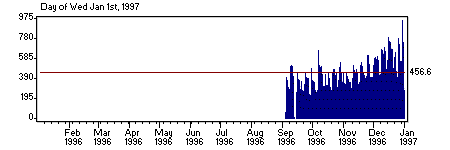

**Editor's Note**: This file and all associated resources were created from the oldest available snapshot (January 13, 1997) of
[http://massena.com/darrin/pilot/index.html](https://web.archive.org/web/19970113081208/http://massena.com/darrin/pilot/index.html)
at the [Internet Archive](https://archive.org/).  The original HTML markup was converted to Markdown, which will result in
formatting differences, but except for the rare spelling error, none of the original text has been altered, at least not intentionally.
Also, where possible, broken links will be updated to refer to local copies if the original files can be located.

---

## Pilot Software Development

Developing software for a flexible
computer that fits in the palm of your hand can be lots
of fun. This page is devoted to the development of
quality software for the USRobotics Pilot. I try to
update it often and you can contribute too by sending
your Pilot development discoveries, tools, apps, tips and
tricks to me ([*darrin@massena.com*](mailto:darrin@massena.com)).
I'll organize and post them so everyone can share your
brilliant insights.

- [Read the latest Pilot development news](#news)
- [Read the latest Pila news](pila/)
- [Read the latest ASDK news](asdk/)
- [Download Pilot development tools and articles](tanda/)
- [Other Pilot development resources](resources/)
- [Download lots of cool Pilot software](https://web.archive.org/web/19970113081208/http://massena.com/darrin/pilot/resources.htm)

### News

#### 1 Jan 97 - PDA Developers magazine is renamed to [Handheld Systems Journal](https://web.archive.org/web/19970113081208/http://www.cdpubs.com/HHSJ.html)

Handheld Systems is a bimonthly printed magazine targeted at
developers of (surprise!) handheld systems like Windows CE,
Newton, GEOS, Magic Cap, and most importantly, the Pilot. Every
one of the last several issues has at least one Pilot programming
article which puts it ahead of any other magazine I know of.
Excerpts from Handheld Systems are available online including
these articles of particular interest to Pilot developers:
[Unix and Pilots](https://web.archive.org/web/19970113081208/http://www.cdpubs.com/excerpts/51/14flynn.pdf) by Kevin Flynn,
[Hacking the Pilot](https://web.archive.org/web/19970113081208/http://www.cdpubs.com/excerpts/46/14keye.pdf) by Edward Keyes,
[WorldTime - A Pilot World Clock](https://web.archive.org/web/19970113081208/http://www.cdpubs.com/excerpts/4417mann.pdf) by Steve Mann,
[Pilot Programming Primer](https://web.archive.org/web/19970113081208/http://www.cdpubs.com/excerpts/43/14mann.txt) by Steve Mann, and
[Palm Ups the Ante with Pilot](https://web.archive.org/web/19970113081208/http://www.cdpubs.com/excerpts/42/04mann.txt) by Steve Mann.

#### 1 Jan 97 - [Solutions 0.1](https://web.archive.org/web/19970113081208/http://fatmac.ee.cornell.edu/pilot/solutionMain.html) (a shared library mechanism) released by [Russell Y. Webb](mailto:rw20@cornell.edu)

Given the limited amount of memory each Pilot has you'd think
the PalmOS designers would have given priority to devising a
means by which common code (aside from the OS itself) could be
shared by several applications to save memory. Another advantage
of shared libraries is that they can be upgraded independently
from the applications that use them (though this certainly has
its pitfalls). USRobotics wasn't able to get such a feature into
PalmOS 1.0 so along comes Russell Webb to fill the hole. Russ is
proposing a solution to become the standard mechanism by which
Pilot applications bind to and call shared library functions.
Please [read his proposal](https://web.archive.org/web/19970113081208/http://fatmac.ee.cornell.edu/pilot/solutionMain.html)
and let him know what you think -- a good
solution to the shared library problem will benefit Pilot
developers and users alike.

#### 1 Jan 97 - Metrowerks SDK + Pilot 5000 Bundle

Barry Berman of Metrowerks informed me that Metrowerks is
still providing a deal for Pilot developers. For US$299 you get a
Pilot 5000, CodeWarrior for Pilot (only runs on a Mac!), the
Conduit SDK, Pilot Desktop for the Mac, a debugger cable, and
they toss on a t-shirt too! This is a pretty good deal if you
want the SDK and is actually US$11 cheaper than buying the SDK
without the Pilot 5000 (seems strange to me too). Think of it as
buying the SDK for $299 and having a Pilot 5000 and a t-shirt
thrown in for free. Follow this [link](https://web.archive.org/web/19970113081208/http://www.metrowerks.com/products/embedded/pilot/6_20_bundle.html)
for details.

Now if only they could get CodeWarrior and the Pilot SDK
running on the PC...

#### 1 Jan 97 - *Happy New Year!*

Wow, 1996 was a lot of fun. Two big events for me were getting
a Pilot and starting this Web site. The Pilot has been a blast
and although USRobotics' offerings for software developers have
been severely limited that just provided more opportunities for
some fun hacking and creating my own tools. Other hackers have
taken up the cause and there are now free Java, C, and assembler
tools for developing and debugging Pilot software on PCs.

Putting this site together has also been a kick. Pilot
Software Development first came on-line June 27th, 1996. In early
September I bought some software ([IIS Assistant](https://web.archive.org/web/19970113081208/http://www.go-iis.com/iisa/iisahome.htm))
to help me track usage statistics for my site. Back then I was
averaging ~300 &quot;users&quot; a day (IISA counts each unique
IP address hitting the site that day as a &quot;user&quot; -- not
entirely accurate but closer than most measurements). The week of
December 15 daily usage averaged 672 users and on December 30th a
record 962 users visited this site! Looks like quite a few people
found Pilots under the Christmas tree this year!

Here's a chart that shows the number of users per day since
September to the present. I don't really know what the main
factors contributing to the growth are (usage has more than
doubled in just over two months) but I'd guess it's a combination
of the increasing number of Pilot owners overlapping with the
increasing number of Internet users.

Now that the new year has begun I just want to
say I've enjoyed interacting with many of you over the past few
months. It's been fun hearing about your Pilot development
efforts and I especially appreciate the contributions of other
developers to improve the state of the tools we all use to create
Pilot software. So, thanks for stopping by and I wish you all a
very happy new year.

#### 14 Dec 96 - Newsgroup for Jump (Java for Pilot) available

I've added another newsgroup to those already hosted on
news.massena.com. This one provides a forum for Jump users to ask
questions, provide answers, and share their experiences with
other Jump enthusiasts. Come join the discussion in
pilot.programmer.jump.

You can read these newsgroups with your favorite news reader
or most Web browsers (Netscape 2.0 or newer, Internet Explorer
3.0 or newer). With a browser, follow these links:

- [pilot.programmer](https://groups.google.com/g/pilot.programmer) (news://news.massena.com/pilot.programmer)
- [pilot.programmer.gcc](https://groups.google.com/g/pilot.programmer.gcc) (news://news.massena.com/pilot.programmer.gcc)
- **pilot.programmer.pila** (news://news.massena.com/pilot.programmer.pila)
- [pilot.programmer.jump](https://groups.google.com/g/pilot.programmer.jump) (news://news.massena.com/pilot.programmer.jump)

#### 12 Dec 96 - Jump (Java for Pilot) released by [Greg Hewgill](mailto:gregh@lightspeed.net)!

Another breakthrough from Greg Hewgill, author of Copilot (the
Pilot Emulator)! Here's the scoop direct from Greg: "Jump is
a developer's tool that lets you write Java applications for the
Pilot. This has nothing to do with the Internet, HTTP, or the
World Wide Web, and in particular will not allow you to run or
write Java 'applets'. It does allow you to use a well-designed,
easy to learn language to write applications for the Pilot.

Jump works by translating compiled Java class files into 68000
assembly language, which is then run through Pila (the Pilot
Assembler) to generate standalone prc files. No extra Java
runtime support is required on the Pilot."

Wow! For many people Jump will be the easiest and most
accessible way to write Pilot applications. You'll find the
latest details about Jump on
[Greg's Jump home page](https://web.archive.org/web/19970113081208/http://userzweb.lightspeed.net/~gregh/pilot/jump/).

#### 12 Dec 96 - GCC Win32 Port for Pilot released by [J. J. Lehett](mailto:jlehett@iag.net)!

It's been a long time coming (I've been receiving email on
this topic since I published my first Pilot article) but it's
finally here. Now you can write Pilot applications in C, on your
Windows PC -- for free! J. J. Lehett has built on Jeff Dione's
effort to create tools for writing Pilot applications under UNIX
and brought the whole package to Windows. Benchmarks haven't been
run yet but there's reason to believe the GCC compiler might
generate smaller, faster Pilot code than the Metrowerks compiler!
Anyone up to writing a test to find out?

NOTE: J.J.'s GCC port is not for the faint of heart. The ZIP
file of the required Gnu toolchain is ~6.5 *megs*, the
installation process can be...challenging, and the documentation
is...thin, but hey, that's what's hacking is all about. Combine
these tools, your wits, and some sweat and eventually the Pilot
will be singing **your** tune.

For the latest info on this GCC port, head on over to the
[GCC Win32 Port for Pilot home page](https://web.archive.org/web/19970113081208/http://www.ftpx.com/pilotgcc/gccwin32.html).
For other GCC/Pilot news and discussion check out the [pilot.programmer.gcc](news://news.massena.com/pilot.programmer.gcc)
newsgroup (news://news.massena.com/pilot.programmer.gcc) hosted
on my site.

#### 12 Dec 96 - Article: [Extending Your Desktop with the Pilot](https://web.archive.org/web/19970113081208/http://www.wwg.com/technical_articles.html) by [Stu Slack](mailto:slack@wwg.com)

Shame on me. A couple months ago Stu Slack pointed me to his
(then) new article on writing Pilot Conduits using the Conduit
SDK. I dropped the ball and never passed on a pointer to his
article. Better late than never, right? If you want to know what
Conduits are for, how they work and how to create one for
yourself, go read
[Stu's article](https://web.archive.org/web/19970113081208/http://www.wwg.com/technical_articles.html).
It includes the source to a PC app, a Pilot app, and a Conduit to
link them together. Great stuff.

#### 10 Nov 96 - [ASDK 1.0 Alpha 1](tanda/#asdk-download-mirror) released by [Darrin Massena](mailto:darrin@massena.com)!

The Alternative Software Development Kit
([view documentation](https://web.archive.org/web/19970113081208/http://massena.com/darrin/pilot/asdk/asdk.htm),
[download](https://web.archive.org/web/19970113081208/http://fisheye.picnet.com/~pilot/asdk1a1.zip)
([mirror](https://web.archive.org/web/19970113081208/http://members.aol.com/pilotasdk/asdk1a1.zip)))
bundles together the tools, headers, support files, samples and
documentation necessary to develop Pilot applications on a PC
running Windows 95 or NT. Some highlights of the SDK include:

- 68328 cross-assembler (Pila)
- Pilot resource compiler and previewer (PilRC, PilRCUI)
- Pilot emulator and debugger (Copilot)
- 68328 disassembler (PilDis)
- Pilot API documentation (PilotAPI.hlp)
- USRobotics SDK header files
- Miscellaneous support utilities (exe2prc, PilotHack, prc2bin, prc2bmp)
- Sample programs

There's still a lot of work left to build a complete Pilot
software development environment but this first release of the
ASDK is quite a milestone and provides fully functional tools for
creating Pilot applications. Many, many thanks to everyone who
contributed to the ASDK, especially Wes Cherry, Greg Hewgill,
Matt Peterson, Bill Hunt, and Scott Ludwig. Thanks also to
Shannon Haworth and Potomac Interactive Corporation for providing
a high-bandwidth site for ASDK distribution.

#### 9 Nov 96 - Pilot Software Development survives ISP's incompetence

Have you had any problems accessing this
web page or the pilot.programmer newsgroups recently? My site has
periodically been unreachable the last couple of weeks usually
sometime between the hours of 9:00am-5:00pm PST due to various
problems my Internet Service Provider has been having maintaining
their service. I think they finally have the problems fixed and
we'll be back to enjoying reliable service (fingers crossed).

#### 9 Nov 96 - Oops, a few Pilot News notices have accidentally been lost!

I'm trying to recover them...

#### 9 Nov 96 - Pilot Software Development discussion groups available

New newsgroups for discussing Pilot software development
topics are now hosted on Pilot Software Development
(news.massena.com). Please join us! You can read these newsgroups
with your favorite news reader or most Web browsers (Netscape 2.0
or newer, Internet Explorer 3.0 or newer). With a browser, follow
these links:

- [pilot.programmer](news://news.massena.com/pilot.programmer) news://news.massena.com/pilot.programmer
- [pilot.programmer.gcc](news://news.massena.com/pilot.programmer.gcc) news://news.massena.com/pilot.programmer.gcc
- [pilot.programmer.pila](news://news.massena.com/pilot.programmer.pila) news://news.massena.com/pilot.programmer.pila

#### 5 Oct 96 - [Pila](tanda/#pila-now-included-in-the-asdk), the Pilot Assembler, Beta 2 released by [Darrin Massena](mailto:darrin@massena.com)

Here it is! The first public release of
a PC-hosted programming language for creating Pilot applications.
With Pila, the accompanying tools, and some 68000 assembly
language experience you can create complete Pilot applications on
your PC. This version of Pila has too many new features to list
here so see the [Pila News](pila/) page for details or read
the [Pila documentation](pila/pilaum/) on line.

#### 5 Oct 96 - [PilRC v0.8 and PilRCUI](tanda/#pilrc-download) released by [Wes Cherry](mailto:wesc@ricochet.net)

Wes has updated his Pilot Resource Compiler and added a new
utility, PilRCUI, to provide a graphical preview of your Pilot
form resources.

#### 5 Oct 96 - Updated: [Hardware &amp; Stuff](luiz/hardware/) by [Luiz Coutinho](luiz/COUTINHO/)

Luiz is continually updating his in-depth report on the Pilot
hardware. If you haven't checked it out lately you're missing out
on some cool hardware hacking.

#### 1 Oct 96 - [Copilot](tanda/#copilot-download) released by [Greg Hewgill](mailto:gregh@lightspeed.net)

This one is going to blow you away when you see it. Greg
Hewgill has implemented a complete Pilot emulator running under
Windows 95/NT! This is not a flakey half-baked emulator. It looks
like a Pilot, sounds like a Pilot, and runs all your favorite
Pilot apps at full speed. Better yet, Copilot has a symbolic
debugger built in and symbols for all the Pilot APIs and internal
routines! What fun! Take a hop over to Greg's web site at
[http://userzweb.lightspeed.net/~gregh/pilot/copilot/](https://web.archive.org/web/19970113081208/http://userzweb.lightspeed.net/~gregh/pilot/copilot/)
to see the latest Copilot news.

### Old News

#### 11 Sep 96 - Pilot Software Development mirrors USRobotics SDK FTP

I have received a few messages from
people who have been having trouble downloading USRobotics' SDK
documentation from their FTP site at [ftp://ftp.netcom.com/pub/pa/palm](ftp://ftp.netcom.com/pub/pa/palm).
The problems include an inability to connect,
partial downloads, and very slow downloads. Until they take care
of these problems I'm going to duplicate the contents of their
os_sdk and cond_sdk directories on a faster site [http://www.wolfenet.com/~darrinm/pilot](https://web.archive.org/web/19970113081208/http://www.wolfenet.com/~darrinm/pilot).

#### 11 Sep 96 - Pila, the Pilot Assembler, enters Beta test phase

Pila now comes bundled with PilRC, for creating user interface
resources, and PilDis, for disassembling existing Pilot
applications. If you have assembly language programming
experience and would like to contribute to the Beta test, please
[send me mail](mailto:darrin@massena.com).

#### 11 Sep 96 - [PilDis](tanda/#pildis-download) released by [Bill Hunt](mailto:bhunt@ix.netcom.com)

With PilDis you can take a peek at the assembly code of any
available Pilot application. It's a great learning tool for both
beginning and experienced assembly language programmers.

#### 11 Sep 96 - [prc2bmp](tanda/#prc2bmp-download) released by [Scott Ludwig](mailto:scottlu@eskimo.com)

This was actually released a couple weeks ago but I spaced it.
prc2bmp is a Windows tool that extracts the icon image from a PRC
file and writes it out as a Windows .BMP file for easy editing.
More interesting to the average Pilot programmer is that the
source code is included and provides a simple example of how to
read a PRC file and extract a desired resource from it.

#### 3 Sep 96 - Pilot Software Development has moved!

It should be completely transparent to you (I kept the old
address) but I've finally found a permanent host for this site!
We have more bandwidth now so if I can restrain myself from
loading up on GIFs, JPEGs, WAV files, AVIs, VRML, RealAudio
streams, Java applets, ActiveX controls, cookie processing, and
complex scripts (it won't be easy!) you should notice improved
performance.

The site is now housed at my home, running on my fabulous
Gateway 486/66 and exercising the full 32-bit power of Windows NT
4.0. Nothing can stop me now! Expect more frequent updates and
new features. As you'll see, I took the opportunity to update the
News with some recent happenings you may have missed.

And many, many thanks to Phil Wherry for playing the temporary
host for P.S.D!

#### 2 Sep 96 - Article: [Hardware &amp; Stuff](luiz/hardware/) by [Luiz Coutinho](luiz/COUTINHO/)

Want to know what's inside your Pilot? Don't want to void your
warranty? Well after everything he's done to his Pilot Luiz
Coutinho's warranty is long, long gone but you can reap the
benefits as Luiz spills his guts on the Pilot's guts. Lots of
great pictures, check it out.

#### 28 Aug 96 - [PilRC v0.6](tanda/#pilrc-download) released by [Wes Cherry](mailto:wesc@microsoft.com)

Resources provide the user interface fire for Pilot
applications but without tools to create them PC-based Pilot
developers have been rubbing sticks together and getting nowhere
fast. Wes Cherry delivers the Bic lighter we've been needing in
the form of PilRC, the Pilot Resource Compiler. PilRC is a
Windows NT/95 application that reads a textual description of
your resources and spits out Pilot format binary resources for
easy inclusion in your app.

Now who's going to write the GUI resource flamethrower?

#### 23 Aug 96 - [PocketChess](https://web.archive.org/web/19970113081208/http://www.eskimo.com/~scottlu/pilot/) released by [Scott Ludwig](mailto:scottlu@eskimo.com)

Another fine application written with the ASDK. Go to
[Scott Ludwig's Pilot Software](https://web.archive.org/web/19970113081208/http://www.eskimo.com/~scottlu/pilot/)
site to check out his latest.

#### 22 Aug 96 - [PilotMark](tanda/#pilotmark-download) released by [Darrin Massena](mailto:darrin@massena.com)

The only difference between a Pilot 1000, 5000 and a Pilot
upgraded to 1 meg of memory is how much memory they have, right? *Wrong!*
While hacking the hardware [Luiz Coutinho](luiz/COUTINHO/)
discovered the 1 meg Pilot has twice the RAM
bandwidth (16/32-bit memory reads and writes take half as long)
of a standard 1000 or 5000. I wrote PilotMark to verify this. Run
PilotMark on your own Pilot and compare the timings to those I've
found on other Pilots. Read the included note for details.

#### 7 Aug 96 - Pila, a Pilot Assembler, is ready for Alpha testing

I'm putting the finishing touches on a Windows 95/NT-based
assembler for the Pilot called 'Pila'. If you have 68000 assembly
language programming experience and would like to try your hand
at creating Pilot applications please [send me mail](mailto:darrin@massena.com).

#### 30 Jul 96 - [Alarm Hack source code](tanda/#alarm-hack-source-download) released by [Wes Cherry](mailto:wesc@microsoft.com)

[Alarm Hack](tanda/#alarm-hack-download) demonstrates a
way to patch PalmOS APIs and keep the patch in memory after the
patching application is removed. The patch resides in Storage RAM
and consumes none of Pilot's precious Dynamic memory. This is a
great example to follow if you're thinking about writing a
TSR-like application.

#### 12 Jul 96 - [Pilot Hack 1.01](tanda/#-pilot-hack-101-download) released by [Darrin Massena](mailto:darrin@massena.com)

A very minor revision. Fixes a bug in the 'x' command (used to
backup ranges of Pilot memory to your PC) and adds a new 'v'
command to display the Pilot's ROM version and Product ID. Thanks
to Luiz Coutinho in Brazil for reporting the 'x' bug! At this
point if you're having problems producing ROMDump.prc files it's
probably because you're low on memory or at one time you
installed a copy of Pilot Money that somehow hoses hotsync
backups (I'd like to know that trick!). Either can be fixed by
cold-resetting (memory wipe) your Pilot and then loading Pilot
Hack.

#### 10 Jul 96 - [prc2bin](tanda/#prc2bin-download) released by [Darrin Massena](mailto:darrin@massena.com)

For hackers only, here's a simple Win32 utility for extracting
resources from PRC files.

#### 9 Jul 96 - [Debugger Patcher-o-matic](tanda/#debugger-patcher-o-matic-download) released by [Flip Phillips](mailto:flip@tvl.psy.ohio-state.edu)

This cool hack changes the Mac Pilot debugger to use the
printer port instead of the modem port.

#### 2 Jul 96 - Article: [Writing Pilot Applications Under Windows](WinPilot/) by [Darrin Massena](mailto:darrin@massena.com)

Although it isn't simple or graceful and it may not even be
affordable, writing Pilot applications on a PC under Windows is *possible*.
The tools you need are
[Microsoft's Visual C++ Cross-Development Edition for Macintosh](https://web.archive.org/web/19970113081208/http://www.microsoft.com/visualc/cp/cppr_avl/pricing.htm),
[exe2prc](tanda/#exe2prc-download) (a program to convert a
Win32 EXE to a PRC file), and the [know-how](tanda/WinPilot)
to put it all together. The result is for hackers only and
certainly isn't close to the complete set of tools that comes
with the USRobotics/CodeWarrior Pilot SDK. But if you already
have VC++ Mac or qualify for Microsoft's competitive upgrade it
can be a lot cheaper than buying a Macintosh.

#### 30 Jun 96 - Article: [Pilot Hack Tutorial](PilotHackTutorial/) by [Darrin Massena](mailto:darrin@massena.com)

I take you on a trip down Pilot's memory lane with Pilot Hack.

#### 28 Jun 96 - [Graffiti Help](tanda/#-graffiti-help-download) released by [Scott Ludwig](mailto:scottlu@eskimo.com) (a.k.a. PilotHacker)

Another application by Scott Ludwig. Graffiti Help gives you
Graffiti online help without putting a squeeze on your Pilot's
memory.

#### 28 Jun 96 - Article: [Writing Space Invaders for Pilot v1.0 on a PC](invaders/) by [Scott Ludwig](mailto:scottlu@eskimo.com) (a.k.a. PilotHacker)

Scott tells how he wrote Space Invaders for the Pilot using
only his wits and a few crude tools.

#### 27 Jun 96 - [Pilot Hack](tanda/#-pilot-hack-101-download) released by [Darrin Massena](mailto:darrin@massena.com)

Pilot Hack is my first Pilot application. I wrote it *before*
I received an SDK from USRobotics, *before* USRobotics
released their API documentation on the Internet. Maybe I went
off the deep end but I couldn't wait for USRobotics to get their
act together so I started hacking. Pilot Hack is the first
result, a tool used to help create itself. More details in
[Cool Stuff](index.html#Stuff) below.

#### 27 Jun 96 - Pilot Software Development site up!

Everything has finally come together so I can now provide this
resource for people interested in creating applications for the
Pilot. Many thanks to [Phil Wherry](https://web.archive.org/web/19970113081208/http://www.wherry.com/)
for playing host for this site and for setting up the software,
dealing with InterNIC, etc. - making it all work!

#### 26 Jun 96 - USRobotics SDK arrives!

It's here! If only I had a Mac to run it on. Well, the headers
will be very useful anyway and the SDK CD makes a fine coaster.

#### 25 Jun 96 - [Invaders](tanda/#-invaders-download) released by [Scott Ludwig](mailto:scottlu@eskimo.com) (a.k.a. PilotHacker)

A talented friend used my PC-based SDK to create this
excellent rendition of the arcade game classic Space Invaders.
More details on the [Pilot development tools and articles](tanda/) page.

---

*Pilot Software Development is by [Darrin Massena](mailto:darrin@massena.com)*

<!--
     FILE ARCHIVED ON 8:12:08 Jan 13, 1997 AND RETRIEVED FROM THE
     INTERNET ARCHIVE ON 17:07:06 May 24, 2016.
-->
