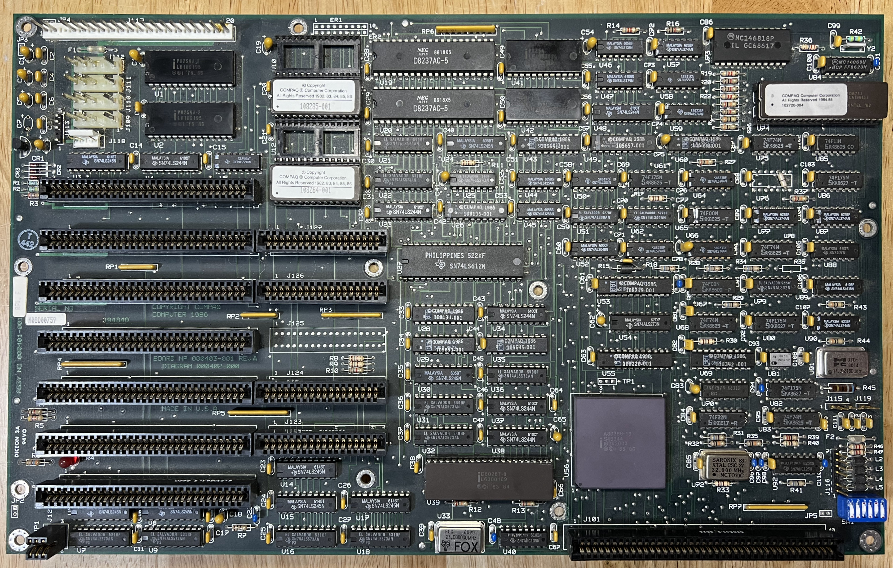

Originally, the oldest COMPAQ DeskPro 386 ROM I had was a `Rev J.4` ROM from a "Version 2" motherboard designed in 1987, released in 1988, and purchased on eBay in October 2014.

And thanks to folks at the [Vintage Computer Federation](https://vcfed.org) [forum](https://forum.vcfed.org/index.php?threads/compaq-deskpro-roms.47584/), I was later able to add the `Rev N.1` ROM from 1989 to this collection.  And when I obtained a DeskPro 386/25 from eBay in March 2015, I was able to add the `Rev K.2` ROM.

More recently (January 2018), I discovered that I still had a copy of the 1986 `Rev F` ROM, which I had made on April 22, 1987, using one of the early DeskPro 386 machines that Microsoft had purchased for the OS/2 development team.  The only downside of my `Rev F` ROM image is that it was dumped using the DOS `DEBUG` utility, since I didn't have ROM reader hardware in those days.

Fortunately, since I wasn't sure how large the ROM actually was, I had dumped the entire 64Kb from F000:0000 through F000:FFFF.  As it turns out, that entire address range is actually write-protected RAM (since RAM provided faster 32-bit access), where the first 32Kb contained a modified copy of the second.  For example, the first 32Kb contains some data structures that are updated by COMPAQ utilities such as `CEMM` to record "Built-in Memory" allocations.

Sure enough, attempting to use the first 32Kb ([1986-09-04-LO](1986-09-04/1986-09-04-LO.json5)) as a DeskPro 386 ROM generated a "ROM Error", no doubt due to a checksum mismatch.  However, the second 32Kb ([1986-09-04-HI](1986-09-04/1986-09-04-HI.json5)) appeared to work fine.  I can't guarantee that its contents are identical to the original `Rev F` ROM, since it was not a direct copy of the physical ROM, but it's all we've got.  All the PCjs EGA-based COMPAQ 4Mb machine configurations have been updated to use that ROM.

This collection of COMPAQ DeskPro 386 ROMs still has several holes, but I'm very happy to have finally found one of the earliest (if not *the* earliest) ROMs commercially available for this line of COMPAQ computers.

### The Newest Oldest COMPAQ DeskPro 386 ROM

Well, it turns out that `Rev F` was *not* the earliest DeskPro 386 ROM that COMPAQ shipped.  On March 9, 2024, GitHub user *[bitslasher](https://github.com/bitslasher)* contributed a significant find to the project--an even *older* COMPAQ DeskPro 386 ROM: the `Rev E`.  He wrote:

> This commit includes properly formatted ROM images I read from a Deskpro 386 that dates from Week 37, 1986. That's September 8th-12th! This is significant because Compaq announced and made the Deskpro 386 available on September 9th, 1986. This has to be one of the earliest machines off the assembly line. The machine's serial number is **4637AJ4B0052**. The beginning of the serial number gives the year and week ([198]6[week]37). The system includes all the original hardware, including the EGA adapter, EGA monitor, and green mono screen. This is certainly the earliest 386 specimen I've ever seen.

Following this discovery, I updated the [COMPAQ DeskPro 386 with Enhanced Graphics (2Mb RAM)](/machines/pcx86/compaq/deskpro386/ega/) to use this new *old* ROM.  It appears to work fine, but it will be interesting to compare this ROM to later revisions and see what COMPAQ changed, fixed, added, etc, over time.

### System ROM Locations

    COMPAQ DESKPRO 386 System Board Version 2 (Assembly No. 000558-001)
    
    U13 (EVEN)
    U15 (ODD)

### System ROM Revisions

	Rev  Even ROM #  Odd ROM #   Size  Date
	---  ----------  ----------  ----  ----
	E    108285-001  108284-001  32Kb  1986-08-19 (from a 386/16 rev-A motherboard)
	F    108328-001  108327-001  32Kb  1986-09-04
	G    108328-002  108327-002
	H.8  113270-008  113269-008
	J.4  109592-001  109591-001  32Kb  1988-01-28 (from a 386/16 motherboard)
	K.2  109592-003  109591-003  32Kb  1988-05-10 (from a 386/25 motherboard)
	M.1  109592-004  109591-004
	N.1  109592-005  109591-005  32Kb  1989-04-14	

## Dumping ROMs

The `.hex` files for the [1988-01-28](1988-01-28/1988-01-28.json5) DeskPro ROM were produced by running [eeprom_read](http://github.com/phooky/PROM/blob/master/tools/eeprom_read/eeprom_read.pde) on a [chipKIT Uno32](http://www.digilentinc.com/Products/Detail.cfm?NavPath=2,892,893&Prod=CHIPKIT-UNO32) Arduino-compatible prototyping board, and capturing the serial port output on my MacBook Pro -- as outlined in "[Stick a Straw in Its Brain and Suck: How to Read a ROM](http://www.nycresistor.com/2012/07/07/stick-a-straw-in-its-brain-and-suck-how-to-read-a-rom/)" by [NYC Resistor](http://www.nycresistor.com/) contributor [phooky](http://www.nycresistor.com/author/phooky/).

The DeskPro 386 ROMs were P27128A-2 chips, so I wired my Uno32 based on this [27128A](https://1drv.ms/b/s!ArcO_mFRe1Z9gqEu9pZaLgq772i_fQ?e=LZxxHU) datasheet -- the closest match I could find online.

On my first dump attempt, every ROM address returned 0xFF.  After looking at the 27128A datasheet more closely, I noticed the DEVICE OPERATION table indicated that, for a READ operation, /CE and /OE pins should be connected to INPUT LOW VOLTAGE, while the /PGM should be connected to INPUT HIGH VOLTAGE.  So I wired pin 27 (/PGM) to +5V instead of GND, and the dump worked perfectly.  The NYC Resistor article implied that every *active low* pin should be connected to GND, but apparently there are exceptions to that general rule.

## Converting Dumps to JSON

[1986-09-04-HI](1986-09-04/1986-09-04-HI.json5) was created with the PCjs [FileImage](/tools/fileimage/) utility:

	cd 1986-09-04
	fileimage.js --file=archive/1986-09-04-HI.rom --output=1986-09-04-HI.json5 --comments

[1988-01-28](1988-01-28/1988-01-28.json5) was created using the [109591-001.hex](1988-01-28/109591-001.hex) and [109592-001.hex](1988-01-28/109592-001.hex) files dumped earlier:

	cd 1988-01-28
	fileimage.js --file=109592-001.hex --merge=109591-001.hex --output=1988-01-28.json5 --comments

Similarly, [1988-05-10](1988-05-10/1988-05-10.json5) was created using the [109591-003.hex](1988-05-10/109591-003.hex) and [109592-003.hex](1988-05-10/109592-003.hex) files:

	cd 1988-05-10
	fileimage.js --file=109592-003.hex --merge=109591-003.hex --output=1988-05-10.json5 --comments

And [1989-04-14](1989-04-14/1989-04-14.json5) was generated from the two 16Kb BIN files provided by [Al Kossow](http://www.vintage-computer.com/vcforum/member.php?2256-Al-Kossow):

	cd 1989-04-14
	fileimage.js --file=archive/109592-005.U11.bin --merge=archive/109591-005.U13.bin --output=1989-04-14.json5 --comments

## Recreating ROM Source Code

In the current directory, an original ROM can be regenerated from the JSON-encoded file:

    cd 1988-01-28
	fileimage.js --file=1988-01-28.json5 --output=1988-01-28.rom --format=rom

The ROM can then be fed into NDISASM, the disassembler included with NASM:

	ndisasm -o0x8000 -se105h -se05ah -se6ffh -sf025h -sf8aah 1988-01-28.rom > 1988-01-28.asm

The `-o0x8000` argument is required to "org" the file at the proper starting address, but the `-s` arguments are optional; they simply establish a few sync points within the ROM image that save a little cleanup effort, by preventing disassembly in the middle of instructions.

Next, the PCjs [TextOut]({{ site.github.pages }}/tools/old/textout/) command, with the *--nasm* option, prepares the code for reassembly:

	textout.js --file=1988-01-28.asm --nasm > temp.asm
	mv temp.asm 1988-01-28.asm

The result, [1988-01-28.asm](1988-01-28/1988-01-28.asm), after a small amount of manual cleanup, can now be successfully reassembled:

	nasm -f bin 1988-01-28.asm -l 1988-01-28.lst -o 1988-01-28.rom

However, it does NOT produce a binary identical to the original ROM, in part because of instruction ambiguities (ie, instructions that can be assembled multiple ways).  It's possible the reassembled ROM may still work, but more research is required.

### Authors of the COMPAQ DeskPro 386 ROM

One interesting section of the COMPAQ DeskPro ROM is this string at offset 0xE002:
 
	db	'AUTHORS CAB93GLB93RWS93DJC93NPB(C)Copyright COMPAQ Computer Corporation 1982,83,84,85,86'

which presumably contains the initials of 5 authors: **CAB**, **GLB**, **RWS**, **DJC**, and **NPB**.

This was later confirmed by HPE firmware engineer Thomas Palmer, who still works at the location of COMPAQ's headquarters in Houston, Texas.  On June 19, 2018, Thomas arranged a reunion for the authors and as many other COMPAQ engineers as he could locate, all who worked on early COMPAQ products and still lived in the area.

Thanks to Thomas, I was able to attend the reunion, and the engineers who worked on the DeskPro 386 were gracious enough to sign my copy of the COMPAQ DeskPro 386 Technical Reference:

- Monty McGraw
- Mike Perez
- Carrie Boone (**CAB**)
- Norm Brown (**NPB**)
- Randy Spurlock (**RWS**)
- Darren Cepulis (**DJC**)

Of the 5 people whose initials are embedded in the original DeskPro 386 ROM, only **GLB** was unable to attend.

The meaning of the "93" sequences in the ROM was originally unclear -- I thought they were likely some form of obfuscation -- until I saw this snippet of COMPAQ ROM source code and we were able to talk to Mike Perez about it:

      page  58,132
    title CMESG Copyright (c) 1982,83,84,85,86,87 COMPAQ Computer Corp.
    ;******************************************************************************
    ;
    ;  Name:  CMESG - Copyright Message
    ;
    ;  Group: ROM
    ;
    ;  Revision:  A
    ;
    ;  Date:  November 6, 1987
    ;
    ;  Authors: Mike Perez
    ;
    ;******************************************************************************
    ;
    ;  CHANGES:
    ;
    ;    DATE     REVISION      DESCRIPTION
    ;  --------   --------   ------------------------------------------------------
    ;  12/31/87   Original    Adapted from DESKPRO 386 Revision J.1/G ROM.
    ;
    ;******************************************************************************
    ;
    ;  FUNCTIONAL DESCRIPTION:
    ;
    ; This module supplies the Copyright and notice in the ROM.  This
    ; module must start at F000:E000 on COMPAQ, COMPAQ PLUS, DESKPRO
    ; and Magnum.  On Magnum, however, this is not the first module in
    ; the ROM, since it is composed of a single 32kx8 ROM doubly-mapped
    ; at F000:0 and F800:0.  On the COMPAQs and DESKPRO, the system ROM
    ; is an 8kx8 ROM that starts at F000:E000.
    ;
    ; The sum of the words at F000:E008, E00A, E00C, E00E, and E010
    ; must equal 2457h for "Exploring the PC"  and possibly other
    ; programs to work.
    ;
    ;******************************************************************************
    ;
    ; Public Declarations
    ;
      public  _CMESG      ; ...So it shows up in the link map
      PUBLIC  _INIT     ; CTRL-ALT-DEL entry point
      public  COMPAQ    ; For general use
    ;
      extrn bas_main:far    ; BAS_MAIN Entry to BASIC intercept
    ;
    ROM SEGMENT BYTE PUBLIC 'ROM'
      ASSUME  CS:ROM
    ;
    ; External References

Mike explained that an IBM program called "[Exploring the IBM Personal Computer](/software/pcx86/demo/ibm/exploring/1.00-MDA/)" contained some code that checksummed the first few bytes of the ROM and would refuse to run if the result didn't match that of a genuine IBM PC.  So one of the COMPAQ engineers simply inserted a series of characters ("93") between their initials which, when checksummed, yielded the same result.

This was one of the many hallmarks of COMPAQ's commitment to compatibility.
