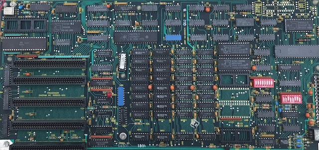

The oldest COMPAQ Portable Computer ROM BIOS we originally had was an 8Kb [Rev C ROM](bios/100666-001-REVC.json) from a
000006-001 REV D system board purchased on eBay.

Printed on the back of the system board:

	(C) COMPAQ COMPUTER CORP. 1982
	BOARD NO. 000006-001   REV D 84490

Curiously, the system board contained two mask ROMs (AM9265DPC), both labeled `1000666-001 REV.C` but with two different
identifiers: `34569 8350KME` on the ROM in socket U40, and `34569 8350LME` on the ROM the socket below U40.  However, when
the chips from each socket were dumped, their contents were identical.  I later found another
[copy](http://www.minuszerodegrees.net/rom/bin/Compaq/Compaq%20Portable%20Plus%20-%20BIOS%20-%20100666-001%20Rev%20C.zip)
of the Rev C BIOS at [minuszerodegrees.net](http://www.minuszerodegrees.net/rom/rom.htm), with dumps of both the U40 and U47 ROMs,
and again the contents of the chips were identical (to ours and to each other).

I've seen pictures of other COMPAQ Portable system boards with only one mask ROM installed, so I was puzzled why my board
contained two.  Did the contents of the second ROM show up in a different part of the address space, or was it merely a decoding
convenience (e.g., one ROM for even addresses, and a second ROM for odd addresses)?  This
[COMPAQ Portable/Plus Maintenance Guide (Excerpt)](https://1drv.ms/b/s!ArcO_mFRe1Z9gt4Suatb4VvNGCHEZQ?e=OSWyfN)
confirms that an older (000004 REV B) system board *did* require 2 ROMs, at locations U40 and U47, while later system boards required
only 1 (Rev C or later) ROM at location U40, but there is no explanation for the requirement.

NOTE: [minuszerodegrees.net](http://www.minuszerodegrees.net/rom/rom.htm) claims that its ROM dump was from a "Portable Plus",
but the Rev C ROM BIOS was an update used in both the COMPAQ Portable *and* the COMPAQ Plus, so strictly speaking, that revision
is not *just* a "Portable Plus" ROM.

Other differences between early (Portable) and later (Plus) system boards: the original board had two sets of DIP switches
(just like the original IBM PC) while later boards had only one set (just like the IBM PC XT).  Although COMPAQ Plus systems were
introduced to offer 10Mb of fixed disk storage and compete with the IBM PC XT, COMPAQ continued making and marketing the original
Portable as well, so it would have made sense to standardize the boards, ROMs, etc, across both systems.

See the March 6, 1984 issue of PC Magazine for an early COMPAQ Plus advertisement.

### System ROM Revisions

Thanks to the aforementioned Maintenance Guide excerpt, we know that these other COMPAQ Portable ROM revisions existed;
however, only Rev B and Rev C are currently available.

	Rev  ROM #       Size  Date
	---  ----------  ----  ----
	B    100518-001   8Kb  None (http://www.minuszerodegrees.net/rom/rom.htm)
	C    100666-001   8Kb  None
	E    100298-004
	F    100298-005
	G    105681-001
    H    106265-001
	J    106265-002
