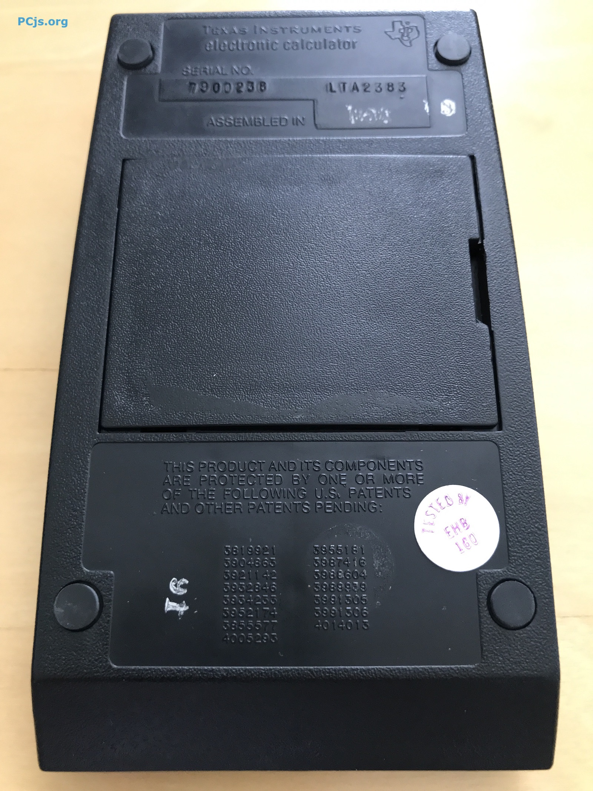

Thanks to research done in 2005 by [Mike Sebastian](http://www.rskey.org/~mwsebastian/patents/patent_ti.htm), we know of
9 patents granted to Texas Instruments, all of which describe both the hardware and software of the TI-57 in surprising
detail.

Of these 9 patents, the first 8 were filed on October 27, 1976, and the last was filed on March 23, 1979.  The issue
dates are in the same order as the patent numbers, with the first issue date being almost one and a half years later
(March, 7, 1978).

- [U.S. Pat. No. 4,078,251: ELECTRONIC CALCULATOR OR MICROPROCESSOR WITH MASK LOGIC EFFECTIVE DURING DATA EXCHANGE OPERATION](us4078251/)
- [U.S. Pat. No. 4,079,459: TWO SPEED SHIFT REGISTER FOR ELECTRONIC CALCULATOR OR MICROPROCESSOR SYSTEM](us4079459/)
- [U.S. Pat. No. 4,100,600: DATA DISPLAY SYSTEM FOR ELECTRONIC CALCULATOR OR MICROPROCESSOR](us4100600/)
- [U.S. Pat. No. 4,107,781: ELECTRONIC CALCULATOR OR MICROPROCESSOR WITH INDIRECT ADDRESSING](us4107781/)
- [U.S. Pat. No. 4,125,867: ELECTRONIC CALCULATOR OR MICROPROCESSOR HAVING A HEXADECIMAL/BINARY CODED DECIMAL ARITHMETIC UNIT](us4125867/)
- [U.S. Pat. No. 4,125,901: ELECTRONIC CALCULATOR OR MICROPROCESSOR HAVING A MULTI-INPUT ARITHMETIC UNIT](us4125901/)
- [U.S. Pat. No. 4,146,928: POWER UP CLEAR SYSTEM FOR AN ELECTRONIC CALCULATOR OR MICROPROCESSOR](us4146928/)
- [U.S. Pat. No. 4,164,037: ELECTRONIC CALCULATOR OR MICROPROCESSOR SYSTEM HAVING COMBINED DATA AND FLAG BIT STORAGE SYSTEM](us4164037/)
- [U.S. Pat. No. 4,277,675: NON-SEQUENTIAL COUNTER](us4277675/)

I've compared a few of these patent texts to each other.  Using [4,125,901](us4125901/) as an arbitrary baseline,
I compared it to the first patent in the list, [4,078,251](us4078251/), and aside from the introductory text and claims,
the vast majority of the text and diagrams are identical, with most differences being either typist mistakes or OCR quirks.

I should add that the text for *all* of the patents above came from [Google](https://patents.google.com),
although I apparently could have obtained the same full-text results from the [U.S. Patent and Trademark Office](http://patft.uspto.gov)
as well, since all these patents were issued after 1976.

The back of every TI-57 also mentions these patents:

	THIS PRODUCT AND ITS COMPONENTS ARE PROTECTED
	BY ONE OR MORE OF THE FOLLOWING U.S. PATENTS
	AND OTHER PATENTS PENDING:
	
	       3819921    3955181
	       3904863    3987416
	       3921142    3988604
	       3932846    3989939
	       3934233    3991305
	       3952174    3991306
	       3855577    4014013
	       4005293

