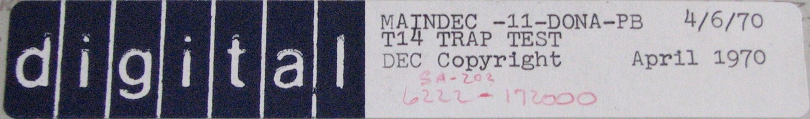

Thanks to the [iamvirtual.ca](http://iamvirtual.ca/collection/systems/mediadoc/mediadoc.html#papertape)
website, we have been able to archive the PDP-11 diagnostics shown below.  The tapes have been added to the
[Default PC11 Configuration](/machines/pdp11/pc11/), so that you can easily load them into any machine with a
[PC11](/machines/dec/pdp11/lib/pc11.js), such as this [PDP-11/20 with Front Panel and Debugger](/machines/dec/pdp11/1120/panel/debugger/).

As noted for other [DEC PDP-11 Tape Images](/software/dec/pdp11/tapes/), these "Absolute Format" tapes can be read directly
into RAM using the machine's **Read** button instead of **Load**, allowing you to bypass the usual multi-step process of
loading the [Bootstrap Loader](/software/dec/pdp11/boot/bootstrap/) in order to load the [Absolute Loader](/software/dec/pdp11/tapes/absloader/)
in order to load the desired tape.

Additional (non-paper tape) diagnostics are available on the [XXDP+ Diagnostics](/software/dec/pdp11/disks/rl02k/xxdp/) disk.

Running Paper Tape Diagnostics
------------------------------

### Tests 1-12

Instructions for running "TEST 1 - BRANCH" through "TEST 12 - JUMP" come from the
[MAINDEC-11-DZQAB MAINDEC USER REFERENCE MANUAL (Oct 1973)](https://1drv.ms/b/s!ArcO_mFRe1Z9gp4RIs4XFo4GvOtA6Q?e=kw0CwE),
page 19:

	MAINDEC-11-D0AA to D0LA (NEW NUMBER - DZKAA to DZKAL)
	
	T1 to T12
	
	ABSTRACT
	
	This is a group of 12 tests that incrementally test and isolate simple
	malfunctions of the PDP-11. The tests should be run in the indicated
	numerical sequence. The sequence is:
	
	                   1. Branch
	                   2. Conditional Branch
	                   3. Unary
	                   4. Unary and Binarys
	                   5. Rotate/Shift
	                   6. Compare (Equality)
	                   7. Compare (non equality)
	                   8. Move
	                   9. Bit Set, Clear and Test
	                   10. Add
	                   11. Subtract
	                   12. Jump
	
	REQUIREMENTS
	
	          PDP-11
	
	STORAGE - Use all of 4K [words] except 17500 - 17776 (Reserved for boot and
	          absolute loader)
	
	LOADING - Absolute Loader
	
	EXECUTION TIME - 246 min, depending on test - Bell will ring
	 
	STARTING PROCEDURE - Start and Restart at 200
	 
	PRINTOUTS - No
	 
	SWITCH REGISTER OPTIONS - No

The code for "TEST 1 - BRANCH" is not terribly exciting.  Most of its 8Kb length is filled with these
three repeated instructions:

	000210: 060100                 ADD   R1,R0
	000212: 000401                 BR    000216
	000214: 000000                 HALT 

until it reaches this point:

	014202: 005267 000022          INC   014230
	014206: 001006                 BNE   014224
	014210: 012737 000207 177566   MOV   #207,@#177566
	014216: 105737 177564          TSTB  @#177564
	014222: 100375                 BPL   014216
	014224: 000167 163750          JMP   000200
	014230: 000000                 HALT 

where it increments a zero-initialized word.  When the word wraps around to zero again, it will output a BELL
character (with bit 7 set; I'm not sure why) to the machine's display terminal, and then run the test again.  If a
BR instruction fails to branch for some strange reason, then in theory, the machine will fall through to a HALT
instruction, and the test will halt.

### Test 13

	MAINDEC-11-D0MA (NEW NUMBER - DZKAM)
	
	T13
	
	ABSTRACT
	
	This is a test of the JSR, RTS and RTI instructions.  It is also the
	first time the Register 6 has been "PUSHED and POPPED".
	
	REQUIREMENTS
	
	          PDP-11
	
	STORAGE - 0 - 5000
	
	LOADING - Absolute Loader
	
	EXECUTION TIME - 2 min - Bell will ring
	 
	STARTING PROCEDURE - Start and Restart at 200
	 
	PRINTOUTS - No
	 
	SWITCH REGISTER OPTIONS - No

### Test 14

Note that, as the instructions indicate, this test will fail on a PDP-11/45 or newer machine, because
it expects the MUL instruction to trap.

This test is also noteworthy because it uncovered a bug involving instructions like this:

	MOV     R0,(R0)+

Imagine that R0 contains 1000.  PDPjs would write the value 1000 to address 1000 after auto-incrementing R0 to
1002.

Unfortunately, that's wrong -- for the PDP-11/20 anyway.  Apparently, unlike later (micro-coded) models, the
PDP-11/20 performs both source and destination address calculations *before* reading and writing the source and
destination values.  So, in the above example, the value 1002 must be written to address 1000.

	MAINDEC-11-D0NA (NEW NUMBER - DAKAA)
	
	T14 TRAPS
	
	ABSTRACT
	
	This is a test of all operation and instruction that cause traps.
	Also tested are trap overflow conditions, oddities of register 6,
	interrupts and the reset instructions.
	
	REQUIREMENTS
	
	          PDP-11/20, 11/05, 11/10
	
	STORAGE - 0 - 17500
	
	LOADING - Absolute Loader
	
	EXECUTION TIME - Function or core size - Bell will ring
	 
	STARTING PROCEDURE
	
	          Start and Restart at     200 for a 4K System
	                                   202 for an 8K System
	                                   204 for a 12K System
	                                   206 for a 16K System
	                                   210 for a 20K System
	                                   212 for a 24K System
	                                   214 for a 28K System
	
	PRINTOUTS - No
	 
	SWITCH REGISTER OPTIONS - No
	
	This program should not be used to test 11/40 and 11/45's.

### Test 15

Before loading and running this test on the [PDP-11/20 with Front Panel and Debugger](/machines/dec/pdp11/1120/panel/debugger/),
it's recommended that you also toggle SW-15, as described below, so that the test will HALT on any failure.

Also, this test, like [Test 14](#test-14), fails on a PDP-11/45 or newer machine.  In this case, it's because DEC
changed the behavior of the RTI instruction on newer models.

	MAINDEC-11-D0OA (NEW NUMBER - DZQKA)
	
	T15 Instruction Exerciser
	
	ABSTRACT
	
	This program is designed to be a comprehensive check of all 11 family
	processor instructions.  The program executed each instruction in all
	address modes and includes tests for traps and the teletype interrupt
	sequence.  The program relocates the test code throughout memory 0-28K.
	
	REQUIREMENTS
	
	          PDP-11 family central processor
	          Optional - KL11-L (line clock)
	
	STORAGE - Program uses all the first 4K of memory (excluding that area
	          of memory reserved for the loaders.)
	
	LOADING - Absolute Loader
	
	EXECUTION TIME - For 4K - 1 min, for 28K - 5 min.
	 
	STARTING PROCEDURE - 200
	
	PRINTOUTS - Yes
	
	SWITCH REGISTER OPTIONS - Yes
	
	SW15 =   .... HALT ON ERROR
	SW14 =   .... LOOP SUBTEST
	SW13 =   .... INHIBIT ERROR PRINTOUT
	SW12 =   .... INHIBIT TRACE TRAPPING
	SW11 =   .... INHIBIT SUBTEST ITERATION
	SW10 =   .... RING BELL ON ERROR
	SW 8 =   .... LOAD PDP-11/45 MICRO BREAK REGISTER
	SW 7-0 = .... WHEN SET LOADS THE MICRO BREAK REGISTER WITH THE VALUE
	              SET INTO SW7-0 AT THE BEGINNING OF EACH SUBTEST
	
	                          NOTE
	                          
	              WHEN ALL SWITCHES ARE DOWN NO TYPEOUTS
	              WILL OCCUR AT THE END OF A PASS (errors
	              will be typed). SETTING SW7 WILL CAUSE
	              END OF PASS MESSAGE TO BE TYPED.

### Newer Paper Tape Software (mid-1970s)

Thanks to the efforts of person(s) unknown, additional paper tape images have been uploaded to
[bitsavers.org](http://bitsavers.trailing-edge.com/bits/DEC/pdp11/papertapeimages/).  It's not super organized,
so for now, I'm just going to pick out selected tapes and archive them here.

From [bitsavers.org](http://bitsavers.trailing-edge.com/bits/DEC/pdp11/papertapeimages/20040101/), Tray 02:

  - Tape 04: [MAINDEC-11-DEQKC-B1-PB 06/12/78; 11/70 cpu instruction exerciser; (c)1975,76](#md-11-1170-cpu-exerciser) [[1980 Listing](http://bitsavers.org/pdf/dec/pdp11/microfiche/ftp.j-hoppe.de/bw/gh/AH-7996E-MC__PDP11-70-74__11-70_INST_EXR__CEQKCE0__%28C%2975,80.pdf)]

### MD-11 11/70 CPU EXERCISER

When started in a [PDP-11/70](/machines/dec/pdp11/1170/panel/debugger/cpuexer/) with no disk drives installed,
this diagnostic displays the following startup information ("EXERCISOR" is DEC's typo, not mine):

	MAINDEC-11-DEQKC-B...PDP 11/70 CPU EXERCISOR
	OPT.CP=145406
	OPERATIONAL SWITCH SETTINGS
	SWITCH                  USE
	  15            HALT ON ERROR
	  14            LOOP ON TEST
	  13            INHIBIT ERROR TYPEOUTS
	  12            INHIBIT UBE
	  11            INHIBIT ITTERATIONS
	  10            BELL ON ERROR
	   9            LOOP ON ERROR
	   8            INHIBIT RELOCATION VIA I/O DEVICE
	   7            INHIBIT TYPEOUT OF THIS TEXT AND SYS SIZE
	   6            INHIBIT RELOCATION
	   5            INHIBIT ROUND ROBIN RELOCATION
	   4            INHIBIT RANDOM DISK ADDRESS
	   3            INHIBIT MBT
	   2            THESE THREE SWITCHES
	   1            ARE ENCODED TO SELECT RELOCATION
	   0            ON THE FOLLOWING DEVICES:
	        0...RP11/RP03
	        1...RK11/RK05
	        2...NOT USED
	        3...NOT USED
	        4...RH70/RP04
	        5...RH70/RS04 OR RS03
	        6...NOT USED
	        7...NOT USED
	THE FOLLOWING DEVICES AND DRIVES WILL BE USED FOR RELOCATION:
	DEVICE  DRIVES
	TYPE A CHARACTER TO CONTINUE

The first time I tried this test, there were a number of failures.  Here's one example:

	000:00:00
	ERRORPC PHYSC PC    PSW   MAINT   TEST NO SUB-PASS CNT
	022024  00022024  000340  000000  000041  000000  000000

I disassembled the code responsible for that failure:

	021632: 052737 000340 177776   BIS   #340,@#177776
	021640: 010746                 MOV   PC,-(SP)
	021642: 062716 000152          ADD   #152,@SP
	021646: 011637 000004          MOV   @SP,@#4
	021652: 012737 000340 000006   MOV   #340,@#6
	021660: 013727 000014 001472   MOV   @#14,#1472
	021666: 062716 000100          ADD   #100,@SP
	021672: 012637 000014          MOV   (SP)+,@#14
	021676: 012737 000340 000016   MOV   #340,@#16
	021704: 012703 000376          MOV   #376,R3
	021710: 010313                 MOV   R3,@R3
	021712: 010306                 MOV   R3,SP
	021714: 032767 140000 000234   BIT   #140000,022156
	021722: 001015                 BNE   021756
	021724: 005716                 TST   @SP
	021726: 021666 177776          CMP   @SP,177776(SP)
	021732: 012656                 MOV   (SP)+,@-(SP)
	021734: 057636 000000          BIS   @000000(SP),@(SP)+
	021740: 054676 000000          BIS   -(SP),@000000(SP)
	021744: 005006                 CLR   SP
	021746: 013766 020000 020000   MOV   @#20000,20000(SP)
	021754: 000425                 BR    022030
	021756: 156737 000175 177777   BISB  022157,@#177777
	021764: 012706 000376          MOV   #376,SP
	021770: 016646 177776          MOV   177776(SP),-(SP)
	021774: 051616                 BIS   @SP,@SP
	021776: 061666 177776          ADD   @SP,177776(SP)
	022002: 105037 177777          CLRB  @#177777
	022006: 012706 000700          MOV   #700,SP
	022012: 000451                 BR    022136
	022014: 012600                 MOV   (SP)+,R0
	022016: 012602                 MOV   (SP)+,R2
	022020: 012706 000700          MOV   #700,SP
	022024: 104000                 EMT   000

I wasn't able to locate a source code listing for this particular (1978) version of the 11/70 CPU Instruction Exerciser,
but I did find another useful document,
[MAINDEC-11-DCQKC 11/40 and 11/45 INSTRUCTION EXERCISER (Sep 1974)](https://1drv.ms/b/s!ArcO_mFRe1Z9gp4ebuUvYWlXBLnWCw?e=1LDnUC),
where I discovered a matching test sequence on page 86.

Here's an excerpt:

	; THE BELOW INSTRUCTIONS SHOULD NOT CAUSE AN OVERFLOW TRAP
	        TST     (SP)            ; BECAUSE TST IS A NON MODIFYING INST
	        CMP     (SP),-2(SP)     ; SO IS COMPARE
	        MOV     (SP)+,@-(SP)    ; BECAUSE OF ADDRESS MODE 5
	        BIS     @(SP),@(SP)+    ; BECAUSE OF ADDRESS MODE 3
	        BIS     -(SP),@(SP)     ; BECAUSE OF ADDRESS MODE 7
	        CLR     SP
	        MOV     @#20000,20000(SP)
	        BR      3$              ; BRANCH OVER NON KERNEL MODE TESTS

This test uncovered a number of stack overflow-related issues that PDPjs needed to resolve,
including the fact that none of the "deferred" addressing modes (3, 5, or 7) apparently trigger a
stack overflow; eg:

	R0=000000 R1=154112 R2=155754 R3=000376 R4=160316 R5=153412
	SP=000376 PC=021734 PS=000340 IR=000000 SL=000377 T0 N0 Z0 V0 C0
    021734: 057636 000000          BIS   @000000(SP),@(SP)+

whereas addressing mode 6 *does*; eg:

	R0=001437 R1=154112 R2=000040 R3=000376 R4=160316 R5=153412 
	SP=000376 PC=022074 PS=000340 IR=000000 SL=000377 T0 N0 Z0 V0 C0 
	022074: 050666 177776          BIS   SP,177776(SP)

I have to assume that the idiosyncrasies of stack overflow checking changed over time, because [Test 14](#test-14),
which predates the 11/45 and 11/70, expects this instruction:

	TST     -(SP)

to trap when SP is 150.  That contradicts this newer test (ie, that TST should not cause an overflow
trap "BECAUSE TST IS A NON MODIFYING INST").  For this and other reasons, PDPjs now installs different
checkStackLimit() handlers based on the CPU model.

UPDATE: Another (1980) version of the source code for this diagnostic has been located and archived
with the rest of our [DEC PDP-11 Diagnostic Publications](/documents/manuals/dec/#pdp-11-diagnostics):

- [CEQKCE0 11/70 INSTRUCTION EXERCISER (May 1980)](https://1drv.ms/b/s!ArcO_mFRe1Z9gp47nXKy7moL1Rj5mA?e=QDDzO4) [[Original PDF](http://bitsavers.org/pdf/dec/pdp11/microfiche/ftp.j-hoppe.de/bw/gh/AH-7996E-MC__PDP11-70-74__11-70_INST_EXR__CEQKCE0__%28C%2975,80.pdf)]

You'll find the above excerpt on page 114, at address 024624.

---

Here's the next test that PDPjs failed.  Again, I found the same sequence of instructions in the 11/40 and 11/45
version of the diagnostic, at PC 023360 rather than 023450, so I've annotated the code below with DEC's comments:

	023450: 012704 000001          MOV   #1,R4                  ;SET R4
	023454: 006767 000060          SXT   023540                 ;PRESET DATA=0
	023460: 074467 000054          XOR   R4,023540
	023464: 100423                 BMI   023534
	023466: 006304                 ASL   R4                     ;SHIFT R4
	023470: 102373                 BVC   023460                 ;UNTIL V SETS (R4=100000)
	023472: 100020                 BPL   023534                 ;BRANCH IF 'N' IS CLEAR
	023474: 074467 000040          XOR   R4,023540              ;XOR6A=177777
	023500: 100015                 BPL   023534
	023502: 074767 000032          XOR   PC,023540              ;XOR PC WITH XOR6A (177777)
	023506: 010767 000030          MOV   PC,023542              ;FORM PC AS USED IN XOR ABOVE
	023512: 162767 000004 000022   SUB   #4,023542
	023520: 005167 000016          COM   023542
	023524: 026767 000012 000006   CMP   023542,023540          ;XOR6A SHOULD = COMPLEMENT OF PC
	023532: 001401                 BEQ   023536
	023534: 104000                 EMT   000                    ;ERROR: XOR TESTS ABOVE FAILED [They use HLT instead of EMT here]

In my case, the failure was caused by the XOR instruction.  When I fixed the PDP-11/20 issue uncovered by
[Test 14](#test-14), I had neglected to update XOR, which has some unique operand decoding logic.


