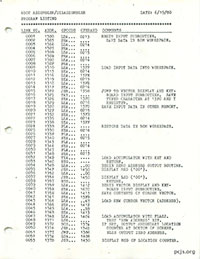

By Jeff Parsons



The "source code" listing below from June 19, 1980 is for the first piece of software I sold, right around the
time I graduated from high school.  I had had my Ohio Scientific Challenger 1P for maybe a year when I decided
to write something that would make it easier to write "machine language" programs than the incredibly tedious
HEX monitor that was built into the C1P.  And so my [6502 Assembler/Disassembler](ASSEMBLER-4K.json) was born,
with full-screen editor, assembler, and disassembler.

There were two versions, one for each of the standard Challenger 1P memory configurations:

- [6502 Assembler/Disassembler for 4K C1P](ASSEMBLER-4K.json)
- [6502 Assembler/Disassembler for 8K C1P](ASSEMBLER-8K.json)

One of the conditions of the sale, however, was that I provide a "source code" listing.  I don't think the buyer
understood that I had essentially written the program in machine language -- because that's how I had to enter it
into the machine.  Maybe *some* lucky C1P users had disk drives and editors and assemblers, but I had none of those
of things.  I had never even used tools like that before, which is why the [6502 Assembler/Disassembler](ASSEMBLER-4K.json)
is a bit of an odd duck.  I'll post some screenshots and a demo eventually, and you'll see what I mean.

Anyway, to satisfy the buyer, I sat down at my old manual typewriter and banged out my version of a "source
code" listing.  I produced it mostly by using the program to disassemble itself, combined with information from
hand-written notes (which I may still have somewhere).

Here it is, many decades later, for your amusement.

NOTE: Even though the "source code" listing was based on the 8K version, it more closely resembles the
[4K version](ASSEMBLER-4K.json), because the [8K version](ASSEMBLER-8K.json) I originally located appears to be
an older vintage (4/1980 instead of 6/1980, if the embedded dates are correct).  However, even the 4K version
probably doesn't align perfectly with the listing, because it appears to be *newer* than the listing (9/1980).
