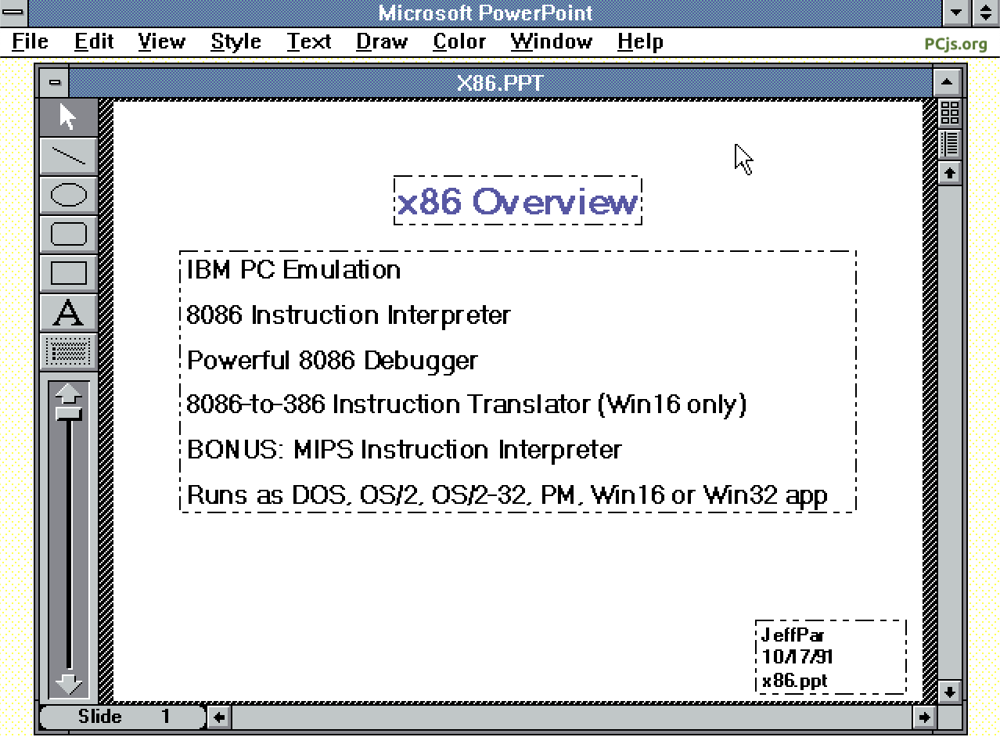

Much like the [PCjs Document Archive](/documents/pcjs/), this collection is an assortment of software from the PCjs Archives that may or may not be of historical interest.

Some disks from this collection include:

  - [COMPAQ Diagnostics 5.08](/software/pcx86/diag/compaq/5.08/)
  - [COMPAQ DeskPro 386 (1986)](/software/pcx86/diag/compaq/1986/)
  - [COMPAQ MS-DOS 3.10 (12-17-85)](/software/pcx86/sys/dos/compaq/3.10/#compaq-ms-dos-310-12-17-85)
  - [COMPAQ MS-DOS 3.31 (1987)](/software/pcx86/sys/dos/compaq/3.31/#directory-of-compaq-ms-dos-331-1987)
  - [dBASE III 1.0](/software/pcx86/app/other/dbase3/1.0/)
  - [DoubleDOS 2.1F](/software/pcx86/sys/ext/softlogic/doubledos/2.1f/)
  - [Inside the IBM PC (1983)](/software/pcx86/sw/books/inside_the_ibm_pc/)
  - [Multitasking MS-DOS 4.00](/software/pcx86/sys/dos/microsoft/4.0M/)
  - [Microsoft C Compiler 1.03 (Beta)](/software/pcx86/lang/microsoft/c/1.03/)
  - [Microsoft C Compiler 1.04](/software/pcx86/lang/microsoft/c/1.04/)
  - [Microsoft Macro Assembler 5.10 (Feb 1988)](/software/pcx86/lang/microsoft/masm/5.10x/)
  - [Microsoft Windows 95 (Build 121)](/software/pcx86/sys/windows/win95/4.00.121/)
  - [Microsoft Windows 95 (Build 499)](/software/pcx86/sys/windows/win95/4.00.499/)
  - [Microsoft Word 1.10 (for DOS)](/software/pcx86/app/microsoft/word/1.10/)
  - [The Norton Utilities 2.00](/software/pcx86/util/norton/2.00/)
  - [The Norton Utilities 2.01 (1983-11-03)](/software/pcx86/util/norton/2.01/)
  - [The Norton Utilities 3.00 (1984-12-07)](/software/pcx86/util/norton/3.00/)
  - [The Norton Utilities 4.00 (Standard Edition)](/software/pcx86/util/norton/4.00/)
  - [The Norton Utilities 4.00 (Advanced Edition)](/software/pcx86/util/norton/4.00/advanced/)
  - [Early OS/2 Prototypes](/software/pcx86/sys/os2/misc/) (eg, CP-DOS and FOOTBALL)
  - [Early WOW Development Files/Notes](#early-wow-development-filesnotes)

You can probably find most or all of these disks on other software sites now, just as software from many other sites has found its way here, thanks to the continuous motion of bits on the Internet.

Any other disks you see [below](#directory-listings) are primarily ones that don't neatly fit into another PCjs category, usually either because the disks contain a mixture of random/personal/unique content.



## Directory Listings

### Directory of Jeff's MS-DOS 3.20 Tools

	 Volume in drive A is MSDOS 32   
	 Directory of  A:\

	LINK     EXE    43988   7-07-86  12:00p
	DEBUG    EXE    15647  11-26-86  10:24p
	GWBASIC  EXE    78864   7-07-86  12:00p
	PCPAL    EXE    63088   8-23-86  11:33a
	HDISK    ASM     5238   3-27-87  12:01a
	MASM     EXE    83165  10-05-86   5:22p
	HDISK    OBJ      643   2-09-87  11:52p
	HDISK    EXE      857   2-09-87  11:53p
	EXE2BIN  EXE     3050   7-07-86  12:00p
	PF       COM      290   1-03-80  11:46p
	TF       COM       40   1-03-80  11:57p
	COMMAND  COM    23612   7-07-86  12:00p
	HDISK    SYS      345   3-27-87  12:03a
	       13 File(s)     35840 bytes free

> NOTES: This was originally an MS-DOS 3.20 Distribution Disk (Disk 2 of 2) which I had subsequently modified for
personal use.  Presumably to make more room on the disk, I had moved off a few MS-DOS 3.20 files (BACKUP.EXE,
RESTORE.EXE, SHARE.EXE, TREE.EXE, and XCOPY.EXE), updated DEBUG.EXE, added MASM.EXE (v4.00), and then included
a few files of my own (eg, PCPAL.EXE and HDISK.ASM).  FYI, this particular copy of PCPAL.EXE was saved with **Alt-Esc**
configured as the activation key sequence. *--[Jeff]({{ site.author_url }})*

### Directory of Jeff's Misc Disk #1

     Volume in drive A is JEFF 1
     Directory of A:\
    
    HOME              1536   5-09-91  11:10a
    HOME     C        2048   5-09-91  11:10a
    HOME     H        4096   5-09-91  11:10a
    HOMEKBD  C        1536   5-09-91  11:10a
    HOMELOC  C        5120   5-09-91  11:10a
    HOMEPARS C        1024   5-09-91  11:10a
    HOMESCRN C        7168   5-09-91  11:10a
    HOMEVERB C        2560   5-09-91  11:10a
    MBROT             1536   5-09-91  11:10a
    MBROT    C       54272   5-09-91  11:10a
    MBROT    EXE     40448   5-09-91  11:10a
    MBROT    TXT       512   5-09-91  11:10a
    MBROT1   MEM     30720   5-09-91  11:10a
    MBROT2   MEM     53248   5-09-91  11:10a
    MBROT3   MEM    242688   5-09-91  11:10a
    MBROT4   MEM    180736   5-09-91  11:10a
    MBROT5   MEM     82944   5-09-91  11:10a
           17 file(s)     712192 bytes
                          501760 bytes free

### Directory of Jeff's Misc Disk #2

     Volume in drive A is JEFF 2
     Directory of A:\
    
    CMD      PAS       640   8-09-84   6:41p
    DCROSS   PAS     50688   8-09-84   9:10p
    DFORM    PAS      2944   8-09-84   6:44p
    STARTREK PAS     27776   8-09-84   6:46p
    SYSLIB   PAS     18432   8-09-84   6:47p
    8088     ASM      7552   8-09-84   6:48p
    JPCON1   A86      3584   8-09-84   6:48p
    JPDSK1   A86      2304   8-09-84   6:49p
    JPINTC   A86      4608   8-09-84   6:50p
    JPUTIL   A86     12416   8-09-84   6:51p
    ROMFIX   ASM      4337   5-22-86  12:33p
    SAMPLE   PRG      6528   8-10-84  12:22p
    DCROSS30 PAS     52736   8-19-84   7:56p
    BLACKJK  PAS      3363   9-08-84  11:10p
    DLOK     PAS      5632  11-05-84  11:41p
    DLOK     COM     12450  10-12-84  11:37p
    DLOK     TXT      1280  10-12-84  11:49p
    DBASE    TXT      1024  10-13-84  12:02a
    BYTE     LTR      5504  10-14-84  10:29p
    DUU      ASM     51712   2-04-85   9:59a
    DUU      DOC     13952   2-04-85  10:00a
    8080     ASM       768   2-05-85   9:49p
    KEQ      DOC     14720  11-26-84  12:05a
    DMAC     ASM      6612   5-13-86   7:38p
    DSKTST   ASM      2027   5-22-86  12:54p
    KEQ      MAC     27925   9-14-86   1:35a
           26 file(s)     341514 bytes
                            7168 bytes free

### Directory of Jeff's Misc Disk #3

     Volume in drive A is JEFF 3
     Directory of A:\
    
    RESUME            7435   5-07-86   2:53p
    ROMBIOS  DAT     65536   6-03-86   6:42p
    CALL     ASM      1001   7-22-86   2:10p
    VTP      ASM      7884   9-04-86  12:40p
    VT52     ASM     39252   8-26-86   3:50p
    VTP      COM       473   9-03-86   9:16a
    VT52     SYS      3146   9-05-86  11:36a
    VT52               122   8-26-86   2:47p
    ANSI     ASM     14756   7-11-85   9:04a
    MULT     INC      3586   7-01-85   9:34a
    VECTOR   INC      2966   7-01-85   9:36a
    ANSI               127   9-05-86   9:33a
    ATBIOS   DAT     65536  10-19-85   8:07p
    ATVECS   DAT      1024  10-19-85   8:07p
    CQBIOS   DAT     40472  10-19-85  11:29p
    CQHROM   DAT      3840  10-19-85   8:49p
    SAMPLE1  ASM       896  10-18-84   9:47p
    SAMPLE2  ASM       896  10-18-84   9:51p
    FLIB     ASM      5376   1-17-85  10:47p
    FMAIN    ASM       768   1-17-85   9:11p
    DEBBIE   ASM      2432  12-24-84   4:13p
    NEC      ASM      3968   1-01-80  12:07a
    RAMDRIVE ASM      4352   2-26-85  11:46p
    TABEX    ASM      2842   7-24-85  11:27p
    TABIN    ASM      2607   2-19-86   5:50p
    HDISK    SYS       345  10-20-86  11:46a
    HDISK    ASM      5238   2-01-87  10:39p
    IBMBIO   COM     16369  12-30-85  12:00p
           28 file(s)     303245 bytes
                           47104 bytes free

## Early WOW Development Files/Notes

### Directory of WOW Reversi MIPS Demo (Disk 1)

     Volume in drive A has no label
     Directory of A:\

    NT       ZIP   1128366   4-04-91   5:34p
    DEBUG    CMD       111   3-29-91   8:55a
    PKZIP    EXE     31342   7-21-89   1:01a
    PKUNZIP  EXE     21440   7-21-89   1:01a
            4 file(s)    1181259 bytes

     Directory of A:\NT.ZIP

    KD       EXE    218334   3-09-91  12:30a
    MIPSKD   EXE    218934   3-29-91   6:32p
    NTOS2    CFG      6251   4-03-91   9:53p
    NTOSKRNL EXE   2096041   4-01-91   7:55p
    SMSS     EXE     42496   4-01-91   7:55p
            5 file(s)    2582056 bytes

    Total files listed:
            9 file(s)    3763315 bytes
                           31744 bytes free

### Directory of WOW Reversi MIPS Demo (Disk 2)

     Volume in drive A has no label
     Directory of A:\

    NTBIN    ZIP    267010   4-04-91   5:50p
    NTBIN86  ZIP    478904   4-04-91   5:51p
    NTSUBSYS ZIP      9871   4-04-91   5:53p
    NTWIN    ZIP     48398   4-04-91   5:54p
            4 file(s)     804183 bytes

     Directory of A:\NTBIN.ZIP

    CMD      EXE    158720   4-02-91  11:39p
    MAZE     EXE     11776   4-01-91  11:00p
    PLGBLT   EXE     14336   4-03-91   1:20a
    TESTIT   EXE     95744   4-03-91  12:49a
    X86      EXE    382464   4-04-91   8:36p
            5 file(s)     663040 bytes

     Directory of A:\NTBIN86.ZIP

    DOS500   DSK    368648  12-21-90   7:05p
    REVERSI  HOT    657448   1-01-85   8:03a
    WOW      DSK    368648   3-21-91   5:56p
            3 file(s)    1394744 bytes

     Directory of A:\NTSUBSYS.ZIP

    CSRSS    EXE      5120   4-01-91   7:55p
    DBGSS    EXE     19968   4-01-91   7:55p
            2 file(s)      25088 bytes

     Directory of A:\NTWIN.ZIP\FONTS

    COURE08  FNT      3968   2-20-91  10:24p
    COURE10  FNT      8246   2-20-91  10:24p
    COURE12  FNT     10050   2-20-91  10:24p
    HELVE08  FNT      4043   2-20-91  10:24p
    HELVE10  FNT      5523   2-20-91  10:24p
    HELVE12  FNT      8107   2-20-91  10:24p
    HELVE14  FNT      9979   2-20-91  10:24p
    HELVE18  FNT     12859   2-20-91  10:24p
    HELVE24  FNT     22487   2-20-91  10:24p
    TMSRE08  FNT      4016   2-20-91  10:24p
    TMSRE10  FNT      5426   2-20-91  10:24p
    TMSRE12  FNT      6650   2-20-91  10:24p
    TMSRE14  FNT      8691   2-20-91  10:24p
    TMSRE18  FNT     12150   2-20-91  10:24p
    TMSRE24  FNT     19296   2-20-91  10:24p
    VGASYS   FNT      5461   3-01-91   3:36a
           16 file(s)     146952 bytes

     Directory of A:\NTWIN.ZIP

    WIN      INI      3670   4-03-91   9:57p
            1 file(s)       3670 bytes

    Total files listed:
           31 file(s)    3037677 bytes
                          408576 bytes free

### Directory of WOW Reversi MIPS Demo (Disk 3)

     Volume in drive A has no label
     Directory of A:\
    
    NTDLL    ZIP    717080   4-04-91   5:52p
            1 file(s)     717080 bytes
    
     Directory of A:\NTDLL.ZIP
    
    BASE     DLL    103424   4-01-91   8:32p
    BASERTL  DLL      6656   4-01-91   8:32p
    BASESRV  DLL     24576   4-01-91   8:32p
    BMFD     DLL     28160   4-02-91   4:52a
    CONSOLE  DLL     24576   4-02-91   6:49p
    CONSRV   DLL    105984   4-02-91   6:49p
    CSR      DLL     15872   4-01-91   7:55p
    CSRRTL   DLL      2560   4-01-91   7:55p
    CSRSRV   DLL     38912   4-01-91   7:55p
    DBGDLL   DLL     10240   4-01-91   7:56p
    GDI      DLL     13312   4-02-91   4:52a
    GDISRV   DLL     13824   4-02-91   4:52a
    GRE      DLL    332288   4-03-91   6:57a
    JAZZ     DLL     25600   4-03-91   6:00a
    NETAPI   DLL     91136   4-01-91   7:56p
    NTDLL    DLL    180224   4-02-91   6:25p
    SERVICES DLL     61440   4-02-91   4:52a
    USER     DLL    118272   4-03-91  11:39p
    USERRTL  DLL     15872   4-03-91   9:45p
    USERSRV  DLL    425472   4-03-91  11:27p
    WINNET   DLL     14848   4-01-91   8:33p
           21 file(s)    1653248 bytes
    
    Total files listed:
           22 file(s)    2370328 bytes
                          496640 bytes free

### Directory of X86 Emulator Source Code (1990-1996)

     Volume in drive A has no label
     Directory of A:\
    
    MAKEFILE         24347   3-12-96   3:35p
    OBJ          <DIR>      11-14-23  12:24p
    README   TXT       350  11-14-23   1:25p
    TEST         <DIR>       7-01-96   5:44p
    VMDISK   ASM     10982   7-30-91   9:52a
    WINMEM32 DLL      4320   3-22-92   7:10p
    WLDR         <DIR>       7-01-96   5:43p
    X86      C        9689   2-18-93   1:54a
    X86      H       29815   2-18-93   2:07a
    X86      ICO       766   7-30-91   5:10a
    X86      INC      8715   2-18-93   4:25a
    X86      PPT     17412  10-17-91   4:14a
    X86      RC       2080   3-08-92  12:15p
    X86PM    ICO      1056   7-30-91   5:10a
    X86PM    RC         47   7-30-91   5:10a
    XASM     ASM     28487   3-08-92  10:21a
    XASM     H       10789  10-04-91   5:17a
    XASM     INC      6730   1-20-92   4:59a
    XBIOS    C        5653  11-13-92   7:43a
    XBIOS    H        4101   7-30-91   9:48a
    XBIOSDSK C       16766   3-12-96   4:07p
    XBIOSDSK H        9416  11-13-92   7:18a
    XBIOSKBD C        2771   2-18-93   3:25a
    XBIOSKBD H         820   7-30-91   9:48a
    XBIOSVID C        4348  10-12-91   6:58p
    XBIOSVID H        1775  10-01-91  11:14a
    XDOS6    C        2154  11-12-91   7:33a
    XDOS6    H        2779  11-12-91   7:25a
    XERR     C        5079   2-18-93   2:05a
    XERR     H        2718   2-18-93   1:56a
    XGUEST   C       63405  11-13-92   6:22a
    XGUEST   H       38830   6-15-92   6:50a
    XGUEST   INC     16382   6-15-92   6:57a
    XGUEST1  C        8478  10-07-91   8:09a
    XGUEST1  H        1580   8-08-91   8:46a
    XGUEST2  C       38030  11-12-91   7:32a
    XGUEST2  H        3961   8-08-91   8:48a
    XGUESTBP C        7346   8-18-91   4:09p
    XGUESTBP H        2040   8-08-91   7:17a
    XGUESTDB C       25319   3-09-92   3:05a
    XGUESTDB H        1121   7-30-91   9:48a
    XGUESTEM C       30453   6-16-92   9:01a
    XGUESTEM H        5690   8-31-91   4:45p
    XGUESTWP C        4918   8-18-91   4:10p
    XGUESTWP H        1387   8-08-91   7:20a
    XHOST    C       13373   8-18-91   4:15p
    XHOST    H        7930   7-30-91   9:49a
    XHOST    INC      3141   1-20-92   4:59a
    XHOSTDB  C       12161   6-16-92   8:49a
    XHOSTDB  H        1044   8-08-91   7:19a
    XHOSTEM  C        7290   8-18-91   4:11p
    XHOSTEM  H         789   7-30-91   9:49a
    XHOSTOP  C        2719   8-18-91   4:11p
    XHOSTOP  H         861   7-30-91   9:49a
    XLIB     C        7255   3-08-92  10:32a
    XLIB     H        1986   3-09-92  12:40a
    XSTATS   C        6157   8-18-91   4:23p
    XSTATS   H        1549   7-30-91   9:49a
    XTRANS1  C       94417  10-14-91   6:29p
    XTRANS1  H       20019   3-08-92  10:07a
    XTRANS2  C       59293  10-14-91   3:04a
    XTRANS2  H        2311  10-07-91   8:14a
    XWIN     C       16549   6-16-92   9:05a
    XWIN     H        1082   8-19-91   9:30a
    XWINCON  C       25141   4-03-92   5:30a
    XWINCON  H        6976  10-01-91  11:11a
           66 file(s)     754948 bytes
    
     Directory of A:\OBJ
    
    .            <DIR>      11-14-23  12:24p
    ..           <DIR>      11-14-23  12:24p
    286          <DIR>       7-01-96   5:43p
            3 file(s)          0 bytes
    
     Directory of A:\OBJ\286
    
    .            <DIR>       7-01-96   5:43p
    ..           <DIR>       7-01-96   5:43p
    X86      EXE     66799   2-18-93   4:19a
    X86      LRF       446   2-18-93   4:19a
    X86      MAP     38529   2-18-93   4:19a
    X86      SYM      8900   2-18-93   4:19a
            6 file(s)     114674 bytes
    
     Directory of A:\TEST
    
    .            <DIR>       7-01-96   5:44p
    ..           <DIR>       7-01-96   5:44p
    ADD      ASM     40147   7-30-91   5:10a
    ADD      COM      8166   7-30-91   5:10a
    AND      ASM     40147   7-30-91   5:10a
    AND      COM      8166   7-30-91   5:10a
    CMP      ASM     40147   7-30-91   5:10a
    CMP      COM      8166   7-30-91   5:10a
    OR       ASM     40147   7-30-91   5:10a
    OR       COM      8166   7-30-91   5:10a
    SUB      ASM     40147   7-30-91   5:10a
    SUB      COM      8166   7-30-91   5:10a
    XOR      ASM     40147   7-30-91   5:10a
    XOR      COM      8166   7-30-91   5:10a
           14 file(s)     289878 bytes
    
     Directory of A:\WLDR
    
    .            <DIR>       7-01-96   5:43p
    ..           <DIR>       7-01-96   5:43p
    MAKEFILE          1707   7-30-91   5:10a
    WLDR     C       24032   7-30-91   5:10a
    WLDR     H        6964   7-30-91   5:10a
    WLDR     OBJ      9198   1-21-92   7:21a
    WLDRASM  ASM      1206   1-21-92   7:25a
    WLDRGDI  C       35300   7-30-91   5:10a
    WLDRKBD  C        7876   7-30-91   5:10a
    WLDRKRN  C       22081   7-30-91   5:10a
    WLDROVL  C        2127   7-30-91   5:10a
    WLDRSND  C        1765   7-30-91   5:10a
    WLDRUSR  C       47801   7-30-91   5:10a
           13 file(s)     160057 bytes
    
    Total files listed:
          102 file(s)    1319557 bytes
                          111104 bytes free

#### Screenshot from October 1991 PowerPoint File

