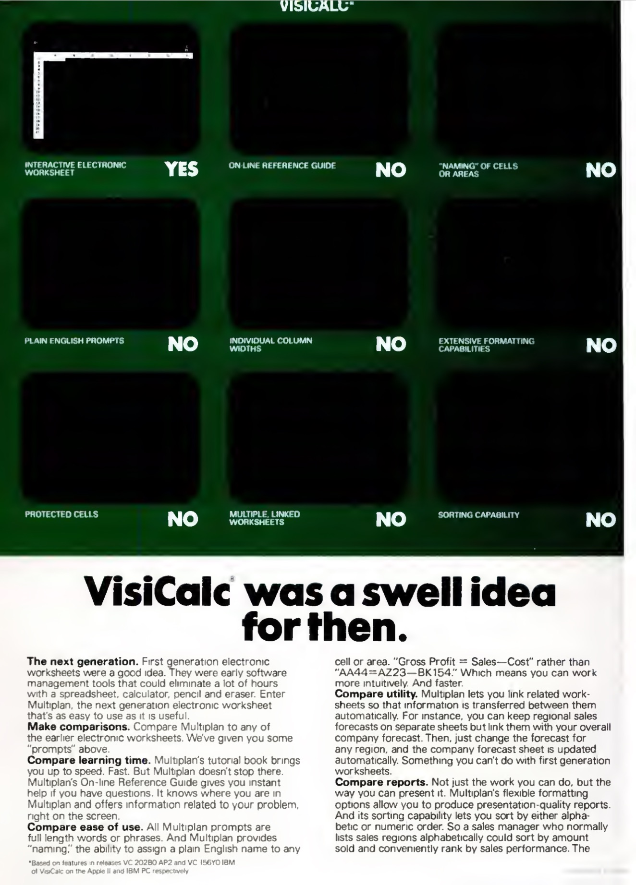
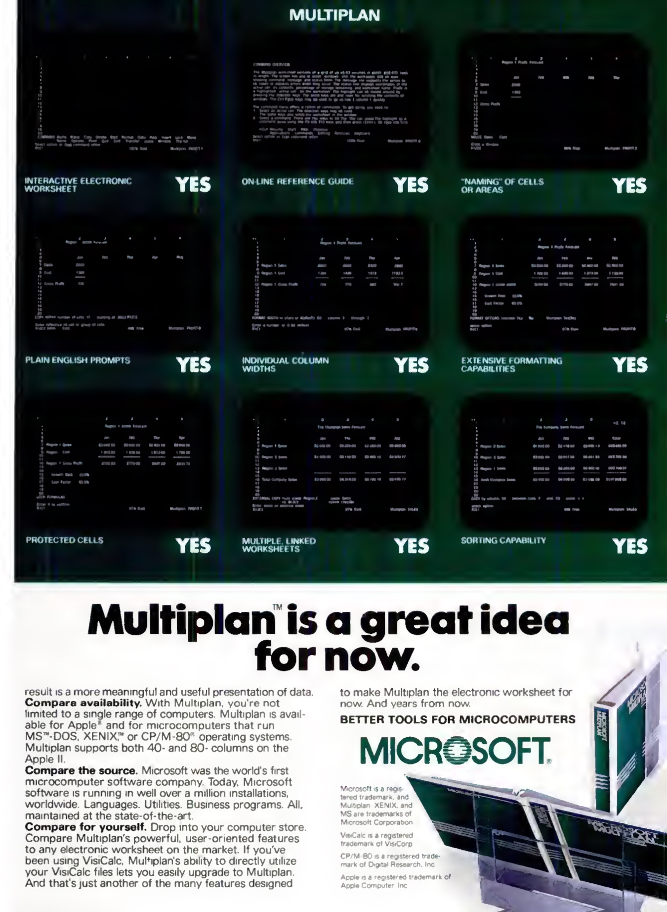

NOTE: The Microsoft Multiplan 1.06 disk below is *not* an original distribution disk.  It was obtained from
[VETUSWARE](https://vetusware.com/download/Multiplan%203.0%201.0/?id=8608) and contains a pre-installed copy of
`MP.COM` (the original `MP.COM` may have been preserved as `MPBARE.COM`).  No installation files were included
with the disk.



### Directory of MS Multiplan 1.06 (Modified)

     Volume in drive A is MULTIPLAN
     Directory of A:\

    IBMBIO   COM*     4736  10-20-83  12:00p
    IBMDOS   COM*    17024  10-20-83  12:00p
    COMMAND  COM     17792  10-20-83  12:00p
    MP       LOD     20488   2-28-83   6:26p
    MP       SYS     24130   2-28-83   6:27p
    MP       HLP     41000   2-28-83   6:30p
    MP       COM      8441  11-01-84   7:20p
    MP40     DAT      6364   2-28-83   6:28p
    MP80     DAT      6314   3-01-83  10:01a
    MPBARE   COM      7424   2-28-83   6:45p
           10 file(s)     153713 bytes
                          201728 bytes free

### Advertisement from PC Magazine (Nov 1982)

