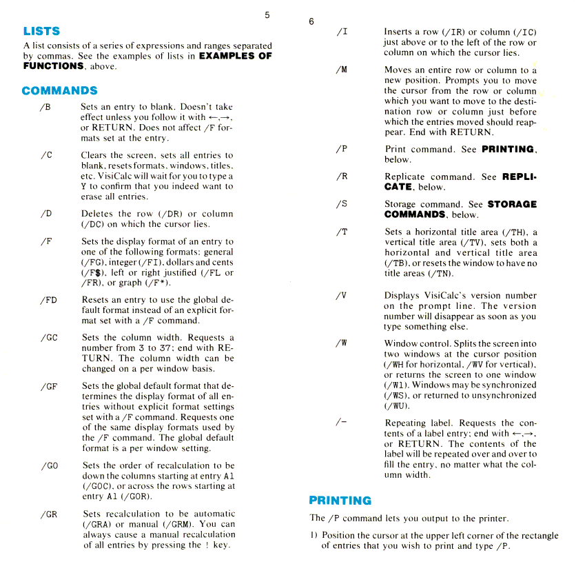
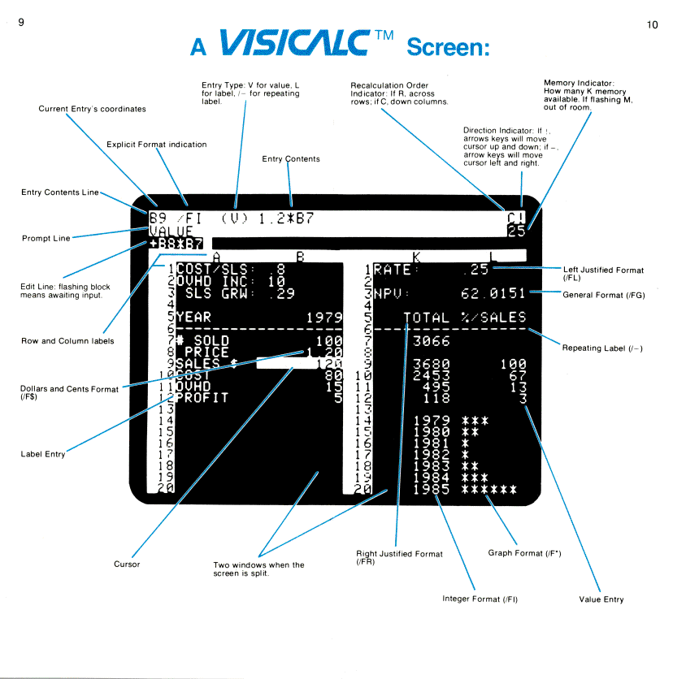



VisiCalc Reference
------------------

[From the [website](http://www.bricklin.com/history/refcard1.htm) of Dan Bricklin, co-author of VisiCalc]

VisiCalc History
----------------
See [http://www.bricklin.com/history/vcexecutable.htm](http://www.bricklin.com/history/vcexecutable.htm)

VisiCalc License
----------------
See [http://www.bricklin.com/history/vclicense.htm](http://www.bricklin.com/history/vclicense.htm)
