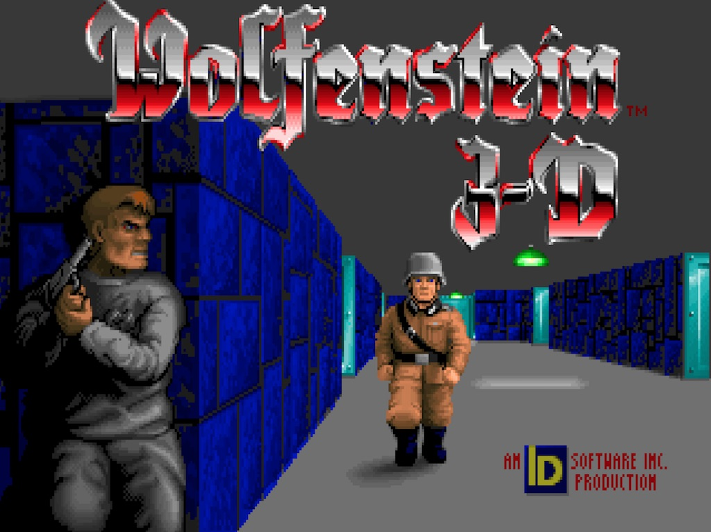
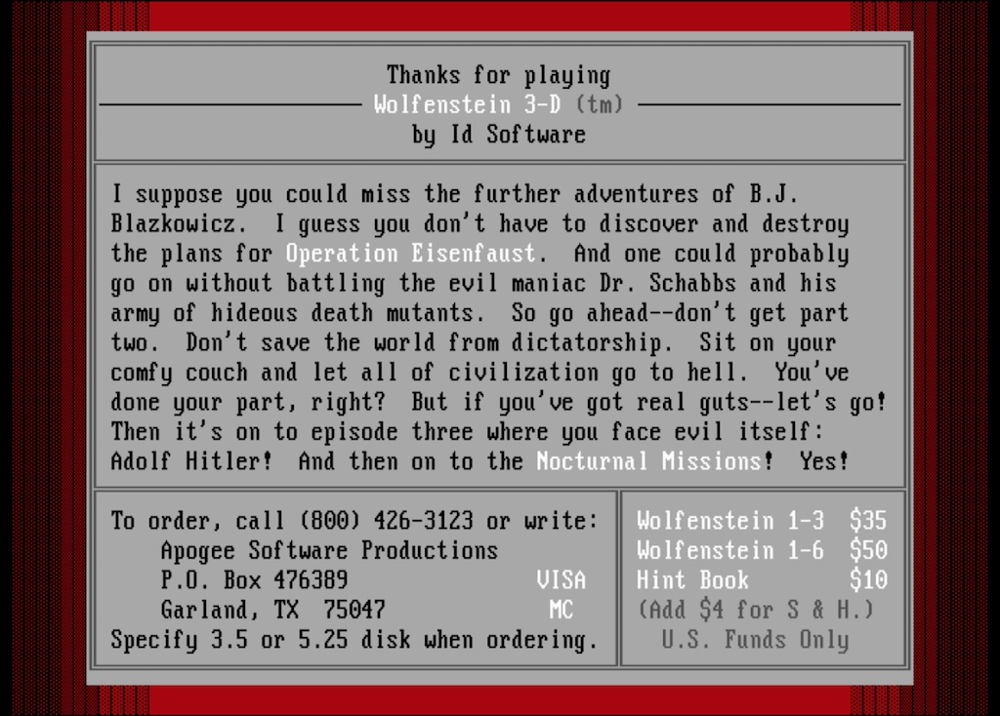

This is a shareware version (1.4) of Wolfenstein 3D.  Directory listings and screenshots are
[below](#directory-of-wolfenstein-3d-14).



### Directory of Wolfenstein 3D 1.4

	 Volume in drive A is 1WOLF14    

	Directory of A:\

	FILE_ID  DIZ       350 01-01-93  12:40p
	INSTALL  EXE    142181 01-01-93  12:40p
	W3DSW14  SHR    790409 01-01-93  12:40p
	        3 file(s)     932940 bytes

	Total files listed:
	        3 file(s)     932940 bytes
	                      280576 bytes free

### Directory of C:\WOLF3D

     Volume in drive C has no label
     Directory of  C:\WOLF3D
    
    .            <DIR>      5-07-18   7:55p
    ..           <DIR>      5-07-18   7:55p
    W3DHELP  EXE    33161   1-01-93   1:40p
    WOLF3D   EXE   109959   1-01-93   1:40p
    AUDIOHED WL1     1156   1-01-93   1:40p
    AUDIOT   WL1   132613   1-01-93   1:40p
    GAMEMAPS WL1    27425   1-01-93   1:40p
    MAPHEAD  WL1      402   1-01-93   1:40p
    VGADICT  WL1     1024   1-01-93   1:40p
    VGAGRAPH WL1   326568   1-01-93   1:40p
    VGAHEAD  WL1      471   1-01-93   1:40p
    VSWAP    WL1   742912   1-01-93   1:40p
    VENDOR   DOC     7641   7-22-98  11:45a
    ORDER    FRM     5714   4-21-98   1:24p
           14 File(s)   9076736 bytes free
    

    

