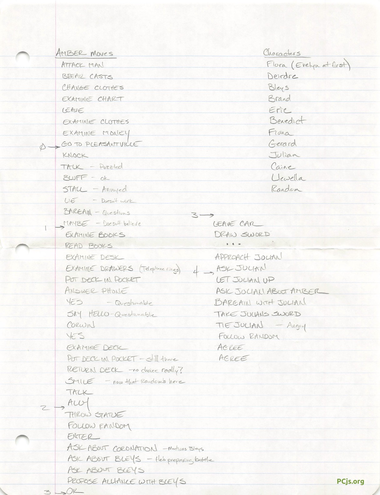
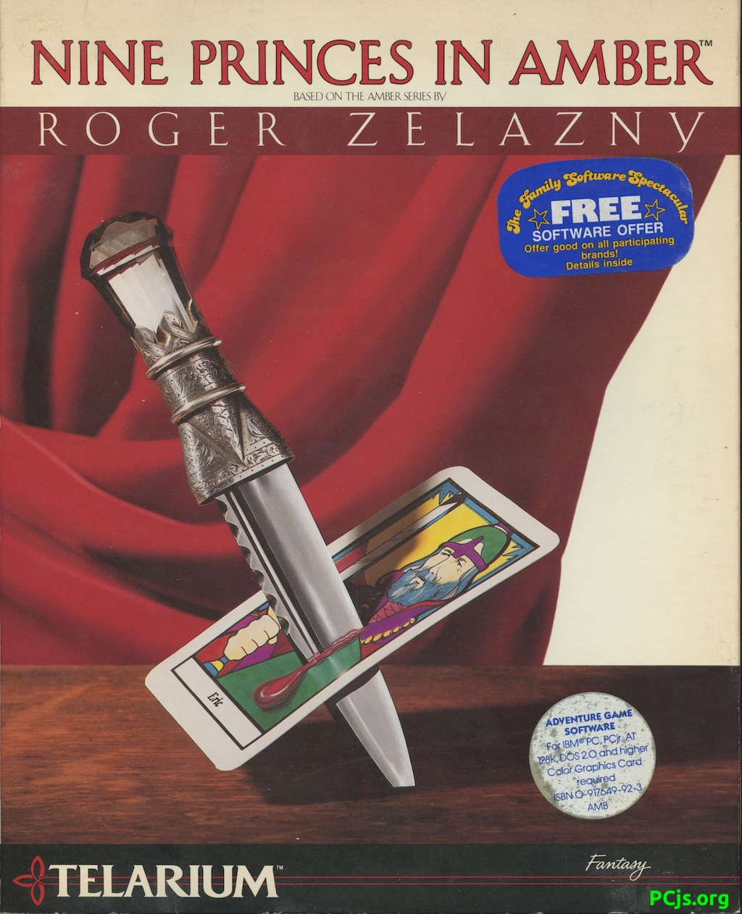

On initial startup (or reset) of the machine below, a PCjs machine script will automatically load
"Nine Princes in Amber" disks **A** and **B** into floppy drives A: and B: and then start the game.



### Preservation Notes

The **A** and **B** diskettes are from my private collection, but shortly after purchasing the game in 1985, I
modified their contents.  For starters, I had patched `AMB.EXE` on disk **A** to circumvent its copy-protection:

    push    cx
    push    ds
    xor     dx, dx
    mov     ds, dx
    mov     ah, 0
    pushf                       ; patched with NOP
    call    dword ptr ds:4Ch    ; patched with NOP, NOP, NOP, NOP
    mov     ax, 401h
    mov     cx, 0Ah
    pushf                       ; patched with CLC
    call    dword ptr ds:4Ch    ; patched with NOP, NOP, NOP, NOP
    pop     ds
    pop     cx

The copy-protection check was fairly simple: in addition to the usual sectors 1-9 on the first track of disk
**A**, it expected a sector 10 as well, and to obfuscate the sector request, it used a `PUSHF, CALL DWORD PTR DS:[004Ch]`
instruction sequence instead of `INT 13h`.  In addition to the patch, it appears I also reformatted the diskettes and
rearranged some of the files, so the original contents of the diskettes, as well as the contents of sector 10, are unknown.

I was able to restore `AMB.EXE` to its unpatched state, and I've included a fake sector 10 on the first track of disk **A**,
so the copy-protection check runs and passes.  However, it's still possible that the disk contents may not be quite right,
so if you run into problems, try running the game from a [hard disk](hdd/).

Need hints? You're in luck, because I also saved the [notes](images/Nine_Princes_in_Amber-Handwritten_Notes.jpg) I made
while playing the game back 1985/1986.

### Online References

I also scanned all the printed materials that came with the game and uploaded the PDF to the Internet Archive.

### Directory of Nine Princes in Amber (Disk A)

     Volume in drive A is AMBER-1
     Directory of A:\

    AMB          <DIR>       1-15-23  10:31p
    AMBER    BAT        24   1-15-23   3:09p
            2 file(s)         24 bytes

     Directory of A:\AMB

    .            <DIR>       1-15-23  10:31p
    ..           <DIR>       1-15-23  10:31p
    AMB               2605   9-12-85   4:27p
    AMB      DIB       708   9-04-85   4:10p
    AMB      EXE     49528   1-06-87   4:41p
    AMB      T         921   9-12-85   8:48p
    AMB      TOK       991   8-14-85   1:58p
    AMB      V        4501   9-12-85   4:37p
    AMBBLEYS IB        133   8-09-85   7:18p
    AMBCAR   IB        249   8-13-85  11:04a
    AMBCLOSE IB        183   8-09-85   7:10p
    AMBDEAD1 IB         58   8-09-85   7:18p
    AMBDEAD1 JR         87   8-14-85  11:52a
    AMBDEAD2 IB         68   8-09-85   7:02p
    AMBDEAD2 JR         80   8-14-85  11:53a
    AMBDEAD3 IB         67   8-09-85   7:03p
    AMBDEAD4 IB         63   8-09-85   7:03p
    AMBDEAD4 JR        108   8-14-85  11:55a
    AMBDEIRD IB        166   8-09-85   7:06p
    AMBDEMO1 IB         95   7-09-85   4:42p
    AMBDEMO1 JR        185   7-09-85   4:48p
    AMBDEMO2 IB        914   7-12-85   4:54p
    AMBDEMO2 JR       1880   7-12-85   5:27p
    AMBDEMO3 IB        533   7-09-85   4:42p
    AMBDEMO3 JR       1183   7-10-85  10:51a
    AMBDEMO4 IB        166   7-10-85   9:53a
    AMBDEMO4 JR        166   7-10-85   9:58a
    AMBDEMO5 IB        349   7-09-85   4:43p
    AMBDEMO5 JR        639   7-09-85   4:54p
    AMBERIC  IB        439   8-09-85   7:07p
    AMBFENCE IB         50   8-13-85  11:06a
    AMBFLORA IB        145   8-09-85   7:07p
    AMBGLOB           4411   9-15-85   3:56p
    AMBHORN  IB         43   8-13-85  11:07a
    AMBINIT            339   9-13-85   4:40p
    AMBJULIA IB        236   8-09-85   7:08p
    AMBLLEWE IB        206   8-09-85   7:09p
    AMBOPEN           5215   9-18-85  10:43a
    AMBPAT1  IB        179   8-13-85  11:08a
    AMBPAT2  IB        136   8-13-85  11:08a
    AMBPAT3  IB        284   8-13-85  11:09a
    AMBPAT4  IB        197   8-13-85  11:09a
    AMBPAT5  IB        307   8-20-85   5:59p
    AMBPHONE IB        380   8-15-85  11:15a
    AMBRANDO IB        277   8-09-85   7:09p
    AMBRANDO JR        413   8-14-85  12:09p
    AMBRAZZ  IB         48   8-13-85  11:11a
    AMBRESCU IB        162   8-13-85  11:05a
    AMBSTAR  IB         90   8-13-85  11:10a
    AMBTAROT IB        151   8-13-85  11:05a
    AMBWHIST IB         65   9-18-85   6:28p
    ARDEN1            2352   9-12-85   5:25p
    ARDEN2            6577   9-14-85  11:01p
    BCON              3980   9-17-85   1:42a
    BED                402   9-04-85   9:35a
    BLTRUMP           1232   8-18-85  12:41p
    BORDER             668   9-13-85   4:41p
    CAR               2792   8-18-85  12:43p
    CARDPIX            708   9-06-85   5:32a
    CARDS             1922   9-07-85   6:16p
    CARRIDE           6834   9-14-85  11:45p
    CENTER            1310   9-12-85   5:59p
    CLIFF             2527   9-17-85   5:29p
    DEFAULTS          3564   9-12-85   5:05p
    DETRUMP            867   8-18-85  12:45p
    ERICFIGH          4631   9-17-85   4:38p
    ERICMEET          4114   9-17-85   3:23p
    ERICMERC          5226   9-13-85   7:27p
    ERLIB             2499   9-11-85   3:33p
    ERMEET            1131   8-18-85  12:47p
    ERTRUMP           1002   8-18-85  12:47p
    FEET               504   9-11-85   3:33p
    FLLIB             2931   9-17-85   5:08p
    FLMEET            1278   9-05-85  11:46a
    FLORAS            5973   9-17-85   9:02p
    FLTRUMP           1143   8-18-85  12:50p
    GERMEET           1391   9-12-85   5:39p
    GETRUMP           1314   8-18-85  12:52p
    GLADE             3940   9-14-85   5:49p
    HOSPITAL          4467   9-14-85  10:52p
    HOSPTL            1460   8-18-85  12:53p
    INITFLOR          6440   9-17-85   8:59p
    JULFIGHT          4418   9-17-85   1:53a
    JULIB             2771   9-16-85   4:49p
    JUTRUMP           1238   8-18-85  12:54p
    LIBRARY           2083   9-13-85   4:33p
    LIB_ALLY          2283   9-14-85  10:37p
    LIB_ENEM          2295   9-15-85   6:48p
    LLTRUMP           1356   8-18-85  12:57p
    MAID              1140   8-18-85   1:01p
    MORG              1488   8-18-85   1:02p
    M_COURT           5415   9-12-85   5:53p
    NEWDATA           1366   9-18-85  10:50p
    NTRUMPS             69   9-11-85   3:35p
    OPENING           3804   8-18-85   1:03p
    PATTERN           2952   9-17-85   3:27p
    PATT_GAM          5883   9-17-85   8:53p
    RANDANGR          4747   9-17-85   3:25p
    RANDCON2          3261   9-12-85   5:20p
    RANDENTE          5870   9-17-85   9:05p
    RATRUMP           1215   8-18-85   1:04p
    RCON              1591   9-12-85   6:11p
    REBCORT           1590   8-18-85   1:04p
    REBHALL            998   8-18-85   1:05p
    REBMA             3570   9-16-85   4:53p
    REBMA2            2819   9-15-85   4:43p
    RESCUE            4985   9-17-85   5:28p
    ROAD              1985   8-18-85   1:06p
    STAIRS            2606   8-18-85   1:07p
    STAKE             2019   8-18-85   1:08p
    STREET            4406   9-12-85   5:16p
    TELARIUM IB        196   9-04-85   3:15p
    TRUMPS              83   9-11-85   3:36p
    VOLT                 3   9-15-85  12:04a
          114 file(s)     246083 bytes

    Total files listed:
          116 file(s)     246107 bytes
                           40960 bytes free

### Directory of Nine Princes in Amber (Disk B)

     Volume in drive A is AMBER-2
     Directory of A:\

    AMB          <DIR>       1-15-23  10:31p
            1 file(s)          0 bytes

     Directory of A:\AMB

    .            <DIR>       1-15-23  10:31p
    ..           <DIR>       1-15-23  10:31p
    A                 7824   1-20-86   2:24p
    AMBATTLE IB        289   8-13-85  11:06a
    AMBATTLE JR        567   8-14-85   5:27p
    AMBBENED IB        346   8-09-85   7:04p
    AMBBENED JR        465   8-14-85  11:57a
    AMBBLEYS JR        277   8-14-85   1:57p
    AMBBRAND IB        190   8-09-85   7:05p
    AMBBRAND JR        353   8-14-85  11:59a
    AMBCAINE IB         60   8-09-85   7:05p
    AMBCAINE JR         92   8-14-85  12:00p
    AMBCAR   JR        658   8-14-85   5:24p
    AMBCATS  IB        219   8-13-85  11:03a
    AMBCATS  JR        498   8-14-85   5:23p
    AMBCHARG IB        204   8-13-85  11:02a
    AMBCHARG JR        438   8-14-85   5:22p
    AMBCLOSE JR        313   8-14-85  12:11p
    AMBDCIRC IB        112   8-13-85  11:13a
    AMBDCIRC JR        136   8-14-85   5:41p
    AMBDEAD3 JR         93   8-14-85   1:33p
    AMBDEIRD JR        166   8-14-85  12:01p
    AMBDWORK IB        224   8-13-85  11:01a
    AMBDWORK JR        224   8-14-85   5:20p
    AMBER             4077   8-18-85  12:39p
    AMBERIC  JR        688   8-14-85  12:03p
    AMBFAIR  IB        178   8-09-85   7:11p
    AMBFAIR  JR        253   8-14-85  12:15p
    AMBFENCE JR         74   8-14-85   5:28p
    AMBFIONA IB        114   8-09-85   7:07p
    AMBFIONA JR        148   8-14-85  12:04p
    AMBFLORA JR        190   8-14-85  12:05p
    AMBGANEL IB         54   8-13-85  11:01a
    AMBGANEL JR        100   8-14-85   5:19p
    AMBGERAR IB        244   8-09-85   7:08p
    AMBGERAR JR        436   8-14-85  12:06p
    AMBGOOD  IB        194   8-09-85   7:11p
    AMBGOOD  JR        417   8-14-85  12:14p
    AMBHORN  JR         43   8-14-85   5:31p
    AMBJULIA JR        516   8-14-85  12:07p
    AMBLANCE IB        136   8-13-85  11:02a
    AMBLANCE JR        288   8-14-85   5:21p
    AMBLLEWE JR        284   8-14-85  12:08p
    AMBLOSE  IB         44   8-09-85   7:18p
    AMBLOSE  JR         58   8-14-85   1:59p
    AMBMETAM IB        154   8-13-85  11:06a
    AMBMETAM JR        337   8-14-85   5:29p
    AMBPAT1  JR        302   8-14-85   5:33p
    AMBPAT2  JR        175   8-14-85   5:34p
    AMBPAT3  JR        376   8-14-85   5:35p
    AMBPAT4  JR        328   8-14-85   5:36p
    AMBPAT5  JR        412   8-14-85   5:37p
    AMBPHONE JR        380   8-14-85   5:47p
    AMBRAZZ  JR         92   8-14-85   5:39p
    AMBRESCU JR        428   8-14-85   5:26p
    AMBSHIP  IB        103   9-11-85   4:47p
    AMBSHIP  JR        146   9-11-85   4:55p
    AMBSSSSS IB        255   8-13-85  11:07a
    AMBSSSSS JR        462   8-14-85   5:31p
    AMBSTAR  JR        196   8-14-85   5:38p
    AMBTAROT JR        286   8-14-85   5:25p
    AMBWHIST JR         65   9-18-85   6:28p
    AMBWIN1  IB        206   8-09-85   7:10p
    AMBWIN1  JR        437   8-14-85  12:45p
    AMBWIN2  IB        630   8-09-85   7:10p
    AMBWIN2  JR       1560   8-14-85  12:12p
    BATTLE            6077   9-16-85  11:51p
    BATTLE2           4082   9-18-85   3:11p
    BEMEET            1694   9-04-85   9:36a
    BENEMEET          6512   9-17-85   4:11p
    BENESTAY          3546   9-14-85  11:40p
    BETRUMP           1139   8-18-85  12:40p
    BLEYSWON          4312   9-12-85   6:23p
    BLMEET            1338   8-18-85  12:41p
    BRAND    FEN      1344   8-22-85   1:15p
    BRANDFIG          4651   9-13-85   1:18p
    BRANDTAL          4690   9-14-85   9:02p
    BRMEET            1916   8-18-85  12:42p
    BRTRUMP           1376   8-18-85  12:43p
    CABRA             6222   9-16-85   6:33p
    CAMP              2628   9-17-85   1:37a
    CATMEET           3632   9-12-85   6:41p
    CATRUMP           1142   8-18-85  12:44p
    CATS               764   8-18-85  12:44p
    CELL              9944   9-16-85   7:36p
    DESERT            7246   9-17-85  12:56a
    DMEET             5046   9-16-85  11:24p
    DWLIB             2235   8-18-85  12:45p
    DWTRUMP           1835   8-18-85  12:46p
    ERIC     FEN      1344   7-11-85   3:02p
    ERICKILL          1019   9-12-85   6:21p
    FAMEET_B          8400   9-17-85   4:00p
    FAMEET_C          7515   9-17-85   3:49p
    FAMENTER          6108   9-17-85   4:03p
    FIONACON          2682   9-17-85   3:54p
    FITRUMP           1083   8-18-85  12:48p
    FULLBLK            324   8-18-85  12:50p
    GANELON           1052   8-18-85  12:51p
    GEMEET            1467   8-18-85  12:51p
    GERSHIP           6211   9-18-85  12:08p
    HALFBLK            150   8-18-85  12:52p
    JOPIN             1652   8-18-85  12:53p
    JULCON            2371   9-14-85  11:30p
    JULIAN   FEN      1344   9-13-85  11:28a
    KEEP              4833   9-17-85   4:26p
    KEEP2             7919   9-17-85   6:29p
    KEEPIC            2898   8-18-85  12:55p
    LAHORSE           1724   8-18-85  12:55p
    LANCE    FEN      1344   8-05-85  10:09a
    LANCE2            4492   9-17-85   4:23p
    LANCEFIG          4223   9-12-85   6:39p
    LANCEMEE          6145   9-12-85   6:34p
    LAWOUND           2084   9-04-85   9:39a
    LHOUSE            1950   8-18-85  12:57p
    MINDFIGH          4758   9-17-85   3:56p
    MTOWR             1644   8-19-85  11:12a
    RANDCON           3811   9-17-85   5:21p
    SANDS             3422   8-18-85   1:06p
    SAVED              324   1-20-86   2:24p
    STUDY             6040   9-16-85   6:30p
    TELARIUM JR        188   9-04-85   3:25p
    TENT              2490   9-14-85   9:00p
    THRONE            1290   8-18-85   1:13p
    TOWER             6286   9-17-85   1:24a
    TOWR               804   8-19-85  11:13a
    VENGERIC          3006   9-14-85  10:39p
    VOLT                 3   1-15-23   4:01p
          127 file(s)     227385 bytes

    Total files listed:
          128 file(s)     227385 bytes
                           50176 bytes free

### Copy-Protection Information (Disk A)

    MFM Sector
    Sector ID:010
    Track ID:000 - Side ID:000
    Size:00128 (ID:0x00)
    DataMark:0xFB
    Head CRC:0xAC0C (Ok)
    Data CRC:0x2BF6 (Ok)

    0000| F6 F6 F6 F6 F6 F6 F6 F6 | ........
    0008| F6 F6 F6 F6 F6 F6 F6 F6 | ........
    0010| F6 F6 F6 F6 F6 F6 F6 F6 | ........
    0018| F6 F6 F6 F6 F6 F6 F6 F6 | ........
    0020| F6 F6 F6 F6 F6 F6 F6 F6 | ........
    0028| F6 F6 F6 F6 F6 F6 F6 F6 | ........
    0030| F6 F6 F6 F6 F6 F6 F6 F6 | ........
    0038| F6 F6 F6 F6 F6 F6 F6 F6 | ........
    0040| F6 F6 F6 F6 F6 F6 F6 F6 | ........
    0048| F6 F6 F6 F6 F6 F6 F6 F6 | ........
    0050| F6 F6 F6 F6 F6 F6 F6 F6 | ........
    0058| F6 F6 F6 F6 F6 F6 F6 F6 | ........
    0060| F6 F6 F6 F6 F6 F6 F6 F6 | ........
    0068| F6 F6 F6 F6 F6 F6 F6 F6 | ........
    0070| F6 F6 F6 F6 F6 F6 F6 F6 | ........
    0078| F6 F6 F6 F6 F6 F6 F6 F6 | ........
