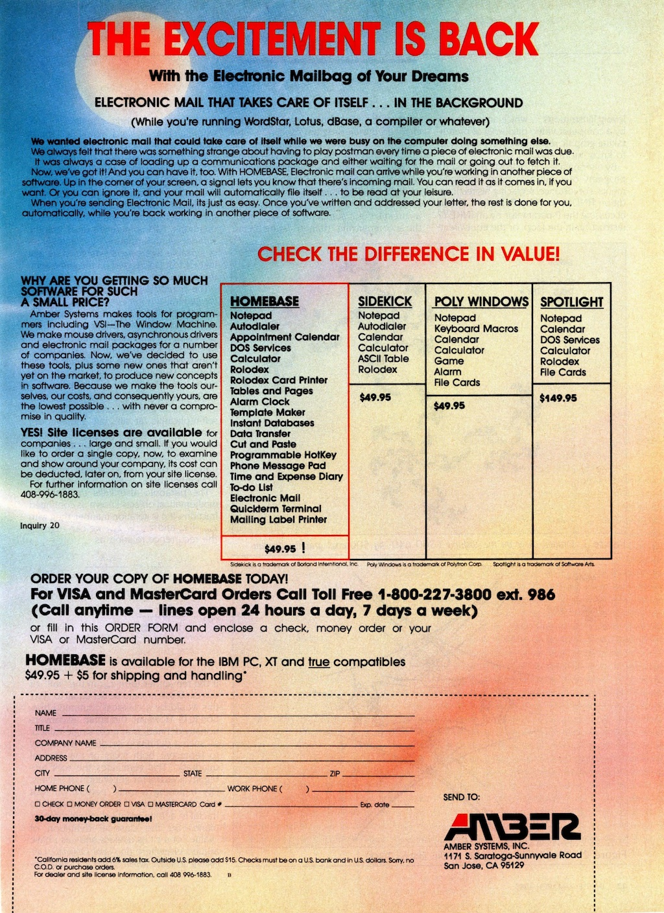

On initial startup (or reset) of the IBM PC AT below, a PCjs machine script automatically loads
the "HomeBase 1.04A" diskette into drive A: and runs the `INSTALL` program.

After installation and reboot, the HomeBase program displays the following messages:

    HomeBase Copyright(c) 1985 by Amber Systems, Inc. - All rights reserved
    Code version 1.04a, dated 7/26/85
    HBKERNEL version 2.46, HBASYNC version 2.43, HBVSI version 4.02
    Loading help index...
    HomeBase uses 128368 bytes of memory of which 20392 are for buffers.

    Press Alt/Shift/H for HomeBase



### BYTE Magazine Advertisement from March 1985

### Directory of HomeBase 1.04A

     Volume in drive A has no label
     Directory of A:\

    INSTALL  BAT      8064   7-29-85  11:22a
    CONFLOP  SYS       128   7-26-85  12:00p
    CONHARD  SYS       128   7-26-85  12:00p
    INSDONE  BAT       896   7-26-85  12:00p
    AUTOHARD BAT       128   7-26-85  12:00p
    INSFLOP  BAT      3968   7-26-85  12:00p
    ASK      COM       512   7-26-85  12:00p
    GPATH    COM       512   7-26-85  12:00p
    HBKERNEL BIN     15862   7-26-85  12:00p
    HBASYNC  BIN      4848   7-26-85  12:00p
    HBVSI    EXE     14091   7-26-85  12:00p
    HB       EXE     81904   7-26-85  12:00p
    HB       OVR    102800   7-26-85  12:00p
    HB       HLP     56296   7-26-85  12:00p
    HBGRAB   COM       896   7-26-85  12:00p
    AUTOFLOP BAT       128   7-26-85  12:00p
    KERNEL   TXT     30452   7-26-85  12:00p
    PROKEYHB TXT       512   7-26-85  12:00p
    README           12928   7-29-85  11:28a
           19 file(s)     335053 bytes
                           19456 bytes free
