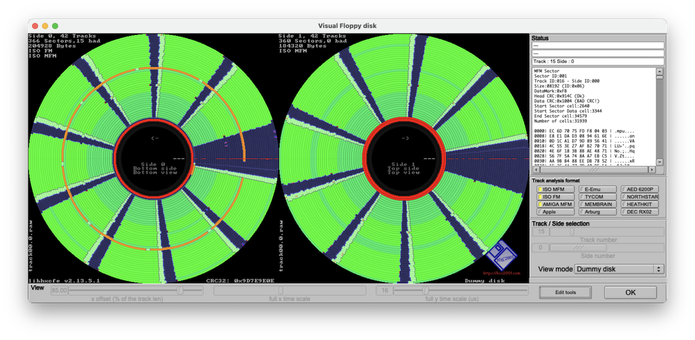

NOTE: Software Carousel was distributed on a copy-protected diskette.  We have created a Kryoflux copy
of the diskette in our possession (shown below), and it's clear that track 16 has some unusual characteristics,
but until we have time to analyze the diskette and software more closely, it will not operate in the PCx86
emulator as intended.



### Directory of Software Carousel 2.0.3

     Volume in drive A has no label
     Directory of A:\

    CAROUSEL EXE*    18432   3-17-86   5:07p
    CAROUSEL PGL*     4096   3-17-86   5:07p
    SERIALNO COM*      702   3-17-86   5:07p
    ID       SC *        0   3-17-86   5:07p
    CAROUSEL PGM     32108   6-18-86  12:41p
    INSTALL  BAT      4129   4-14-86  12:01p
    UNINSTAL BAT      3454   4-14-86  10:52a
    VDF0203  VDF*     2192   1-28-87  10:27p
    ETC          <DIR>       3-17-86   5:09p
    TRANSFER COM     50288   1-15-86  12:00p
    CML0203  FCL*    13104   1-15-86  12:00p
    MNL0203  FML*     2016   1-15-86  12:00p
    CML0203  HCL*     9632   1-15-86  12:00p
    MNL0203  HML*     1840   1-15-86  12:00p
    SGS0203  SUP*        0   3-17-86   5:08p
    CAROUSEL COM      2016   1-15-86  12:00p
           16 file(s)     144009 bytes

     Directory of A:\ETC

    .            <DIR>       3-17-86   5:09p
    ..           <DIR>       3-17-86   5:09p
    ETC      DOC      1408   3-14-86   4:00p
    INT15    COM        32   3-10-86   9:48a
    SWITCHC  ASM      4369   3-12-86  10:34a
    SWITCHC  COM        45   3-12-86  10:34a
    DOUBLED2 PGM     46080   4-29-86  12:09p
    BOOT     COM        35   3-11-86   3:55p
            8 file(s)      51969 bytes

    Total files listed:
           24 file(s)     195978 bytes
                          155648 bytes free

### Copy-Protection Information

    MFM Sector
    Sector ID:001
    Track ID:016 - Side ID:000
    Size:08192 (ID:0x06)
    DataMark:0xFB
    Head CRC:0x914C (Ok)
    Data CRC:0x1004 (BAD)
    Start Sector cell:2704
    Start Sector Data cell:3408
    End Sector cell:34643
    Number of cells:31939

    0000| EC 6D 70 75 FD F8 04 03 | .mpu....
    0008| E8 E1 DA D3 08 94 61 6E | ......an
    0010| 0D 1C A1 D7 9D 89 56 41 | ......VA
    0018| 4C 55 3E 27 AF B2 70 71 | LU>'..pq
    0020| 4E 6F 18 3B 8B AE 48 71 | No.;..Hq
    0028| 56 7F 5A 74 8A A7 EB C5 | V.Zt....
    0030| AA 9B B4 88 EE DB 78 52 | ......xR
    0038| 1F 26 4A 77 7D 40 DF E4 | .&Jw}@..
    0040| 59 18 49 0C B4 F1 B6 F1 | Y.I.....
    0048| B6 FF A4 F1 29 64 29 66 | ....)d)f
    0050| 33 62 1F 4E 86 D3 84 D3 | 3b.N....
    0058| 88 D1 7A 23 EB B6 E7 B8 | ..z#....
    0060| D5 B4 C5 A8 38 5D 3A 5D | ....8]:]
    0068| 32 5B 20 4D 8D E0 8D E2 | 2[ M....
    0070| 8F FE 7B 0A EA 9F E8 9F | ..{.....
    0078| E4 9D D6 AF 3F 42 3B 44 | ....?B;D
    0080| 0E 0F FC 01 71 74 71 76 | ....qtqv
    0088| 7B 72 67 6E CE C3 CC C3 | {rgn....
    0090| D0 C1 C2 D3 33 26 2F 38 | ....3&/8
    0098| 1D 04 0D 18 70 6D 72 6D | ....pmrm
    00A0| 4A 6B 38 1D A5 80 A5 82 | Jk8.....
    00A8| A7 8E 93 BA 02 2F 00 2F | ....././
    00B0| 1C 2D 0E 3F 77 42 73 44 | .-.?wBsD
    00B8| 79 40 69 54 D4 E9 D6 E9 | y@iT....
    00C0| A6 E7 94 D9 09 4C 09 4E | .....L.N
    00C8| 03 4A EF A6 56 1B 54 1B | .J..V.T.
    00D0| 48 19 3A 6B AB FE A7 F0 | H.:k....
    00D8| A5 FC 95 D0 F8 A5 FA A5 | ........
    00E0| C2 A3 B0 D5 1D 78 1D 7A | .....x.z
    00E8| 0F 66 FB 92 6A 07 68 07 | .f..j.h.
    00F0| 74 05 66 17 CF BA CB BC | t.f.....
    00F8| C1 B8 B1 CC 1C 61 1E 61 | .....a.a
    0100| 0E 0F FC 01 71 74 71 76 | ....qtqv
    0108| 7B 72 67 6E CE C3 CC C3 | {rgn....
    0110| D0 C1 C2 D3 33 26 2F 38 | ....3&/8
    0118| 1D 04 0D 18 70 6D 72 6D | ....pmrm
    0120| 4A 6B 38 1D A5 80 A5 82 | Jk8.....
    0128| A7 8E 93 BA 02 2F 00 2F | ....././
    0130| 1C 2D 0E 3F 77 42 73 44 | .-.?wBsD
    0138| 79 40 69 54 D4 E9 D6 E9 | y@iT....
    0140| A6 E7 94 D9 09 4C 09 4E | .....L.N
    0148| 03 4A EF A6 56 1B 54 1B | .J..V.T.
    0150| 48 19 3A 6B AB FE A7 F0 | H.:k....
    0158| A5 FC 95 D0 F8 A5 FA A5 | ........
    0160| C2 A3 B0 D5 1D 78 1D 7A | .....x.z
    0168| 0F 66 FB 92 6A 07 68 07 | .f..j.h.
    0170| 74 05 66 17 CF BA CB BC | t.f.....
    0178| C1 B8 B1 CC 1C 61 1E 61 | .....a.a
    0180| 0E 0F FC 01 71 74 71 76 | ....qtqv
    0188| 7B 72 67 6E CE C3 CC C3 | {rgn....
    0190| D0 C1 C2 D3 33 26 2F 38 | ....3&/8
    0198| 1D 04 0D 18 70 6D 72 6D | ....pmrm
    01A0| 4A 6B 38 1D A5 80 A5 82 | Jk8.....
    01A8| A7 8E 93 BA 02 2F 00 2F | ....././
    01B0| 1C 2D 0E 3F 77 42 73 44 | .-.?wBsD
    01B8| 79 40 69 54 D4 E9 D6 E9 | y@iT....
    01C0| A6 E7 94 D9 09 4C 09 4E | .....L.N
    01C8| 03 4A EF A6 56 1B 54 1B | .J..V.T.
    01D0| 48 19 3A 6B AB FE A7 F0 | H.:k....
    01D8| A5 FC 95 D0 F8 A5 FA A5 | ........
    01E0| C2 A3 B0 D5 1D 78 1D 7A | .....x.z
    01E8| 0F 66 FB 92 6A 07 68 07 | .f..j.h.
    01F0| 74 05 66 17 CF BA CB BC | t.f.....
    01F8| C1 B8 B1 CC 1C 61 1E 61 | .....a.a
    0200| 64 56 43 8D 5B 61 68 5E | dVC.[ah^
    0208| E7 B8 45 32 5F 8F 13 AB | ..E2_...
    0210| BC 23 F5 E6 31 32 22 89 | .#..12".
    0218| 95 40 57 96 06 57 0B F5 | .@W..W..
    0220| 7B 01 65 BF 2C 40 95 2D | {.e.,@.-
    0228| 18 11 1A BF 1B FD BF D8 | ........
    0230| 4F D4 4B 48 EE 36 37 2F | O.KH.67/
    0238| 95 4A 3F 05 4F 35 56 52 | .J?.O5VR
    0240| D2 85 41 43 4E 4E 4E 4E | ..ACNNNN
    0248| 4E 4E 4E 4E 4E 4E 4E 4E | NNNNNNNN
    0250| 4E 4E 4E 4E 4E 4E 4E F5 | NNNNNNN.
    0258| F5 F5 F7 F7 4E 4E 4E 4E | ....NNNN
    0260| 4E 4E 4E 4E 4E 4E 4E 4E | NNNNNNNN
    0268| 4E 4E 4E 4E 4E 4E 4E 4E | NNNNNNNN
    0270| 4E 4E 4E 4E 4E 4E 4E 4E | NNNNNNNN
    0278| 4E 4E 4E 4E 4E 4E 4E 4E | NNNNNNNN
    0280| 4E 4E 4E 4E 4E 4E 4E 4E | NNNNNNNN
    0288| 4E 4E 4E 4E 4E 4E 4E 4E | NNNNNNNN
    0290| 4E 4E 4E 4E 00 00 00 00 | NNNN....
    0298| 00 00 00 00 00 00 00 00 | ........
    02A0| A1 A1 A1 FE 10 00 02 03 | ........
    02A8| 94 BA 4E 4E 4E 4E 4E 4E | ..NNNNNN
    02B0| 4E 4E 4E 4E 4E 4E 4E F7 | NNNNNNN.
    02B8| 4E 4E 4E 4E 4E 4E 4E 4E | NNNNNNNN
    02C0| 00 00 00 00 00 00 00 00 | ........
    02C8| 00 00 00 00 A1 A1 A1 FB | ........
    02D0| F6 F8 3B E8 AC 4D 69 10 | ..;..Mi.
    02D8| AE 4D 75 80 CB 51 C1 82 | .Mu..Q..
    02E0| B0 BD 59 DA F2 A6 3A A2 | ..Y...:.
    02E8| 26 41 79 8E CE D2 1F 09 | &Ay.....
    02F0| 3A 28 E6 64 0E 5D B2 7E | :(.d.].~
    02F8| 99 F5 17 8E 3A 1B 66 80 | ....:.f.
    0300| F1 C2 A6 1B 6A EA 52 1D | ....j.R.
    0308| 37 B6 54 74 07 78 EC 45 | 7.Tt.x.E
    0310| 65 E4 52 32 E3 65 04 0D | e.R2.e..
    0318| 75 8F 47 9E 96 E3 0B 0A | u.G.....
    0320| E3 D3 96 BF 6B 5D 40 DF | ....k]@.
    0328| 9A 0E DA 6F 52 AE 54 55 | ...oR.TU
    0330| 0E D7 2A 87 9A C3 DE 07 | ..*.....
    0338| 09 B6 62 DD 77 0F D0 AB | ..b.w...
    0340| 0E BF 58 61 98 8D 48 91 | ..Xa..H.
    0348| A2 99 34 03 FC D7 90 11 | ..4.....
    0350| 4A A2 62 77 10 B1 98 B8 | J.bw....
    0358| 11 E2 D5 88 C4 7A 5B B2 | .....z[.
    0360| 1A C2 27 F1 A0 67 3C FD | ..'..g<.
    0368| B6 5D 6D AF EA 29 46 BF | .]m..)F.
    0370| EC 03 D3 35 4C 93 F8 29 | ...5L..)
    0378| 52 A1 39 D3 B6 45 32 DB | R.9..E2.
    0380| B8 37 AF 59 28 BF C4 55 | .7.Y(..U
    0388| 3E A5 45 80 FC 2A 95 C4 | >.E..*..
    0390| 5E 17 34 E9 75 B7 BE 52 | ^.4.u..R
    0398| 25 2E 51 B7 9B EF 39 34 | %.Q...94
    03A0| 8B DD 2F 95 BB F3 51 54 | ../...QT
    03A8| 71 C3 06 E9 F5 32 73 57 | q....2sW
    03B0| DA 43 B9 C8 52 BD 30 27 | .C..R.0'
    03B8| 72 A3 0F 43 D1 46 E9 B3 | r..C.F..
    03C0| E6 1F 4F 4D DF 37 1D 04 | ..OM.7..
    03C8| 92 4A F2 AD F1 8B CA 88 | .J......
    03D0| 9C 11 53 A5 AC 55 1A EA | ..S..U..
    03D8| AC 51 89 F4 E7 F0 A7 C6 | .Q......
    03E0| 3C 43 93 C6 BF 68 53 DA | <C...hS.
    03E8| 2F 9F 27 A2 EC DD F4 F2 | /.'.....
    03F0| E2 0E BB 1C 9A 11 56 6D | ......Vm
    03F8| 98 10 51 63 34 3B 6B 48 | ..Qc4;kH
    0400| FB A5 CE C4 91 FA A4 DF | ........
    0408| 75 25 F6 6F 4A 4E 32 61 | u%.oJN2a
    0410| 50 94 06 35 73 A9 CF F2 | P..5s...
    0418| AB 7C 5E 9A D6 B9 CC 6B | .|^....k
    0420| A9 9C E5 0F 23 52 63 BC | ....#Rc.
    0428| A9 7A EC 32 59 85 CD B9 | .z.2Y...
    0430| DE 3B BA CF 21 43 68 41 | .;..!ChA
    0438| 1F 26 76 D7 A1 09 C3 44 | .&v....D
    0440| 00 C1 A6 1A BD D2 88 91 | ........
    0448| BA B3 17 C6 F3 D2 BF C9 | ........
    0450| B9 FC 53 77 F5 B4 29 1A | ..Sw..).
    0458| 42 53 A7 AE 44 53 F0 75 | BS..DS.u
    0460| A0 D2 F2 10 FF AE 99 B0 | ........
    0468| 02 5F E4 14 CD 59 BC 72 | ._...Y.r
    0470| C7 61 A5 87 65 90 72 6F | .a..e.ro
    0478| 92 5C DA B9 0D F5 EC 66 | .\.....f
    0480| 06 BF A4 D1 D6 14 F0 A5 | ........
    0488| EE 0E D0 AD 93 D2 A3 64 | .......d
    0490| F3 72 51 09 0D 61 72 6B | .rQ..ark
    0498| 4C DC 32 3F B0 D4 A8 B1 | L.2?....
    04A0| BC AC 24 1F D5 6D B3 52 | ..$..m.R
    04A8| B2 F2 FC E5 7F 67 39 4A | .....g9J
    04B0| 07 26 45 F0 E1 B8 8B 43 | .&E....C
    04B8| 88 EF 3F 12 CF B3 15 DE | ..?.....
    04C0| 53 1A F5 53 C0 FE 5D 38 | S..S..]8
    04C8| 90 87 32 CA F1 4C C1 CB | ..2..L..
    04D0| 7C 88 40 05 0F FA 06 D7 | |.@.....
    04D8| AC EB 47 CD D4 AF FC 76 | ..G....v
    04E0| B3 7A E5 3F 61 B4 A2 56 | .z.?a..V
    04E8| BE EB CE B7 E8 42 76 17 | .....Bv.
    04F0| 68 84 C4 43 20 5C C5 02 | h..C \..
    04F8| 97 C5 8D F4 23 89 01 16 | ....#...
    0500| 02 4D A9 AA 5B 2E 52 6A | .M..[.Rj
    0508| D5 8A 1F 40 7E FD 0E 0F | ...@~...
    0510| FC 7D 41 43 4E 4E 4E 4E | .}ACNNNN
    0518| 4E 4E 4E 4E 4E 4E 4E 4E | NNNNNNNN
    0520| 4E 4E 4E 4E 4E 4E 4E F5 | NNNNNNN.
    0528| F5 F5 F7 F7 4E 4E 4E 4E | ....NNNN
    0530| 4E 4E 4E 4E 4E 4E 4E 4E | NNNNNNNN
    0538| 4E 4E 4E 4E 4E 4E 4E 4E | NNNNNNNN
    0540| 4E 4E 4E 4E 4E 4E 4E 4E | NNNNNNNN
    0548| 4E 4E 4E 4E 4E 4E 4E 4E | NNNNNNNN
    0550| 4E 4E 4E 4E 4E 4E 4E 4E | NNNNNNNN
    0558| 4E 4E 4E 4E 4E 4E 4E 4E | NNNNNNNN
    0560| 4E 4E 4E 4E 00 00 00 00 | NNNN....
    0568| 00 00 00 00 00 00 00 00 | ........
    0570| A1 A1 A1 FE 10 00 03 03 | ........
    0578| A7 8B 4E 4E 4E 4E 4E 4E | ..NNNNNN
    0580| 4E 4E 4E 4E 4E 4E 4E F7 | NNNNNNN.
    0588| 4E 4E 4E 4E 4E 4E 4E 4E | NNNNNNNN
    0590| 00 00 00 00 00 00 00 00 | ........
    0598| 00 00 00 00 A1 A1 A1 FB | ........
    05A0| 2B AC 59 AA 09 F0 D6 8D | +.Y.....
    05A8| FD 9F 25 5C 78 0A A5 19 | ..%\x...
    05B0| B7 A4 33 CC 28 C8 7A B7 | ..3.(.z.
    05B8| CE 90 6C EE 93 08 07 F5 | ..l.....
    05C0| B2 26 FB 39 97 C5 F1 AB | .&.9....
    05C8| 89 77 1F 78 45 50 2D 01 | .w.xEP-.
    05D0| 6B B2 C3 B1 65 A7 29 D1 | k...e.).
    05D8| 60 F5 0F BF F1 1D B7 E9 | `.......
    05E0| D6 37 18 8E 58 67 75 1A | .7..Xgu.
    05E8| C2 06 47 C0 8D 52 93 4F | ..G..R.O
    05F0| DC EF 4B 1C 41 18 31 6C | ..K.A.1l
    05F8| 9C C1 9E C1 CF 3A 6B 3E | .....:k>
    0600| 40 66 2D 8F C4 79 16 AD | @f-..y..
    0608| 67 3F 7D 57 68 1B 3A 54 | g?}Wh.:T
    0610| 8B 31 67 36 57 EA 31 6F | .1g6W.1o
    0618| C8 D8 85 2D 33 F0 32 47 | ...-3.2G
    0620| F8 1C 3B 4F 24 99 24 50 | ..;O$.$P
    0628| F7 DA B3 9C 69 7A 55 28 | ....izU(
    0630| A7 92 63 54 29 32 15 F0 | ..cT)2..
    0638| 57 2A 13 EC A9 8A 95 98 | W*......
    0640| 27 E2 A3 64 29 02 15 20 | '..d).. 
    0648| 77 3A F3 BC CA 89 AB A3 | w:......
    0650| 94 BA A4 AB 9C A7 99 6D | .......m
    0658| 7C 16 0B 14 20 D4 02 15 | |... ...
    0660| BC 1A 7F 54 F9 8F 46 32 | ...T..F2
    0668| 2B 7A 40 EF CE CD 7F 53 | +z@....S
    0670| 04 67 4B 40 FB A4 EB 92 | .gK@....
    0678| 39 44 F9 86 C3 A4 B3 B2 | 9D......
    0680| 41 04 41 06 4B 24 3B 32 | A.A.K$;2
    0688| C9 84 C9 86 D3 A4 C3 92 | ........
    0690| 51 04 51 06 5B 24 4B 12 | Q.Q.[$K.
    0698| D9 84 D9 86 EE F1 E0 C5 | ........
    06A0| 2C 09 EE C9 9E 99 80 6D | ,......m
    06A8| CC A1 8E 61 4E 61 60 55 | ...aNa`U
    06B0| AC 99 6E 59 1E 09 00 FD | ..nY....
    06B8| 4C 31 0E F1 AE 91 A0 65 | L1.....e
    06C0| AC 69 2E E9 9E B9 80 8D | .i......
    06C8| 0C 01 0E 01 0E 41 60 35 | .....A`5
    06D0| 6C 39 EE B9 5E 69 40 5D | l9..^i@]
    06D8| CC D1 CE D1 6E 31 60 05 | ....n1`.
    06E0| AC C9 6E 09 1E 59 00 2D | ..n..Y.-
    06E8| CC 61 0E 21 B2 51 E4 DE | .a.!.Q..
    06F0| 27 85 ED DE 63 09 F4 CD | '...c...
    06F8| E6 D7 9F A0 C9 36 A0 A5 | .....6..
    0700| 2C 29 2E 29 1E 79 00 4D | ,).).y.M
    0708| 8C C1 8E C1 8E 01 60 F5 | ......`.
    0710| EC 79 EE 79 DE A9 C0 9D | .y.y....
    0718| 4C 11 4E 11 EE F1 E0 C5 | L.N.....
    0720| 2C 09 EE C9 9E 99 80 6D | ,......m
    0728| CC A1 8E 61 4E 61 60 55 | ...aNa`U
    0730| AC 99 6E 59 1E 09 00 FD | ..nY....
    0738| 4C 31 0E F1 FF 0C FE F8 | L1......
    0740| 51 90 95 F0 E0 77 2E 2C | Q....w.,
    0748| FD 9A 93 9C 89 BA 75 28 | ......u(
    0750| 87 92 83 94 89 B2 75 30 | ......u0
    0758| 77 2A F3 AC C9 8A B5 D8 | w*......
    0760| 07 22 43 E4 89 C2 75 20 | ."C...u 
    0768| D7 7A 13 3C 49 1A 35 48 | .z.<I.5H
    0770| 87 B2 C3 74 09 52 F5 90 | ...t.R..
    0778| 37 4A F3 8C C9 AA B5 B8 | 7J......
    0780| 47 02 43 04 49 22 35 40 | G.C.I"5@
    0788| 97 DA 93 DC 89 FA 75 E8 | ......u.
    0790| 07 52 03 54 09 72 F5 70 | .R.T.r.p
    0798| 77 EA 73 EC EE F1 E0 C5 | w.s.....
    07A0| 2C 09 EE C9 9E 99 80 6D | ,......m
    07A8| CC A1 8E 61 4E 61 60 55 | ...aNa`U
    07B0| AC 99 6E 59 1E 09 00 FD | ..nY....
    07B8| 4C 31 0E F1 AE 91 A0 65 | L1.....e
    07C0| AC 69 2E E9 9E B9 80 8D | .i......
    07C8| 0C 01 0E 01 0E 41 60 35 | .....A`5
    07D0| 6C 39 EE B9 5E 69 40 5D | l9..^i@]
    07D8| CC D1 CE D1 BA 79 BC 10 | .....y..
    07E0| BF 0D 41 43 4E 4E 4E 4E | ..ACNNNN
    07E8| 4E 4E 4E 4E 4E 4E 4E 4E | NNNNNNNN
    07F0| 4E 4E 4E 4E 4E 4E 4E F5 | NNNNNNN.
    07F8| F5 F5 F7 F7 4E 4E 4E 4E | ....NNNN
    0800| 4E 4E 4E 4E 4E 4E 4E 4E | NNNNNNNN
    0808| 4E 4E 4E 4E 4E 4E 4E 4E | NNNNNNNN
    0810| 4E 4E 4E 4E 4E 4E 4E 4E | NNNNNNNN
    0818| 4E 4E 4E 4E 4E 4E 4E 4E | NNNNNNNN
    0820| 4E 4E 4E 4E 4E 4E 4E 4E | NNNNNNNN
    0828| 4E 4E 4E 4E 4E 4E 4E 4E | NNNNNNNN
    0830| 4E 4E 4E 4E 00 00 00 00 | NNNN....
    0838| 00 00 00 00 00 00 00 00 | ........
    0840| A1 A1 A1 FE 10 00 04 03 | ........
    0848| 3E 1C 4E 4E 4E 4E 4E 4E | >.NNNNNN
    0850| 4E 4E 4E 4E 4E 4E 4E F7 | NNNNNNN.
    0858| 4E 4E 4E 4E 4E 4E 4E 4E | NNNNNNNN
    0860| 00 00 00 00 00 00 00 00 | ........
    0868| 00 00 00 00 A1 A1 A1 FB | ........
    0870| 6B 52 23 79 34 8F 18 35 | kR#y4..5
    0878| 9D F3 B7 E8 8B FF 16 58 | .......X
    0880| 1A 72 43 1C E7 D8 EF D1 | .rC.....
    0888| B0 14 55 36 34 72 B3 FD | ..U64r..
    0890| BE FE 73 E8 23 67 F8 AA | ..s.#g..
    0898| CF C5 C4 B7 A5 E1 9A 03 | ........
    08A0| 8F 15 50 2B 3E 27 C6 9B | ..P+>'..
    08A8| C4 9B EE F1 E0 C5 2C 09 | ......,.
    08B0| EE C9 9E 99 80 6D CC A1 | .....m..
    08B8| 8E 61 4E 61 60 55 AC 99 | .aNa`U..
    08C0| 6E 59 1E 09 00 FD 4C 31 | nY....L1
    08C8| 0E F1 AE 91 A0 65 AC 69 | .....e.i
    08D0| 2E E9 9E B9 80 8D 0C 01 | ........
    08D8| 0E 01 0E 41 60 35 6C 39 | ...A`5l9
    08E0| EE B9 5E 69 40 5D CC D1 | ..^i@]..
    08E8| CE D1 6E 31 60 05 AC C9 | ..n1`...
    08F0| 6E 09 1E 59 00 2D CC 61 | n..Y.-.a
    08F8| 0E 21 4E 21 60 15 AC D9 | .!N!`...
    0900| 6E 19 1E 49 00 3D CC 71 | n..I.=.q
    0908| 0E 31 2E 51 20 25 AC A9 | .1.Q %..
    0910| AE A9 9E F9 80 CD 0C 41 | .......A
    0918| 0E 41 0E 81 E0 75 6C F9 | .A...ul.
    0920| 6E F9 5E 29 40 1D CC 91 | n.^)@...
    0928| CE 91 EE F1 E0 C5 2C 09 | ......,.
    0930| EE C9 9E 99 80 6D CC A1 | .....m..
    0938| 8E 61 4E 61 60 55 AC 99 | .aNa`U..
    0940| 6E 59 1E 09 00 FD 4C 31 | nY....L1
    0948| 0E F1 AE 91 A0 65 AC 69 | .....e.i
    0950| 2E E9 9E B9 80 8D 0C 01 | ........
    0958| 0E 01 0E 41 60 35 6C 39 | ...A`5l9
    0960| EE B9 5E 69 40 5D CC D1 | ..^i@]..
    0968| CE D1 6E 31 60 05 AC C9 | ..n1`...
    0970| 6E 09 1E 59 00 2D CC 61 | n..Y.-.a
    0978| 0E 21 4E 21 60 15 AC D9 | .!N!`...
    0980| 6E 19 1E 49 00 3D CC 71 | n..I.=.q
    0988| 0E 31 2E 51 20 25 AC A9 | .1.Q %..
    0990| AE A9 9E F9 80 CD 0C 41 | .......A
    0998| 0E 41 0E 81 E0 75 6C F9 | .A...ul.
    09A0| 6E F9 5E 29 40 1D CC 91 | n.^)@...
    09A8| CE 91 EE F1 E0 C5 2C 09 | ......,.
    09B0| EE C9 9E 99 80 6D CC 7A | .....m.z
    09B8| 36 F6 A6 6B 44 16 9C 46 | 6..kD..F
    09C0| 12 C2 9A 37 F8 A2 58 02 | ...7..X.
    09C8| DE 7E 1E F3 9C 7E F4 8E | .~...~..
    09D0| 6A 0A E2 7F 20 CA 80 6A | j... ..j
    09D8| 06 E6 96 5B 34 C6 8C 76 | ...[4..v
    09E0| 02 F2 8A 67 28 D2 88 72 | ...g(..r
    09E8| 0E 7C 19 5A 05 28 D7 72 | .|.Z.(.r
    09F0| 13 34 59 12 45 F0 27 4A | .4Y.E.'J
    09F8| E3 8C B9 EA A5 D8 F7 82 | ........
    0A00| B3 C4 79 22 65 20 E7 04 | ..y"e ..
    0A08| 39 46 03 64 F3 72 81 C4 | 9F.d.r..
    0A10| 81 C6 8B E4 7B F2 09 44 | ....{..D
    0A18| 09 46 13 64 03 52 91 C4 | .F.d.R..
    0A20| 91 C6 9B E4 8B D2 19 44 | .......D
    0A28| 19 46 EE F1 E0 C5 2C 09 | .F....,.
    0A30| EE C9 9E 99 80 6D CC A1 | .....m..
    0A38| 8E CB B8 AB A6 97 EE DB | ........
    0A40| AC 9B 60 7B 4E 37 96 6B | ..`{N7.k
    0A48| 54 2B E8 CB D6 D7 5E 5B | T+....^[
    0A50| 5C 5B 50 7B 3E F7 46 B5 | \[P{>.F.
    0A58| 7A 35 E2 D5 D4 C9 68 3D | z5....h=
    0A60| EA BD 3E 4B AC 5D B3 52 | ..>K.].R
    0A68| 27 DC 79 D4 83 FD 24 95 | '.y...$.
    0A70| B2 2E 43 D6 89 09 B0 C1 | ..C.....
    0A78| 4A C9 52 47 50 C9 EF 9A | J.RGP...
    0A80| AB DC 61 3A 4D F8 0F 32 | ..a:M..2
    0A88| 4B 5E 1B 7C 0B 4A 99 DC | K^.|.J..
    0A90| 99 DE 93 FC 83 CA 11 5C | .......\
    0A98| 11 5E 0B 7C FB 6A 89 DC | .^.|.j..
    0AA0| 89 DE 83 FC 73 EA 01 C6 | ....s...
    0AA8| 97 C8 EE F1 E0 C5 2C 09 | ......,.
    0AB0| EE C9 41 43 4E 4E 4E 4E | ..ACNNNN
    0AB8| 4E 4E 4E 4E 4E 4E 4E 4E | NNNNNNNN
    0AC0| 4E 4E 4E 4E 4E 4E 4E F5 | NNNNNNN.
    0AC8| F5 F5 F7 F7 4E 4E 4E 4E | ....NNNN
    0AD0| 4E 4E 4E 4E 4E 4E 4E 4E | NNNNNNNN
    0AD8| 4E 4E 4E 4E 4E 4E 4E 4E | NNNNNNNN
    0AE0| 4E 4E 4E 4E 4E 4E 4E 4E | NNNNNNNN
    0AE8| 4E 4E 4E 4E 4E 4E 4E 4E | NNNNNNNN
    0AF0| 4E 4E 4E 4E 4E 4E 4E 4E | NNNNNNNN
    0AF8| 4E 4E 4E 4E 4E 4E 4E 4E | NNNNNNNN
    0B00| 4E 4E 4E 4E 00 00 00 00 | NNNN....
    0B08| 00 00 00 00 00 00 00 00 | ........
    0B10| A1 A1 A1 FE 10 00 05 03 | ........
    0B18| 0D 2D 4E 4E 4E 4E 4E 4E | .-NNNNNN
    0B20| 4E 4E 4E 4E 4E 4E 4E F7 | NNNNNNN.
    0B28| 4E 4E 4E 4E 4E 4E 4E 4E | NNNNNNNN
    0B30| 00 00 00 00 00 00 00 00 | ........
    0B38| 00 00 00 00 A1 A1 A1 FB | ........
    0B40| 9E 99 80 6D CC A1 8E 61 | ...m...a
    0B48| 4E 61 60 55 AC 99 6E 59 | Na`U..nY
    0B50| 1E 09 00 FD 4C 31 0E F1 | ....L1..
    0B58| AE 91 A0 65 AC 69 2E E9 | ...e.i..
    0B60| 9E B9 80 8D 0C 01 0E 6B | .......k
    0B68| 38 0B 26 F7 2E FB AC 7B | 8.&....{
    0B70| 20 1B 0E 17 96 8B 94 8B |  .......
    0B78| A8 EB 96 B7 5E FB 9C BB | ....^...
    0B80| D0 9B BE D7 06 95 BA D5 | ........
    0B88| 62 00 F3 C4 5D 44 32 8C | b...]D2.
    0B90| F8 6F 22 AA 9B E2 C6 AD | .o".....
    0B98| F1 1E 0D 7F 86 FA C2 C1 | ........
    0BA0| CA A5 BF F7 D0 9D 11 5E | .......^
    0BA8| 07 69 07 46 1D 48 6B 61 | .i.F.Hka
    0BB0| 43 26 2E 9B 52 0F 50 79 | C&..R.Py
    0BB8| EE F1 E0 C5 2C 09 EE C9 | ....,...
    0BC0| 9E 99 80 6D CC A1 8E 61 | ...m...a
    0BC8| 4E 61 60 55 AC 99 6E 59 | Na`U..nY
    0BD0| 1E 09 00 FD 4C 9B 64 5B | ....L.d[
    0BD8| 58 7B 6A 66 3F FA 02 43 | X{jf?..C
    0BE0| 86 3D E7 EB 3C 25 31 3D | .=..<%1=
    0BE8| 30 03 32 21 BA A4 9D 8A | 0.2!....
    0BF0| BA 21 1C 3E CF 0A 54 7D | .!.>..T}
    0BF8| 61 7F 7E 63 92 EC B6 16 | a.~c....
    0C00| 3B 00 5B F2 29 44 E9 F0 | ;.[.)D..
    0C08| 7D 2E 69 1C B3 C6 6F 18 | }.i...o.
    0C10| 1D 46 09 34 D3 6E 0F 30 | .F.4.n.0
    0C18| 2D 4E 19 5C A3 A6 9F D8 | -N.\....
    0C20| 8D E6 79 F4 03 B8 B5 BA | ..y.....
    0C28| A7 D8 DA C3 6C 2C 39 5E | ....l,9^
    0C30| 35 DA C1 CA 2B 73 EC AC | 5...+s..
    0C38| 2C 2F DE 04 65 81 AA 8D | ,/..e...
    0C40| A1 76 AC C2 73 9C 71 97 | .v..s.q.
    0C48| 95 86 C4 FA B3 CB FE C9 | ........
    0C50| F0 58 2F 16 75 48 35 74 | .X/.uH5t
    0C58| 31 12 1D 20 6F 2A EB AC | 1.. o*..
    0C60| 61 4A 4D 48 CF C2 CB C4 | aJMH....
    0C68| D1 E2 BD 70 AF 7A 2B FC | ...p.z+.
    0C70| A1 9A 8D 98 0F 7C 21 FE | .....|!.
    0C78| 9B DC 80 E0 01 58 41 25 | .....XA%
    0C80| 87 3C 57 FE B8 14 7D 47 | .<W...}G
    0C88| 20 DF 2E 99 D2 67 51 18 |  ....gQ.
    0C90| 1D 32 F9 AD 5C 20 97 A8 | .2..\ ..
    0C98| EC CC 8E CF 20 6C 24 61 | .... l$a
    0CA0| 12 4A AD A8 2F 22 2B 8E | .J../"+.
    0CA8| DB AC CB 9A 59 0C 59 0E | ....Y.Y.
    0CB0| 53 2C 43 1A D1 8C D1 8E | S,C.....
    0CB8| EE F1 E0 C5 2C 09 EE C9 | ....,...
    0CC0| 9E 99 80 6D CC 0B E4 CB | ...m....
    0CC8| B8 75 6A B7 31 04 E0 D4 | .uj.1...
    0CD0| A1 BB 8D 75 64 50 1B E1 | ...udP..
    0CD8| 95 27 F1 A4 EB E7 DA DD | .'......
    0CE0| 09 AE C4 D1 AA A8 8F C5 | ........
    0CE8| D2 51 F4 EB 84 C3 17 41 | .Q.....A
    0CF0| 82 29 B4 AB 32 EF B0 D9 | .)..2...
    0CF8| 76 39 68 0D B4 D1 76 11 | v9h...v.
    0D00| 36 81 B8 D5 04 29 46 E9 | 6....)F.
    0D08| 96 C9 88 BD 54 E1 96 A1 | ....T...
    0D10| D6 91 B8 C5 04 A3 DC 63 | .......c
    0D18| E0 83 CE 8F 56 13 54 13 | ....V.T.
    0D20| 58 33 46 0F CE 83 CC 83 | X3F.....
    0D28| D0 A3 BE AF 46 13 44 13 | ....F.D.
    0D30| 48 33 36 2F BE A3 BC A3 | H36/....
    0D38| EE F1 E0 C5 2C 09 EE C9 | ....,...
    0D40| 9E 99 80 6D CC A1 8E CB | ...m....
    0D48| B8 AB A6 97 EE DB AC 9B | ........
    0D50| 60 7B 4E 37 96 6B 54 2B | `{N7.kT+
    0D58| E8 CB D6 D7 5E 5B 5C 5B | ....^[\[
    0D60| 50 7B 3E F7 46 23 CF 9D | P{>.F#..
    0D68| 6D 10 ED 9D 43 33 C7 AD | m...C3..
    0D70| 55 20 E5 9D 3B C3 BF 3D | U ..;..=
    0D78| 3D 30 3D 3D 13 13 17 0D | =0==....
    0D80| 05 00 41 43 4E 4E 4E 4E | ..ACNNNN
    0D88| 4E 4E 4E 4E 4E 4E 4E 4E | NNNNNNNN
    0D90| 4E 4E 4E 4E 4E 4E 4E F5 | NNNNNNN.
    0D98| F5 F5 F7 F7 4E 4E 4E 4E | ....NNNN
    0DA0| 4E 4E 4E 4E 4E 4E 4E 4E | NNNNNNNN
    0DA8| 4E 4E 4E 4E 4E 4E 4E 4E | NNNNNNNN
    0DB0| 4E 4E 4E 4E 4E 4E 4E 4E | NNNNNNNN
    0DB8| 4E 4E 4E 4E 4E 4E 4E 4E | NNNNNNNN
    0DC0| 4E 4E 4E 4E 4E 4E 4E 4E | NNNNNNNN
    0DC8| 4E 4E 4E 4E 4E 4E 4E 4E | NNNNNNNN
    0DD0| 4E 4E 4E 4E 00 00 00 00 | NNNN....
    0DD8| 00 00 00 00 00 00 00 00 | ........
    0DE0| A1 A1 A1 FE 10 00 06 03 | ........
    0DE8| 58 7E 4E 4E 4E 4E 4E 4E | X~NNNNNN
    0DF0| 4E 4E 4E 4E 4E 4E 4E F7 | NNNNNNN.
    0DF8| 4E 4E 4E 4E 4E 4E 4E 4E | NNNNNNNN
    0E00| 00 00 00 00 00 00 00 00 | ........
    0E08| 00 00 00 00 A1 A1 A1 FB | ........
    0E10| 15 1D EB 63 EF 5D CD 50 | ...c.].P
    0E18| CD 5D A3 B3 A7 AD B5 A0 | .]......
    0E20| C5 5D 9B 83 9F 0C 6C 6D | .]....lm
    0E28| CE A5 55 2A 4E 23 28 43 | ..U*N#(C
    0E30| 16 5F 9E D3 9C D3 A0 D1 | ._......
    0E38| 1A 6D 85 F0 85 F2 87 FE | .m......
    0E40| 73 0A E2 9F E0 9F 0E 0F | s.......
    0E48| FC 01 71 74 71 76 81 98 | ..qtqv..
    0E50| 36 3F 9F 1E B6 3E 2D 7E | 6?...>-~
    0E58| 0A EA DF 9D 38 02 D0 6B | ....8..k
    0E60| D8 BF 1F 02 4B B0 17 3B | ....K..;
    0E68| F8 83 28 96 A0 08 DE 06 | ..(.....
    0E70| 4C 43 B2 8D A2 8D C5 19 | LC......
    0E78| 07 D3 EA 75 0F C7 CD D9 | ...u....
    0E80| BF 2D 14 E2 3E 7C 01 9A | .-..>|..
    0E88| C0 E9 09 43 88 83 4E CC | ...C..N.
    0E90| ED 8B 8F 4E 84 E1 B0 39 | ...N...9
    0E98| FE B3 AA BD 77 84 62 58 | ....w.bX
    0EA0| 11 C3 3C 61 A1 6F 9D 66 | ..<a.o.f
    0EA8| 2B 00 27 00 F2 F9 D3 D2 | +.'.....
    0EB0| 80 64 F2 19 B0 DF FD 7C | .d.....|
    0EB8| 45 F7 58 33 D6 62 C7 94 | E.X3.b..
    0EC0| 57 C0 B2 01 80 D2 C7 99 | W.......
    0EC8| 75 63 86 D0 D5 2F AD 28 | uc.../.(
    0ED0| D7 54 4A 4A F9 98 1C A4 | .TJJ....
    0ED8| E5 CF E7 1C 8D 60 FB 87 | .....`..
    0EE0| 31 24 A4 34 BE 1C 7E 3F | 1$.4..~?
    0EE8| 1F CD 38 4B A3 07 D2 5B | ..8K...[
    0EF0| 39 AB B2 A1 8E A1 8E 56 | 9......V
    0EF8| 0C CC 21 A3 25 A1 2B A9 | ..!.%.+.
    0F00| 3B 8D DA 76 D8 76 C8 20 | ;..v.v. 
    0F08| 0A D6 BB 8D 5B AB 75 D3 | ....[.u.
    0F10| 41 97 04 D8 26 F8 3A 02 | A...&.:.
    0F18| F8 38 95 4F A9 8D 67 D5 | .8.O..g.
    0F20| 37 F9 CE 22 0C E2 14 0C | 7.."....
    0F28| 16 02 8F BC 75 65 09 45 | ....ue.E
    0F30| 18 F9 B3 DE BB C8 18 85 | ........
    0F38| 4E C7 73 CA 06 69 F8 F7 | N.s..i..
    0F40| 67 B6 2A F0 3B E8 8C 03 | g.*.;...
    0F48| 50 F5 B1 7B 51 F0 01 48 | P..{Q..H
    0F50| 34 85 52 4D C1 5A 47 46 | 4.RM.ZGF
    0F58| 74 5E 12 93 D8 5D D7 5A | t^...].Z
    0F60| 53 24 A2 C5 DA C6 47 6F | S$....Go
    0F68| DA BE F6 D5 F1 4E 1F 9E | .....N..
    0F70| EF 1C 51 3D 9C 74 49 B7 | ..Q=.tI.
    0F78| 59 3A C8 3A E0 71 57 C8 | Y:.:.qW.
    0F80| CE 94 7E AF 14 DB 7B 3B | ..~...{;
    0F88| 68 5D 50 15 51 47 37 AB | h]P.QG7.
    0F90| B3 2F 51 4C 2C 98 F0 68 | ./QL,..h
    0F98| A1 AA 01 EA 1F 14 25 BB | ......%.
    0FA0| 20 1B 80 78 0F C0 CB 64 |  ..x...d
    0FA8| 98 CA F9 80 F0 2A C8 48 | .....*.H
    0FB0| B6 2C AC BF C1 0B 01 F4 | .,......
    0FB8| EB 29 AC AC 6A 9B 9D AC | .)..j...
    0FC0| D0 8A E2 9F 62 C5 64 6E | ....b.dn
    0FC8| 5B A3 73 76 FC 5F 5A 63 | [.sv._Zc
    0FD0| 0D 66 DE 4E 00 9C 5B 4E | .f.N..[N
    0FD8| 44 AF E1 22 66 78 63 0B | D.."fxc.
    0FE0| C8 D7 77 6A F0 F5 DA FB | ..wj....
    0FE8| C7 60 60 3D 1A 10 EE 1F | .``=....
    0FF0| 54 4E F8 FF DC F9 BB E7 | TN......
    0FF8| 57 8D E7 91 3A FB BD 24 | W...:..$
    1000| BC D3 6B 56 41 F9 B2 CD | ..kVA...
    1008| BE FF 19 A2 BD 75 36 DA | .....u6.
    1010| 7F 34 61 CF 7F 36 5F 0E | .4a..6_.
    1018| 6F 80 2F F5 9E 2C 77 2E | o./..,w.
    1020| 87 20 D7 05 56 54 21 40 | . ..VT!@
    1028| 4A CA 35 56 2F 21 44 6D | J.5V/!Dm
    1030| F6 50 D7 BE CF EE A1 D0 | .P......
    1038| AF 55 6D 1B 66 09 6E F1 | .Um.f.n.
    1040| B9 C4 16 B1 A8 52 0A E5 | .....R..
    1048| F5 F8 1B 12 13 FA 78 B1 | ......x.
    1050| A0 9B 41 43 4E 4E 4E 4E | ..ACNNNN
    1058| 4E 4E 4E 4E 4E 4E 4E 4E | NNNNNNNN
    1060| 4E 4E 4E 4E 4E 4E 4E F5 | NNNNNNN.
    1068| F5 F5 F7 F7 4E 4E 4E 4E | ....NNNN
    1070| 4E 4E 4E 4E 4E 4E 4E 4E | NNNNNNNN
    1078| 4E 4E 4E 4E 4E 4E 4E 4E | NNNNNNNN
    1080| 4E 4E 4E 4E 4E 4E 4E 4E | NNNNNNNN
    1088| 4E 4E 4E 4E 4E 4E 4E 4E | NNNNNNNN
    1090| 4E 4E 4E 4E 4E 4E 4E 4E | NNNNNNNN
    1098| 4E 4E 4E 4E 4E 4E 4E 4E | NNNNNNNN
    10A0| 4E 4E 4E 4E 00 00 00 00 | NNNN....
    10A8| 00 00 00 00 00 00 00 00 | ........
    10B0| A1 A1 A1 FE 10 00 07 03 | ........
    10B8| 6B 4F 4E 4E 4E 4E 4E 4E | kONNNNNN
    10C0| 4E 4E 4E 4E 4E 4E 4E F7 | NNNNNNN.
    10C8| 4E 4E 4E 4E 4E 4E 4E 4E | NNNNNNNN
    10D0| 00 00 00 00 00 00 00 00 | ........
    10D8| 00 00 00 00 A1 A1 A1 FB | ........
    10E0| 03 54 93 82 18 49 3A 2D | .T...I:-
    10E8| E5 F0 42 45 5A DE 13 09 | ..BEZ...
    10F0| 18 9B 09 14 2F 0E 36 B0 | ..../.6.
    10F8| B0 9C 3B 0A 27 0E 0C 8E | ..;.'...
    1100| 3E 02 AD 88 BD 8C 25 12 | >.....%.
    1108| 72 47 F5 98 9B A2 74 DC | rG....t.
    1110| 3C F0 5A CA 8D 5D B3 DA | <.Z..]..
    1118| 0A CA D7 8A C0 E1 3A 6D | ......:m
    1120| 8D 21 76 39 07 37 F2 68 | .!v9.7.h
    1128| 4B 18 4A 99 77 FE 1E C1 | K.J.w...
    1130| E7 BB DF 03 1E BF B6 71 | .......q
    1138| A5 80 C8 9F F4 45 2A BD | .....E*.
    1140| 03 F8 77 96 D1 E1 82 CD | ..w.....
    1148| 81 DA 95 E2 30 12 F5 07 | ....0...
    1150| 17 6E 0F 4E 6D 6D 5E 8F | .n.Nmm^.
    1158| 26 84 6F 68 8D 57 75 4F | &.oh.WuO
    1160| 6C 34 DC A6 65 47 BF 7D | l4..eG.}
    1168| DB 8D F1 3F 26 16 61 56 | ...?&.aV
    1170| 73 4C 02 1F 46 17 67 5E | sL..F.g^
    1178| CF CA 17 42 82 D9 E0 E8 | ...B....
    1180| 21 EC FC E9 FD 8A A5 B6 | !.......
    1188| D7 03 42 88 8D 92 29 28 | ..B...)(
    1190| E1 01 4C 53 2E 4E 4C 2A | ..LS.NL*
    1198| 3B 5E F6 B8 EA B3 18 58 | ;^.....X
    11A0| 78 3C 4D 02 4F B5 8F AD | x<M.O...
    11A8| 6B BC 99 1A CF 96 83 92 | k.......
    11B0| 6E DB 06 19 CC B8 A9 43 | n......C
    11B8| 48 B9 42 09 73 84 9A D7 | H.B.s...
    11C0| 90 85 36 52 79 13 30 02 | ..6Ry.0.
    11C8| E9 7A 9C C9 63 FA 4D 38 | .z..c.M8
    11D0| B0 CD B2 CD 0E 0F FC 01 | ........
    11D8| 71 74 71 76 7B 72 67 6E | qtqv{rgn
    11E0| CE C3 CC C3 D0 C1 C2 D3 | ........
    11E8| 33 26 2F 38 1D 04 0D 18 | 3&/8....
    11F0| 70 6D 72 6D 4A 6B 38 1D | pmrmJk8.
    11F8| A5 80 A5 82 A7 8E 93 BA | ........
    1200| 02 2F 00 2F 1C 2D 0E 3F | ././.-.?
    1208| 77 42 73 44 79 40 69 54 | wBsDy@iT
    1210| D4 E9 D6 E9 A6 E7 94 D9 | ........
    1218| 09 4C 09 4E 03 4A EF A6 | .L.N.J..
    1220| 56 1B 54 1B 48 19 3A 6B | V.T.H.:k
    1228| AB FE A7 F0 A5 FC 95 D0 | ........
    1230| F8 A5 FA A5 C2 A3 B0 D5 | ........
    1238| 1D 78 1D 7A 0F 66 FB 92 | .x.z.f..
    1240| 6A 07 68 07 74 05 66 17 | j.h.t.f.
    1248| CF BA CB BC C1 B8 B1 CC | ........
    1250| 1C 61 1E 61 0E 0F FC 01 | .a.a....
    1258| 71 74 71 76 7B 72 67 6E | qtqv{rgn
    1260| CE C3 CC C3 D0 C1 C2 D3 | ........
    1268| 33 26 2F 38 1D 04 0D 18 | 3&/8....
    1270| 70 6D 72 6D 4A 6B 38 1D | pmrmJk8.
    1278| A5 80 A5 82 A7 8E 93 BA | ........
    1280| 02 2F 00 2F 1C 2D 0E 3F | ././.-.?
    1288| 77 42 73 44 79 40 69 54 | wBsDy@iT
    1290| D4 E9 D6 E9 A6 E7 94 D9 | ........
    1298| 09 4C 09 4E 03 4A EF A6 | .L.N.J..
    12A0| 56 1B 54 1B 48 19 3A 6B | V.T.H.:k
    12A8| AB FE A7 F0 A5 FC 95 D0 | ........
    12B0| F8 A5 FA A5 C2 A3 B0 D5 | ........
    12B8| 1D 78 1D 7A 0F 66 FB 92 | .x.z.f..
    12C0| 6A 07 68 07 74 05 66 17 | j.h.t.f.
    12C8| CF BA CB BC C1 B8 B1 CC | ........
    12D0| 1C 61 1E 61 0E 0F FC 01 | .a.a....
    12D8| 71 74 71 76 7B 72 67 6E | qtqv{rgn
    12E0| CE C3 CC C3 D0 C1 C2 D3 | ........
    12E8| 33 26 2F 38 1D 04 0D 18 | 3&/8....
    12F0| 70 6D 72 6D 4A 6B 38 1D | pmrmJk8.
    12F8| A5 80 A5 82 A7 8E 93 BA | ........
    1300| 02 2F 00 2F 1C 2D 0E 3F | ././.-.?
    1308| 77 42 73 44 79 40 69 54 | wBsDy@iT
    1310| D4 E9 D6 E9 A6 E7 94 D9 | ........
    1318| 09 4C 09 4E 03 4A EF A6 | .L.N.J..
    1320| 56 1B 41 43 4E 4E 4E 4E | V.ACNNNN
    1328| 4E 4E 4E 4E 4E 4E 4E 4E | NNNNNNNN
    1330| 4E 4E 4E 4E 4E 4E 4E F5 | NNNNNNN.
    1338| F5 F5 F7 F7 4E 4E 4E 4E | ....NNNN
    1340| 4E 4E 4E 4E 4E 4E 4E 4E | NNNNNNNN
    1348| 4E 4E 4E 4E 4E 4E 4E 4E | NNNNNNNN
    1350| 4E 4E 4E 4E 4E 4E 4E 4E | NNNNNNNN
    1358| 4E 4E 4E 4E 4E 4E 4E 4E | NNNNNNNN
    1360| 4E 4E 4E 4E 4E 4E 4E 4E | NNNNNNNN
    1368| 4E 4E 4E 4E 4E 4E 4E 4E | NNNNNNNN
    1370| 4E 4E 4E 4E 00 00 00 00 | NNNN....
    1378| 00 00 00 00 00 00 00 00 | ........
    1380| A1 A1 A1 FE 10 00 08 03 | ........
    1388| 7B 71 4E 4E 4E 4E 4E 4E | {qNNNNNN
    1390| 4E 4E 4E 4E 4E 4E 4E F7 | NNNNNNN.
    1398| 4E 4E 4E 4E 4E 4E 4E 4E | NNNNNNNN
    13A0| 00 00 00 00 00 00 00 00 | ........
    13A8| 00 00 00 00 A1 A1 A1 FB | ........
    13B0| 54 1B 48 19 3A 6B AB FE | T.H.:k..
    13B8| A7 F0 A5 FC 95 D0 F8 A5 | ........
    13C0| FA A5 C2 A3 B0 D5 1D 78 | .......x
    13C8| 1D 7A 0F 66 FB 92 6A 07 | .z.f..j.
    13D0| 68 07 74 05 66 17 CF BA | h.t.f...
    13D8| FB BF F3 67 2F 89 C4 A2 | ...g/...
    13E0| 9E C2 68 A9 9A E2 5F 5E | ..h..._^
    13E8| AE AA 9F 4A 7D A1 CC 71 | ...J}..q
    13F0| 78 05 0E E6 A9 14 EC 0E | x.......
    13F8| ED 0C E9 6B E0 FD E4 A4 | ...k....
    1400| 0F 11 2E D9 A7 56 6F 25 | .....Vo%
    1408| D6 BA 9C C7 EF 3D D3 00 | .....=..
    1410| E5 6C ED 49 4E 1D BA 08 | .l.IN...
    1418| 2F 18 1D 6F D3 A7 0E 7E | /..o...~
    1420| DE E5 F9 A8 D9 E2 F2 B7 | ........
    1428| B3 DA C9 07 EF D0 DA C0 | ........
    1430| C2 B5 A3 69 A4 8B E5 82 | ...i....
    1438| 93 74 C9 7D 7E 13 86 E2 | .t.}~...
    1440| BB BF 9F E3 EA 0B F8 9E | ........
    1448| FD 5D 69 2C 2D D5 65 1A | .]i,-.e.
    1450| 70 F2 22 6F F6 26 98 B0 | p."o.&..
    1458| F4 CC AE D7 0A 30 4E D3 | .....0N.
    1460| E3 94 0B 36 1B A7 4F 5C | ...6..O\
    1468| 56 24 CC 91 86 6F D8 FA | V$...o..
    1470| 1A 34 2C AC EF 1D 86 A7 | .4,.....
    1478| BD BC C9 DE 25 5A DB D6 | ....%Z..
    1480| EB 1A 61 4F 6D 56 4F 72 | ..aOmVOr
    1488| 35 EF A9 A2 A5 C1 24 0F | 5.....$.
    1490| 20 89 56 6C 97 56 B3 58 |  .Vl.V.X
    1498| 2D CA 8B 81 8A 3D 73 E6 | -....=s.
    14A0| 21 AD 8C A4 68 EC 1D 99 | !...h...
    14A8| FC FD D3 66 5D 5C 65 6D | ...f]\em
    14B0| 3C B9 03 5E 7D 68 F1 7E | <..^}h.~
    14B8| 4D 54 32 B7 4A 4F A8 32 | MT2.JO.2
    14C0| 8D 10 92 C5 97 26 9D 29 | .....&.)
    14C8| 5C 6D 13 47 5D 6C D5 ED | \m.G]l..
    14D0| 8C 19 73 0F ED C8 F1 AD | ..s.....
    14D8| F0 B1 99 22 24 2A 59 EC | ..."$*Y.
    14E0| 5D F9 D9 FB 95 73 1A 50 | ]....s.P
    14E8| 7E C8 F9 E0 6E A8 10 AF | ~...n...
    14F0| 02 B0 A6 AF 66 BB 23 75 | ....f.#u
    14F8| E7 B7 E1 65 F7 AD D7 F3 | ...e....
    1500| 83 5F D4 0E 1B B4 02 76 | ._.....v
    1508| 8F A8 D5 05 25 67 82 AF | ....%g..
    1510| 80 2D D9 83 E5 D9 1C BC | .-......
    1518| E5 2D 62 64 B3 64 CF F6 | .-bd.d..
    1520| C7 76 F3 E2 8E CF 79 B8 | .v....y.
    1528| C4 5E DB 87 D6 50 95 89 | .^...P..
    1530| 65 DB 27 49 16 77 ED 96 | e.'I.w..
    1538| 43 1A 3B 62 B1 FC 14 4F | C.;b...O
    1540| 01 AC 49 28 02 C0 9F 9E | ..I(....
    1548| 7C D3 59 5B B4 60 45 21 | |.Y[.`E!
    1550| 58 87 75 7B 36 5A F5 7E | X.u{6Z.~
    1558| 00 C6 B9 C0 DC DA AF 36 | .......6
    1560| 7E 2F 14 A6 1D 31 56 65 | ~/...1Ve
    1568| D9 B1 59 AB FE F7 8A 1F | ..Y.....
    1570| 1B A3 C2 7B E2 E5 1A B1 | ...{....
    1578| 31 74 52 4B B8 3C E3 9C | 1tRK.<..
    1580| BC 1E D1 48 F9 DC 64 C2 | ...H..d.
    1588| 82 AC 81 E3 38 EB 80 09 | ....8...
    1590| AC 23 C2 F9 E2 6C 5A 0B | .#...lZ.
    1598| B6 1A 29 54 C3 3B 9D B5 | ..)T.;..
    15A0| 24 69 0F 4E 1E BB 1D 08 | $i.N....
    15A8| F5 62 CF 8B 3A FD 23 40 | .b..:.#@
    15B0| A9 49 18 49 82 8B E2 54 | .I.I...T
    15B8| 30 B0 E0 B9 5C 1C 61 65 | 0...\.ae
    15C0| 8B 04 61 ED 13 73 83 7E | ..a..s.~
    15C8| 3B EA E9 ED 60 A2 96 F9 | ;...`...
    15D0| 94 FB DD CC AD 11 9C EE | ........
    15D8| 97 78 37 F5 E4 CA 37 DF | .x7...7.
    15E0| F7 80 00 00 00 00 00 00 | ........
    15E8| 00 00 00 00 00 00 00 00 | ........
    15F0| 00 00 41 43 4E 4E 4E 4E | ..ACNNNN
    15F8| 4E 4E 4E 4E 4E 4E 4E 4E | NNNNNNNN
    1600| 4E 4E 4E 4E 4E 4E 4E F5 | NNNNNNN.
    1608| F5 F5 F7 F7 4E 4E 4E 4E | ....NNNN
    1610| 4E 4E 4E 4E 4E 4E 4E 4E | NNNNNNNN
    1618| 4E 4E 4E 4E 4E 4E 4E 4E | NNNNNNNN
    1620| 4E 4E 4E 4E 4E 4E 4E 4E | NNNNNNNN
    1628| 4E 4E 4E 4E 4E 4E 4E 4E | NNNNNNNN
    1630| 4E 4E 4E 4E 4E 4E 4E 4E | NNNNNNNN
    1638| 4E 4E 4E 4E 4E 4E 4E 4E | NNNNNNNN
    1640| 4E 4E 4E 4E 4E 4E 4E 4E | NNNNNNNN
    1648| 4E 4E 4E 4E 4E 4E 4E 4E | NNNNNNNN
    1650| 4E 4E 4E 4E 4E 4E 4E 4E | NNNNNNNN
    1658| 4E 4E 4E 4E 4E 4E 4E 4E | NNNNNNNN
    1660| 4E 4E 4E 4E 4E 4E 4E 4E | NNNNNNNN
    1668| 4E 4E 4E 4E 4E 4E 4E 4E | NNNNNNNN
    1670| 4E 4E 4E 4E 4E 4E 4E 4E | NNNNNNNN
    1678| 4E 4E 4E 4E 4E 4E 4E 4E | NNNNNNNN
    1680| 4E 4E 4E 4E 4E 4E 4E 4E | NNNNNNNN
    1688| 4E 4E 4E 4E 4E 4E 4E 4E | NNNNNNNN
    1690| 4E 4E 4E 4E 4E 4E 4E 4E | NNNNNNNN
    1698| 4E 4E 4E 4E 4E 4E 4E 4E | NNNNNNNN
    16A0| 4E 4E 4E 4E 4E 4E 4E 4E | NNNNNNNN
    16A8| 4E 4E 4E 4E 4E 4E 4E 4E | NNNNNNNN
    16B0| 4E 4E 4E 4E 4E 4E 4E 4E | NNNNNNNN
    16B8| 4E 4E 4E 4E 4E 4E 4E 4E | NNNNNNNN
    16C0| 4E 4E 4E 4E 4E 4E 4E 4E | NNNNNNNN
    16C8| 4E 4E 4E 4E 4E 4E 4E 4E | NNNNNNNN
    16D0| 4E 4E 4E 4E 4E 4E 4E 4E | NNNNNNNN
    16D8| 4E 4E 4E 4E 4E 4E 4E 4E | NNNNNNNN
    16E0| 4E 4E 4E 4E 4E 4E 4E 4E | NNNNNNNN
    16E8| 4E 4E 4E 4E 4E 4E 4E 4E | NNNNNNNN
    16F0| 4E 4E 4E 4E 4E 4E 4E 4E | NNNNNNNN
    16F8| 4E 4E 4E 4E 4E 4E 4E 4E | NNNNNNNN
    1700| 4E 4E 4E 4E 4E 4E 4E 4E | NNNNNNNN
    1708| 4E 4E 4E 4E 4E 4E 4E 4E | NNNNNNNN
    1710| 4E 4E 4E 4E 4E 4E 4E 4E | NNNNNNNN
    1718| 4E 4E 4E 4E 4E 4E 4E 4E | NNNNNNNN
    1720| 4E 4E 4E 4E 4E 4E 4E 4E | NNNNNNNN
    1728| 4E 4E 4E 4E 4E 4E 4E 4E | NNNNNNNN
    1730| 4E 4E 4E 4E 4E 4E 4E 4E | NNNNNNNN
    1738| 4E 4E 4E 4E 4E 4E 4E 4E | NNNNNNNN
    1740| 4E 4E 4E 4E 4E 4E 4E 4E | NNNNNNNN
    1748| 4E 4E 4E 4E 4E 4E 4E 4E | NNNNNNNN
    1750| 4E 4E 4E 4E 4E 4E 4E 4E | NNNNNNNN
    1758| 4E 4E 4E 4E 4E 4E 4E 4E | NNNNNNNN
    1760| 4E 4E 4E 4E 4E 4E 4E 4E | NNNNNNNN
    1768| 4E 4E 4E 4E 4E 4E 4E 4E | NNNNNNNN
    1770| 4E 4E 4E 4E 4E 4E 4E 4E | NNNNNNNN
    1778| 4E 4E 4E 4E 4E 4E 4E 4E | NNNNNNNN
    1780| 4E 4E 4E 4E 4E 4E 4E 4E | NNNNNNNN
    1788| 4E 4E 4E 4E 4E 4E 4E 4E | NNNNNNNN
    1790| 4E 4E 4E 4E 4E 4E 78 00 | NNNNNNx.
    1798| 42 42 42 42 42 42 42 42 | BBBBBBBB
    17A0| 42 42 42 42 42 42 42 42 | BBBBBBBB
    17A8| 42 42 42 42 42 42 42 42 | BBBBBBBB
    17B0| 42 42 42 42 42 42 42 42 | BBBBBBBB
    17B8| 42 42 42 42 42 42 42 42 | BBBBBBBB
    17C0| 42 42 42 42 42 42 42 42 | BBBBBBBB
    17C8| 42 42 42 42 42 42 42 42 | BBBBBBBB
    17D0| 42 42 42 42 42 42 42 42 | BBBBBBBB
    17D8| 42 42 42 42 42 42 42 42 | BBBBBBBB
    17E0| 42 42 42 42 42 42 42 43 | BBBBBBBC
    17E8| FF FF FF FF FF FF FF FF | ........
    17F0| FF FF FF FC 50 50 50 06 | ....PPP.
    17F8| 42 42 42 42 42 42 42 42 | BBBBBBBB
    1800| 42 42 42 42 42 42 42 42 | BBBBBBBB
    1808| 42 42 42 42 42 42 42 42 | BBBBBBBB
    1810| 42 42 42 42 42 42 42 42 | BBBBBBBB
    1818| 42 42 42 42 42 42 42 42 | BBBBBBBB
    1820| 42 42 42 42 42 42 42 42 | BBBBBBBB
    1828| 42 43 FF FF FF FF FF FF | BC......
    1830| FF FF FF FF FF FC 28 28 | ......((
    1838| 28 03 9F FF F9 E0 98 46 | (......F
    1840| 42 42 42 42 42 42 42 42 | BBBBBBBB
    1848| 42 42 42 42 40 00 42 42 | BBBB@.BB
    1850| 42 42 42 42 42 43 FF FF | BBBBBC..
    1858| FF FF FF FF FF FF FF FF | ........
    1860| FF FC 28 28 28 00 06 00 | ..(((...
    1868| 1E 00 00 0F E7 F0 0C 38 | .......8
    1870| 00 11 CC 86 38 03 C1 84 | ....8...
    1878| 38 00 80 C8 02 78 46 01 | 8....xF.
    1880| 03 20 00 12 1E 18 42 01 | . ....B.
    1888| 8F 00 C0 02 4E 18 02 00 | ....N...
    1890| 02 04 C0 20 00 60 00 80 | ... .`..
    1898| 04 CC 00 00 0E 13 81 22 | ......."
    18A0| 42 00 00 7C 00 26 09 8E | B..|.&..
    18A8| 49 C4 04 18 00 18 00 00 | I.......
    18B0| 24 19 08 27 08 23 10 33 | $..'.#.3
    18B8| 80 40 E0 10 E4 10 CC 18 | .@......
    18C0| 03 30 00 00 20 0C 00 04 | .0.. ...
    18C8| 60 0F 0E 01 02 01 12 01 | `.......
    18D0| 3E 40 C0 3C C0 30 C0 02 | >@.<.0..
    18D8| 01 C0 00 80 0C 80 24 80 | ......$.
    18E0| 00 01 00 73 00 67 C3 C0 | ...s.g..
    18E8| 07 F8 18 06 18 02 00 12 | ........
    18F0| 20 00 40 70 44 70 1C 78 |  .@pDp.x
    18F8| 70 11 11 23 01 0F 81 E7 | p..#....
    1900| C1 8E 1E 00 12 00 42 01 | ......B.
    1908| 0F 80 20 FC 20 F0 20 C0 | .. . . .
    1910| 90 03 F3 01 FF 01 87 01 | ........
    1918| C3 00 00 72 10 66 08 7E | ...r.f.~
    1920| 08 04 04 08 00 08 20 20 | ......  
    1928| 84 09 C8 47 C8 43 F0 40 | ...G.C.@
    1930| 00 22 03 80 07 80 4F 89 | ."....O.
    1938| 02 00 00 00 20 1C 20 04 | .... . .
    1940| 80 1C 0C 20 00 20 70 30 | ... . p0
    1948| 1C 01 80 0F 80 03 C0 20 | ....... 
    1950| 00 92 03 E0 0F E0 07 E0 | ........
    1958| 23 80 40 00 40 04 78 0C | #.@.@.x.
    1960| 18 47 86 39 82 39 C3 C0 | .G.9.9..
    1968| 07 F8 18 06 18 02 00 12 | ........
    1970| 20 00 40 70 44 70 1C 78 |  .@pDp.x
    1978| 70 11 11 23 01 0F 81 E7 | p..#....
    1980| C1 8E 1E 00 12 00 42 01 | ......B.
    1988| 0F 80 20 FC 20 F0 20 C0 | .. . . .
    1990| 90 03 F3 01 FF 01 87 01 | ........
    1998| C3 00 00 72 10 66 08 7E | ...r.f.~
    19A0| 08 04 04 08 00 08 20 20 | ......  
    19A8| 84 09 C8 47 C8 43 F0 40 | ...G.C.@
    19B0| 00 22 03 80 07 80 4F 89 | ."....O.
    19B8| 02 00 00 00 20 1C 20 04 | .... . .
    19C0| 80 1C 0C 20 00 20 70 30 | ... . p0
    19C8| 1C 01 80 0F 80 03 C0 20 | ....... 
    19D0| 00 92 03 E0 0F E0 07 E0 | ........
    19D8| 23 80 40 00 40 04 78 0C | #.@.@.x.
    19E0| 18 47 86 39 82 39 C3 C0 | .G.9.9..
    19E8| 07 F8 18 06 18 02 00 12 | ........
    19F0| 20 00 40 70 44 70 1C 78 |  .@pDp.x
    19F8| 70 11 11 23 01 0F 81 E7 | p..#....
    1A00| C1 8E 1E 00 12 00 42 01 | ......B.
    1A08| 0F 80 20 FC 20 F0 20 C0 | .. . . .
    1A10| 90 03 F3 01 FF 01 87 01 | ........
    1A18| C3 00 00 72 10 66 08 7E | ...r.f.~
    1A20| 08 04 04 08 00 08 20 20 | ......  
    1A28| 84 09 C8 47 C8 43 F0 40 | ...G.C.@
    1A30| 00 22 03 80 07 80 4F 89 | ."....O.
    1A38| 02 00 00 00 20 1C 20 04 | .... . .
    1A40| 80 1C 0C 20 00 20 70 30 | ... . p0
    1A48| 1C 01 80 0F 80 03 C0 20 | ....... 
    1A50| 00 92 03 E0 0F E0 07 E0 | ........
    1A58| 23 80 40 00 40 04 78 0C | #.@.@.x.
    1A60| 18 47 86 39 82 38 26 02 | .G.9.8&.
    1A68| 70 C0 00 38 0E 00 20 0E | p..8.. .
    1A70| 61 12 00 C1 90 00 07 30 | a......0
    1A78| 00 23 19 13 30 C8 80 7E | .#..0..~
    1A80| 00 83 E2 01 C0 00 01 F8 | ........
    1A88| 20 01 06 7C 81 01 8F 99 |  ..|....
    1A90| 80 01 80 00 00 0E 40 06 | ......@.
    1A98| 40 4C 03 03 01 00 80 43 | @L.....C
    1AA0| 01 E0 41 00 02 10 10 E0 | ..A.....
    1AA8| 78 70 42 42 42 42 42 42 | xpBBBBBB
    1AB0| 42 42 42 42 42 42 42 42 | BBBBBBBB
    1AB8| 42 42 42 42 40 00 00 00 | BBBB@...
    1AC0| 00 00 42 42 42 42 42 42 | ..BBBBBB
    1AC8| 42 42 42 42 42 42 42 42 | BBBBBBBB
    1AD0| 42 42 42 42 42 42 42 42 | BBBBBBBB
    1AD8| 42 42 42 42 42 42 42 42 | BBBBBBBB
    1AE0| 42 42 42 42 42 42 42 42 | BBBBBBBB
    1AE8| 42 42 42 42 42 42 42 42 | BBBBBBBB
    1AF0| 42 42 42 42 42 42 42 42 | BBBBBBBB
    1AF8| 42 43 FF FF FF FF FF FF | BC......
    1B00| FF FF FF FF FF FC 28 28 | ......((
    1B08| 28 03 9F FF F3 F0 84 02 | (.......
    1B10| 42 42 42 42 42 42 42 42 | BBBBBBBB
    1B18| 42 42 42 42 40 00 42 42 | BBBB@.BB
    1B20| 42 42 42 42 42 43 FF FF | BBBBBC..
    1B28| FF FF FF FF FF FF FF FF | ........
    1B30| FF FC 28 28 28 00 00 0F | ..(((...
    1B38| 00 0C 06 40 09 9C 02 40 | ...@...@
    1B40| 00 FC 40 18 78 F0 1C 00 | ..@.x...
    1B48| 08 00 10 23 00 33 22 78 | ...#.3"x
    1B50| 08 C0 40 13 81 C9 03 0C | ..@.....
    1B58| 22 27 C2 00 12 00 88 01 | "'......
    1B60| 80 C3 03 80 20 FC 18 70 | .... ..p
    1B68| 23 80 00 02 13 81 00 02 | #.......
    1B70| 06 07 E0 0C 06 60 20 26 | .....` &
    1B78| 13 10 30 21 E7 C0 00 C0 | ..0!....
    1B80| 60 80 80 31 C1 C0 30 10 | `..1..0.
    1B88| 80 00 00 00 7C 00 83 C0 | ....|...
    1B90| 02 00 10 02 06 01 C0 01 | ........
    1B98| 00 E0 80 70 03 E1 C8 02 | ...p....
    1BA0| 30 00 01 C0 1C 01 C0 00 | 0.......
    1BA8| 0E 38 8C C0 4C 98 30 89 | .8..L.0.
    1BB0| 07 F0 04 00 9F 98 40 32 | ......@2
    1BB8| 32 01 9C 18 8C 0F 98 30 | 2......0
    1BC0| 00 CC 66 02 00 13 80 73 | ..f....s
    1BC8| 20 18 3E 21 04 00 02 00 |  .>!....
    1BD0| 00 00 03 08 60 00 07 F0 | ....`...
    1BD8| 11 00 44 90 0F 08 10 39 | ..D....9
    1BE0| 08 10 02 61 10 00 0F 00 | ...a....
    1BE8| 00 09 0C 00 66 01 00 20 | ....f.. 
    1BF0| 60 FC 07 00 80 66 03 81 | `....f..
    1BF8| 04 08 00 00 02 13 21 02 | ......!.
    1C00| 18 00 80 01 09 04 C0 01 | ........
    1C08| 00 80 00 10 18 06 18 71 | .......q
    1C10| E0 08 01 12 10 00 02 70 | .......p
    1C18| 08 4E 10 01 1F 20 10 31 | .N... .1
    1C20| C0 70 18 60 08 10 23 80 | .p.`..#.
    1C28| 40 40 01 01 81 E4 92 40 | @@.....@
    1C30| 10 00 18 C0 40 CC 87 98 | ....@...
    1C38| 10 20 06 01 80 00 06 18 | . ......
    1C40| C8 04 20 1C 20 63 06 70 | .. . c.p
    1C48| 90 60 00 0E 10 03 00 81 | .`......
    1C50| 20 30 04 00 04 10 33 C0 |  0....3.
    1C58| 01 84 83 98 02 00 8F 9E | ........
    1C60| 18 31 07 00 00 4C 00 20 | .1...L. 
    1C68| 40 64 98 00 24 00 01 20 | @d..$.. 
    1C70| 02 00 42 43 12 38 1C 87 | ..BC.8..
    1C78| E3 00 10 08 40 10 00 06 | ....@...
    1C80| 00 80 00 08 46 00 08 84 | ....F...
    1C88| 21 C1 30 12 30 04 08 00 | !.0.0...
    1C90| 07 12 08 E0 40 08 03 00 | ....@...
    1C98| 00 41 38 70 0E 79 81 22 | .A8p.y."
    1CA0| 00 00 39 C8 70 67 FC 78 | ..9.pg.x
    1CA8| 23 80 00 10 CC 98 00 11 | #.......
    1CB0| 80 60 10 10 00 48 08 06 | .`...H..
    1CB8| 10 00 00 07 09 82 72 10 | ......r.
    1CC0| 20 02 66 10 1E 00 3C 10 |  .f...<.
    1CC8| 13 9C 00 00 88 1F F2 00 | ........
    1CD0| 27 84 40 08 06 10 60 38 | '.@...`8
    1CD8| 20 E0 20 9E 12 00 92 04 |  . .....
    1CE0| 00 09 C0 00 06 23 E0 00 | .....#..
    1CE8| 24 18 03 84 1C 20 03 C0 | $.... ..
    1CF0| 1C 00 90 10 30 24 10 12 | ....0$..
    1CF8| 19 C9 C0 38 12 00 44 07 | ...8..D.
    1D00| 13 00 1C 04 0C 18 04 07 | ........
    1D08| 27 80 00 00 10 10 10 10 | '.......
    1D10| 04 20 00 21 08 43 E1 22 | . .!.C."
    1D18| 60 1C 38 0C C0 70 CC 01 | `.8..p..
    1D20| 01 90 40 11 80 02 11 80 | ..@.....
    1D28| 00 10 7C 02 01 0C 9C E1 | ..|.....
    1D30| 10 40 18 44 78 40 04 CE | .@.Dx@..
    1D38| 7F E1 C0 03 E0 00 04 00 | ........
    1D40| 60 40 04 00 06 00 10 00 | `@......
    1D48| 21 00 38 04 32 00 00 00 | !.8.2...
    1D50| 40 00 0E 72 03 80 0C E4 | @..r....
    1D58| 66 71 3E 04 61 F0 80 60 | fq>.a..`
    1D60| C0 07 30 C9 F9 83 F2 40 | ..0....@
    1D68| 08 02 01 02 12 00 00 C3 | ........
    1D70| 80 7E 00 01 C3 C0 06 00 | .~......
    1D78| 78 70 42 42 42 42 42 42 | xpBBBBBB
    1D80| 42 42 42 42 42 42 42 42 | BBBBBBBB
    1D88| 42 42 42 42 40 00 00 00 | BBBB@...
    1D90| 00 00 42 42 42 42 42 42 | ..BBBBBB
    1D98| 42 42 42 42 42 42 42 42 | BBBBBBBB
    1DA0| 42 42 42 42 42 42 42 42 | BBBBBBBB
    1DA8| 42 42 42 42 42 42 42 42 | BBBBBBBB
    1DB0| 42 42 42 42 42 42 42 42 | BBBBBBBB
    1DB8| 42 42 42 42 42 42 42 42 | BBBBBBBB
    1DC0| 42 42 42 42 42 42 42 42 | BBBBBBBB
    1DC8| 42 43 FF FF FF FF FF FF | BC......
    1DD0| FF FF FF FF FF FC 28 28 | ......((
    1DD8| 28 03 9F FF F1 F0 20 C0 | (..... .
    1DE0| 42 42 42 42 42 42 42 42 | BBBBBBBB
    1DE8| 42 42 42 42 40 00 42 42 | BBBB@.BB
    1DF0| 42 42 42 42 42 43 FF FF | BBBBBC..
    1DF8| FF FF FF FF FF FF FF FF | ........
    1E00| FF FC 28 28 28 01 00 06 | ..(((...
    1E08| 08 03 C8 1C 00 C0 00 81 | ........
    1E10| 20 06 0F C0 21 88 00 27 |  ...!..'
    1E18| 10 47 0C 4E 00 00 40 9E | .G.N..@.
    1E20| 04 00 91 CF E0 00 13 20 | ....... 
    1E28| 01 08 80 60 18 00 C8 01 | ...`....
    1E30| 80 0E 60 1F 01 F8 00 10 | ..`.....
    1E38| 70 18 20 21 08 18 3C 01 | p. !..<.
    1E40| C0 00 19 80 00 08 03 01 | ........
    1E48| 8C C2 0E 20 01 80 73 E2 | ... ..s.
    1E50| 60 7C C0 10 90 40 04 00 | `|...@..
    1E58| 41 86 79 8F 18 04 84 78 | A.y....x
    1E60| 80 78 41 02 01 02 7E 23 | .xA...~#
    1E68| 00 C0 66 09 80 00 21 00 | ..f...!.
    1E70| 00 00 0F 81 02 04 C1 18 | ........
    1E78| 21 02 00 03 18 00 4C 0C | !.....L.
    1E80| E1 01 10 1F 12 60 0F 87 | .....`..
    1E88| 00 41 24 89 26 1C 00 00 | .A$.&...
    1E90| 10 86 08 02 01 0C 20 92 | ...... .
    1E98| 30 07 09 13 80 1E 01 03 | 0.......
    1EA0| 90 04 08 C0 80 8F 20 30 | ...... 0
    1EA8| 30 27 09 F3 81 3E 01 00 | 0'...>..
    1EB0| 10 04 40 C8 00 30 84 00 | ..@..0..
    1EB8| 24 00 84 20 88 00 07 83 | $.. ....
    1EC0| C1 87 3C 07 F3 80 07 82 | ..<.....
    1EC8| 00 04 08 C0 63 13 00 02 | ....c...
    1ED0| 7C 00 40 40 00 11 E6 20 | |.@@... 
    1ED8| 40 7C 00 24 00 93 08 64 | @|.$...d
    1EE0| 08 E0 70 24 10 12 79 E6 | ..p$..y.
    1EE8| 79 E2 41 27 01 10 48 E4 | y.A'..H.
    1EF0| 48 E0 10 24 70 92 19 E6 | H..$p...
    1EF8| 19 E2 01 26 41 90 08 E4 | ...&A...
    1F00| 08 E0 00 18 3C 61 07 C8 | ....<a..
    1F08| 00 48 80 88 FE 00 44 38 | .H....D8
    1F10| C2 38 42 38 3E 00 04 88 | .8B8>...
    1F18| 02 09 83 C9 FC 00 47 19 | ......G.
    1F20| C0 18 00 98 3E 20 06 09 | ....> ..
    1F28| 00 08 80 08 FC C1 C7 F9 | ........
    1F30| C3 F9 C2 78 3F 00 07 08 | ...x?...
    1F38| 00 08 02 08 7E 00 44 18 | ....~.D.
    1F40| 40 18 03 18 3F E0 04 48 | @...?..H
    1F48| 03 C9 82 09 FF 00 46 39 | ......F9
    1F50| C3 38 12 18 24 03 20 E0 | .8..$. .
    1F58| 00 02 31 C8 04 40 20 00 | ..1..@ .
    1F60| 80 3C 49 00 3C 21 07 09 | .<I.<!..
    1F68| 03 09 82 09 FE 40 C4 78 | .....@.x
    1F70| C0 78 C3 F8 3C 00 06 08 | .x..<...
    1F78| 02 08 00 08 7C 80 47 98 | ....|.G.
    1F80| 43 98 00 18 3C 61 07 C8 | C...<a..
    1F88| 00 48 80 88 FE 00 44 38 | .H....D8
    1F90| C2 38 42 38 3E 00 04 88 | .8B8>...
    1F98| 02 09 83 C9 FC 00 47 19 | ......G.
    1FA0| C0 18 01 C4 00 0E 18 9C | ........
    1FA8| 80 1C 3E 01 03 04 00 80 | ..>.....
    1FB0| 90 84 C8 02 01 0C E0 90 | ........
    1FB8| F0 84 C8 12 01 1E 01 00 | ........
    1FC0| 10 04 48 C0 00 0F E1 32 | ..H....2
    1FC8| 70 24 C8 72 01 3C 00 03 | p$.r.<..
    1FD0| 91 06 49 83 00 4C E0 10 | ..I..L..
    1FD8| 70 07 C8 10 00 9F 00 40 | p......@
    1FE0| 10 C4 48 00 00 0E 61 F2 | ..H...a.
    1FE8| 71 E6 49 33 00 7C 80 00 | q.I3.|..
    1FF0| 90 04 C8 02 00 0F E0 13 | ........
    1FF8| F0 07 C8 10 00 1E 00 02 | ........
    
    ---

    MFM Sector
    Sector ID:002
    Track ID:016 - Side ID:000
    Size:01024 (ID:0x03)
    DataMark:0xFB
    Head CRC:0x94BA (Ok)
    Data CRC:0x6C39 (BAD)
    Start Sector cell:14224
    Start Sector Data cell:14928
    End Sector cell:31408
    Number of cells:17184

    0000| F6 F8 3B E8 AC 4D 69 10 | ..;..Mi.
    0008| AE 4D 75 80 CB 51 C1 82 | .Mu..Q..
    0010| B0 BD 59 DA F2 A6 3A A2 | ..Y...:.
    0018| 26 41 79 8E CE D2 1F 09 | &Ay.....
    0020| 3A 28 E6 64 0E 5D B2 7E | :(.d.].~
    0028| 99 F5 17 8E 3A 1B 66 80 | ....:.f.
    0030| F1 C2 A6 1B 6A EA 52 1D | ....j.R.
    0038| 37 B6 54 74 07 78 EC 45 | 7.Tt.x.E
    0040| 65 E4 52 32 E3 65 04 0D | e.R2.e..
    0048| 75 8F 47 9E 96 E3 0B 0A | u.G.....
    0050| E3 D3 96 BF 6B 5D 40 DF | ....k]@.
    0058| 9A 0E DA 6F 52 AE 54 55 | ...oR.TU
    0060| 0E D7 2A 87 9A C3 DE 07 | ..*.....
    0068| 09 B6 62 DD 77 0F D0 AB | ..b.w...
    0070| 0E BF 58 61 98 8D 48 91 | ..Xa..H.
    0078| A2 99 34 03 FC D7 90 11 | ..4.....
    0080| 4A A2 62 77 10 B1 98 B8 | J.bw....
    0088| 11 E2 D5 88 C4 7A 5B B2 | .....z[.
    0090| 1A C2 27 F1 A0 67 3C FD | ..'..g<.
    0098| B6 5D 6D AF EA 29 46 BF | .]m..)F.
    00A0| EC 03 D3 35 4C 93 F8 29 | ...5L..)
    00A8| 52 A1 39 D3 B6 45 32 DB | R.9..E2.
    00B0| B8 37 AF 59 28 BF C4 55 | .7.Y(..U
    00B8| 3E A5 45 80 FC 2A 95 C4 | >.E..*..
    00C0| 5E 17 34 E9 75 B7 BE 52 | ^.4.u..R
    00C8| 25 2E 51 B7 9B EF 39 34 | %.Q...94
    00D0| 8B DD 2F 95 BB F3 51 54 | ../...QT
    00D8| 71 C3 06 E9 F5 32 73 57 | q....2sW
    00E0| DA 43 B9 C8 52 BD 30 27 | .C..R.0'
    00E8| 72 A3 0F 43 D1 46 E9 B3 | r..C.F..
    00F0| E6 1F 4F 4D DF 37 1D 04 | ..OM.7..
    00F8| 92 4A F2 AD F1 8B CA 88 | .J......
    0100| 9C 11 53 A5 AC 55 1A EA | ..S..U..
    0108| AC 51 89 F4 E7 F0 A7 C6 | .Q......
    0110| 3C 43 93 C6 BF 68 53 DA | <C...hS.
    0118| 2F 9F 27 A2 EC DD F4 F2 | /.'.....
    0120| E2 0E BB 1C 9A 11 56 6D | ......Vm
    0128| 98 10 51 63 34 3B 6B 48 | ..Qc4;kH
    0130| FB A5 CE C4 91 FA A4 DF | ........
    0138| 75 25 F6 6F 4A 4E 32 61 | u%.oJN2a
    0140| 50 94 06 35 73 A9 CF F2 | P..5s...
    0148| AB 7C 5E 9A D6 B9 CC 6B | .|^....k
    0150| A9 9C E5 0F 23 52 63 BC | ....#Rc.
    0158| A9 7A EC 32 59 85 CD B9 | .z.2Y...
    0160| DE 3B BA CF 21 43 68 41 | .;..!ChA
    0168| 1F 26 76 D7 A1 09 C3 44 | .&v....D
    0170| 00 C1 A6 1A BD D2 88 91 | ........
    0178| BA B3 17 C6 F3 D2 BF C9 | ........
    0180| B9 FC 53 77 F5 B4 29 1A | ..Sw..).
    0188| 42 53 A7 AE 44 53 F0 75 | BS..DS.u
    0190| A0 D2 F2 10 FF AE 99 B0 | ........
    0198| 02 5F E4 14 CD 59 BC 72 | ._...Y.r
    01A0| C7 61 A5 87 65 90 72 6F | .a..e.ro
    01A8| 92 5C DA B9 0D F5 EC 66 | .\.....f
    01B0| 06 BF A4 D1 D6 14 F0 A5 | ........
    01B8| EE 0E D0 AD 93 D2 A3 64 | .......d
    01C0| F3 72 51 09 0D 61 72 6B | .rQ..ark
    01C8| 4C DC 32 3F B0 D4 A8 B1 | L.2?....
    01D0| BC AC 24 1F D5 6D B3 52 | ..$..m.R
    01D8| B2 F2 FC E5 7F 67 39 4A | .....g9J
    01E0| 07 26 45 F0 E1 B8 8B 43 | .&E....C
    01E8| 88 EF 3F 12 CF B3 15 DE | ..?.....
    01F0| 53 1A F5 53 C0 FE 5D 38 | S..S..]8
    01F8| 90 87 32 CA F1 4C C1 CB | ..2..L..
    0200| 7C 88 40 05 0F FA 06 D7 | |.@.....
    0208| AC EB 47 CD D4 AF FC 76 | ..G....v
    0210| B3 7A E5 3F 61 B4 A2 56 | .z.?a..V
    0218| BE EB CE B7 E8 42 76 17 | .....Bv.
    0220| 68 84 C4 43 20 5C C5 02 | h..C \..
    0228| 97 C5 8D F4 23 89 01 16 | ....#...
    0230| 02 4D A9 AA 5B 2E 52 6A | .M..[.Rj
    0238| D5 8A 1F 40 7E FD 0E 0F | ...@~...
    0240| FC 7D 41 43 4E 4E 4E 4E | .}ACNNNN
    0248| 4E 4E 4E 4E 4E 4E 4E 4E | NNNNNNNN
    0250| 4E 4E 4E 4E 4E 4E 4E F5 | NNNNNNN.
    0258| F5 F5 F7 F7 4E 4E 4E 4E | ....NNNN
    0260| 4E 4E 4E 4E 4E 4E 4E 4E | NNNNNNNN
    0268| 4E 4E 4E 4E 4E 4E 4E 4E | NNNNNNNN
    0270| 4E 4E 4E 4E 4E 4E 4E 4E | NNNNNNNN
    0278| 4E 4E 4E 4E 4E 4E 4E 4E | NNNNNNNN
    0280| 4E 4E 4E 4E 4E 4E 4E 4E | NNNNNNNN
    0288| 4E 4E 4E 4E 4E 4E 4E 4E | NNNNNNNN
    0290| 4E 4E 4E 4E 00 00 00 00 | NNNN....
    0298| 00 00 00 00 00 00 00 00 | ........
    02A0| A1 A1 A1 FE 10 00 03 03 | ........
    02A8| A7 8B 4E 4E 4E 4E 4E 4E | ..NNNNNN
    02B0| 4E 4E 4E 4E 4E 4E 4E F7 | NNNNNNN.
    02B8| 4E 4E 4E 4E 4E 4E 4E 4E | NNNNNNNN
    02C0| 00 00 00 00 00 00 00 00 | ........
    02C8| 00 00 00 00 A1 A1 A1 FB | ........
    02D0| 2B AC 59 AA 09 F0 D6 8D | +.Y.....
    02D8| FD 9F 25 5C 78 0A A5 19 | ..%\x...
    02E0| B7 A4 33 CC 28 C8 7A B7 | ..3.(.z.
    02E8| CE 90 6C EE 93 08 07 F5 | ..l.....
    02F0| B2 26 FB 39 97 C5 F1 AB | .&.9....
    02F8| 89 77 1F 78 45 50 2D 01 | .w.xEP-.
    0300| 6B B2 C3 B1 65 A7 29 D1 | k...e.).
    0308| 60 F5 0F BF F1 1D B7 E9 | `.......
    0310| D6 37 18 8E 58 67 75 1A | .7..Xgu.
    0318| C2 06 47 C0 8D 52 93 4F | ..G..R.O
    0320| DC EF 4B 1C 41 18 31 6C | ..K.A.1l
    0328| 9C C1 9E C1 CF 3A 6B 3E | .....:k>
    0330| 40 66 2D 8F C4 79 16 AD | @f-..y..
    0338| 67 3F 7D 57 68 1B 3A 54 | g?}Wh.:T
    0340| 8B 31 67 36 57 EA 31 6F | .1g6W.1o
    0348| C8 D8 85 2D 33 F0 32 47 | ...-3.2G
    0350| F8 1C 3B 4F 24 99 24 50 | ..;O$.$P
    0358| F7 DA B3 9C 69 7A 55 28 | ....izU(
    0360| A7 92 63 54 29 32 15 F0 | ..cT)2..
    0368| 57 2A 13 EC A9 8A 95 98 | W*......
    0370| 27 E2 A3 64 29 02 15 20 | '..d).. 
    0378| 77 3A F3 BC CA 89 AB A3 | w:......
    0380| 94 BA A4 AB 9C A7 99 6D | .......m
    0388| 7C 16 0B 14 20 D4 02 15 | |... ...
    0390| BC 1A 7F 54 F9 8F 46 32 | ...T..F2
    0398| 2B 7A 40 EF CE CD 7F 53 | +z@....S
    03A0| 04 67 4B 40 FB A4 EB 92 | .gK@....
    03A8| 39 44 F9 86 C3 A4 B3 B2 | 9D......
    03B0| 41 04 41 06 4B 24 3B 32 | A.A.K$;2
    03B8| C9 84 C9 86 D3 A4 C3 92 | ........
    03C0| 51 04 51 06 5B 24 4B 12 | Q.Q.[$K.
    03C8| D9 84 D9 86 EE F1 E0 C5 | ........
    03D0| 2C 09 EE C9 9E 99 80 6D | ,......m
    03D8| CC A1 8E 61 4E 61 60 55 | ...aNa`U
    03E0| AC 99 6E 59 1E 09 00 FD | ..nY....
    03E8| 4C 31 0E F1 AE 91 A0 65 | L1.....e
    03F0| AC 69 2E E9 9E B9 80 8D | .i......
    03F8| 0C 01 0E 01 0E 41 60 35 | .....A`5

    ---

    MFM Sector
    Sector ID:003
    Track ID:016 - Side ID:000
    Size:01024 (ID:0x03)
    DataMark:0xFB
    Head CRC:0xA78B (Ok)
    Data CRC:0x6EF9 (BAD)
    Start Sector cell:25744
    Start Sector Data cell:26448
    End Sector cell:42928
    Number of cells:17184

    0000| 2B AC 59 AA 09 F0 D6 8D | +.Y.....
    0008| FD 9F 25 5C 78 0A A5 19 | ..%\x...
    0010| B7 A4 33 CC 28 C8 7A B7 | ..3.(.z.
    0018| CE 90 6C EE 93 08 07 F5 | ..l.....
    0020| B2 26 FB 39 97 C5 F1 AB | .&.9....
    0028| 89 77 1F 78 45 50 2D 01 | .w.xEP-.
    0030| 6B B2 C3 B1 65 A7 29 D1 | k...e.).
    0038| 60 F5 0F BF F1 1D B7 E9 | `.......
    0040| D6 37 18 8E 58 67 75 1A | .7..Xgu.
    0048| C2 06 47 C0 8D 52 93 4F | ..G..R.O
    0050| DC EF 4B 1C 41 18 31 6C | ..K.A.1l
    0058| 9C C1 9E C1 CF 3A 6B 3E | .....:k>
    0060| 40 66 2D 8F C4 79 16 AD | @f-..y..
    0068| 67 3F 7D 57 68 1B 3A 54 | g?}Wh.:T
    0070| 8B 31 67 36 57 EA 31 6F | .1g6W.1o
    0078| C8 D8 85 2D 33 F0 32 47 | ...-3.2G
    0080| F8 1C 3B 4F 24 99 24 50 | ..;O$.$P
    0088| F7 DA B3 9C 69 7A 55 28 | ....izU(
    0090| A7 92 63 54 29 32 15 F0 | ..cT)2..
    0098| 57 2A 13 EC A9 8A 95 98 | W*......
    00A0| 27 E2 A3 64 29 02 15 20 | '..d).. 
    00A8| 77 3A F3 BC CA 89 AB A3 | w:......
    00B0| 94 BA A4 AB 9C A7 99 6D | .......m
    00B8| 7C 16 0B 14 20 D4 02 15 | |... ...
    00C0| BC 1A 7F 54 F9 8F 46 32 | ...T..F2
    00C8| 2B 7A 40 EF CE CD 7F 53 | +z@....S
    00D0| 04 67 4B 40 FB A4 EB 92 | .gK@....
    00D8| 39 44 F9 86 C3 A4 B3 B2 | 9D......
    00E0| 41 04 41 06 4B 24 3B 32 | A.A.K$;2
    00E8| C9 84 C9 86 D3 A4 C3 92 | ........
    00F0| 51 04 51 06 5B 24 4B 12 | Q.Q.[$K.
    00F8| D9 84 D9 86 EE F1 E0 C5 | ........
    0100| 2C 09 EE C9 9E 99 80 6D | ,......m
    0108| CC A1 8E 61 4E 61 60 55 | ...aNa`U
    0110| AC 99 6E 59 1E 09 00 FD | ..nY....
    0118| 4C 31 0E F1 AE 91 A0 65 | L1.....e
    0120| AC 69 2E E9 9E B9 80 8D | .i......
    0128| 0C 01 0E 01 0E 41 60 35 | .....A`5
    0130| 6C 39 EE B9 5E 69 40 5D | l9..^i@]
    0138| CC D1 CE D1 6E 31 60 05 | ....n1`.
    0140| AC C9 6E 09 1E 59 00 2D | ..n..Y.-
    0148| CC 61 0E 21 B2 51 E4 DE | .a.!.Q..
    0150| 27 85 ED DE 63 09 F4 CD | '...c...
    0158| E6 D7 9F A0 C9 36 A0 A5 | .....6..
    0160| 2C 29 2E 29 1E 79 00 4D | ,).).y.M
    0168| 8C C1 8E C1 8E 01 60 F5 | ......`.
    0170| EC 79 EE 79 DE A9 C0 9D | .y.y....
    0178| 4C 11 4E 11 EE F1 E0 C5 | L.N.....
    0180| 2C 09 EE C9 9E 99 80 6D | ,......m
    0188| CC A1 8E 61 4E 61 60 55 | ...aNa`U
    0190| AC 99 6E 59 1E 09 00 FD | ..nY....
    0198| 4C 31 0E F1 FF 0C FE F8 | L1......
    01A0| 51 90 95 F0 E0 77 2E 2C | Q....w.,
    01A8| FD 9A 93 9C 89 BA 75 28 | ......u(
    01B0| 87 92 83 94 89 B2 75 30 | ......u0
    01B8| 77 2A F3 AC C9 8A B5 D8 | w*......
    01C0| 07 22 43 E4 89 C2 75 20 | ."C...u 
    01C8| D7 7A 13 3C 49 1A 35 48 | .z.<I.5H
    01D0| 87 B2 C3 74 09 52 F5 90 | ...t.R..
    01D8| 37 4A F3 8C C9 AA B5 B8 | 7J......
    01E0| 47 02 43 04 49 22 35 40 | G.C.I"5@
    01E8| 97 DA 93 DC 89 FA 75 E8 | ......u.
    01F0| 07 52 03 54 09 72 F5 70 | .R.T.r.p
    01F8| 77 EA 73 EC EE F1 E0 C5 | w.s.....
    0200| 2C 09 EE C9 9E 99 80 6D | ,......m
    0208| CC A1 8E 61 4E 61 60 55 | ...aNa`U
    0210| AC 99 6E 59 1E 09 00 FD | ..nY....
    0218| 4C 31 0E F1 AE 91 A0 65 | L1.....e
    0220| AC 69 2E E9 9E B9 80 8D | .i......
    0228| 0C 01 0E 01 0E 41 60 35 | .....A`5
    0230| 6C 39 EE B9 5E 69 40 5D | l9..^i@]
    0238| CC D1 CE D1 BA 79 BC 10 | .....y..
    0240| BF 0D 41 43 4E 4E 4E 4E | ..ACNNNN
    0248| 4E 4E 4E 4E 4E 4E 4E 4E | NNNNNNNN
    0250| 4E 4E 4E 4E 4E 4E 4E F5 | NNNNNNN.
    0258| F5 F5 F7 F7 4E 4E 4E 4E | ....NNNN
    0260| 4E 4E 4E 4E 4E 4E 4E 4E | NNNNNNNN
    0268| 4E 4E 4E 4E 4E 4E 4E 4E | NNNNNNNN
    0270| 4E 4E 4E 4E 4E 4E 4E 4E | NNNNNNNN
    0278| 4E 4E 4E 4E 4E 4E 4E 4E | NNNNNNNN
    0280| 4E 4E 4E 4E 4E 4E 4E 4E | NNNNNNNN
    0288| 4E 4E 4E 4E 4E 4E 4E 4E | NNNNNNNN
    0290| 4E 4E 4E 4E 00 00 00 00 | NNNN....
    0298| 00 00 00 00 00 00 00 00 | ........
    02A0| A1 A1 A1 FE 10 00 04 03 | ........
    02A8| 3E 1C 4E 4E 4E 4E 4E 4E | >.NNNNNN
    02B0| 4E 4E 4E 4E 4E 4E 4E F7 | NNNNNNN.
    02B8| 4E 4E 4E 4E 4E 4E 4E 4E | NNNNNNNN
    02C0| 00 00 00 00 00 00 00 00 | ........
    02C8| 00 00 00 00 A1 A1 A1 FB | ........
    02D0| 6B 52 23 79 34 8F 18 35 | kR#y4..5
    02D8| 9D F3 B7 E8 8B FF 16 58 | .......X
    02E0| 1A 72 43 1C E7 D8 EF D1 | .rC.....
    02E8| B0 14 55 36 34 72 B3 FD | ..U64r..
    02F0| BE FE 73 E8 23 67 F8 AA | ..s.#g..
    02F8| CF C5 C4 B7 A5 E1 9A 03 | ........
    0300| 8F 15 50 2B 3E 27 C6 9B | ..P+>'..
    0308| C4 9B EE F1 E0 C5 2C 09 | ......,.
    0310| EE C9 9E 99 80 6D CC A1 | .....m..
    0318| 8E 61 4E 61 60 55 AC 99 | .aNa`U..
    0320| 6E 59 1E 09 00 FD 4C 31 | nY....L1
    0328| 0E F1 AE 91 A0 65 AC 69 | .....e.i
    0330| 2E E9 9E B9 80 8D 0C 01 | ........
    0338| 0E 01 0E 41 60 35 6C 39 | ...A`5l9
    0340| EE B9 5E 69 40 5D CC D1 | ..^i@]..
    0348| CE D1 6E 31 60 05 AC C9 | ..n1`...
    0350| 6E 09 1E 59 00 2D CC 61 | n..Y.-.a
    0358| 0E 21 4E 21 60 15 AC D9 | .!N!`...
    0360| 6E 19 1E 49 00 3D CC 71 | n..I.=.q
    0368| 0E 31 2E 51 20 25 AC A9 | .1.Q %..
    0370| AE A9 9E F9 80 CD 0C 41 | .......A
    0378| 0E 41 0E 81 E0 75 6C F9 | .A...ul.
    0380| 6E F9 5E 29 40 1D CC 91 | n.^)@...
    0388| CE 91 EE F1 E0 C5 2C 09 | ......,.
    0390| EE C9 9E 99 80 6D CC A1 | .....m..
    0398| 8E 61 4E 61 60 55 AC 99 | .aNa`U..
    03A0| 6E 59 1E 09 00 FD 4C 31 | nY....L1
    03A8| 0E F1 AE 91 A0 65 AC 69 | .....e.i
    03B0| 2E E9 9E B9 80 8D 0C 01 | ........
    03B8| 0E 01 0E 41 60 35 6C 39 | ...A`5l9
    03C0| EE B9 5E 69 40 5D CC D1 | ..^i@]..
    03C8| CE D1 6E 31 60 05 AC C9 | ..n1`...
    03D0| 6E 09 1E 59 00 2D CC 61 | n..Y.-.a
    03D8| 0E 21 4E 21 60 15 AC D9 | .!N!`...
    03E0| 6E 19 1E 49 00 3D CC 71 | n..I.=.q
    03E8| 0E 31 2E 51 20 25 AC A9 | .1.Q %..
    03F0| AE A9 9E F9 80 CD 0C 41 | .......A
    03F8| 0E 41 0E 81 E0 75 6C F9 | .A...ul.

    ---

    MFM Sector
    Sector ID:004
    Track ID:016 - Side ID:000
    Size:01024 (ID:0x03)
    DataMark:0xFB
    Head CRC:0x3E1C (Ok)
    Data CRC:0xA19A (BAD)
    Start Sector cell:37264
    Start Sector Data cell:37968
    End Sector cell:54448
    Number of cells:17184

    0000| 6B 52 23 79 34 8F 18 35 | kR#y4..5
    0008| 9D F3 B7 E8 8B FF 16 58 | .......X
    0010| 1A 72 43 1C E7 D8 EF D1 | .rC.....
    0018| B0 14 55 36 34 72 B3 FD | ..U64r..
    0020| BE FE 73 E8 23 67 F8 AA | ..s.#g..
    0028| CF C5 C4 B7 A5 E1 9A 03 | ........
    0030| 8F 15 50 2B 3E 27 C6 9B | ..P+>'..
    0038| C4 9B EE F1 E0 C5 2C 09 | ......,.
    0040| EE C9 9E 99 80 6D CC A1 | .....m..
    0048| 8E 61 4E 61 60 55 AC 99 | .aNa`U..
    0050| 6E 59 1E 09 00 FD 4C 31 | nY....L1
    0058| 0E F1 AE 91 A0 65 AC 69 | .....e.i
    0060| 2E E9 9E B9 80 8D 0C 01 | ........
    0068| 0E 01 0E 41 60 35 6C 39 | ...A`5l9
    0070| EE B9 5E 69 40 5D CC D1 | ..^i@]..
    0078| CE D1 6E 31 60 05 AC C9 | ..n1`...
    0080| 6E 09 1E 59 00 2D CC 61 | n..Y.-.a
    0088| 0E 21 4E 21 60 15 AC D9 | .!N!`...
    0090| 6E 19 1E 49 00 3D CC 71 | n..I.=.q
    0098| 0E 31 2E 51 20 25 AC A9 | .1.Q %..
    00A0| AE A9 9E F9 80 CD 0C 41 | .......A
    00A8| 0E 41 0E 81 E0 75 6C F9 | .A...ul.
    00B0| 6E F9 5E 29 40 1D CC 91 | n.^)@...
    00B8| CE 91 EE F1 E0 C5 2C 09 | ......,.
    00C0| EE C9 9E 99 80 6D CC A1 | .....m..
    00C8| 8E 61 4E 61 60 55 AC 99 | .aNa`U..
    00D0| 6E 59 1E 09 00 FD 4C 31 | nY....L1
    00D8| 0E F1 AE 91 A0 65 AC 69 | .....e.i
    00E0| 2E E9 9E B9 80 8D 0C 01 | ........
    00E8| 0E 01 0E 41 60 35 6C 39 | ...A`5l9
    00F0| EE B9 5E 69 40 5D CC D1 | ..^i@]..
    00F8| CE D1 6E 31 60 05 AC C9 | ..n1`...
    0100| 6E 09 1E 59 00 2D CC 61 | n..Y.-.a
    0108| 0E 21 4E 21 60 15 AC D9 | .!N!`...
    0110| 6E 19 1E 49 00 3D CC 71 | n..I.=.q
    0118| 0E 31 2E 51 20 25 AC A9 | .1.Q %..
    0120| AE A9 9E F9 80 CD 0C 41 | .......A
    0128| 0E 41 0E 81 E0 75 6C F9 | .A...ul.
    0130| 6E F9 5E 29 40 1D CC 91 | n.^)@...
    0138| CE 91 EE F1 E0 C5 2C 09 | ......,.
    0140| EE C9 9E 99 80 6D CC 7A | .....m.z
    0148| 36 F6 A6 6B 44 16 9C 46 | 6..kD..F
    0150| 12 C2 9A 37 F8 A2 58 02 | ...7..X.
    0158| DE 7E 1E F3 9C 7E F4 8E | .~...~..
    0160| 6A 0A E2 7F 20 CA 80 6A | j... ..j
    0168| 06 E6 96 5B 34 C6 8C 76 | ...[4..v
    0170| 02 F2 8A 67 28 D2 88 72 | ...g(..r
    0178| 0E 7C 19 5A 05 28 D7 72 | .|.Z.(.r
    0180| 13 34 59 12 45 F0 27 4A | .4Y.E.'J
    0188| E3 8C B9 EA A5 D8 F7 82 | ........
    0190| B3 C4 79 22 65 20 E7 04 | ..y"e ..
    0198| 39 46 03 64 F3 72 81 C4 | 9F.d.r..
    01A0| 81 C6 8B E4 7B F2 09 44 | ....{..D
    01A8| 09 46 13 64 03 52 91 C4 | .F.d.R..
    01B0| 91 C6 9B E4 8B D2 19 44 | .......D
    01B8| 19 46 EE F1 E0 C5 2C 09 | .F....,.
    01C0| EE C9 9E 99 80 6D CC A1 | .....m..
    01C8| 8E CB B8 AB A6 97 EE DB | ........
    01D0| AC 9B 60 7B 4E 37 96 6B | ..`{N7.k
    01D8| 54 2B E8 CB D6 D7 5E 5B | T+....^[
    01E0| 5C 5B 50 7B 3E F7 46 B5 | \[P{>.F.
    01E8| 7A 35 E2 D5 D4 C9 68 3D | z5....h=
    01F0| EA BD 3E 4B AC 5D B3 52 | ..>K.].R
    01F8| 27 DC 79 D4 83 FD 24 95 | '.y...$.
    0200| B2 2E 43 D6 89 09 B0 C1 | ..C.....
    0208| 4A C9 52 47 50 C9 EF 9A | J.RGP...
    0210| AB DC 61 3A 4D F8 0F 32 | ..a:M..2
    0218| 4B 5E 1B 7C 0B 4A 99 DC | K^.|.J..
    0220| 99 DE 93 FC 83 CA 11 5C | .......\
    0228| 11 5E 0B 7C FB 6A 89 DC | .^.|.j..
    0230| 89 DE 83 FC 73 EA 01 C6 | ....s...
    0238| 97 C8 EE F1 E0 C5 2C 09 | ......,.
    0240| EE C9 41 43 4E 4E 4E 4E | ..ACNNNN
    0248| 4E 4E 4E 4E 4E 4E 4E 4E | NNNNNNNN
    0250| 4E 4E 4E 4E 4E 4E 4E F5 | NNNNNNN.
    0258| F5 F5 F7 F7 4E 4E 4E 4E | ....NNNN
    0260| 4E 4E 4E 4E 4E 4E 4E 4E | NNNNNNNN
    0268| 4E 4E 4E 4E 4E 4E 4E 4E | NNNNNNNN
    0270| 4E 4E 4E 4E 4E 4E 4E 4E | NNNNNNNN
    0278| 4E 4E 4E 4E 4E 4E 4E 4E | NNNNNNNN
    0280| 4E 4E 4E 4E 4E 4E 4E 4E | NNNNNNNN
    0288| 4E 4E 4E 4E 4E 4E 4E 4E | NNNNNNNN
    0290| 4E 4E 4E 4E 00 00 00 00 | NNNN....
    0298| 00 00 00 00 00 00 00 00 | ........
    02A0| A1 A1 A1 FE 10 00 05 03 | ........
    02A8| 0D 2D 4E 4E 4E 4E 4E 4E | .-NNNNNN
    02B0| 4E 4E 4E 4E 4E 4E 4E F7 | NNNNNNN.
    02B8| 4E 4E 4E 4E 4E 4E 4E 4E | NNNNNNNN
    02C0| 00 00 00 00 00 00 00 00 | ........
    02C8| 00 00 00 00 A1 A1 A1 FB | ........
    02D0| 9E 99 80 6D CC A1 8E 61 | ...m...a
    02D8| 4E 61 60 55 AC 99 6E 59 | Na`U..nY
    02E0| 1E 09 00 FD 4C 31 0E F1 | ....L1..
    02E8| AE 91 A0 65 AC 69 2E E9 | ...e.i..
    02F0| 9E B9 80 8D 0C 01 0E 6B | .......k
    02F8| 38 0B 26 F7 2E FB AC 7B | 8.&....{
    0300| 20 1B 0E 17 96 8B 94 8B |  .......
    0308| A8 EB 96 B7 5E FB 9C BB | ....^...
    0310| D0 9B BE D7 06 95 BA D5 | ........
    0318| 62 00 F3 C4 5D 44 32 8C | b...]D2.
    0320| F8 6F 22 AA 9B E2 C6 AD | .o".....
    0328| F1 1E 0D 7F 86 FA C2 C1 | ........
    0330| CA A5 BF F7 D0 9D 11 5E | .......^
    0338| 07 69 07 46 1D 48 6B 61 | .i.F.Hka
    0340| 43 26 2E 9B 52 0F 50 79 | C&..R.Py
    0348| EE F1 E0 C5 2C 09 EE C9 | ....,...
    0350| 9E 99 80 6D CC A1 8E 61 | ...m...a
    0358| 4E 61 60 55 AC 99 6E 59 | Na`U..nY
    0360| 1E 09 00 FD 4C 9B 64 5B | ....L.d[
    0368| 58 7B 6A 66 3F FA 02 43 | X{jf?..C
    0370| 86 3D E7 EB 3C 25 31 3D | .=..<%1=
    0378| 30 03 32 21 BA A4 9D 8A | 0.2!....
    0380| BA 21 1C 3E CF 0A 54 7D | .!.>..T}
    0388| 61 7F 7E 63 92 EC B6 16 | a.~c....
    0390| 3B 00 5B F2 29 44 E9 F0 | ;.[.)D..
    0398| 7D 2E 69 1C B3 C6 6F 18 | }.i...o.
    03A0| 1D 46 09 34 D3 6E 0F 30 | .F.4.n.0
    03A8| 2D 4E 19 5C A3 A6 9F D8 | -N.\....
    03B0| 8D E6 79 F4 03 B8 B5 BA | ..y.....
    03B8| A7 D8 DA C3 6C 2C 39 5E | ....l,9^
    03C0| 35 DA C1 CA 2B 73 EC AC | 5...+s..
    03C8| 2C 2F DE 04 65 81 AA 8D | ,/..e...
    03D0| A1 76 AC C2 73 9C 71 97 | .v..s.q.
    03D8| 95 86 C4 FA B3 CB FE C9 | ........
    03E0| F0 58 2F 16 75 48 35 74 | .X/.uH5t
    03E8| 31 12 1D 20 6F 2A EB AC | 1.. o*..
    03F0| 61 4A 4D 48 CF C2 CB C4 | aJMH....
    03F8| D1 E2 BD 70 AF 7A 2B FC | ...p.z+.

    ---

    MFM Sector
    Sector ID:005
    Track ID:016 - Side ID:000
    Size:01024 (ID:0x03)
    DataMark:0xFB
    Head CRC:0x0D2D (Ok)
    Data CRC:0x67B6 (BAD)
    Start Sector cell:48784
    Start Sector Data cell:49488
    End Sector cell:65968
    Number of cells:17184

    0000| 9E 99 80 6D CC A1 8E 61 | ...m...a
    0008| 4E 61 60 55 AC 99 6E 59 | Na`U..nY
    0010| 1E 09 00 FD 4C 31 0E F1 | ....L1..
    0018| AE 91 A0 65 AC 69 2E E9 | ...e.i..
    0020| 9E B9 80 8D 0C 01 0E 6B | .......k
    0028| 38 0B 26 F7 2E FB AC 7B | 8.&....{
    0030| 20 1B 0E 17 96 8B 94 8B |  .......
    0038| A8 EB 96 B7 5E FB 9C BB | ....^...
    0040| D0 9B BE D7 06 95 BA D5 | ........
    0048| 62 00 F3 C4 5D 44 32 8C | b...]D2.
    0050| F8 6F 22 AA 9B E2 C6 AD | .o".....
    0058| F1 1E 0D 7F 86 FA C2 C1 | ........
    0060| CA A5 BF F7 D0 9D 11 5E | .......^
    0068| 07 69 07 46 1D 48 6B 61 | .i.F.Hka
    0070| 43 26 2E 9B 52 0F 50 79 | C&..R.Py
    0078| EE F1 E0 C5 2C 09 EE C9 | ....,...
    0080| 9E 99 80 6D CC A1 8E 61 | ...m...a
    0088| 4E 61 60 55 AC 99 6E 59 | Na`U..nY
    0090| 1E 09 00 FD 4C 9B 64 5B | ....L.d[
    0098| 58 7B 6A 66 3F FA 02 43 | X{jf?..C
    00A0| 86 3D E7 EB 3C 25 31 3D | .=..<%1=
    00A8| 30 03 32 21 BA A4 9D 8A | 0.2!....
    00B0| BA 21 1C 3E CF 0A 54 7D | .!.>..T}
    00B8| 61 7F 7E 63 92 EC B6 16 | a.~c....
    00C0| 3B 00 5B F2 29 44 E9 F0 | ;.[.)D..
    00C8| 7D 2E 69 1C B3 C6 6F 18 | }.i...o.
    00D0| 1D 46 09 34 D3 6E 0F 30 | .F.4.n.0
    00D8| 2D 4E 19 5C A3 A6 9F D8 | -N.\....
    00E0| 8D E6 79 F4 03 B8 B5 BA | ..y.....
    00E8| A7 D8 DA C3 6C 2C 39 5E | ....l,9^
    00F0| 35 DA C1 CA 2B 73 EC AC | 5...+s..
    00F8| 2C 2F DE 04 65 81 AA 8D | ,/..e...
    0100| A1 76 AC C2 73 9C 71 97 | .v..s.q.
    0108| 95 86 C4 FA B3 CB FE C9 | ........
    0110| F0 58 2F 16 75 48 35 74 | .X/.uH5t
    0118| 31 12 1D 20 6F 2A EB AC | 1.. o*..
    0120| 61 4A 4D 48 CF C2 CB C4 | aJMH....
    0128| D1 E2 BD 70 AF 7A 2B FC | ...p.z+.
    0130| A1 9A 8D 98 0F 7C 21 FE | .....|!.
    0138| 9B DC 80 E0 01 58 41 25 | .....XA%
    0140| 87 3C 57 FE B8 14 7D 47 | .<W...}G
    0148| 20 DF 2E 99 D2 67 51 18 |  ....gQ.
    0150| 1D 32 F9 AD 5C 20 97 A8 | .2..\ ..
    0158| EC CC 8E CF 20 6C 24 61 | .... l$a
    0160| 12 4A AD A8 2F 22 2B 8E | .J../"+.
    0168| DB AC CB 9A 59 0C 59 0E | ....Y.Y.
    0170| 53 2C 43 1A D1 8C D1 8E | S,C.....
    0178| EE F1 E0 C5 2C 09 EE C9 | ....,...
    0180| 9E 99 80 6D CC 0B E4 CB | ...m....
    0188| B8 75 6A B7 31 04 E0 D4 | .uj.1...
    0190| A1 BB 8D 75 64 50 1B E1 | ...udP..
    0198| 95 27 F1 A4 EB E7 DA DD | .'......
    01A0| 09 AE C4 D1 AA A8 8F C5 | ........
    01A8| D2 51 F4 EB 84 C3 17 41 | .Q.....A
    01B0| 82 29 B4 AB 32 EF B0 D9 | .)..2...
    01B8| 76 39 68 0D B4 D1 76 11 | v9h...v.
    01C0| 36 81 B8 D5 04 29 46 E9 | 6....)F.
    01C8| 96 C9 88 BD 54 E1 96 A1 | ....T...
    01D0| D6 91 B8 C5 04 A3 DC 63 | .......c
    01D8| E0 83 CE 8F 56 13 54 13 | ....V.T.
    01E0| 58 33 46 0F CE 83 CC 83 | X3F.....
    01E8| D0 A3 BE AF 46 13 44 13 | ....F.D.
    01F0| 48 33 36 2F BE A3 BC A3 | H36/....
    01F8| EE F1 E0 C5 2C 09 EE C9 | ....,...
    0200| 9E 99 80 6D CC A1 8E CB | ...m....
    0208| B8 AB A6 97 EE DB AC 9B | ........
    0210| 60 7B 4E 37 96 6B 54 2B | `{N7.kT+
    0218| E8 CB D6 D7 5E 5B 5C 5B | ....^[\[
    0220| 50 7B 3E F7 46 23 CF 9D | P{>.F#..
    0228| 6D 10 ED 9D 43 33 C7 AD | m...C3..
    0230| 55 20 E5 9D 3B C3 BF 3D | U ..;..=
    0238| 3D 30 3D 3D 13 13 17 0D | =0==....
    0240| 05 00 41 43 4E 4E 4E 4E | ..ACNNNN
    0248| 4E 4E 4E 4E 4E 4E 4E 4E | NNNNNNNN
    0250| 4E 4E 4E 4E 4E 4E 4E F5 | NNNNNNN.
    0258| F5 F5 F7 F7 4E 4E 4E 4E | ....NNNN
    0260| 4E 4E 4E 4E 4E 4E 4E 4E | NNNNNNNN
    0268| 4E 4E 4E 4E 4E 4E 4E 4E | NNNNNNNN
    0270| 4E 4E 4E 4E 4E 4E 4E 4E | NNNNNNNN
    0278| 4E 4E 4E 4E 4E 4E 4E 4E | NNNNNNNN
    0280| 4E 4E 4E 4E 4E 4E 4E 4E | NNNNNNNN
    0288| 4E 4E 4E 4E 4E 4E 4E 4E | NNNNNNNN
    0290| 4E 4E 4E 4E 00 00 00 00 | NNNN....
    0298| 00 00 00 00 00 00 00 00 | ........
    02A0| A1 A1 A1 FE 10 00 06 03 | ........
    02A8| 58 7E 4E 4E 4E 4E 4E 4E | X~NNNNNN
    02B0| 4E 4E 4E 4E 4E 4E 4E F7 | NNNNNNN.
    02B8| 4E 4E 4E 4E 4E 4E 4E 4E | NNNNNNNN
    02C0| 00 00 00 00 00 00 00 00 | ........
    02C8| 00 00 00 00 A1 A1 A1 FB | ........
    02D0| 15 1D EB 63 EF 5D CD 50 | ...c.].P
    02D8| CD 5D A3 B3 A7 AD B5 A0 | .]......
    02E0| C5 5D 9B 83 9F 0C 6C 6D | .]....lm
    02E8| CE A5 55 2A 4E 23 28 43 | ..U*N#(C
    02F0| 16 5F 9E D3 9C D3 A0 D1 | ._......
    02F8| 1A 6D 85 F0 85 F2 87 FE | .m......
    0300| 73 0A E2 9F E0 9F 0E 0F | s.......
    0308| FC 01 71 74 71 76 81 98 | ..qtqv..
    0310| 36 3F 9F 1E B6 3E 2D 7E | 6?...>-~
    0318| 0A EA DF 9D 38 02 D0 6B | ....8..k
    0320| D8 BF 1F 02 4B B0 17 3B | ....K..;
    0328| F8 83 28 96 A0 08 DE 06 | ..(.....
    0330| 4C 43 B2 8D A2 8D C5 19 | LC......
    0338| 07 D3 EA 75 0F C7 CD D9 | ...u....
    0340| BF 2D 14 E2 3E 7C 01 9A | .-..>|..
    0348| C0 E9 09 43 88 83 4E CC | ...C..N.
    0350| ED 8B 8F 4E 84 E1 B0 39 | ...N...9
    0358| FE B3 AA BD 77 84 62 58 | ....w.bX
    0360| 11 C3 3C 61 A1 6F 9D 66 | ..<a.o.f
    0368| 2B 00 27 00 F2 F9 D3 D2 | +.'.....
    0370| 80 64 F2 19 B0 DF FD 7C | .d.....|
    0378| 45 F7 58 33 D6 62 C7 94 | E.X3.b..
    0380| 57 C0 B2 01 80 D2 C7 99 | W.......
    0388| 75 63 86 D0 D5 2F AD 28 | uc.../.(
    0390| D7 54 4A 4A F9 98 1C A4 | .TJJ....
    0398| E5 CF E7 1C 8D 60 FB 87 | .....`..
    03A0| 31 24 A4 34 BE 1C 7E 3F | 1$.4..~?
    03A8| 1F CD 38 4B A3 07 D2 5B | ..8K...[
    03B0| 39 AB B2 A1 8E A1 8E 56 | 9......V
    03B8| 0C CC 21 A3 25 A1 2B A9 | ..!.%.+.
    03C0| 3B 8D DA 76 D8 76 C8 20 | ;..v.v. 
    03C8| 0A D6 BB 8D 5B AB 75 D3 | ....[.u.
    03D0| 41 97 04 D8 26 F8 3A 02 | A...&.:.
    03D8| F8 38 95 4F A9 8D 67 D5 | .8.O..g.
    03E0| 37 F9 CE 22 0C E2 14 0C | 7.."....
    03E8| 16 02 8F BC 75 65 09 45 | ....ue.E
    03F0| 18 F9 B3 DE BB C8 18 85 | ........
    03F8| 4E C7 73 CA 06 69 F8 F7 | N.s..i..

    MFM Sector
    Sector ID:006
    Track ID:016 - Side ID:000
    Size:01024 (ID:0x03)
    DataMark:0xFB
    Head CRC:0x587E (Ok)
    Data CRC:0xD4E9 (BAD)
    Start Sector cell:60304
    Start Sector Data cell:61008
    End Sector cell:77488
    Number of cells:17184

    0000| 15 1D EB 63 EF 5D CD 50 | ...c.].P
    0008| CD 5D A3 B3 A7 AD B5 A0 | .]......
    0010| C5 5D 9B 83 9F 0C 6C 6D | .]....lm
    0018| CE A5 55 2A 4E 23 28 43 | ..U*N#(C
    0020| 16 5F 9E D3 9C D3 A0 D1 | ._......
    0028| 1A 6D 85 F0 85 F2 87 FE | .m......
    0030| 73 0A E2 9F E0 9F 0E 0F | s.......
    0038| FC 01 71 74 71 76 81 98 | ..qtqv..
    0040| 36 3F 9F 1E B6 3E 2D 7E | 6?...>-~
    0048| 0A EA DF 9D 38 02 D0 6B | ....8..k
    0050| D8 BF 1F 02 4B B0 17 3B | ....K..;
    0058| F8 83 28 96 A0 08 DE 06 | ..(.....
    0060| 4C 43 B2 8D A2 8D C5 19 | LC......
    0068| 07 D3 EA 75 0F C7 CD D9 | ...u....
    0070| BF 2D 14 E2 3E 7C 01 9A | .-..>|..
    0078| C0 E9 09 43 88 83 4E CC | ...C..N.
    0080| ED 8B 8F 4E 84 E1 B0 39 | ...N...9
    0088| FE B3 AA BD 77 84 62 58 | ....w.bX
    0090| 11 C3 3C 61 A1 6F 9D 66 | ..<a.o.f
    0098| 2B 00 27 00 F2 F9 D3 D2 | +.'.....
    00A0| 80 64 F2 19 B0 DF FD 7C | .d.....|
    00A8| 45 F7 58 33 D6 62 C7 94 | E.X3.b..
    00B0| 57 C0 B2 01 80 D2 C7 99 | W.......
    00B8| 75 63 86 D0 D5 2F AD 28 | uc.../.(
    00C0| D7 54 4A 4A F9 98 1C A4 | .TJJ....
    00C8| E5 CF E7 1C 8D 60 FB 87 | .....`..
    00D0| 31 24 A4 34 BE 1C 7E 3F | 1$.4..~?
    00D8| 1F CD 38 4B A3 07 D2 5B | ..8K...[
    00E0| 39 AB B2 A1 8E A1 8E 56 | 9......V
    00E8| 0C CC 21 A3 25 A1 2B A9 | ..!.%.+.
    00F0| 3B 8D DA 76 D8 76 C8 20 | ;..v.v. 
    00F8| 0A D6 BB 8D 5B AB 75 D3 | ....[.u.
    0100| 41 97 04 D8 26 F8 3A 02 | A...&.:.
    0108| F8 38 95 4F A9 8D 67 D5 | .8.O..g.
    0110| 37 F9 CE 22 0C E2 14 0C | 7.."....
    0118| 16 02 8F BC 75 65 09 45 | ....ue.E
    0120| 18 F9 B3 DE BB C8 18 85 | ........
    0128| 4E C7 73 CA 06 69 F8 F7 | N.s..i..
    0130| 67 B6 2A F0 3B E8 8C 03 | g.*.;...
    0138| 50 F5 B1 7B 51 F0 01 48 | P..{Q..H
    0140| 34 85 52 4D C1 5A 47 46 | 4.RM.ZGF
    0148| 74 5E 12 93 D8 5D D7 5A | t^...].Z
    0150| 53 24 A2 C5 DA C6 47 6F | S$....Go
    0158| DA BE F6 D5 F1 4E 1F 9E | .....N..
    0160| EF 1C 51 3D 9C 74 49 B7 | ..Q=.tI.
    0168| 59 3A C8 3A E0 71 57 C8 | Y:.:.qW.
    0170| CE 94 7E AF 14 DB 7B 3B | ..~...{;
    0178| 68 5D 50 15 51 47 37 AB | h]P.QG7.
    0180| B3 2F 51 4C 2C 98 F0 68 | ./QL,..h
    0188| A1 AA 01 EA 1F 14 25 BB | ......%.
    0190| 20 1B 80 78 0F C0 CB 64 |  ..x...d
    0198| 98 CA F9 80 F0 2A C8 48 | .....*.H
    01A0| B6 2C AC BF C1 0B 01 F4 | .,......
    01A8| EB 29 AC AC 6A 9B 9D AC | .)..j...
    01B0| D0 8A E2 9F 62 C5 64 6E | ....b.dn
    01B8| 5B A3 73 76 FC 5F 5A 63 | [.sv._Zc
    01C0| 0D 66 DE 4E 00 9C 5B 4E | .f.N..[N
    01C8| 44 AF E1 22 66 78 63 0B | D.."fxc.
    01D0| C8 D7 77 6A F0 F5 DA FB | ..wj....
    01D8| C7 60 60 3D 1A 10 EE 1F | .``=....
    01E0| 54 4E F8 FF DC F9 BB E7 | TN......
    01E8| 57 8D E7 91 3A FB BD 24 | W...:..$
    01F0| BC D3 6B 56 41 F9 B2 CD | ..kVA...
    01F8| BE FF 19 A2 BD 75 36 DA | .....u6.
    0200| 7F 34 61 CF 7F 36 5F 0E | .4a..6_.
    0208| 6F 80 2F F5 9E 2C 77 2E | o./..,w.
    0210| 87 20 D7 05 56 54 21 40 | . ..VT!@
    0218| 4A CA 35 56 2F 21 44 6D | J.5V/!Dm
    0220| F6 50 D7 BE CF EE A1 D0 | .P......
    0228| AF 55 6D 1B 66 09 6E F1 | .Um.f.n.
    0230| B9 C4 16 B1 A8 52 0A E5 | .....R..
    0238| F5 F8 1B 12 13 FA 78 B1 | ......x.
    0240| A0 9B 41 43 4E 4E 4E 4E | ..ACNNNN
    0248| 4E 4E 4E 4E 4E 4E 4E 4E | NNNNNNNN
    0250| 4E 4E 4E 4E 4E 4E 4E F5 | NNNNNNN.
    0258| F5 F5 F7 F7 4E 4E 4E 4E | ....NNNN
    0260| 4E 4E 4E 4E 4E 4E 4E 4E | NNNNNNNN
    0268| 4E 4E 4E 4E 4E 4E 4E 4E | NNNNNNNN
    0270| 4E 4E 4E 4E 4E 4E 4E 4E | NNNNNNNN
    0278| 4E 4E 4E 4E 4E 4E 4E 4E | NNNNNNNN
    0280| 4E 4E 4E 4E 4E 4E 4E 4E | NNNNNNNN
    0288| 4E 4E 4E 4E 4E 4E 4E 4E | NNNNNNNN
    0290| 4E 4E 4E 4E 00 00 00 00 | NNNN....
    0298| 00 00 00 00 00 00 00 00 | ........
    02A0| A1 A1 A1 FE 10 00 07 03 | ........
    02A8| 6B 4F 4E 4E 4E 4E 4E 4E | kONNNNNN
    02B0| 4E 4E 4E 4E 4E 4E 4E F7 | NNNNNNN.
    02B8| 4E 4E 4E 4E 4E 4E 4E 4E | NNNNNNNN
    02C0| 00 00 00 00 00 00 00 00 | ........
    02C8| 00 00 00 00 A1 A1 A1 FB | ........
    02D0| 03 54 93 82 18 49 3A 2D | .T...I:-
    02D8| E5 F0 42 45 5A DE 13 09 | ..BEZ...
    02E0| 18 9B 09 14 2F 0E 36 B0 | ..../.6.
    02E8| B0 9C 3B 0A 27 0E 0C 8E | ..;.'...
    02F0| 3E 02 AD 88 BD 8C 25 12 | >.....%.
    02F8| 72 47 F5 98 9B A2 74 DC | rG....t.
    0300| 3C F0 5A CA 8D 5D B3 DA | <.Z..]..
    0308| 0A CA D7 8A C0 E1 3A 6D | ......:m
    0310| 8D 21 76 39 07 37 F2 68 | .!v9.7.h
    0318| 4B 18 4A 99 77 FE 1E C1 | K.J.w...
    0320| E7 BB DF 03 1E BF B6 71 | .......q
    0328| A5 80 C8 9F F4 45 2A BD | .....E*.
    0330| 03 F8 77 96 D1 E1 82 CD | ..w.....
    0338| 81 DA 95 E2 30 12 F5 07 | ....0...
    0340| 17 6E 0F 4E 6D 6D 5E 8F | .n.Nmm^.
    0348| 26 84 6F 68 8D 57 75 4F | &.oh.WuO
    0350| 6C 34 DC A6 65 47 BF 7D | l4..eG.}
    0358| DB 8D F1 3F 26 16 61 56 | ...?&.aV
    0360| 73 4C 02 1F 46 17 67 5E | sL..F.g^
    0368| CF CA 17 42 82 D9 E0 E8 | ...B....
    0370| 21 EC FC E9 FD 8A A5 B6 | !.......
    0378| D7 03 42 88 8D 92 29 28 | ..B...)(
    0380| E1 01 4C 53 2E 4E 4C 2A | ..LS.NL*
    0388| 3B 5E F6 B8 EA B3 18 58 | ;^.....X
    0390| 78 3C 4D 02 4F B5 8F AD | x<M.O...
    0398| 6B BC 99 1A CF 96 83 92 | k.......
    03A0| 6E DB 06 19 CC B8 A9 43 | n......C
    03A8| 48 B9 42 09 73 84 9A D7 | H.B.s...
    03B0| 90 85 36 52 79 13 30 02 | ..6Ry.0.
    03B8| E9 7A 9C C9 63 FA 4D 38 | .z..c.M8
    03C0| B0 CD B2 CD 0E 0F FC 01 | ........
    03C8| 71 74 71 76 7B 72 67 6E | qtqv{rgn
    03D0| CE C3 CC C3 D0 C1 C2 D3 | ........
    03D8| 33 26 2F 38 1D 04 0D 18 | 3&/8....
    03E0| 70 6D 72 6D 4A 6B 38 1D | pmrmJk8.
    03E8| A5 80 A5 82 A7 8E 93 BA | ........
    03F0| 02 2F 00 2F 1C 2D 0E 3F | ././.-.?
    03F8| 77 42 73 44 79 40 69 54 | wBsDy@iT

    ---

    MFM Sector
    Sector ID:007
    Track ID:016 - Side ID:000
    Size:01024 (ID:0x03)
    DataMark:0xFB
    Head CRC:0x6B4F (Ok)
    Data CRC:0x5DF9 (BAD)
    Start Sector cell:71824
    Start Sector Data cell:72528
    End Sector cell:89008
    Number of cells:17184

    0000| 03 54 93 82 18 49 3A 2D | .T...I:-
    0008| E5 F0 42 45 5A DE 13 09 | ..BEZ...
    0010| 18 9B 09 14 2F 0E 36 B0 | ..../.6.
    0018| B0 9C 3B 0A 27 0E 0C 8E | ..;.'...
    0020| 3E 02 AD 88 BD 8C 25 12 | >.....%.
    0028| 72 47 F5 98 9B A2 74 DC | rG....t.
    0030| 3C F0 5A CA 8D 5D B3 DA | <.Z..]..
    0038| 0A CA D7 8A C0 E1 3A 6D | ......:m
    0040| 8D 21 76 39 07 37 F2 68 | .!v9.7.h
    0048| 4B 18 4A 99 77 FE 1E C1 | K.J.w...
    0050| E7 BB DF 03 1E BF B6 71 | .......q
    0058| A5 80 C8 9F F4 45 2A BD | .....E*.
    0060| 03 F8 77 96 D1 E1 82 CD | ..w.....
    0068| 81 DA 95 E2 30 12 F5 07 | ....0...
    0070| 17 6E 0F 4E 6D 6D 5E 8F | .n.Nmm^.
    0078| 26 84 6F 68 8D 57 75 4F | &.oh.WuO
    0080| 6C 34 DC A6 65 47 BF 7D | l4..eG.}
    0088| DB 8D F1 3F 26 16 61 56 | ...?&.aV
    0090| 73 4C 02 1F 46 17 67 5E | sL..F.g^
    0098| CF CA 17 42 82 D9 E0 E8 | ...B....
    00A0| 21 EC FC E9 FD 8A A5 B6 | !.......
    00A8| D7 03 42 88 8D 92 29 28 | ..B...)(
    00B0| E1 01 4C 53 2E 4E 4C 2A | ..LS.NL*
    00B8| 3B 5E F6 B8 EA B3 18 58 | ;^.....X
    00C0| 78 3C 4D 02 4F B5 8F AD | x<M.O...
    00C8| 6B BC 99 1A CF 96 83 92 | k.......
    00D0| 6E DB 06 19 CC B8 A9 43 | n......C
    00D8| 48 B9 42 09 73 84 9A D7 | H.B.s...
    00E0| 90 85 36 52 79 13 30 02 | ..6Ry.0.
    00E8| E9 7A 9C C9 63 FA 4D 38 | .z..c.M8
    00F0| B0 CD B2 CD 0E 0F FC 01 | ........
    00F8| 71 74 71 76 7B 72 67 6E | qtqv{rgn
    0100| CE C3 CC C3 D0 C1 C2 D3 | ........
    0108| 33 26 2F 38 1D 04 0D 18 | 3&/8....
    0110| 70 6D 72 6D 4A 6B 38 1D | pmrmJk8.
    0118| A5 80 A5 82 A7 8E 93 BA | ........
    0120| 02 2F 00 2F 1C 2D 0E 3F | ././.-.?
    0128| 77 42 73 44 79 40 69 54 | wBsDy@iT
    0130| D4 E9 D6 E9 A6 E7 94 D9 | ........
    0138| 09 4C 09 4E 03 4A EF A6 | .L.N.J..
    0140| 56 1B 54 1B 48 19 3A 6B | V.T.H.:k
    0148| AB FE A7 F0 A5 FC 95 D0 | ........
    0150| F8 A5 FA A5 C2 A3 B0 D5 | ........
    0158| 1D 78 1D 7A 0F 66 FB 92 | .x.z.f..
    0160| 6A 07 68 07 74 05 66 17 | j.h.t.f.
    0168| CF BA CB BC C1 B8 B1 CC | ........
    0170| 1C 61 1E 61 0E 0F FC 01 | .a.a....
    0178| 71 74 71 76 7B 72 67 6E | qtqv{rgn
    0180| CE C3 CC C3 D0 C1 C2 D3 | ........
    0188| 33 26 2F 38 1D 04 0D 18 | 3&/8....
    0190| 70 6D 72 6D 4A 6B 38 1D | pmrmJk8.
    0198| A5 80 A5 82 A7 8E 93 BA | ........
    01A0| 02 2F 00 2F 1C 2D 0E 3F | ././.-.?
    01A8| 77 42 73 44 79 40 69 54 | wBsDy@iT
    01B0| D4 E9 D6 E9 A6 E7 94 D9 | ........
    01B8| 09 4C 09 4E 03 4A EF A6 | .L.N.J..
    01C0| 56 1B 54 1B 48 19 3A 6B | V.T.H.:k
    01C8| AB FE A7 F0 A5 FC 95 D0 | ........
    01D0| F8 A5 FA A5 C2 A3 B0 D5 | ........
    01D8| 1D 78 1D 7A 0F 66 FB 92 | .x.z.f..
    01E0| 6A 07 68 07 74 05 66 17 | j.h.t.f.
    01E8| CF BA CB BC C1 B8 B1 CC | ........
    01F0| 1C 61 1E 61 0E 0F FC 01 | .a.a....
    01F8| 71 74 71 76 7B 72 67 6E | qtqv{rgn
    0200| CE C3 CC C3 D0 C1 C2 D3 | ........
    0208| 33 26 2F 38 1D 04 0D 18 | 3&/8....
    0210| 70 6D 72 6D 4A 6B 38 1D | pmrmJk8.
    0218| A5 80 A5 82 A7 8E 93 BA | ........
    0220| 02 2F 00 2F 1C 2D 0E 3F | ././.-.?
    0228| 77 42 73 44 79 40 69 54 | wBsDy@iT
    0230| D4 E9 D6 E9 A6 E7 94 D9 | ........
    0238| 09 4C 09 4E 03 4A EF A6 | .L.N.J..
    0240| 56 1B 41 43 4E 4E 4E 4E | V.ACNNNN
    0248| 4E 4E 4E 4E 4E 4E 4E 4E | NNNNNNNN
    0250| 4E 4E 4E 4E 4E 4E 4E F5 | NNNNNNN.
    0258| F5 F5 F7 F7 4E 4E 4E 4E | ....NNNN
    0260| 4E 4E 4E 4E 4E 4E 4E 4E | NNNNNNNN
    0268| 4E 4E 4E 4E 4E 4E 4E 4E | NNNNNNNN
    0270| 4E 4E 4E 4E 4E 4E 4E 4E | NNNNNNNN
    0278| 4E 4E 4E 4E 4E 4E 4E 4E | NNNNNNNN
    0280| 4E 4E 4E 4E 4E 4E 4E 4E | NNNNNNNN
    0288| 4E 4E 4E 4E 4E 4E 4E 4E | NNNNNNNN
    0290| 4E 4E 4E 4E 00 00 00 00 | NNNN....
    0298| 00 00 00 00 00 00 00 00 | ........
    02A0| A1 A1 A1 FE 10 00 08 03 | ........
    02A8| 7B 71 4E 4E 4E 4E 4E 4E | {qNNNNNN
    02B0| 4E 4E 4E 4E 4E 4E 4E F7 | NNNNNNN.
    02B8| 4E 4E 4E 4E 4E 4E 4E 4E | NNNNNNNN
    02C0| 00 00 00 00 00 00 00 00 | ........
    02C8| 00 00 00 00 A1 A1 A1 FB | ........
    02D0| 54 1B 48 19 3A 6B AB FE | T.H.:k..
    02D8| A7 F0 A5 FC 95 D0 F8 A5 | ........
    02E0| FA A5 C2 A3 B0 D5 1D 78 | .......x
    02E8| 1D 7A 0F 66 FB 92 6A 07 | .z.f..j.
    02F0| 68 07 74 05 66 17 CF BA | h.t.f...
    02F8| FB BF F3 67 2F 89 C4 A2 | ...g/...
    0300| 9E C2 68 A9 9A E2 5F 5E | ..h..._^
    0308| AE AA 9F 4A 7D A1 CC 71 | ...J}..q
    0310| 78 05 0E E6 A9 14 EC 0E | x.......
    0318| ED 0C E9 6B E0 FD E4 A4 | ...k....
    0320| 0F 11 2E D9 A7 56 6F 25 | .....Vo%
    0328| D6 BA 9C C7 EF 3D D3 00 | .....=..
    0330| E5 6C ED 49 4E 1D BA 08 | .l.IN...
    0338| 2F 18 1D 6F D3 A7 0E 7E | /..o...~
    0340| DE E5 F9 A8 D9 E2 F2 B7 | ........
    0348| B3 DA C9 07 EF D0 DA C0 | ........
    0350| C2 B5 A3 69 A4 8B E5 82 | ...i....
    0358| 93 74 C9 7D 7E 13 86 E2 | .t.}~...
    0360| BB BF 9F E3 EA 0B F8 9E | ........
    0368| FD 5D 69 2C 2D D5 65 1A | .]i,-.e.
    0370| 70 F2 22 6F F6 26 98 B0 | p."o.&..
    0378| F4 CC AE D7 0A 30 4E D3 | .....0N.
    0380| E3 94 0B 36 1B A7 4F 5C | ...6..O\
    0388| 56 24 CC 91 86 6F D8 FA | V$...o..
    0390| 1A 34 2C AC EF 1D 86 A7 | .4,.....
    0398| BD BC C9 DE 25 5A DB D6 | ....%Z..
    03A0| EB 1A 61 4F 6D 56 4F 72 | ..aOmVOr
    03A8| 35 EF A9 A2 A5 C1 24 0F | 5.....$.
    03B0| 20 89 56 6C 97 56 B3 58 |  .Vl.V.X
    03B8| 2D CA 8B 81 8A 3D 73 E6 | -....=s.
    03C0| 21 AD 8C A4 68 EC 1D 99 | !...h...
    03C8| FC FD D3 66 5D 5C 65 6D | ...f]\em
    03D0| 3C B9 03 5E 7D 68 F1 7E | <..^}h.~
    03D8| 4D 54 32 B7 4A 4F A8 32 | MT2.JO.2
    03E0| 8D 10 92 C5 97 26 9D 29 | .....&.)
    03E8| 5C 6D 13 47 5D 6C D5 ED | \m.G]l..
    03F0| 8C 19 73 0F ED C8 F1 AD | ..s.....
    03F8| F0 B1 99 22 24 2A 59 EC | ..."$*Y.

    ---

    MFM Sector
    Sector ID:008
    Track ID:016 - Side ID:000
    Size:01024 (ID:0x03)
    DataMark:0xFB
    Head CRC:0x7B71 (Ok)
    Data CRC:0x4242 (BAD)
    Start Sector cell:83344
    Start Sector Data cell:84048
    End Sector cell:595
    Number of cells:17184

    0000| 54 1B 48 19 3A 6B AB FE | T.H.:k..
    0008| A7 F0 A5 FC 95 D0 F8 A5 | ........
    0010| FA A5 C2 A3 B0 D5 1D 78 | .......x
    0018| 1D 7A 0F 66 FB 92 6A 07 | .z.f..j.
    0020| 68 07 74 05 66 17 CF BA | h.t.f...
    0028| FB BF F3 67 2F 89 C4 A2 | ...g/...
    0030| 9E C2 68 A9 9A E2 5F 5E | ..h..._^
    0038| AE AA 9F 4A 7D A1 CC 71 | ...J}..q
    0040| 78 05 0E E6 A9 14 EC 0E | x.......
    0048| ED 0C E9 6B E0 FD E4 A4 | ...k....
    0050| 0F 11 2E D9 A7 56 6F 25 | .....Vo%
    0058| D6 BA 9C C7 EF 3D D3 00 | .....=..
    0060| E5 6C ED 49 4E 1D BA 08 | .l.IN...
    0068| 2F 18 1D 6F D3 A7 0E 7E | /..o...~
    0070| DE E5 F9 A8 D9 E2 F2 B7 | ........
    0078| B3 DA C9 07 EF D0 DA C0 | ........
    0080| C2 B5 A3 69 A4 8B E5 82 | ...i....
    0088| 93 74 C9 7D 7E 13 86 E2 | .t.}~...
    0090| BB BF 9F E3 EA 0B F8 9E | ........
    0098| FD 5D 69 2C 2D D5 65 1A | .]i,-.e.
    00A0| 70 F2 22 6F F6 26 98 B0 | p."o.&..
    00A8| F4 CC AE D7 0A 30 4E D3 | .....0N.
    00B0| E3 94 0B 36 1B A7 4F 5C | ...6..O\
    00B8| 56 24 CC 91 86 6F D8 FA | V$...o..
    00C0| 1A 34 2C AC EF 1D 86 A7 | .4,.....
    00C8| BD BC C9 DE 25 5A DB D6 | ....%Z..
    00D0| EB 1A 61 4F 6D 56 4F 72 | ..aOmVOr
    00D8| 35 EF A9 A2 A5 C1 24 0F | 5.....$.
    00E0| 20 89 56 6C 97 56 B3 58 |  .Vl.V.X
    00E8| 2D CA 8B 81 8A 3D 73 E6 | -....=s.
    00F0| 21 AD 8C A4 68 EC 1D 99 | !...h...
    00F8| FC FD D3 66 5D 5C 65 6D | ...f]\em
    0100| 3C B9 03 5E 7D 68 F1 7E | <..^}h.~
    0108| 4D 54 32 B7 4A 4F A8 32 | MT2.JO.2
    0110| 8D 10 92 C5 97 26 9D 29 | .....&.)
    0118| 5C 6D 13 47 5D 6C D5 ED | \m.G]l..
    0120| 8C 19 73 0F ED C8 F1 AD | ..s.....
    0128| F0 B1 99 22 24 2A 59 EC | ..."$*Y.
    0130| 5D F9 D9 FB 95 73 1A 50 | ]....s.P
    0138| 7E C8 F9 E0 6E A8 10 AF | ~...n...
    0140| 02 B0 A6 AF 66 BB 23 75 | ....f.#u
    0148| E7 B7 E1 65 F7 AD D7 F3 | ...e....
    0150| 83 5F D4 0E 1B B4 02 76 | ._.....v
    0158| 8F A8 D5 05 25 67 82 AF | ....%g..
    0160| 80 2D D9 83 E5 D9 1C BC | .-......
    0168| E5 2D 62 64 B3 64 CF F6 | .-bd.d..
    0170| C7 76 F3 E2 8E CF 79 B8 | .v....y.
    0178| C4 5E DB 87 D6 50 95 89 | .^...P..
    0180| 65 DB 27 49 16 77 ED 96 | e.'I.w..
    0188| 43 1A 3B 62 B1 FC 14 4F | C.;b...O
    0190| 01 AC 49 28 02 C0 9F 9E | ..I(....
    0198| 7C D3 59 5B B4 60 45 21 | |.Y[.`E!
    01A0| 58 87 75 7B 36 5A F5 7E | X.u{6Z.~
    01A8| 00 C6 B9 C0 DC DA AF 36 | .......6
    01B0| 7E 2F 14 A6 1D 31 56 65 | ~/...1Ve
    01B8| D9 B1 59 AB FE F7 8A 1F | ..Y.....
    01C0| 1B A3 C2 7B E2 E5 1A B1 | ...{....
    01C8| 31 74 52 4B B8 3C E3 9C | 1tRK.<..
    01D0| BC 1E D1 48 F9 DC 64 C2 | ...H..d.
    01D8| 82 AC 81 E3 38 EB 80 09 | ....8...
    01E0| AC 23 C2 F9 E2 6C 5A 0B | .#...lZ.
    01E8| B6 1A 29 54 C3 3B 9D B5 | ..)T.;..
    01F0| 24 69 0F 4E 1E BB 1D 08 | $i.N....
    01F8| F5 62 CF 8B 3A FD 23 40 | .b..:.#@
    0200| A9 49 18 49 82 8B E2 54 | .I.I...T
    0208| 30 B0 E0 B9 5C 1C 61 65 | 0...\.ae
    0210| 8B 04 61 ED 13 73 83 7E | ..a..s.~
    0218| 3B EA E9 ED 60 A2 96 F9 | ;...`...
    0220| 94 FB DD CC AD 11 9C EE | ........
    0228| 97 78 37 F5 E4 CA 37 DF | .x7...7.
    0230| F7 80 00 00 00 00 00 00 | ........
    0238| 00 00 00 00 00 00 00 00 | ........
    0240| 00 00 41 43 4E 4E 4E 4E | ..ACNNNN
    0248| 4E 4E 4E 4E 4E 4E 4E 4E | NNNNNNNN
    0250| 4E 4E 4E 4E 4E 4E 4E F5 | NNNNNNN.
    0258| F5 F5 F7 F7 4E 4E 4E 4E | ....NNNN
    0260| 4E 4E 4E 4E 4E 4E 4E 4E | NNNNNNNN
    0268| 4E 4E 4E 4E 4E 4E 4E 4E | NNNNNNNN
    0270| 4E 4E 4E 4E 4E 4E 4E 4E | NNNNNNNN
    0278| 4E 4E 4E 4E 4E 4E 4E 4E | NNNNNNNN
    0280| 4E 4E 4E 4E 4E 4E 4E 4E | NNNNNNNN
    0288| 4E 4E 4E 4E 4E 4E 4E 4E | NNNNNNNN
    0290| 4E 4E 4E 4E 4E 4E 4E 4E | NNNNNNNN
    0298| 4E 4E 4E 4E 4E 4E 4E 4E | NNNNNNNN
    02A0| 4E 4E 4E 4E 4E 4E 4E 4E | NNNNNNNN
    02A8| 4E 4E 4E 4E 4E 4E 4E 4E | NNNNNNNN
    02B0| 4E 4E 4E 4E 4E 4E 4E 4E | NNNNNNNN
    02B8| 4E 4E 4E 4E 4E 4E 4E 4E | NNNNNNNN
    02C0| 4E 4E 4E 4E 4E 4E 4E 4E | NNNNNNNN
    02C8| 4E 4E 4E 4E 4E 4E 4E 4E | NNNNNNNN
    02D0| 4E 4E 4E 4E 4E 4E 4E 4E | NNNNNNNN
    02D8| 4E 4E 4E 4E 4E 4E 4E 4E | NNNNNNNN
    02E0| 4E 4E 4E 4E 4E 4E 4E 4E | NNNNNNNN
    02E8| 4E 4E 4E 4E 4E 4E 4E 4E | NNNNNNNN
    02F0| 4E 4E 4E 4E 4E 4E 4E 4E | NNNNNNNN
    02F8| 4E 4E 4E 4E 4E 4E 4E 4E | NNNNNNNN
    0300| 4E 4E 4E 4E 4E 4E 4E 4E | NNNNNNNN
    0308| 4E 4E 4E 4E 4E 4E 4E 4E | NNNNNNNN
    0310| 4E 4E 4E 4E 4E 4E 4E 4E | NNNNNNNN
    0318| 4E 4E 4E 4E 4E 4E 4E 4E | NNNNNNNN
    0320| 4E 4E 4E 4E 4E 4E 4E 4E | NNNNNNNN
    0328| 4E 4E 4E 4E 4E 4E 4E 4E | NNNNNNNN
    0330| 4E 4E 4E 4E 4E 4E 4E 4E | NNNNNNNN
    0338| 4E 4E 4E 4E 4E 4E 4E 4E | NNNNNNNN
    0340| 4E 4E 4E 4E 4E 4E 4E 4E | NNNNNNNN
    0348| 4E 4E 4E 4E 4E 4E 4E 4E | NNNNNNNN
    0350| 4E 4E 4E 4E 4E 4E 4E 4E | NNNNNNNN
    0358| 4E 4E 4E 4E 4E 4E 4E 4E | NNNNNNNN
    0360| 4E 4E 4E 4E 4E 4E 4E 4E | NNNNNNNN
    0368| 4E 4E 4E 4E 4E 4E 4E 4E | NNNNNNNN
    0370| 4E 4E 4E 4E 4E 4E 4E 4E | NNNNNNNN
    0378| 4E 4E 4E 4E 4E 4E 4E 4E | NNNNNNNN
    0380| 4E 4E 4E 4E 4E 4E 4E 4E | NNNNNNNN
    0388| 4E 4E 4E 4E 4E 4E 4E 4E | NNNNNNNN
    0390| 4E 4E 4E 4E 4E 4E 4E 4E | NNNNNNNN
    0398| 4E 4E 4E 4E 4E 4E 4E 4E | NNNNNNNN
    03A0| 4E 4E 4E 4E 4E 4E 4E 4E | NNNNNNNN
    03A8| 4E 4E 4E 4E 4E 4E 4E 4E | NNNNNNNN
    03B0| 4E 4E 4E 4E 4E 4E 4E 4E | NNNNNNNN
    03B8| 4E 4E 4E 4E 4E 4E 4E 4E | NNNNNNNN
    03C0| 4E 4E 4E 4E 4E 4E 4E 4E | NNNNNNNN
    03C8| 4E 4E 4E 4E 4E 4E 4E 4E | NNNNNNNN
    03D0| 4E 4E 4E 4E 4E 4E 4E 4E | NNNNNNNN
    03D8| 4E 4E 4E 4E 4E 4E 4E 4E | NNNNNNNN
    03E0| 4E 4E 4E 4E 4E 4E 78 00 | NNNNNNx.
    03E8| 42 42 42 42 42 42 42 42 | BBBBBBBB
    03F0| 42 42 42 42 42 42 42 42 | BBBBBBBB
    03F8| 42 42 42 42 42 42 42 42 | BBBBBBBB

The JSON disk image was created with the following command:

    node diskimage.js --disk archive/SOFTWARE-CAROUSEL.img --output SOFTWARE-CAROUSEL.json --suppData /software/pcx86/sys/ext/softlogic/carousel/2.0.3/index.md --overwrite

However, the disk still does not pass the software's copy-protection checks, because it issues a `READ TRACK` command that the PCx86
FDC component does not currently emulate.
