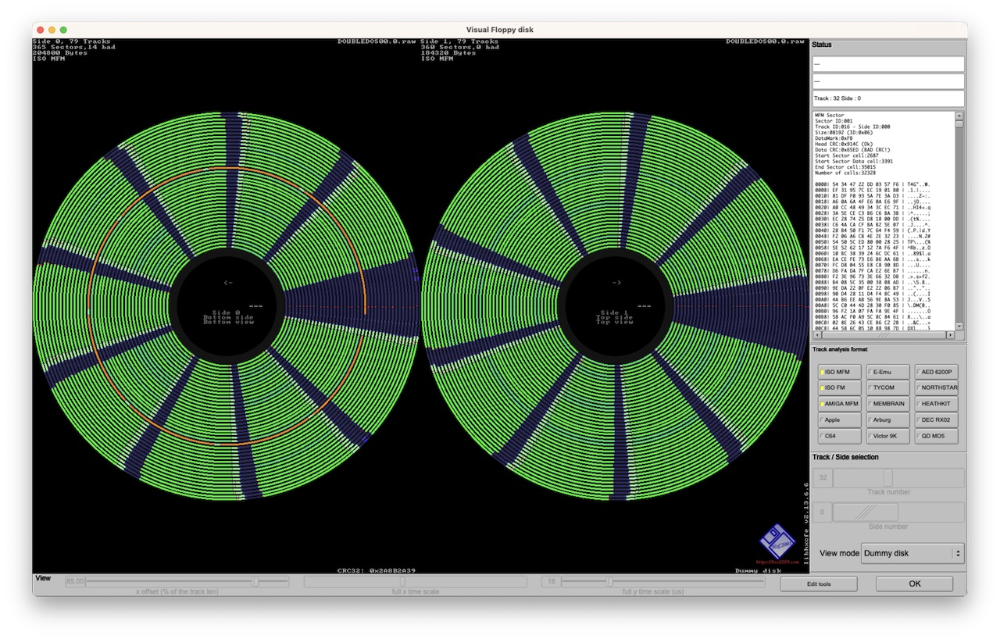

NOTE: DoubleDOS was distributed on a copy-protected diskette.  We have created a Kryoflux copy
of the diskette in our possession (shown below), and it's clear that track 16 has some unusual characteristics,
but until we have time to analyze the diskette and software more closely, it will not operate in the PCx86
emulator as intended.



### Directory of DoubleDOS 2.1

     Volume in drive A has no label
     Directory of A:\

    DOUBLEDO EXE*    18432  10-21-85   2:08p
    DOUBLED2 PGM     45056   1-25-86  11:43p
    SWITCH   ASM     14069  10-21-85   2:07p
    SWITCH   EXE      1152  10-21-85   2:07p
    DBLDANSI SYS      1698  10-21-85   2:07p
    DDCONFIG SYS      2551   1-01-80  12:08a
    DBLDMONO DRV       798  10-21-85   2:07p
    DBLDCOLO DRV      5363  10-21-85   2:07p
    DBLDHERC DRV      5330  10-21-85   2:07p
    DBLDB&W  DRV      5363  10-21-85   2:07p
    DBLDCPQ  DRV       798  10-21-85   2:07p
    123DRIVE BAT       857  10-21-85   2:07p
    DBLDRPGM DRV     36864  10-21-85   2:07p
    UNINSTAL BAT      2697  10-21-85   2:07p
    INSTALL  BAT      3018  10-21-85   2:07p
    VDF0203  VDF*     2560   9-27-86   9:32p
    PATCHES      <DIR>      10-21-85   2:12p
    TRANSFER COM     50192   6-21-85   1:10p
    CML0203  FCL*    12864   6-21-85  11:05a
    MNL0203  FML*     2016   4-18-85  10:01a
    CML0203  HCL*     9344   6-19-85   4:06p
    MNL0203  HML*     1840   5-21-85   4:05p
    SGS0203  SUP*        0  10-21-85   2:09p
    DOUBLEDO COM      2016   4-18-85  10:01a
    INSTAL   BAK        99   1-01-80  12:18a
           25 file(s)     224977 bytes

     Directory of A:\PATCHES

    .            <DIR>      10-21-85   2:12p
    ..           <DIR>      10-21-85   2:12p
    DBLDM32B BAT       415   5-21-85   1:52p
    DBLDSC11 BAT       405   5-21-85  11:36a
    DBLDPFS  BAT       336   8-13-84   9:14a
    DBLDWS   BAT       323   8-13-84  12:01p
    DBLDM320 BAT       362   2-28-85   3:32p
    DBLDFC2  BAT       288   5-22-85   9:54a
    DBLDXTK1 BAT       413  11-13-84   1:07p
    DBLDXTK2 BAT       444   6-12-85  11:19p
    DBLDSYM  BAT       548   3-06-85   4:26p
    DBLDR    BAT       368   2-20-85   3:43p
    DBLDEML  BAT       259   3-06-85  12:02p
    DBLDDB3  BAT       494   6-27-85  10:03a
    DBLDNUTS BAT       425   6-21-85  10:49a
    DBLDXT35 BAT       395   5-03-85  12:10p
    DBLDSC20 BAT       405   5-21-85  11:34a
    DBLDM32A BAT       416   5-21-85   1:54p
    DBLDM32B DEB      4176   3-01-85   2:33p
    DBLDSC11 DEB       961   9-25-84  11:21a
    DBLDPFS  DEB      1219   8-10-84   4:52p
    DBLDWS   DEB       239   8-13-84  11:34a
    DBLDXTK2 DEB      1553   6-12-85  10:58p
    DBLDXTK1 DEB      1021   8-14-84   1:08p
    DBLDM320 DEB      1656   7-10-85  12:23a
    DBLDFC2  DEB       173   8-23-84   3:46p
    DBLDEML  DEB      1358   3-25-85  12:54p
    DBLDR    DEB       742   9-10-85  12:49p
    DBLDSYM  DEB     10478   3-07-85   1:57p
    DBLDDB3  DEB       540   6-27-85  10:07a
    DBLDXT35 DEB      1641   8-19-85  11:00a
    DBLDNUTS DEB      1865   6-21-85  10:34a
    DBLDSC20 DEB      2023   5-21-85  11:28a
    DBLDM32A DEB      4176   5-21-85   2:12p
    PRINTER  COM       496   4-02-85   1:42a
    DB       COM       511   6-26-85   4:28p
    DBLDM330 BAT       338   6-11-85   9:03a
    DDSWITCH BAS      3343   4-23-85   4:55p
    DBLDM330 DEB      4922   6-12-85  10:14p
    DBLDMETA DEB       782   7-16-85  11:14a
    DBLDXTAJ DEB      1641   6-13-85  12:09a
    DBLDXTAJ BAT       438   6-12-85  11:55p
    DBLDSC21 DEB      2023   6-13-85   3:57a
    DBLDSC21 BAT       430   6-13-85   3:00a
    DBLDSCL2 BAT       344   6-14-85   3:33p
    DBLDSCL2 DEB       717   6-14-85   4:53p
    DBLDDB3B BAT       525   6-27-85  11:14a
    DBLDDB3B DEB       533   6-27-85   1:44p
    PATCH    LST      2336   9-19-85   9:41a
    SKLOAD   COM       679   9-19-85   1:07p
    DBLDMETA DE2       198   7-16-85  10:37a
    DBLDMETA BAT       700   7-15-85   3:59p
    DBLDREL2 BAT       332   7-16-85   4:36p
    DBLDREL2 DEB      1474   7-17-85   9:44a
    DBLDLEWP BAT       445   7-18-85   1:04p
    DBLDLEWP DEB      1245   7-29-85   2:20p
    DBLDBI   BAT       435   7-30-85  11:10a
    DBLDBI   DEB       631   7-30-85   4:44p
    DBLDVW12 BAT       409   7-31-85  10:03a
    DBLDVW12 DEB      1208   7-31-85   5:44p
    PATCHES  DOC      2688   9-19-85  11:10a
           61 file(s)      69940 bytes

    Total files listed:
           86 file(s)     294917 bytes
                           23552 bytes free

### Copy-Protection Information

    MFM Sector
    Sector ID:001
    Track ID:000 - Side ID:000
    Size:00512 (ID:0x02)
    DataMark:0xFB
    Head CRC:0xCA6F (Ok)
    Data CRC:0x9AF5 (Ok)
    Start Sector cell:2512
    Start Sector Data cell:3226
    End Sector cell:11514
    Number of cells:9002

    0000| EB 2C 90 49 42 4D 20 20 | .,.IBM  
    0008| 32 2E 30 00 02 02 01 00 | 2.0.....
    0010| 02 70 00 D0 02 FD 02 00 | .p......
    0018| 09 00 02 00 00 00 00 00 | ........
    0020| 0A DF 02 25 02 09 2A FF | ...%..*.
    0028| 50 F6 00 02 CD 19 FA 33 | P......3
    0030| C0 8E D0 BC 00 7C 8E D8 | .....|..
    0038| A3 7A 00 C7 06 78 00 21 | .z...x.!
    0040| 7C FB CD 13 73 03 E9 95 | |...s...
    0048| 00 0E 1F A0 10 7C 98 F7 | .....|..
    0050| 26 16 7C 03 06 1C 7C 03 | &.|...|.
    0058| 06 0E 7C A3 03 7C A3 13 | ..|..|..
    0060| 7C B8 20 00 F7 26 11 7C | |. ..&.|
    0068| 05 FF 01 BB 00 02 F7 F3 | ........
    0070| 01 06 13 7C E8 7E 00 72 | ...|.~.r
    0078| B3 A1 13 7C A3 7E 7D B8 | ...|.~}.
    0080| 70 00 8E C0 8E D8 BB 00 | p.......
    0088| 00 2E A1 13 7C E8 B6 00 | ....|...
    0090| 2E A0 18 7C 2E 2A 06 15 | ...|.*..
    0098| 7C FE C0 32 E4 50 B4 02 | |..2.P..
    00A0| E8 C1 00 58 72 38 2E 28 | ...Xr8.(
    00A8| 06 20 7C 76 0E 2E 01 06 | . |v....
    00B0| 13 7C 2E F7 26 0B 7C 03 | .|..&.|.
    00B8| D8 EB CE 0E 1F CD 11 D0 | ........
    00C0| C0 D0 C0 25 03 00 75 01 | ...%..u.
    00C8| 40 40 8B C8 F6 06 1E 7C | @@.....|
    00D0| 80 75 02 33 C0 8B 1E 7E | .u.3...~
    00D8| 7D EA 00 00 70 00 BE C9 | }...p...
    00E0| 7D E8 02 00 EB FE 2E AC | }.......
    00E8| 24 7F 74 4D B4 0E BB 07 | $.tM....
    00F0| 00 CD 10 EB F1 B8 50 00 | ......P.
    00F8| 8E C0 0E 1F 2E A1 03 7C | .......|
    0100| E8 43 00 BB 00 00 B8 01 | .C......
    0108| 02 E8 58 00 72 2C 33 FF | ..X.r,3.
    0110| B9 0B 00 26 80 0D 20 26 | ...&.. &
    0118| 80 4D 20 20 47 E2 F4 33 | .M  G..3
    0120| FF BE DF 7D B9 0B 00 FC | ...}....
    0128| F3 A6 75 0E BF 20 00 BE | ..u.. ..
    0130| EB 7D B9 0B 00 F3 A6 75 | .}.....u
    0138| 01 C3 BE 80 7D E8 A6 FF | ....}...
    0140| B4 00 CD 16 F9 C3 1E 0E | ........
    0148| 1F 33 D2 F7 36 18 7C FE | .3..6.|.
    0150| C2 88 16 15 7C 33 D2 F7 | ....|3..
    0158| 36 1A 7C 88 16 1F 7C A3 | 6.|...|.
    0160| 08 7C 1F C3 2E 8B 16 08 | .|......
    0168| 7C B1 06 D2 E6 2E 0A 36 | |......6
    0170| 15 7C 8B CA 86 E9 2E 8B | .|......
    0178| 16 1E 7C CD 13 C3 00 00 | ..|.....
    0180| 0D 0A 4E 6F 6E 2D 53 79 | ..Non-Sy
    0188| 73 74 65 6D 20 64 69 73 | stem dis
    0190| 6B 20 6F 72 20 64 69 73 | k or dis
    0198| 6B 20 65 72 72 6F 72 0D | k error.
    01A0| 0A 52 65 70 6C 61 63 65 | .Replace
    01A8| 20 61 6E 64 20 73 74 72 |  and str
    01B0| 69 6B 65 20 61 6E 79 20 | ike any 
    01B8| 6B 65 79 20 77 68 65 6E | key when
    01C0| 20 72 65 61 64 79 0D 0A |  ready..
    01C8| 00 0D 0A 44 69 73 6B 20 | ...Disk 
    01D0| 42 6F 6F 74 20 66 61 69 | Boot fai
    01D8| 6C 75 72 65 0D 0A 00 69 | lure...i
    01E0| 62 6D 62 69 6F 20 20 63 | bmbio  c
    01E8| 6F 6D 30 69 62 6D 64 6F | om0ibmdo
    01F0| 73 20 20 63 6F 6D 30 00 | s  com0.
    01F8| 00 00 00 00 00 00 55 AA | ......U.

    ---

    MFM Sector
    Sector ID:232
    Track ID:000 - Side ID:000
    Size:02048 (ID:0x04)
    DataMark:0x00
    Head CRC:0x0121 (BAD CRC!)
    Data CRC:0x0000 (Ok)
    Start Sector cell:12177
    Start Sector Data cell:12337
    End Sector cell:12337
    Number of cells:160

    ---

    MFM Sector
    Sector ID:002
    Track ID:000 - Side ID:000
    Size:00512 (ID:0x02)
    DataMark:0xFB
    Head CRC:0x9F3C (Ok)
    Data CRC:0xE74D (Ok)
    Start Sector cell:12976
    Start Sector Data cell:13689
    End Sector cell:21977
    Number of cells:9001

    0000| FD FF FF 00 00 00 00 00 | ........
    0008| 00 00 00 00 09 A0 00 0B | ........
    0010| C0 00 0D E0 00 0F 00 01 | ........
    0018| 11 20 01 13 40 01 15 60 | . ..@..`
    0020| 01 17 80 01 19 A0 01 1B | ........
    0028| C0 01 1D E0 01 1F 00 02 | ........
    0030| 21 20 02 23 40 02 25 60 | ! .#@.%`
    0038| 02 27 80 02 29 A0 02 2B | .'..)..+
    0040| C0 02 2D E0 02 2F 00 03 | ..-../..
    0048| 31 C0 15 33 40 03 35 60 | 1..3@.5`
    0050| 03 37 80 03 39 A0 03 3B | .7..9..;
    0058| C0 03 3D E0 03 3F F0 FF | ..=..?..
    0060| 41 F0 FF 43 F0 FF 45 60 | A..C..E`
    0068| 04 FF FF FF 49 A0 04 4B | ....I..K
    0070| C0 04 4D F0 FF 4F 00 05 | ..M..O..
    0078| 51 20 05 53 F0 FF 55 60 | Q .S..U`
    0080| 05 57 80 05 59 F0 FF FF | .W..Y...
    0088| FF FF 5D E0 05 5F 00 06 | ..].._..
    0090| 61 20 06 63 40 06 65 60 | a .c@.e`
    0098| 06 67 80 06 69 A0 06 6B | .g..i..k
    00A0| C0 06 6D E0 06 6F 00 07 | ..m..o..
    00A8| 71 20 07 73 40 07 75 60 | q .s@.u`
    00B0| 07 77 80 07 79 A0 07 7B | .w..y..{
    00B8| C0 07 7D E0 07 7F F0 FF | ..}.....
    00C0| 81 20 08 FF 4F 08 85 F0 | . ..O...
    00C8| FF 87 80 08 FF AF 08 8B | ........
    00D0| E0 09 8D E0 08 8F 00 09 | ........
    00D8| 91 20 09 93 40 09 95 60 | . ..@..`
    00E0| 09 97 80 09 99 A0 09 9B | ........
    00E8| C0 09 9D F0 FF 9F 00 0A | ........
    00F0| A1 20 0A A3 40 0A A5 60 | . ..@..`
    00F8| 0A A7 80 0A A9 A0 0A AB | ........
    0100| C0 0A AD E0 0A AF 00 0B | ........
    0108| B1 20 0B B3 40 0B B5 60 | . ..@..`
    0110| 0B B7 80 0B B9 A0 0B BB | ........
    0118| C0 0B BD E0 0B BF 00 0C | ........
    0120| C1 20 0C C3 40 0C C5 60 | . ..@..`
    0128| 0C C7 80 0C C9 A0 0C CB | ........
    0130| C0 0C FF EF 0C CF 00 0D | ........
    0138| D1 20 0D D3 40 0D D5 60 | . ..@..`
    0140| 0D D7 80 0D D9 F0 FF DB | ........
    0148| F0 FF DD E0 0D DF 00 0E | ........
    0150| E1 20 0E E3 40 0E E5 F0 | . ..@...
    0158| FF E7 F0 FF E9 F0 FF 1D | ........
    0160| F1 FF FF FF FF FF FF FF | ........
    0168| FF FF FF FF FF FF FF FF | ........
    0170| FF FF FF FF FF FF FF FF | ........
    0178| CF 0F FD E0 0F FF F0 FF | ........
    0180| FF 2F 10 FF FF FF 05 F1 | ./......
    0188| FF FF 8F 10 FF FF FF 0B | ........
    0190| F1 FF FF EF 10 0F 01 11 | ........
    0198| 11 21 11 13 41 11 15 61 | .!..A..a
    01A0| 11 17 F1 FF FF AF 11 FF | ........
    01A8| CF 11 FF FF FF 1F F1 FF | ........
    01B0| 21 21 12 23 41 12 FF FF | !!.#A...
    01B8| FF FF FF FF 29 A1 12 2B | ....)..+
    01C0| F1 FF 2D E1 12 2F 01 13 | ..-../..
    01C8| FF FF FF 33 F1 FF FF 6F | ...3...o
    01D0| 13 FF FF FF FF FF FF FF | ........
    01D8| FF FF 3D E1 13 FF FF FF | ..=.....
    01E0| FF FF FF FF 4F 14 FF FF | ....O...
    01E8| FF 47 F1 FF FF FF FF FF | .G......
    01F0| CF 14 FF EF 14 4F F1 FF | .....O..
    01F8| 00 00 00 00 00 00 00 00 | ........

    ---

    MFM Sector
    Sector ID:003
    Track ID:000 - Side ID:000
    Size:00512 (ID:0x02)
    DataMark:0xFB
    Head CRC:0xAC0D (Ok)
    Data CRC:0xB029 (Ok)
    Start Sector cell:23445
    Start Sector Data cell:24160
    End Sector cell:32448
    Number of cells:9003

    0000| 00 00 00 00 00 00 00 00 | ........
    0008| 00 00 5D F1 FF 00 00 00 | ..].....
    0010| 00 00 00 FF 0F 00 00 00 | ........
    0018| 00 00 00 00 00 00 00 00 | ........
    0020| 00 00 00 00 00 00 00 00 | ........
    0028| 00 00 00 00 00 00 00 00 | ........
    0030| 00 00 00 00 00 00 00 00 | ........
    0038| 00 00 00 00 00 00 00 00 | ........
    0040| 00 00 00 00 00 00 00 00 | ........
    0048| 00 00 00 00 00 00 00 00 | ........
    0050| 00 00 00 00 00 00 00 00 | ........
    0058| 00 00 00 00 00 00 00 00 | ........
    0060| 00 00 00 00 00 00 00 00 | ........
    0068| 00 00 00 00 00 00 00 00 | ........
    0070| 00 00 00 00 00 00 00 00 | ........
    0078| 00 00 00 00 00 00 00 00 | ........
    0080| 00 00 00 00 00 00 00 00 | ........
    0088| 00 00 00 00 00 00 00 00 | ........
    0090| 00 00 00 00 00 00 00 00 | ........
    0098| 00 00 00 00 00 00 00 00 | ........
    00A0| 00 00 00 00 00 00 00 00 | ........
    00A8| 00 00 00 00 00 00 00 00 | ........
    00B0| 00 00 00 00 00 00 00 00 | ........
    00B8| 00 00 00 00 00 00 00 00 | ........
    00C0| 00 00 00 00 00 00 00 00 | ........
    00C8| 00 00 00 00 00 00 00 00 | ........
    00D0| 00 00 00 00 00 00 00 00 | ........
    00D8| 00 00 00 00 00 00 00 00 | ........
    00E0| 00 00 00 00 00 00 00 00 | ........
    00E8| 00 00 00 00 00 00 00 00 | ........
    00F0| 00 00 00 00 00 00 00 00 | ........
    00F8| 00 00 00 00 00 00 00 00 | ........
    0100| 00 00 00 00 00 00 00 00 | ........
    0108| 00 00 00 00 00 00 00 00 | ........
    0110| 00 00 00 00 00 00 00 00 | ........
    0118| 00 00 00 00 00 00 00 00 | ........
    0120| 00 00 00 00 00 00 00 00 | ........
    0128| 00 00 00 00 00 00 00 00 | ........
    0130| 00 00 00 00 00 00 00 00 | ........
    0138| 00 00 00 00 00 00 00 00 | ........
    0140| 00 00 00 00 00 00 00 00 | ........
    0148| 00 00 00 00 00 00 00 00 | ........
    0150| 00 00 00 00 00 00 00 00 | ........
    0158| 00 00 00 00 00 00 00 00 | ........
    0160| 00 00 00 00 00 00 00 00 | ........
    0168| 00 00 00 00 00 00 00 00 | ........
    0170| 00 00 00 00 00 00 00 00 | ........
    0178| 00 00 00 00 00 00 00 00 | ........
    0180| 00 00 00 00 00 00 00 00 | ........
    0188| 00 00 00 00 00 00 00 00 | ........
    0190| 00 00 00 00 00 00 00 00 | ........
    0198| 00 00 00 00 00 00 00 00 | ........
    01A0| 00 00 00 00 00 00 00 00 | ........
    01A8| 00 00 00 00 00 00 00 00 | ........
    01B0| 00 00 00 00 00 00 00 00 | ........
    01B8| 00 00 00 00 00 00 00 00 | ........
    01C0| 00 00 00 00 00 00 00 00 | ........
    01C8| 00 00 00 00 00 00 00 00 | ........
    01D0| 00 00 00 00 00 00 00 00 | ........
    01D8| 00 00 00 00 00 00 00 00 | ........
    01E0| 00 00 00 00 00 00 00 00 | ........
    01E8| 00 00 00 00 00 00 00 00 | ........
    01F0| 00 00 00 00 00 00 00 00 | ........
    01F8| 00 00 00 00 00 00 00 00 | ........

    ---

    MFM Sector
    Sector ID:004
    Track ID:000 - Side ID:000
    Size:00512 (ID:0x02)
    DataMark:0xFB
    Head CRC:0x359A (Ok)
    Data CRC:0xE74D (Ok)
    Start Sector cell:33908
    Start Sector Data cell:34621
    End Sector cell:42909
    Number of cells:9001

    0000| FD FF FF 00 00 00 00 00 | ........
    0008| 00 00 00 00 09 A0 00 0B | ........
    0010| C0 00 0D E0 00 0F 00 01 | ........
    0018| 11 20 01 13 40 01 15 60 | . ..@..`
    0020| 01 17 80 01 19 A0 01 1B | ........
    0028| C0 01 1D E0 01 1F 00 02 | ........
    0030| 21 20 02 23 40 02 25 60 | ! .#@.%`
    0038| 02 27 80 02 29 A0 02 2B | .'..)..+
    0040| C0 02 2D E0 02 2F 00 03 | ..-../..
    0048| 31 C0 15 33 40 03 35 60 | 1..3@.5`
    0050| 03 37 80 03 39 A0 03 3B | .7..9..;
    0058| C0 03 3D E0 03 3F F0 FF | ..=..?..
    0060| 41 F0 FF 43 F0 FF 45 60 | A..C..E`
    0068| 04 FF FF FF 49 A0 04 4B | ....I..K
    0070| C0 04 4D F0 FF 4F 00 05 | ..M..O..
    0078| 51 20 05 53 F0 FF 55 60 | Q .S..U`
    0080| 05 57 80 05 59 F0 FF FF | .W..Y...
    0088| FF FF 5D E0 05 5F 00 06 | ..].._..
    0090| 61 20 06 63 40 06 65 60 | a .c@.e`
    0098| 06 67 80 06 69 A0 06 6B | .g..i..k
    00A0| C0 06 6D E0 06 6F 00 07 | ..m..o..
    00A8| 71 20 07 73 40 07 75 60 | q .s@.u`
    00B0| 07 77 80 07 79 A0 07 7B | .w..y..{
    00B8| C0 07 7D E0 07 7F F0 FF | ..}.....
    00C0| 81 20 08 FF 4F 08 85 F0 | . ..O...
    00C8| FF 87 80 08 FF AF 08 8B | ........
    00D0| E0 09 8D E0 08 8F 00 09 | ........
    00D8| 91 20 09 93 40 09 95 60 | . ..@..`
    00E0| 09 97 80 09 99 A0 09 9B | ........
    00E8| C0 09 9D F0 FF 9F 00 0A | ........
    00F0| A1 20 0A A3 40 0A A5 60 | . ..@..`
    00F8| 0A A7 80 0A A9 A0 0A AB | ........
    0100| C0 0A AD E0 0A AF 00 0B | ........
    0108| B1 20 0B B3 40 0B B5 60 | . ..@..`
    0110| 0B B7 80 0B B9 A0 0B BB | ........
    0118| C0 0B BD E0 0B BF 00 0C | ........
    0120| C1 20 0C C3 40 0C C5 60 | . ..@..`
    0128| 0C C7 80 0C C9 A0 0C CB | ........
    0130| C0 0C FF EF 0C CF 00 0D | ........
    0138| D1 20 0D D3 40 0D D5 60 | . ..@..`
    0140| 0D D7 80 0D D9 F0 FF DB | ........
    0148| F0 FF DD E0 0D DF 00 0E | ........
    0150| E1 20 0E E3 40 0E E5 F0 | . ..@...
    0158| FF E7 F0 FF E9 F0 FF 1D | ........
    0160| F1 FF FF FF FF FF FF FF | ........
    0168| FF FF FF FF FF FF FF FF | ........
    0170| FF FF FF FF FF FF FF FF | ........
    0178| CF 0F FD E0 0F FF F0 FF | ........
    0180| FF 2F 10 FF FF FF 05 F1 | ./......
    0188| FF FF 8F 10 FF FF FF 0B | ........
    0190| F1 FF FF EF 10 0F 01 11 | ........
    0198| 11 21 11 13 41 11 15 61 | .!..A..a
    01A0| 11 17 F1 FF FF AF 11 FF | ........
    01A8| CF 11 FF FF FF 1F F1 FF | ........
    01B0| 21 21 12 23 41 12 FF FF | !!.#A...
    01B8| FF FF FF FF 29 A1 12 2B | ....)..+
    01C0| F1 FF 2D E1 12 2F 01 13 | ..-../..
    01C8| FF FF FF 33 F1 FF FF 6F | ...3...o
    01D0| 13 FF FF FF FF FF FF FF | ........
    01D8| FF FF 3D E1 13 FF FF FF | ..=.....
    01E0| FF FF FF FF 4F 14 FF FF | ....O...
    01E8| FF 47 F1 FF FF FF FF FF | .G......
    01F0| CF 14 FF EF 14 4F F1 FF | .....O..
    01F8| 00 00 00 00 00 00 00 00 | ........

    ---

    MFM Sector
    Sector ID:005
    Track ID:000 - Side ID:000
    Size:00512 (ID:0x02)
    DataMark:0xFB
    Head CRC:0x06AB (Ok)
    Data CRC:0xB029 (Ok)
    Start Sector cell:44371
    Start Sector Data cell:45085
    End Sector cell:53373
    Number of cells:9002

    0000| 00 00 00 00 00 00 00 00 | ........
    0008| 00 00 5D F1 FF 00 00 00 | ..].....
    0010| 00 00 00 FF 0F 00 00 00 | ........
    0018| 00 00 00 00 00 00 00 00 | ........
    0020| 00 00 00 00 00 00 00 00 | ........
    0028| 00 00 00 00 00 00 00 00 | ........
    0030| 00 00 00 00 00 00 00 00 | ........
    0038| 00 00 00 00 00 00 00 00 | ........
    0040| 00 00 00 00 00 00 00 00 | ........
    0048| 00 00 00 00 00 00 00 00 | ........
    0050| 00 00 00 00 00 00 00 00 | ........
    0058| 00 00 00 00 00 00 00 00 | ........
    0060| 00 00 00 00 00 00 00 00 | ........
    0068| 00 00 00 00 00 00 00 00 | ........
    0070| 00 00 00 00 00 00 00 00 | ........
    0078| 00 00 00 00 00 00 00 00 | ........
    0080| 00 00 00 00 00 00 00 00 | ........
    0088| 00 00 00 00 00 00 00 00 | ........
    0090| 00 00 00 00 00 00 00 00 | ........
    0098| 00 00 00 00 00 00 00 00 | ........
    00A0| 00 00 00 00 00 00 00 00 | ........
    00A8| 00 00 00 00 00 00 00 00 | ........
    00B0| 00 00 00 00 00 00 00 00 | ........
    00B8| 00 00 00 00 00 00 00 00 | ........
    00C0| 00 00 00 00 00 00 00 00 | ........
    00C8| 00 00 00 00 00 00 00 00 | ........
    00D0| 00 00 00 00 00 00 00 00 | ........
    00D8| 00 00 00 00 00 00 00 00 | ........
    00E0| 00 00 00 00 00 00 00 00 | ........
    00E8| 00 00 00 00 00 00 00 00 | ........
    00F0| 00 00 00 00 00 00 00 00 | ........
    00F8| 00 00 00 00 00 00 00 00 | ........
    0100| 00 00 00 00 00 00 00 00 | ........
    0108| 00 00 00 00 00 00 00 00 | ........
    0110| 00 00 00 00 00 00 00 00 | ........
    0118| 00 00 00 00 00 00 00 00 | ........
    0120| 00 00 00 00 00 00 00 00 | ........
    0128| 00 00 00 00 00 00 00 00 | ........
    0130| 00 00 00 00 00 00 00 00 | ........
    0138| 00 00 00 00 00 00 00 00 | ........
    0140| 00 00 00 00 00 00 00 00 | ........
    0148| 00 00 00 00 00 00 00 00 | ........
    0150| 00 00 00 00 00 00 00 00 | ........
    0158| 00 00 00 00 00 00 00 00 | ........
    0160| 00 00 00 00 00 00 00 00 | ........
    0168| 00 00 00 00 00 00 00 00 | ........
    0170| 00 00 00 00 00 00 00 00 | ........
    0178| 00 00 00 00 00 00 00 00 | ........
    0180| 00 00 00 00 00 00 00 00 | ........
    0188| 00 00 00 00 00 00 00 00 | ........
    0190| 00 00 00 00 00 00 00 00 | ........
    0198| 00 00 00 00 00 00 00 00 | ........
    01A0| 00 00 00 00 00 00 00 00 | ........
    01A8| 00 00 00 00 00 00 00 00 | ........
    01B0| 00 00 00 00 00 00 00 00 | ........
    01B8| 00 00 00 00 00 00 00 00 | ........
    01C0| 00 00 00 00 00 00 00 00 | ........
    01C8| 00 00 00 00 00 00 00 00 | ........
    01D0| 00 00 00 00 00 00 00 00 | ........
    01D8| 00 00 00 00 00 00 00 00 | ........
    01E0| 00 00 00 00 00 00 00 00 | ........
    01E8| 00 00 00 00 00 00 00 00 | ........
    01F0| 00 00 00 00 00 00 00 00 | ........
    01F8| 00 00 00 00 00 00 00 00 | ........

    ---

    MFM Sector
    Sector ID:006
    Track ID:000 - Side ID:000
    Size:00512 (ID:0x02)
    DataMark:0xFB
    Head CRC:0x53F8 (Ok)
    Data CRC:0x7A60 (Ok)
    Start Sector cell:54832
    Start Sector Data cell:55547
    End Sector cell:63835
    Number of cells:9003

    0000| 44 4F 55 42 4C 45 44 4F | DOUBLEDO
    0008| 45 58 45 22 00 00 00 00 | EXE"....
    0010| 00 00 00 00 00 00 03 71 | .......q
    0018| 55 0B 8C 00 00 48 00 00 | U....H..
    0020| E5 4F 4D 4D 41 4E 44 20 | .OMMAND 
    0028| 43 4F 4D 20 00 00 00 00 | COM ....
    0030| 00 00 00 00 00 00 C3 89 | ........
    0038| 68 0D 00 00 00 00 00 00 | h.......
    0040| 44 4F 55 42 4C 45 44 32 | DOUBLED2
    0048| 50 47 4D 20 00 00 00 00 | PGM ....
    0050| 00 00 00 00 00 00 62 BD | ......b.
    0058| 39 0C 08 00 00 B0 00 00 | 9.......
    0060| 53 57 49 54 43 48 20 20 | SWITCH  
    0068| 41 53 4D 20 00 00 00 00 | ASM ....
    0070| 00 00 00 00 00 00 E8 70 | .......p
    0078| 55 0B 32 00 F5 36 00 00 | U.2..6..
    0080| 53 57 49 54 43 48 20 20 | SWITCH  
    0088| 45 58 45 20 00 00 00 00 | EXE ....
    0090| 00 00 00 00 00 00 EA 70 | .......p
    0098| 55 0B 40 00 80 04 00 00 | U.@.....
    00A0| 44 42 4C 44 41 4E 53 49 | DBLDANSI
    00A8| 53 59 53 20 00 00 00 00 | SYS ....
    00B0| 00 00 00 00 00 00 EC 70 | .......p
    00B8| 55 0B 42 00 A2 06 00 00 | U.B.....
    00C0| 44 44 43 4F 4E 46 49 47 | DDCONFIG
    00C8| 53 59 53 20 00 00 00 00 | SYS ....
    00D0| 00 00 00 00 00 00 0C 01 | ........
    00D8| 21 00 44 00 F7 09 00 00 | !.D.....
    00E0| 44 42 4C 44 4D 4F 4E 4F | DBLDMONO
    00E8| 44 52 56 20 00 00 00 00 | DRV ....
    00F0| 00 00 00 00 00 00 EF 70 | .......p
    00F8| 55 0B 47 00 1E 03 00 00 | U.G.....
    0100| 44 42 4C 44 43 4F 4C 4F | DBLDCOLO
    0108| 44 52 56 20 00 00 00 00 | DRV ....
    0110| 00 00 00 00 00 00 F0 70 | .......p
    0118| 55 0B 48 00 F3 14 00 00 | U.H.....
    0120| 44 42 4C 44 48 45 52 43 | DBLDHERC
    0128| 44 52 56 20 00 00 00 00 | DRV ....
    0130| 00 00 00 00 00 00 F2 70 | .......p
    0138| 55 0B 4E 00 D2 14 00 00 | U.N.....
    0140| 44 42 4C 44 42 26 57 20 | DBLDB&W 
    0148| 44 52 56 20 00 00 00 00 | DRV ....
    0150| 00 00 00 00 00 00 F3 70 | .......p
    0158| 55 0B 54 00 F3 14 00 00 | U.T.....
    0160| 44 42 4C 44 43 50 51 20 | DBLDCPQ 
    0168| 44 52 56 20 00 00 00 00 | DRV ....
    0170| 00 00 00 00 00 00 F5 70 | .......p
    0178| 55 0B 5A 00 1E 03 00 00 | U.Z.....
    0180| 31 32 33 44 52 49 56 45 | 123DRIVE
    0188| 42 41 54 20 00 00 00 00 | BAT ....
    0190| 00 00 00 00 00 00 F6 70 | .......p
    0198| 55 0B 5B 00 59 03 00 00 | U.[.Y...
    01A0| 44 42 4C 44 52 50 47 4D | DBLDRPGM
    01A8| 44 52 56 20 00 00 00 00 | DRV ....
    01B0| 00 00 00 00 00 00 FA 70 | .......p
    01B8| 55 0B 5C 00 00 90 00 00 | U.\.....
    01C0| 55 4E 49 4E 53 54 41 4C | UNINSTAL
    01C8| 42 41 54 20 00 00 00 00 | BAT ....
    01D0| 00 00 00 00 00 00 FB 70 | .......p
    01D8| 55 0B 80 00 89 0A 00 00 | U.......
    01E0| 49 4E 53 54 41 4C 4C 20 | INSTALL 
    01E8| 42 41 54 20 00 00 00 00 | BAT ....
    01F0| 00 00 00 00 00 00 FD 70 | .......p
    01F8| 55 0B 83 00 CA 0B 00 00 | U.......

    ---

    MFM Sector
    Sector ID:007
    Track ID:000 - Side ID:000
    Size:00512 (ID:0x02)
    DataMark:0xFB
    Head CRC:0x60C9 (Ok)
    Data CRC:0xE2D4 (Ok)
    Start Sector cell:65290
    Start Sector Data cell:66004
    End Sector cell:74292
    Number of cells:9002

    0000| 56 44 46 30 32 30 33 20 | VDF0203 
    0008| 56 44 46 22 00 00 00 00 | VDF"....
    0010| 00 00 00 00 00 00 11 AC | ........
    0018| 3B 0D 86 00 00 0A 00 00 | ;.......
    0020| 50 41 54 43 48 45 53 20 | PATCHES 
    0028| 20 20 20 10 00 00 00 00 |    .....
    0030| 00 00 00 00 00 00 81 71 | .......q
    0038| 55 0B EA 00 00 00 00 00 | U.......
    0040| 54 52 41 4E 53 46 45 52 | TRANSFER
    0048| 43 4F 4D 20 00 00 00 00 | COM ....
    0050| 00 00 00 00 00 00 57 69 | ......Wi
    0058| D5 0A 89 00 10 C4 00 00 | ........
    0060| 43 4D 4C 30 32 30 33 20 | CML0203 
    0068| 46 43 4C 02 00 00 00 00 | FCL.....
    0070| 00 00 00 00 00 00 A2 58 | .......X
    0078| D5 0A CD 00 40 32 00 00 | ....@2..
    0080| 4D 4E 4C 30 32 30 33 20 | MNL0203 
    0088| 46 4D 4C 02 00 00 00 00 | FML.....
    0090| 00 00 00 00 00 00 23 50 | ......#P
    0098| 92 0A DA 00 E0 07 00 00 | ........
    00A0| 43 4D 4C 30 32 30 33 20 | CML0203 
    00A8| 48 43 4C 02 00 00 00 00 | HCL.....
    00B0| 00 00 00 00 00 00 C6 80 | ........
    00B8| D3 0A DC 00 80 24 00 00 | .....$..
    00C0| 4D 4E 4C 30 32 30 33 20 | MNL0203 
    00C8| 48 4D 4C 02 00 00 00 00 | HML.....
    00D0| 00 00 00 00 00 00 AF 80 | ........
    00D8| B5 0A E6 00 30 07 00 00 | ....0...
    00E0| 53 47 53 30 32 30 33 20 | SGS0203 
    00E8| 53 55 50 02 00 00 00 00 | SUP.....
    00F0| 00 00 00 00 00 00 29 71 | ......)q
    00F8| 55 0B 00 00 00 00 00 00 | U.......
    0100| 44 4F 55 42 4C 45 44 4F | DOUBLEDO
    0108| 43 4F 4D 20 00 00 00 00 | COM ....
    0110| 00 00 00 00 00 00 23 50 | ......#P
    0118| 92 0A E8 00 E0 07 00 00 | ........
    0120| E5 4F 4D 4D 41 4E 44 20 | .OMMAND 
    0128| 43 4F 4D 20 00 00 00 00 | COM ....
    0130| 00 00 00 00 00 00 58 02 | ......X.
    0138| 21 00 00 00 00 00 00 00 | !.......
    0140| 49 4E 53 54 41 4C 20 20 | INSTAL  
    0148| 42 41 4B 20 00 00 00 00 | BAK ....
    0150| 00 00 00 00 00 00 47 02 | ......G.
    0158| 21 00 62 01 63 00 00 00 | !.b.c...
    0160| 00 F6 F6 F6 F6 F6 F6 F6 | ........
    0168| F6 F6 F6 F6 F6 F6 F6 F6 | ........
    0170| F6 F6 F6 F6 F6 F6 F6 F6 | ........
    0178| F6 F6 F6 F6 F6 F6 F6 F6 | ........
    0180| 00 F6 F6 F6 F6 F6 F6 F6 | ........
    0188| F6 F6 F6 F6 F6 F6 F6 F6 | ........
    0190| F6 F6 F6 F6 F6 F6 F6 F6 | ........
    0198| F6 F6 F6 F6 F6 F6 F6 F6 | ........
    01A0| 00 F6 F6 F6 F6 F6 F6 F6 | ........
    01A8| F6 F6 F6 F6 F6 F6 F6 F6 | ........
    01B0| F6 F6 F6 F6 F6 F6 F6 F6 | ........
    01B8| F6 F6 F6 F6 F6 F6 F6 F6 | ........
    01C0| 00 F6 F6 F6 F6 F6 F6 F6 | ........
    01C8| F6 F6 F6 F6 F6 F6 F6 F6 | ........
    01D0| F6 F6 F6 F6 F6 F6 F6 F6 | ........
    01D8| F6 F6 F6 F6 F6 F6 F6 F6 | ........
    01E0| 00 F6 F6 F6 F6 F6 F6 F6 | ........
    01E8| F6 F6 F6 F6 F6 F6 F6 F6 | ........
    01F0| F6 F6 F6 F6 F6 F6 F6 F6 | ........
    01F8| F6 F6 F6 F6 F6 F6 F6 F6 | ........

    ---

    MFM Sector
    Sector ID:008
    Track ID:000 - Side ID:000
    Size:00512 (ID:0x02)
    DataMark:0xFB
    Head CRC:0x70F7 (Ok)
    Data CRC:0x7076 (Ok)
    Start Sector cell:75755
    Start Sector Data cell:76470
    End Sector cell:84758
    Number of cells:9003

    0000| 00 F6 F6 F6 F6 F6 F6 F6 | ........
    0008| F6 F6 F6 F6 F6 F6 F6 F6 | ........
    0010| F6 F6 F6 F6 F6 F6 F6 F6 | ........
    0018| F6 F6 F6 F6 F6 F6 F6 F6 | ........
    0020| 00 F6 F6 F6 F6 F6 F6 F6 | ........
    0028| F6 F6 F6 F6 F6 F6 F6 F6 | ........
    0030| F6 F6 F6 F6 F6 F6 F6 F6 | ........
    0038| F6 F6 F6 F6 F6 F6 F6 F6 | ........
    0040| 00 F6 F6 F6 F6 F6 F6 F6 | ........
    0048| F6 F6 F6 F6 F6 F6 F6 F6 | ........
    0050| F6 F6 F6 F6 F6 F6 F6 F6 | ........
    0058| F6 F6 F6 F6 F6 F6 F6 F6 | ........
    0060| 00 F6 F6 F6 F6 F6 F6 F6 | ........
    0068| F6 F6 F6 F6 F6 F6 F6 F6 | ........
    0070| F6 F6 F6 F6 F6 F6 F6 F6 | ........
    0078| F6 F6 F6 F6 F6 F6 F6 F6 | ........
    0080| 00 F6 F6 F6 F6 F6 F6 F6 | ........
    0088| F6 F6 F6 F6 F6 F6 F6 F6 | ........
    0090| F6 F6 F6 F6 F6 F6 F6 F6 | ........
    0098| F6 F6 F6 F6 F6 F6 F6 F6 | ........
    00A0| 00 F6 F6 F6 F6 F6 F6 F6 | ........
    00A8| F6 F6 F6 F6 F6 F6 F6 F6 | ........
    00B0| F6 F6 F6 F6 F6 F6 F6 F6 | ........
    00B8| F6 F6 F6 F6 F6 F6 F6 F6 | ........
    00C0| 00 F6 F6 F6 F6 F6 F6 F6 | ........
    00C8| F6 F6 F6 F6 F6 F6 F6 F6 | ........
    00D0| F6 F6 F6 F6 F6 F6 F6 F6 | ........
    00D8| F6 F6 F6 F6 F6 F6 F6 F6 | ........
    00E0| 00 F6 F6 F6 F6 F6 F6 F6 | ........
    00E8| F6 F6 F6 F6 F6 F6 F6 F6 | ........
    00F0| F6 F6 F6 F6 F6 F6 F6 F6 | ........
    00F8| F6 F6 F6 F6 F6 F6 F6 F6 | ........
    0100| 00 F6 F6 F6 F6 F6 F6 F6 | ........
    0108| F6 F6 F6 F6 F6 F6 F6 F6 | ........
    0110| F6 F6 F6 F6 F6 F6 F6 F6 | ........
    0118| F6 F6 F6 F6 F6 F6 F6 F6 | ........
    0120| 00 F6 F6 F6 F6 F6 F6 F6 | ........
    0128| F6 F6 F6 F6 F6 F6 F6 F6 | ........
    0130| F6 F6 F6 F6 F6 F6 F6 F6 | ........
    0138| F6 F6 F6 F6 F6 F6 F6 F6 | ........
    0140| 00 F6 F6 F6 F6 F6 F6 F6 | ........
    0148| F6 F6 F6 F6 F6 F6 F6 F6 | ........
    0150| F6 F6 F6 F6 F6 F6 F6 F6 | ........
    0158| F6 F6 F6 F6 F6 F6 F6 F6 | ........
    0160| 00 F6 F6 F6 F6 F6 F6 F6 | ........
    0168| F6 F6 F6 F6 F6 F6 F6 F6 | ........
    0170| F6 F6 F6 F6 F6 F6 F6 F6 | ........
    0178| F6 F6 F6 F6 F6 F6 F6 F6 | ........
    0180| 00 F6 F6 F6 F6 F6 F6 F6 | ........
    0188| F6 F6 F6 F6 F6 F6 F6 F6 | ........
    0190| F6 F6 F6 F6 F6 F6 F6 F6 | ........
    0198| F6 F6 F6 F6 F6 F6 F6 F6 | ........
    01A0| 00 F6 F6 F6 F6 F6 F6 F6 | ........
    01A8| F6 F6 F6 F6 F6 F6 F6 F6 | ........
    01B0| F6 F6 F6 F6 F6 F6 F6 F6 | ........
    01B8| F6 F6 F6 F6 F6 F6 F6 F6 | ........
    01C0| 00 F6 F6 F6 F6 F6 F6 F6 | ........
    01C8| F6 F6 F6 F6 F6 F6 F6 F6 | ........
    01D0| F6 F6 F6 F6 F6 F6 F6 F6 | ........
    01D8| F6 F6 F6 F6 F6 F6 F6 F6 | ........
    01E0| 00 F6 F6 F6 F6 F6 F6 F6 | ........
    01E8| F6 F6 F6 F6 F6 F6 F6 F6 | ........
    01F0| F6 F6 F6 F6 F6 F6 F6 F6 | ........
    01F8| F6 F6 F6 F6 F6 F6 F6 F6 | ........

    ---

    MFM Sector
    Sector ID:009
    Track ID:000 - Side ID:000
    Size:00512 (ID:0x02)
    DataMark:0xFB
    Head CRC:0x43C6 (Ok)
    Data CRC:0x7076 (Ok)
    Start Sector cell:86221
    Start Sector Data cell:86936
    End Sector cell:95224
    Number of cells:9003

    0000| 00 F6 F6 F6 F6 F6 F6 F6 | ........
    0008| F6 F6 F6 F6 F6 F6 F6 F6 | ........
    0010| F6 F6 F6 F6 F6 F6 F6 F6 | ........
    0018| F6 F6 F6 F6 F6 F6 F6 F6 | ........
    0020| 00 F6 F6 F6 F6 F6 F6 F6 | ........
    0028| F6 F6 F6 F6 F6 F6 F6 F6 | ........
    0030| F6 F6 F6 F6 F6 F6 F6 F6 | ........
    0038| F6 F6 F6 F6 F6 F6 F6 F6 | ........
    0040| 00 F6 F6 F6 F6 F6 F6 F6 | ........
    0048| F6 F6 F6 F6 F6 F6 F6 F6 | ........
    0050| F6 F6 F6 F6 F6 F6 F6 F6 | ........
    0058| F6 F6 F6 F6 F6 F6 F6 F6 | ........
    0060| 00 F6 F6 F6 F6 F6 F6 F6 | ........
    0068| F6 F6 F6 F6 F6 F6 F6 F6 | ........
    0070| F6 F6 F6 F6 F6 F6 F6 F6 | ........
    0078| F6 F6 F6 F6 F6 F6 F6 F6 | ........
    0080| 00 F6 F6 F6 F6 F6 F6 F6 | ........
    0088| F6 F6 F6 F6 F6 F6 F6 F6 | ........
    0090| F6 F6 F6 F6 F6 F6 F6 F6 | ........
    0098| F6 F6 F6 F6 F6 F6 F6 F6 | ........
    00A0| 00 F6 F6 F6 F6 F6 F6 F6 | ........
    00A8| F6 F6 F6 F6 F6 F6 F6 F6 | ........
    00B0| F6 F6 F6 F6 F6 F6 F6 F6 | ........
    00B8| F6 F6 F6 F6 F6 F6 F6 F6 | ........
    00C0| 00 F6 F6 F6 F6 F6 F6 F6 | ........
    00C8| F6 F6 F6 F6 F6 F6 F6 F6 | ........
    00D0| F6 F6 F6 F6 F6 F6 F6 F6 | ........
    00D8| F6 F6 F6 F6 F6 F6 F6 F6 | ........
    00E0| 00 F6 F6 F6 F6 F6 F6 F6 | ........
    00E8| F6 F6 F6 F6 F6 F6 F6 F6 | ........
    00F0| F6 F6 F6 F6 F6 F6 F6 F6 | ........
    00F8| F6 F6 F6 F6 F6 F6 F6 F6 | ........
    0100| 00 F6 F6 F6 F6 F6 F6 F6 | ........
    0108| F6 F6 F6 F6 F6 F6 F6 F6 | ........
    0110| F6 F6 F6 F6 F6 F6 F6 F6 | ........
    0118| F6 F6 F6 F6 F6 F6 F6 F6 | ........
    0120| 00 F6 F6 F6 F6 F6 F6 F6 | ........
    0128| F6 F6 F6 F6 F6 F6 F6 F6 | ........
    0130| F6 F6 F6 F6 F6 F6 F6 F6 | ........
    0138| F6 F6 F6 F6 F6 F6 F6 F6 | ........
    0140| 00 F6 F6 F6 F6 F6 F6 F6 | ........
    0148| F6 F6 F6 F6 F6 F6 F6 F6 | ........
    0150| F6 F6 F6 F6 F6 F6 F6 F6 | ........
    0158| F6 F6 F6 F6 F6 F6 F6 F6 | ........
    0160| 00 F6 F6 F6 F6 F6 F6 F6 | ........
    0168| F6 F6 F6 F6 F6 F6 F6 F6 | ........
    0170| F6 F6 F6 F6 F6 F6 F6 F6 | ........
    0178| F6 F6 F6 F6 F6 F6 F6 F6 | ........
    0180| 00 F6 F6 F6 F6 F6 F6 F6 | ........
    0188| F6 F6 F6 F6 F6 F6 F6 F6 | ........
    0190| F6 F6 F6 F6 F6 F6 F6 F6 | ........
    0198| F6 F6 F6 F6 F6 F6 F6 F6 | ........
    01A0| 00 F6 F6 F6 F6 F6 F6 F6 | ........
    01A8| F6 F6 F6 F6 F6 F6 F6 F6 | ........
    01B0| F6 F6 F6 F6 F6 F6 F6 F6 | ........
    01B8| F6 F6 F6 F6 F6 F6 F6 F6 | ........
    01C0| 00 F6 F6 F6 F6 F6 F6 F6 | ........
    01C8| F6 F6 F6 F6 F6 F6 F6 F6 | ........
    01D0| F6 F6 F6 F6 F6 F6 F6 F6 | ........
    01D8| F6 F6 F6 F6 F6 F6 F6 F6 | ........
    01E0| 00 F6 F6 F6 F6 F6 F6 F6 | ........
    01E8| F6 F6 F6 F6 F6 F6 F6 F6 | ........
    01F0| F6 F6 F6 F6 F6 F6 F6 F6 | ........
    01F8| F6 F6 F6 F6 F6 F6 F6 F6 | ........

    ---

    MFM Sector
    Sector ID:209
    Track ID:000 - Side ID:000
    Size:02048 (ID:0x04)
    DataMark:0x00
    Head CRC:0xBE48 (BAD CRC!)
    Data CRC:0x0000 (Ok)
    Start Sector cell:96686
    Start Sector Data cell:96846
    End Sector cell:96846
    Number of cells:160

    ---

    MFM Sector
    Sector ID:165
    Track ID:000 - Side ID:000
    Size:01024 (ID:0x03)
    DataMark:0x00
    Head CRC:0x0A00 (BAD CRC!)
    Data CRC:0x0000 (Ok)
    Start Sector cell:97409
    Start Sector Data cell:97569
    End Sector cell:97569
    Number of cells:160

    ---

    MFM Sector
    Sector ID:001
    Track ID:001 - Side ID:000
    Size:00512 (ID:0x02)
    DataMark:0xFB
    Head CRC:0xBCDB (Ok)
    Data CRC:0xCCDB (Ok)
    Start Sector cell:2512
    Start Sector Data cell:3226
    End Sector cell:11514
    Number of cells:9002

    0000| 0C B9 90 00 F3 A4 FC B4 | ........
    0008| 3A A3 EE 0B A3 75 10 A2 | :....u..
    0010| 43 08 E8 B9 F9 BE 80 00 | C.......
    0018| AC 8A C8 32 ED E3 43 BE | ...2..C.
    0020| 81 00 AC 3C 20 74 17 3C | ...< t.<
    0028| 09 74 13 3A 06 BF 0B 75 | .t.:...u
    0030| 34 49 E3 29 AC 0C 20 3C | 4I.).. <
    0038| 70 75 03 E9 FC 00 3C 64 | pu....<d
    0040| 75 09 C6 06 85 10 01 E2 | u.......
    0048| D9 EB 12 3C 63 75 11 89 | ...<cu..
    0050| 36 73 09 C6 06 72 09 00 | 6s...r..
    0058| C6 06 85 10 01 E9 EC 00 | ........
    0060| E2 C0 E9 11 01 4E 8B D6 | .....N..
    0068| 51 56 AC 49 3C 20 74 09 | QV.I< t.
    0070| 3C 09 74 05 E3 02 EB F2 | <.t.....
    0078| 46 C6 44 FF 00 B8 02 3D | F.D....=
    0080| CD 21 72 46 8B D8 B8 00 | .!rF....
    0088| 44 CD 21 F6 C2 80 75 07 | D.!...u.
    0090| B4 3E CD 21 EB 34 90 32 | .>.!.4.2
    0098| F6 80 CA 03 B8 01 44 CD | ......D.
    00A0| 21 8B D3 5B 5B 51 B9 03 | !..[[Q..
    00A8| 00 33 DB B4 3E CD 21 43 | .3..>.!C
    00B0| E2 F9 8B DA B4 45 CD 21 | .....E.!
    00B8| B4 45 CD 21 B4 45 CD 21 | .E.!.E.!
    00C0| B4 3E CD 21 59 E3 56 E9 | .>.!Y.V.
    00C8| 58 FF C6 06 8A 10 00 B8 | X.......
    00D0| E0 0B B1 04 D3 E8 8C DA | ........
    00D8| 03 C2 A3 1C 0B C6 44 FF | ......D.
    00E0| 20 5E 59 8B 3E 8B 10 AC |  ^Y.>...
    00E8| 49 3C 20 74 09 3C 09 74 | I< t.<.t
    00F0| 05 AA E3 02 EB F1 56 51 | ......VQ
    00F8| BE 67 10 B9 0E 00 8A 45 | .g.....E
    0100| FF E8 63 01 75 02 46 49 | ..c.u.FI
    0108| F3 A4 8B 16 8B 10 B8 00 | ........
    0110| 3D CD 21 72 0D 8B D8 B4 | =.!r....
    0118| 3E CD 21 59 5E E3 2D E9 | >.!Y^.-.
    0120| 00 FF BA 8D 10 B4 09 CD | ........
    0128| 21 BE 67 10 8B 3E 8B 10 | !.g..>..
    0130| B9 0E 00 F3 A4 EB E4 E9 | ........
    0138| E8 FE FE 06 72 09 80 3E | ....r..>
    0140| 85 10 FF 75 05 C6 06 85 | ...u....
    0148| 10 00 E2 EB 80 3E 72 09 | .....>r.
    0150| 00 74 23 B4 50 8C DB CD | .t#.P...
    0158| 21 BF 0A 00 B8 9E 03 AB | !.......
    0160| 8C D8 AB B8 99 02 AB 8C | ........
    0168| D8 AB 8C 1E 16 00 BA 6D | .......m
    0170| 03 B8 2E 25 CD 21 A1 16 | ...%.!..
    0178| 00 A3 2C 09 8C 1E 16 00 | ..,.....
    0180| A1 18 00 A3 6F 09 8C 1E | ....o...
    0188| 20 0B 8C 1E 24 0B 8C 1E |  ...$...
    0190| 28 0B 1E 07 BF 39 09 8B | (....9..
    0198| 36 8B 10 80 3E 8A 10 00 | 6...>...
    01A0| 74 16 BE B6 10 06 57 E8 | t.....W.
    01A8| CB 00 8B F7 06 1F 5F 07 | ......_.
    01B0| 73 06 8B 36 8B 10 0E 1F | s..6....
    01B8| AC AA 0A C0 75 FA 0E 1F | ....u...
    01C0| BB BD 00 B4 4A CD 21 80 | ....J.!.
    01C8| 3E 8A 10 00 75 07 BB 0A | >...u...
    01D0| 00 B4 48 CD 21 E8 90 F7 | ..H.!...
    01D8| E8 DC F7 89 16 69 09 A1 | .....i..
    01E0| 67 09 2D 59 00 90 A3 B1 | g.-Y....
    01E8| 0B E8 61 F3 89 16 B7 0B | ..a.....
    01F0| 80 3E 85 10 00 75 5F BB | .>...u_.
    01F8| 03 00 B4 48 CD 21 72 46 | ...H.!rF

    ---

    MFM Sector
    Sector ID:232
    Track ID:001 - Side ID:000
    Size:02048 (ID:0x04)
    DataMark:0x00
    Head CRC:0x764E (BAD CRC!)
    Data CRC:0x0000 (Ok)
    Start Sector cell:12175
    Start Sector Data cell:12335
    End Sector cell:12335
    Number of cells:160

    ---

    MFM Sector
    Sector ID:002
    Track ID:001 - Side ID:000
    Size:00512 (ID:0x02)
    DataMark:0xFB
    Head CRC:0xE988 (Ok)
    Data CRC:0x126E (Ok)
    Start Sector cell:12975
    Start Sector Data cell:13689
    End Sector cell:21977
    Number of cells:9002

    0000| A3 33 09 8E C0 33 FF 80 | .3...3..
    0008| 3E 75 10 00 75 09 B4 19 | >u..u...
    0010| CD 21 04 41 A2 75 10 BE | .!.A.u..
    0018| 75 10 B9 08 00 F3 A5 B8 | u.......
    0020| FF FF B1 0A F3 AB BA 75 | .......u
    0028| 10 B8 00 3D CD 21 72 08 | ...=.!r.
    0030| 8B D8 B4 3E CD 21 EB 2C | ...>.!.,
    0038| 8E 06 33 09 B4 49 CD 21 | ..3..I.!
    0040| C7 06 33 09 00 00 B8 29 | ..3....)
    0048| 18 A3 86 10 A1 63 09 A3 | .....c..
    0050| 88 10 FF 1E 86 10 83 3E | .......>
    0058| 73 09 00 75 07 BA D4 0F | s..u....
    0060| B4 09 CD 21 E9 37 F4 80 | ...!.7..
    0068| 3E BF 0B 2F 74 04 3C 2F | >../t.</
    0070| 74 02 3C 5C C3 E8 05 00 | t.<\....
    0078| 72 2E EB 41 90 FC E8 28 | r..A...(
    0080| 00 8E 06 1C 0B 33 FF 51 | .....3.Q
    0088| 56 57 AC E8 3B 00 47 26 | VW..;.G&
    0090| 3A 45 FF 75 02 E2 F3 5F | :E.u..._
    0098| 5E 59 74 0C 51 E8 21 00 | ^Yt.Q.!.
    00A0| 59 26 80 3D 00 75 E0 F9 | Y&.=.u..
    00A8| C3 1E 07 8B FE 57 E8 0C | .....W..
    00B0| 00 EB 04 57 E8 0A 00 59 | ...W...Y
    00B8| 2B F9 87 F9 C3 B0 3D EB | +.....=.
    00C0| 02 32 C0 B9 00 01 F2 AE | .2......
    00C8| C3 3C 61 72 06 3C 7A 77 | .<ar.<zw
    00D0| 02 2C 20 C3 0D 0A 0D 0A | ., .....
    00D8| 54 68 65 20 49 42 4D 20 | The IBM 
    00E0| 50 65 72 73 6F 6E 61 6C | Personal
    00E8| 20 43 6F 6D 70 75 74 65 |  Compute
    00F0| 72 20 44 4F 53 0D 0A 56 | r DOS..V
    00F8| 65 72 73 69 6F 6E 20 32 | ersion 2
    0100| 2E 31 30 20 28 43 29 43 | .10 (C)C
    0108| 6F 70 79 72 69 67 68 74 | opyright
    0110| 20 49 42 4D 20 43 6F 72 |  IBM Cor
    0118| 70 20 31 39 38 31 2C 20 | p 1981, 
    0120| 31 39 38 32 2C 20 31 39 | 1982, 19
    0128| 38 33 0D 0A 24 4C 69 63 | 83..$Lic
    0130| 65 6E 73 65 64 20 4D 61 | ensed Ma
    0138| 74 65 72 69 61 6C 20 2D | terial -
    0140| 20 50 72 6F 67 72 61 6D |  Program
    0148| 20 50 72 6F 70 65 72 74 |  Propert
    0150| 79 20 6F 66 20 49 42 4D | y of IBM
    0158| 2F 44 45 56 2F 43 4F 4E | /DEV/CON
    0160| 00 00 00 00 00 00 00 2F | ......./
    0168| 43 4F 4D 4D 41 4E 44 2E | COMMAND.
    0170| 43 4F 4D 00 00 00 3A 5C | COM...:\
    0178| 41 55 54 4F 45 58 45 43 | AUTOEXEC
    0180| 2E 42 41 54 00 FF 00 00 | .BAT....
    0188| 00 00 00 EE 0B 53 70 65 | .....Spe
    0190| 63 69 66 69 65 64 20 43 | cified C
    0198| 4F 4D 4D 41 4E 44 20 73 | OMMAND s
    01A0| 65 61 72 63 68 20 64 69 | earch di
    01A8| 72 65 63 74 6F 72 79 20 | rectory 
    01B0| 62 61 64 0D 0A 24 43 4F | bad..$CO
    01B8| 4D 53 50 45 43 3D 00 00 | MSPEC=..
    01C0| 00 00 00 00 00 00 00 00 | ........
    01C8| 00 00 00 00 00 00 00 00 | ........
    01D0| 00 00 00 00 00 00 00 00 | ........
    01D8| 00 00 00 00 00 00 00 00 | ........
    01E0| 00 00 00 00 00 00 00 00 | ........
    01E8| 00 00 00 00 00 00 00 00 | ........
    01F0| 00 00 00 00 00 00 00 00 | ........
    01F8| 00 00 00 00 00 00 00 00 | ........

    ---

    MFM Sector
    Sector ID:003
    Track ID:001 - Side ID:000
    Size:00512 (ID:0x02)
    DataMark:0xFB
    Head CRC:0xDAB9 (Ok)
    Data CRC:0x0459 (Ok)
    Start Sector cell:23441
    Start Sector Data cell:24156
    End Sector cell:32444
    Number of cells:9003

    0000| 00 00 00 00 00 00 00 00 | ........
    0008| 00 00 00 00 00 00 00 00 | ........
    0010| 00 00 00 00 00 00 00 00 | ........
    0018| 00 00 00 00 00 00 00 00 | ........
    0020| 00 00 00 00 00 00 00 00 | ........
    0028| 00 00 00 00 00 00 00 00 | ........
    0030| 00 00 00 00 00 00 00 00 | ........
    0038| 00 00 00 00 00 00 00 00 | ........
    0040| 00 00 00 00 00 00 00 00 | ........
    0048| 00 00 00 00 00 00 00 00 | ........
    0050| 00 00 00 00 00 00 00 00 | ........
    0058| 00 00 00 00 00 00 00 00 | ........
    0060| 00 00 00 00 00 00 00 00 | ........
    0068| 00 00 00 00 00 00 00 00 | ........
    0070| 00 00 00 00 00 00 00 00 | ........
    0078| 00 00 00 00 00 00 00 00 | ........
    0080| 00 00 00 00 00 00 00 00 | ........
    0088| 00 00 00 00 00 00 00 00 | ........
    0090| 00 00 00 00 00 00 00 00 | ........
    0098| 00 00 00 00 00 00 00 00 | ........
    00A0| 00 00 00 00 00 00 00 00 | ........
    00A8| 00 00 00 00 00 00 00 00 | ........
    00B0| 00 00 00 00 00 00 00 00 | ........
    00B8| 00 00 00 00 00 00 00 00 | ........
    00C0| B4 0E CD 21 2E 8E 1E B3 | ...!....
    00C8| 2C B8 FF FF 87 06 75 09 | ,.....u.
    00D0| 3D FF FF 74 04 B4 2E CD | =..t....
    00D8| 21 2E FF 1E B1 2C 33 ED | !....,3.
    00E0| 83 3E 73 09 FF 75 05 0E | .>s..u..
    00E8| 1F E9 B0 10 FC 8C C8 8E | ........
    00F0| D0 BC 76 2F 8E C0 36 8E | ..v/..6.
    00F8| 1E B3 2C FB 36 C6 06 19 | ..,.6...
    0100| 2B 80 36 C6 06 9C 2B 80 | +.6...+.
    0108| 0B ED 74 09 36 C7 06 1A | ..t.6...
    0110| 2B 01 0D EB 12 80 3E 71 | +.....>q
    0118| 09 00 74 0B 1E 0E 1F BA | ..t.....
    0120| 1F 2C B4 3B CD 21 1F 80 | .,.;.!..
    0128| 3E 78 0A 00 74 0A 80 3E | >x..t..>
    0130| 77 0A 00 75 03 E8 0D 06 | w..u....
    0138| C6 06 6B 09 00 C6 06 71 | ..k....q
    0140| 09 00 8C C8 8E D8 2B 06 | ......+.
    0148| B5 2C BA 10 00 F7 E2 0B | .,......
    0150| D2 74 03 B8 FF FF A3 D0 | .t......
    0158| 2C 8E 1E B3 2C F6 06 6E | ,...,..n
    0160| 09 FF 74 08 E8 7E 05 72 | ..t..~.r
    0168| 03 E8 24 0A B4 19 CD 21 | ..$....!
    0170| 36 A2 C3 2C F6 06 6E 09 | 6..,..n.
    0178| FF 74 08 E8 67 05 72 03 | .t..g.r.
    0180| E8 F5 0C F6 06 77 0A FF | .....w..
    0188| 74 03 E9 33 06 F6 06 77 | t..3...w
    0190| 09 FF 74 03 E9 CC 11 C6 | ..t.....
    0198| 06 26 0A 00 C6 06 4F 0A | .&....O.
    01A0| 00 C6 06 4E 0A 00 F7 06 | ...N....
    01A8| 33 09 FF FF 74 03 E9 05 | 3...t...
    01B0| 01 83 3E 73 09 00 74 1D | ..>s..t.
    01B8| BE FF FF 87 36 73 09 BF | ....6s..
    01C0| 9E 2B 33 C9 AC AA 41 3C | .+3...A<
    01C8| 0D 75 F9 49 0E 1F 88 0E | .u.I....
    01D0| 9D 2B E9 33 01 0E 1F BA | .+.3....
    01D8| 19 2B B4 0A CD 21 8A 0E | .+...!..
    01E0| 19 2B 32 ED 83 C1 03 BE | .+2.....
    01E8| 19 2B BF 9C 2B F3 A4 E9 | .+..+...
    01F0| 16 01 1E 56 57 BF ED 2C | ...VW..,
    01F8| 04 30 AA E8 31 0B AA 3C | .0..1..<

    ---

    MFM Sector
    Sector ID:004
    Track ID:001 - Side ID:000
    Size:00512 (ID:0x02)
    DataMark:0xFB
    Head CRC:0x432E (Ok)
    Data CRC:0xDCB2 (Ok)
    Start Sector cell:33905
    Start Sector Data cell:34620
    End Sector cell:42908
    Number of cells:9003

    0000| 0D 74 09 3C 25 75 F4 26 | .t.<%u.&
    0008| C6 45 FF 3D BE ED 2C 0E | .E.=..,.
    0010| 1F E8 57 0E 06 1F 0E 07 | ..W.....
    0018| 8B F7 5F 73 05 0E 1F BE | .._s....
    0020| ED 2C AC 0A C0 74 0E 3C | .,...t.<
    0028| 0D 74 0A 3C 3D 74 03 AA | .t.<=t..
    0030| EB F0 B0 25 AA 5E 1F 3C | ...%.^.<
    0038| 0D 74 0E E9 9C 00 E8 EE | .t......
    0040| 0A 3C 25 74 04 3C 0D 75 | .<%t.<.u
    0048| 03 E9 98 00 2C 30 72 A2 | ....,0r.
    0050| 3C 09 77 9E 98 8B F0 D1 | <.w.....
    0058| E6 06 57 8E 06 33 09 33 | ..W..3.3
    0060| C9 8B C1 8B F9 49 F2 AE | .....I..
    0068| 03 FE 26 8B 35 5F 07 83 | ..&.5_..
    0070| FE FF 74 66 AC 3C 0D 74 | ..tf.<.t
    0078| 61 AA EB F8 BA 7E 25 36 | a....~%6
    0080| FF 1E BD 2C 74 23 8E 06 | ...,t#..
    0088| 33 09 B4 49 CD 21 C7 06 | 3..I.!..
    0090| 33 09 00 00 C6 06 77 09 | 3.....w.
    0098| 00 C6 06 77 0A 00 0E 1F | ...w....
    00A0| BA 67 25 E8 EF 1F E9 1B | .g%.....
    00A8| FE 0E 1F E8 E7 1F B8 01 | ........
    00B0| 0C CD 21 E9 0E FE E8 47 | ..!....G
    00B8| 14 72 C1 BF 9E 2B E8 6E | .r...+.n
    00C0| 0A 3C 3A 75 18 E8 67 0A | .<:u..g.
    00C8| 3C 0D 75 F9 E8 60 0A F7 | <.u..`..
    00D0| 06 33 09 FF FF 75 E7 E9 | .3...u..
    00D8| EA FD E8 52 0A 3C 25 75 | ...R.<%u
    00E0| 03 E9 5A FF AA 3C 0D 75 | ..Z..<.u
    00E8| F1 81 EF 9F 2B 8B C7 26 | ....+..&
    00F0| A2 9D 2B E8 39 0A E8 FD | ..+.9...
    00F8| 13 F6 06 6E 09 FF 0E 1F | ...n....
    0100| 74 09 BA 9E 2B E8 96 1F | t...+...
    0108| E8 85 08 E8 4B 05 74 03 | ....K.t.
    0110| E9 5D 04 BE 9E 2B BF EC | .]...+..
    0118| 2C B8 01 29 CD 21 3C 01 | ,..).!<.
    0120| 74 07 3C FF 75 06 E9 D4 | t.<.u...
    0128| 00 E9 AE 03 8A 05 A2 CF | ........
    0130| 2C B0 20 B9 09 00 47 F2 | ,. ...G.
    0138| AE B0 09 2A C1 A2 EC 2C | ...*...,
    0140| BF 81 00 33 C9 56 AC AA | ...3.V..
    0148| 3C 0D E0 FA F6 D1 88 0E | <.......
    0150| 80 00 5E E8 71 00 A3 C6 | ..^.q...
    0158| 2C BF 5C 00 B8 01 29 CD | ,.\...).
    0160| 21 A2 C4 2C AC 3A 06 B7 | !..,.:..
    0168| 2C 74 09 3C 0D 74 05 E8 | ,t.<.t..
    0170| 16 0A 75 F0 4E E8 4F 00 | ..u.N.O.
    0178| A3 C8 2C BF 6C 00 B8 01 | ..,.l...
    0180| 29 CD 21 A2 C5 2C E8 3E | ).!..,.>
    0188| 00 A3 CA 2C 0B 06 C8 2C | ...,...,
    0190| A3 CC 2C 80 3C 0D 74 0A | ..,.<.t.
    0198| 46 E8 2B 00 09 06 CC 2C | F.+....,
    01A0| EB F1 A0 EC 2C 8A 16 CF | ....,...
    01A8| 2C 0A D2 74 03 E9 8B 00 | ,..t....
    01B0| FE C8 75 4F 8E 1E B3 2C | ..uO...,
    01B8| 83 3E 73 09 FF 74 03 E9 | .>s..t..
    01C0| AA FD E9 22 FD 93 C3 33 | ..."...3
    01C8| DB E8 B4 09 3A 06 B7 2C | ....:..,
    01D0| 75 F3 81 CB 00 80 46 E8 | u.....F.
    01D8| A6 09 3C 0D 74 E7 46 E8 | ..<.t.F.
    01E0| 16 0D BF 38 04 B9 05 00 | ...8....
    01E8| 90 F2 AE 75 09 B8 01 00 | ...u....
    01F0| D3 E0 0B D8 EB D3 EB D1 | ........
    01F8| 56 42 41 50 57 BA C2 26 | VBAPW..&

    ---

    MFM Sector
    Sector ID:005
    Track ID:001 - Side ID:000
    Size:00512 (ID:0x02)
    DataMark:0xFB
    Head CRC:0x701F (Ok)
    Data CRC:0xEE8D (Ok)
    Start Sector cell:44369
    Start Sector Data cell:45083
    End Sector cell:53371
    Number of cells:9002

    0000| E9 DC 02 BE 1C 2A B5 00 | .....*..
    0008| BF EC 2C 8A 0C E3 32 F3 | ..,...2.
    0010| A6 9F 03 F1 9E AC A2 C1 | ........
    0018| 2C AD 75 EC 8B D0 80 3E | ,.u....>
    0020| C1 2C 00 74 0B A0 C4 2C | .,.t...,
    0028| 0A 06 C5 2C 3C FF 74 CD | ...,<.t.
    0030| E8 82 15 FF D2 E9 8C FC | ........
    0038| E9 85 FC FE CA FE C8 74 | .......t
    0040| F7 C6 06 C2 2C 00 8A 16 | ....,...
    0048| CF 2C 88 16 EC 2C C6 06 | .,...,..
    0050| C1 2D 00 52 BA EC 2C E8 | .-.R..,.
    0058| E5 1F 5A 73 07 FE 06 C1 | ..Zs....
    0060| 2D EB 04 90 E8 9A 0E B0 | -.......
    0068| 3F BF F5 2C AA AA AA BA | ?..,....
    0070| 68 2D B4 1A CD 21 06 E8 | h-...!..
    0078| E9 0B 8B F7 07 BF 62 2C | ......b,
    0080| C6 05 00 80 3E C1 2D 00 | ....>.-.
    0088| 74 03 E9 F0 01 B4 11 0E | t.......
    0090| 1F BA EC 2C CD 21 0A C0 | ...,.!..
    0098| B4 12 75 43 81 3E 71 2D | ..uC.>q-
    00A0| 43 4F 75 0F 80 3E 73 2D | COu..>s-
    00A8| 4D 75 08 80 0E C2 2C 04 | Mu....,.
    00B0| E9 C7 01 81 3E 71 2D 45 | ....>q-E
    00B8| 58 75 0E 80 3E 73 2D 45 | Xu..>s-E
    00C0| 75 07 80 0E C2 2C 01 EB | u....,..
    00C8| C6 81 3E 71 2D 42 41 75 | ..>q-BAu
    00D0| BE 80 3E 73 2D 54 75 B7 | ..>s-Tu.
    00D8| 80 0E C2 2C 02 EB B0 F6 | ...,....
    00E0| 06 C2 2C 01 74 0E C7 06 | ..,.t...
    00E8| 71 2D 45 58 C6 06 73 2D | q-EX..s-
    00F0| 45 E9 86 01 F6 06 C2 2C | E......,
    00F8| 02 74 1F C7 06 71 2D 42 | .t...q-B
    0100| 41 C6 06 73 2D 54 BA 68 | A..s-T.h
    0108| 2D B4 0F CD 21 0A C0 74 | -...!..t
    0110| 06 E8 0E 08 E9 C3 01 E9 | ........
    0118| AE 00 BA 1F 2C B4 3B CD | ....,.;.
    0120| 21 8E 1E B3 2C C6 06 71 | !...,..q
    0128| 09 00 BF 62 2C 8B D6 8E | ...b,...
    0130| 1E 1C 0B AC 0A C0 74 0E | ......t.
    0138| 32 DB AA 0A C0 74 0A 3C | 2....t.<
    0140| 3B 74 0F AC EB F4 E9 91 | ;t......
    0148| 01 26 C6 45 FF 3B 4E 8A | .&.E.;N.
    0150| 5C FF 4F 53 56 52 8B F2 | \.OSVR..
    0158| 32 D2 80 7C 01 3A 75 05 | 2..|.:u.
    0160| 8A 14 80 EA 40 1E 0E 1F | ....@...
    0168| 88 16 EC 2C 57 E8 91 0D | ...,W...
    0170| 5F 73 06 BA 9B 28 E8 2A | _s...(.*
    0178| 1D 1F 5A 5E 5B 86 5C FF | ..Z^[.\.
    0180| B4 3B CD 21 88 5C FF 36 | .;.!.\.6
    0188| 8E 1E B3 2C FE 06 71 09 | ...,..q.
    0190| 72 98 E9 F8 FE 06 8E 06 | r.......
    0198| B5 2C B4 49 CD 21 07 C3 | .,.I.!..
    01A0| BB FF FF B4 48 CD 21 B4 | ....H.!.
    01A8| 48 CD 21 26 A3 BD 0B A3 | H.!&....
    01B0| B5 2C 8B D8 8C C8 2B C3 | .,....+.
    01B8| BA 10 00 F7 E2 0B D2 74 | .......t
    01C0| 03 B8 FF FF A3 D0 2C C3 | ......,.
    01C8| E8 EA 13 8E 06 B3 2C 26 | ......,&
    01D0| C6 06 77 09 00 26 C6 06 | ..w..&..
    01D8| 77 0A 00 26 F7 06 33 09 | w..&..3.
    01E0| FF FF 75 11 E8 AE FF BB | ..u.....
    01E8| 06 00 B4 48 CD 21 26 A3 | ...H.!&.
    01F0| 33 09 E8 AB FF 06 26 8E | 3.....&.
    01F8| 06 33 09 8A 16 68 2D 33 | .3...h-3

    ---

    MFM Sector
    Sector ID:006
    Track ID:001 - Side ID:000
    Size:00512 (ID:0x02)
    DataMark:0xFB
    Head CRC:0x254C (Ok)
    Data CRC:0xE9BF (Ok)
    Start Sector cell:54833
    Start Sector Data cell:55548
    End Sector cell:63836
    Number of cells:9003

    0000| FF E8 00 0D 33 C0 8B C8 | ....3...
    0008| 49 F2 AE 4F A0 B8 2C 26 | I..O..,&
    0010| 3A 45 FF 74 01 AA BE 69 | :E.t...i
    0018| 2D E8 0B 0D B8 FF FF 8B | -.......
    0020| DF B9 0A 00 F3 AB 07 E8 | ........
    0028| F8 06 BE 9E 2B BF 2A 0B | ....+.*.
    0030| B9 0A 00 E8 4A 07 3C 0D | ....J.<.
    0038| 74 23 E3 0C 06 26 8E 06 | t#...&..
    0040| 33 09 26 89 3F 07 43 43 | 3.&.?.CC
    0048| AC E8 3C 07 74 07 AA 3C | ..<.t..<
    0050| 0D 74 0A EB F3 B0 0D AA | .t......
    0058| E3 D9 49 EB D6 32 C0 AA | ..I..2..
    0060| 33 C0 06 1F A3 35 09 A3 | 3....5..
    0068| 37 09 83 3E 73 09 FF 75 | 7..>s..u
    0070| 06 C7 06 73 09 F0 FF E9 | ...s....
    0078| 4A FA E8 A5 06 80 3D 00 | J.....=.
    0080| 74 0E 8A 45 FF E8 B0 02 | t..E....
    0088| 74 0F A0 B8 2C AA EB 09 | t...,...
    0090| A0 68 2D 04 40 AA B0 3A | .h-.@..:
    0098| AA BE 69 2D E8 88 0C E8 | ..i-....
    00A0| 13 13 8E 06 B5 2C B4 49 | .....,.I
    00A8| CD 21 8E 06 B3 2C 26 FE | .!...,&.
    00B0| 06 6B 09 26 C6 06 71 09 | .k.&..q.
    00B8| 00 BF 5C 00 8B F7 B9 52 | ..\....R
    00C0| 00 F3 A5 BA 62 2C BB 1C | ....b,..
    00C8| 0B B8 00 4B F6 06 C1 2D | ...K...-
    00D0| FF 74 03 E9 E3 1D FF 2E | .t......
    00D8| B9 2C 0E 1F BA BC 25 E8 | .,....%.
    00E0| B3 1B E9 DF F9 83 3E 73 | ......>s
    00E8| 09 00 74 12 81 3E 73 09 | ..t..>s.
    00F0| FF EF C3 B0 01 1E 8E 1E | ........
    00F8| B3 2C A2 71 09 1F C3 F7 | .,.q....
    0100| 06 D7 2C FF FF 75 05 BA | ..,..u..
    0108| EE 25 EB D3 A0 D6 2C 3A | .%....,:
    0110| 06 D5 2C 74 03 E8 78 04 | ..,t..x.
    0118| 8B 36 D7 2C 33 FF E8 84 | .6.,3...
    0120| 04 BA AA 26 E8 7C 1B B4 | ...&.|..
    0128| 36 8A 16 5C 00 CD 21 3D | 6..\..!=
    0130| FF FF 74 CA F7 E1 F7 E3 | ..t.....
    0138| 8B FA 8B F0 E8 66 04 BA | .....f..
    0140| B4 26 E9 5E 1B 52 BA FC | .&.^.R..
    0148| 0A B4 41 CD 21 BA 0A 0B | ..A.!...
    0150| B4 41 CD 21 33 C0 A3 77 | .A.!3..w
    0158| 0A C6 06 6E 09 01 5A C3 | ...n..Z.
    0160| BA DD 28 EB 03 BA 04 29 | ..(....)
    0168| E8 DA FF 0E 1F E9 6F FF | ......o.
    0170| 8E 1E B3 2C FE 06 78 0A | ...,..x.
    0178| B4 19 CD 21 04 41 A2 0A | ...!.A..
    0180| 0B BB FC 0A 88 07 8B D3 | ........
    0188| 33 C9 B4 3C CD 21 72 D5 | 3..<.!r.
    0190| 8B D8 B4 3E CD 21 BA 0A | ...>.!..
    0198| 0B B4 3C CD 21 72 C6 8B | ..<.!r..
    01A0| D8 B4 3E CD 21 E8 2A 12 | ..>.!.*.
    01A8| C6 06 6E 09 00 8B 36 79 | ..n...6y
    01B0| 0A 83 3E 73 09 FF 75 06 | ..>s..u.
    01B8| C7 06 73 09 00 F0 EB 23 | ..s....#
    01C0| C6 06 6E 09 00 8B 36 79 | ..n...6y
    01C8| 0A AC 3C 7C 75 77 8B 16 | ..<|uw..
    01D0| 18 0B B8 00 3D CD 21 72 | ....=.!r
    01D8| 8C 8B D8 B0 FF 86 47 18 | ......G.
    01E0| A2 18 00 BF 9E 2B 33 C9 | .....+3.
    01E8| 80 3C 0D 75 03 E9 70 FF | .<.u..p.
    01F0| 80 3C 7C 74 F8 AC AA 3C | .<|t...<
    01F8| 0D 74 38 41 3C 7C 75 F5 | .t8A<|u.

    ---

    MFM Sector
    Sector ID:007
    Track ID:001 - Side ID:000
    Size:00512 (ID:0x02)
    DataMark:0xFB
    Head CRC:0x167D (Ok)
    Data CRC:0xEE01 (Ok)
    Start Sector cell:65295
    Start Sector Data cell:66007
    End Sector cell:74295
    Number of cells:9000

    0000| FB 00 FB 00 FB 00 FB 00 | ........
    0008| FB 00 FB 00 FB 00 FB 00 | ........
    0010| FB 00 FB 00 FB 00 FB 00 | ........
    0018| FB 00 FB 00 FB 00 FB 00 | ........
    0020| FB 00 FB 00 FB 00 FB 00 | ........
    0028| FB 00 FB 00 FB 00 FB 00 | ........
    0030| FB 00 FB 00 FB 00 FB 00 | ........
    0038| FB 00 FB 00 FB 00 FB 00 | ........
    0040| FB 00 FB 00 FB 00 FB 00 | ........
    0048| FB 00 FB 00 FB 00 FB 00 | ........
    0050| FB 00 FB 00 FB 00 FB 00 | ........
    0058| FB 00 FB 00 FB 00 FB 00 | ........
    0060| FB 00 FB 00 FB 00 FB 00 | ........
    0068| FB 00 FB 00 FB 00 FB 00 | ........
    0070| FB 00 FB 00 FB 00 FB 00 | ........
    0078| FB 00 FB 00 FB 00 FB 00 | ........
    0080| FB 00 FB 00 FB 00 FB 00 | ........
    0088| FB 00 FB 00 FB 00 FB 00 | ........
    0090| FB 00 FB 00 FB 00 FB 00 | ........
    0098| FB 00 FB 00 FB 00 FB 00 | ........
    00A0| FB 00 FB 00 FB 00 FB 00 | ........
    00A8| FB 00 FB 00 FB 00 FB 00 | ........
    00B0| FB 00 FB 00 FB 00 FB 00 | ........
    00B8| FB 00 FB 00 FB 00 FB 00 | ........
    00C0| FB 00 FB 00 FB 00 FB 00 | ........
    00C8| FB 00 FB 00 FB 00 FB 00 | ........
    00D0| FB 00 FB 00 FB 00 FB 00 | ........
    00D8| FB 00 FB 00 FB 00 FB 00 | ........
    00E0| FB 00 FB 00 FB 00 FB 00 | ........
    00E8| FB 00 FB 00 FB 00 FB 00 | ........
    00F0| FB 00 FB 00 FB 00 FB 00 | ........
    00F8| FB 00 FB 00 FB 00 FB 00 | ........
    0100| FA 7D 10 12 5C 20 CD B1 | .}..\ ..
    0108| FB FF FB FF FB FF FB FF | ........
    0110| FB FF FB FF FB FF FB FF | ........
    0118| FB FF FB FF FB FF FB FF | ........
    0120| FB FF FB FF FB FF FB FF | ........
    0128| FB FF FB FF FB FF FB FF | ........
    0130| FB FF FB FF FB FF FB FF | ........
    0138| FB FF FB FF FB FF FB FF | ........
    0140| FB FF FB FF FB FF FB FF | ........
    0148| FB FF FB FF FB FF FB FF | ........
    0150| FB FF FB FF FB FF FB FF | ........
    0158| FB FF FB FF FB FF FB FF | ........
    0160| FB FF FB FF FB FF FB FF | ........
    0168| FB FF FB FF FB FF FB FF | ........
    0170| FB FF FB FF FB FF FB FF | ........
    0178| FB FF FB FF FB FF FB FF | ........
    0180| FB FF FB FF FB FF FB FF | ........
    0188| FB FF FB FF FB FF FB FF | ........
    0190| FB 00 FB 00 FB 00 FB 00 | ........
    0198| FB 00 FB 00 FB 00 FB 00 | ........
    01A0| FB 00 FB 00 FB 00 FB 00 | ........
    01A8| FB 00 FB 00 FB 00 FB 00 | ........
    01B0| FB 00 FB 00 FB 00 FB 00 | ........
    01B8| FB 00 FB 00 FB 00 FB 00 | ........
    01C0| FB 00 FB 00 FB 00 FB 00 | ........
    01C8| FB 00 FB 00 FB 00 FB 00 | ........
    01D0| FB 00 FB 00 FB 00 FB 00 | ........
    01D8| FB 00 FB 00 FB 00 FB 00 | ........
    01E0| FB 00 FB 00 FB 00 FB 00 | ........
    01E8| FB 00 FB 00 FB 00 FB 00 | ........
    01F0| FB 00 FB 00 FB 00 FB 00 | ........
    01F8| FB 00 FB 00 FB 00 FB 00 | ........

    ---

    MFM Sector
    Sector ID:008
    Track ID:001 - Side ID:000
    Size:00512 (ID:0x02)
    DataMark:0xFB
    Head CRC:0x0643 (Ok)
    Data CRC:0x36C5 (Ok)
    Start Sector cell:75761
    Start Sector Data cell:76475
    End Sector cell:84763
    Number of cells:9002

    0000| A1 A9 FA 05 FB 0B FB 80 | ........
    0008| FB 04 FB 24 04 FF F1 7A | ...$...z
    0010| F9 00 0E 38 FA 00 FB 00 | ...8....
    0018| FB C3 FB 00 FB 20 F5 AC | ..... ..
    0020| FB 00 D5 AC FB 00 75 77 | ......uw
    0028| FB 00 74 34 FB 00 FB 00 | ..t4....
    0030| FB 00 FB 00 FB 00 FB 00 | ........
    0038| FB 00 FB 00 FB 00 FB 00 | ........
    0040| FB 00 FB 00 FB 00 FB 00 | ........
    0048| FB 00 FB 00 FB 00 FB 00 | ........
    0050| FB 00 FB 00 FB 00 FB 00 | ........
    0058| FB 00 FB 00 FB 00 FB 00 | ........
    0060| FB 00 FB 00 FB 00 FB 00 | ........
    0068| FB 00 FB 00 FB 00 FB 00 | ........
    0070| FB 00 FB 00 FB 00 FB 00 | ........
    0078| FB 00 FB 00 FB 00 FB 00 | ........
    0080| FB 00 FB 00 FB 00 FB 00 | ........
    0088| FB 00 FB 00 FB 00 FB 00 | ........
    0090| FB 00 FB 00 FB 00 FB 00 | ........
    0098| FB 00 FB 00 FB 00 FB 00 | ........
    00A0| FB 00 FB 00 FB 00 FB 00 | ........
    00A8| FB 00 FB 00 FB 00 FB 00 | ........
    00B0| FB 00 FB 00 FB 00 FB 00 | ........
    00B8| FB 00 FB 00 FB 00 FB 00 | ........
    00C0| FB 00 FB 00 FB 00 FB 00 | ........
    00C8| FB 00 FB 00 FB 00 FB 00 | ........
    00D0| FB 00 FB 00 FB 00 FB 00 | ........
    00D8| FB 00 FB 00 FB 00 FB 00 | ........
    00E0| FB 00 FB 00 FB 00 FB 00 | ........
    00E8| FB 00 FB 00 FB 00 FB 00 | ........
    00F0| FB 00 FB 00 FB 00 FB 00 | ........
    00F8| FB 00 FB 00 FB 00 FB 00 | ........
    0100| FB 00 FB 00 FB FF FB FF | ........
    0108| FB FF FB FF FB FF FB FF | ........
    0110| FB FF FB FF FB FF FB FF | ........
    0118| FB FF FB FF FB FF FB FF | ........
    0120| FB FF FB FF FB FF FB FF | ........
    0128| FB FF FB FF FB FF FB FF | ........
    0130| FB FF FB FF FB FF FB FF | ........
    0138| FB FF FB FF FB FF FB FF | ........
    0140| FB FF FB FF FB FF FB FF | ........
    0148| FB FF FB FF FB FF FB FF | ........
    0150| FB FF FB FF FB FF FB FF | ........
    0158| FB FF FB FF FB FF FB FF | ........
    0160| FB FF FB FF FB FF FB FF | ........
    0168| FB FF FB FF FB FF FB FF | ........
    0170| FB FF FB FF FB FF FB FF | ........
    0178| FB FF FB FF FB FF FB FF | ........
    0180| FB FF FB FF FB FF FB FF | ........
    0188| FB FF FB FF FB FF FB FF | ........
    0190| FB 00 FB 00 FB 00 FB 00 | ........
    0198| FB 00 FB 00 FB 00 FB 00 | ........
    01A0| FB 00 FB 00 FB 00 FB 00 | ........
    01A8| FB 00 FB 00 FB 00 FB 00 | ........
    01B0| FB 00 FB 00 FB 00 FB 00 | ........
    01B8| FB 00 FB 00 FB 00 FB 00 | ........
    01C0| FB 00 FB 00 FB 00 FB 00 | ........
    01C8| FB 00 FB 00 FB 00 FB 00 | ........
    01D0| FB 00 FB 00 FB 00 FB 00 | ........
    01D8| FB 00 FB 00 FB 00 FB 00 | ........
    01E0| FB 00 FB 00 FB 00 FB 00 | ........
    01E8| FB 00 FB 00 FB 00 FB 00 | ........
    01F0| FB 00 FB 00 FB 00 FB 00 | ........
    01F8| FB 00 FB 00 FB 00 FB 00 | ........

    ---

    MFM Sector
    Sector ID:009
    Track ID:001 - Side ID:000
    Size:00512 (ID:0x02)
    DataMark:0xFB
    Head CRC:0x3572 (Ok)
    Data CRC:0xC5E2 (Ok)
    Start Sector cell:86225
    Start Sector Data cell:86938
    End Sector cell:95226
    Number of cells:9001

    0000| FB 00 FB 00 FB 00 FB 00 | ........
    0008| FB 00 FB 00 FB 00 FB 00 | ........
    0010| FB 00 FB 00 FB 00 FB 00 | ........
    0018| FB 00 FB 00 FB 00 FB 00 | ........
    0020| FB 00 FB 00 FB 00 FB 00 | ........
    0028| FB 00 FB 00 FB 00 FB 00 | ........
    0030| FB 00 FB 00 FB 00 FB 00 | ........
    0038| FB 00 FB 00 FB 00 FB 00 | ........
    0040| FB 00 FB 00 FB 00 FB 00 | ........
    0048| FB 00 FB 00 FB 00 FB 00 | ........
    0050| FB 00 FB 00 FB 00 FB 00 | ........
    0058| FB 00 FB 00 FB 00 FB 00 | ........
    0060| FB 00 FB 00 FB 00 FB 00 | ........
    0068| FB 00 FB 00 FB 00 FB 00 | ........
    0070| FB 00 FB 00 FB 00 FB 00 | ........
    0078| FB 00 FB 00 FB 00 FB 00 | ........
    0080| FB 00 FB 00 FB 00 FB 00 | ........
    0088| FB 00 FB 00 FB 00 FB 00 | ........
    0090| FB 00 FB 00 FB 00 FB 00 | ........
    0098| FB 00 FB 00 FB 00 FB 00 | ........
    00A0| FB 00 FB 00 FB 00 FB 00 | ........
    00A8| FB 00 FB 00 FB 00 FB 00 | ........
    00B0| FB 00 FB 00 FB 00 FB 00 | ........
    00B8| FB 00 FB 00 FB 00 FB 00 | ........
    00C0| FB 00 FB 00 FB 00 FB 00 | ........
    00C8| FB 00 FB 00 FB 00 FB 00 | ........
    00D0| FB 00 FB 00 FB 00 FB 00 | ........
    00D8| FB 00 FB 00 FB 00 FB 00 | ........
    00E0| FB 00 FB 00 FB 00 FB 00 | ........
    00E8| FB 00 FB 00 FB 00 FB 00 | ........
    00F0| FB 00 FB 00 FB 00 FB 00 | ........
    00F8| FB 00 FB 00 FB 00 FB 00 | ........
    0100| FB 00 FB 00 FB FF FB FF | ........
    0108| FB FF FB FF FB FF FB FF | ........
    0110| FB FF FB FF FB FF FB FF | ........
    0118| FB FF FB FF FB FF FB FF | ........
    0120| FB FF FB FF FB FF FB FF | ........
    0128| FB FF FB FF FB FF FB FF | ........
    0130| FB FF FB FF FB FF FB FF | ........
    0138| FB FF FB FF FB FF FB FF | ........
    0140| FB FF FB FF FB FF FB FF | ........
    0148| FB FF FB FF FB FF FB FF | ........
    0150| FB FF FB FF FB FF FB FF | ........
    0158| FB FF FB FF FB FF FB FF | ........
    0160| FB FF FB FF FB FF FB FF | ........
    0168| FB FF FB FF FB FF FB FF | ........
    0170| FB FF FB FF FB FF FB FF | ........
    0178| FB FF FB FF FB FF FB FF | ........
    0180| FB FF FB FF FB FF FB FF | ........
    0188| FB FF FB FF FB FF FB FF | ........
    0190| FB 00 FB 00 FB 00 FB 00 | ........
    0198| FB 00 FB 00 FB 00 FB 00 | ........
    01A0| FB 00 FB 00 FB 00 FB 00 | ........
    01A8| FB 00 FB 00 FB 00 FB 00 | ........
    01B0| FB 00 FB 00 FB 00 FB 00 | ........
    01B8| FB 00 FB 00 FB 00 FB 00 | ........
    01C0| FB 00 FB 00 FB 00 FB 00 | ........
    01C8| FB 00 FB 00 FB 00 FB 00 | ........
    01D0| FB 00 FB 00 FB 00 FB 00 | ........
    01D8| FB 00 FB 00 FB 00 FB 00 | ........
    01E0| FB 00 FB 00 FB 00 FB 00 | ........
    01E8| FB 00 FB 00 FB 00 FB 00 | ........
    01F0| FB 00 FB 00 FB 00 FB 00 | ........
    01F8| FB 00 FB 00 FB 00 FB 00 | ........

    ---

    MFM Sector
    Sector ID:209
    Track ID:001 - Side ID:000
    Size:02048 (ID:0x04)
    DataMark:0x00
    Head CRC:0xCA4E (BAD CRC!)
    Data CRC:0x0000 (Ok)
    Start Sector cell:96687
    Start Sector Data cell:96847
    End Sector cell:96847
    Number of cells:160

    ---

    MFM Sector
    Sector ID:255
    Track ID:001 - Side ID:000
    Size:00512 (ID:0x02)
    DataMark:0x00
    Head CRC:0x8DF6 (BAD CRC!)
    Data CRC:0x0000 (Ok)
    Start Sector cell:97407
    Start Sector Data cell:97567
    End Sector cell:97567
    Number of cells:160

    ---

    MFM Sector
    Sector ID:001
    Track ID:016 - Side ID:000
    Size:08192 (ID:0x06)
    DataMark:0xFB
    Head CRC:0x914C (Ok)
    Data CRC:0x65ED (BAD CRC!)
    Start Sector cell:2687
    Start Sector Data cell:3391
    End Sector cell:35015
    Number of cells:32328

    0000| 54 34 47 22 DD 03 57 F6 | T4G"..W.
    0008| EF 31 95 7C EC 19 01 B0 | .1.|....
    0010| 81 DF F0 93 5A 7E 3A D3 | ....Z~:.
    0018| A6 0A 6A 4F E6 0A E6 9F | ..jO....
    0020| A0 CC 48 49 34 3C EC 71 | ..HI4<.q
    0028| 3A 5E CE C3 B6 C6 BA 3B | :^.....;
    0030| EC 28 74 25 D8 18 00 DD | .(t%....
    0038| C6 4A CA CF BA B2 5E 07 | .J....^.
    0040| 28 B4 50 F1 7C 64 F4 59 | (.P.|d.Y
    0048| F2 06 A6 CB 4E 2E 32 23 | ....N.2#
    0050| 54 50 5C ED 80 00 28 25 | TP\...(%
    0058| 5E 52 62 17 12 7A F6 4F | ^Rb..z.O
    0060| 10 BC 38 39 24 6C DC 61 | ..89$l.a
    0068| EA CE FE 73 E6 B6 AA 6B | ...s...k
    0070| FC D8 04 55 E8 C8 90 8D | ...U....
    0078| D6 FA DA 7F CA E2 6E B7 | ......n.
    0080| F2 3E 96 73 3E 66 32 DB | .>.s>f2.
    0088| B4 08 5C 35 00 38 08 AD | ..\5.8..
    0090| 9E DA 22 0F E2 22 06 B7 | ..".."..
    0098| 90 D4 28 11 D4 F4 BC 49 | ..(....I
    00A0| 4A B6 EE AB 56 9E 8A 53 | J...V..S
    00A8| 5C C0 44 4D 28 30 F0 85 | \.DM(0..
    00B0| 96 F2 1A 07 FA FA 9E 4F | .......O
    00B8| 58 AC F0 A9 5C 8C 84 61 | X...\..a
    00C0| 02 8E 26 43 CE B6 C2 2B | ..&C...+
    00C8| 44 58 6C 05 10 88 98 7D | DXl....}
    00D0| 0E AA 52 DF 52 32 36 07 | ..R.R26.
    00D8| 40 64 98 A1 C4 C4 6C D9 | @d....l.
    00E0| 9A 46 7E FB 66 2E 1A 23 | .F~.f..#
    00E8| 2C 90 54 1D 38 80 C0 55 | ,.T.8..U
    00F0| 06 C2 0A 57 EA CA 8E 9F | ...W....
    00F8| C8 FC E0 79 CC DC 74 B1 | ...y..t.
    0100| F2 3E 96 73 3E 66 32 DB | .>.s>f2.
    0108| B4 08 5C 35 00 38 08 AD | ..\5.8..
    0110| 9E DA 22 0F E2 22 06 B7 | ..".."..
    0118| 90 D4 28 11 D4 F4 BC 49 | ..(....I
    0120| 4A B6 EE AB 56 9E 8A 53 | J...V..S
    0128| 5C C0 44 4D 28 30 F0 85 | \.DM(0..
    0130| 96 F2 1A 07 FA FA 9E 4F | .......O
    0138| 58 AC F0 A9 5C 8C 84 61 | X...\..a
    0140| 02 8E 26 43 CE B6 C2 2B | ..&C...+
    0148| 44 58 6C 05 10 88 98 7D | DXl....}
    0150| 0E AA 52 DF 52 32 36 07 | ..R.R26.
    0158| 40 64 98 A1 C4 C4 6C D9 | @d....l.
    0160| 9A 46 7E FB 66 2E 1A 23 | .F~.f..#
    0168| 2C 90 54 1D 38 80 C0 55 | ,.T.8..U
    0170| 06 C2 0A 57 EA CA 8E 9F | ...W....
    0178| C8 FC E0 79 CC DC 74 B1 | ...y..t.
    0180| F2 3E 96 73 3E 66 32 DB | .>.s>f2.
    0188| B4 08 5C 35 00 38 08 AD | ..\5.8..
    0190| 9E DA 22 0F E2 22 06 B7 | ..".."..
    0198| 90 D4 28 11 D4 F4 BC 49 | ..(....I
    01A0| 4A B6 EE AB 56 9E 8A 53 | J...V..S
    01A8| 5C C0 44 4D 28 30 F0 85 | \.DM(0..
    01B0| 96 F2 1A 07 FA FA 9E 4F | .......O
    01B8| 58 AC F0 A9 5C 8C 84 61 | X...\..a
    01C0| 02 8E 26 43 CE B6 C2 2B | ..&C...+
    01C8| 44 58 6C 05 10 88 98 7D | DXl....}
    01D0| 0E AA 52 DF 52 32 36 07 | ..R.R26.
    01D8| 40 64 98 A1 C4 C4 6C D9 | @d....l.
    01E0| 9A 46 7E FB 66 2E 1A 23 | .F~.f..#
    01E8| 2C 90 54 1D 38 80 C0 55 | ,.T.8..U
    01F0| 06 C2 0A 57 EA CA 8E 9F | ...W....
    01F8| C8 FC E0 79 CC DC 74 B1 | ...y..t.
    0200| F2 3E 96 73 3E 66 32 DB | .>.s>f2.
    0208| B4 08 5C 35 00 38 08 AD | ..\5.8..
    0210| 9E DA 22 0F E2 22 06 B7 | ..".."..
    0218| 90 D4 28 11 D4 F4 BC 49 | ..(....I
    0220| 4A B6 EE AB 56 9E 8A 53 | J...V..S
    0228| 5C C0 44 4D 28 30 F0 85 | \.DM(0..
    0230| 96 F2 1A 07 FA FA 9E 4F | .......O
    0238| 58 AC F0 A9 5C 8C 84 61 | X...\..a
    0240| 02 8E 41 43 4E 4E 4E 4E | ..ACNNNN
    0248| 4E 4E 4E 4E 4E 4E 4E 4E | NNNNNNNN
    0250| 4E 4E 4E 4E 4E 4E 4E F5 | NNNNNNN.
    0258| F5 F5 F7 F7 4E 4E 4E 4E | ....NNNN
    0260| 4E 4E 4E 4E 4E 4E 4E 4E | NNNNNNNN
    0268| 4E 4E 4E 4E 4E 4E 4E 4E | NNNNNNNN
    0270| 4E 4E 4E 4E 4E 4E 4E 4E | NNNNNNNN
    0278| 4E 4E 4E 4E 4E 4E 4E 4E | NNNNNNNN
    0280| 4E 4E 4E 4E 4E 4E 4E 4E | NNNNNNNN
    0288| 4E 4E 4E 4E 4E 4E 4E 4E | NNNNNNNN
    0290| 4E 4E 4E 4E 00 00 00 00 | NNNN....
    0298| 00 00 00 00 00 00 00 00 | ........
    02A0| A1 A1 A1 FE 10 00 02 03 | ........
    02A8| 94 BA 4E 4E 4E 4E 4E 4E | ..NNNNNN
    02B0| 4E 4E 4E 4E 4E 4E 4E F7 | NNNNNNN.
    02B8| 4E 4E 4E 4E 4E 4E 4E 4E | NNNNNNNN
    02C0| 00 00 00 00 00 00 00 00 | ........
    02C8| 00 00 00 00 A1 A1 A1 FB | ........
    02D0| 26 43 CE B6 C2 2B 44 58 | &C...+DX
    02D8| 6C 05 10 88 98 7D 0E AA | l....}..
    02E0| 52 DF 52 32 36 07 40 64 | R.R26.@d
    02E8| 98 A1 C4 C4 6C D9 9A 46 | ....l..F
    02F0| 7E FB 66 2E 1A 23 2C 90 | ~.f..#,.
    02F8| 54 1D 38 80 C0 55 06 C2 | T.8..U..
    0300| 0A 57 EA CA 8E 9F C8 FC | .W......
    0308| E0 79 CC DC 74 B1 F2 3E | .y..t..>
    0310| 96 73 3E 66 32 DB B4 08 | .s>f2...
    0318| 5C 35 00 38 08 AD 9E DA | \5.8....
    0320| 22 0F E2 22 06 B7 90 D4 | ".."....
    0328| 28 11 D4 F4 BC 49 4A B6 | (....IJ.
    0330| EE AB 56 9E 8A 53 5C C0 | ..V..S\.
    0338| 44 4D 28 30 F0 85 96 F2 | DM(0....
    0340| 1A 07 FA FA 9E 4F 58 AC | .....OX.
    0348| F0 A9 5C 8C 84 61 02 8E | ..\..a..
    0350| 26 43 CE B6 C2 2B 44 58 | &C...+DX
    0358| 6C 05 10 88 98 7D 0E AA | l....}..
    0360| 52 DF 52 32 36 07 40 64 | R.R26.@d
    0368| 98 A1 C4 C4 6C D9 9A 46 | ....l..F
    0370| 7E FB 66 2E 1A 23 2C 90 | ~.f..#,.
    0378| 54 1D 38 80 C0 55 06 C2 | T.8..U..
    0380| 0A 57 EA CA 8E 9F C8 FC | .W......
    0388| E0 79 CC DC 74 B1 F2 3E | .y..t..>
    0390| 96 73 3E CB 69 00 E9 2B | .s>.i..+
    0398| 7B 4E 09 2F F3 A2 93 43 | {N./...C
    03A0| 19 52 80 F7 3F 4E 97 91 | .R..?N..
    03A8| D7 13 59 F2 C4 1E 92 BA | ..Y.....
    03B0| 02 5D 07 84 05 01 18 0F | .]......
    03B8| 2A 82 9A 7F FE 4E 6F E9 | *....No.
    03C0| 45 64 97 4D 3D 30 F9 4B | Ed.M=0.K
    03C8| DB CE 39 AF 53 92 C3 0D | ..9.S...
    03D0| B9 E8 F3 61 E9 D4 8D 4F | ...a...O
    03D8| 6F 12 A5 93 9F F6 97 A4 | o.......
    03E0| FB 29 69 04 FF 25 6E C2 | .)i..%n.
    03E8| 9D 47 07 22 29 F3 84 70 | .G.")..p
    03F0| 17 F5 7D E0 33 D1 A8 4C | ..}.3..L
    03F8| 2B 2E 89 8F A3 49 2A E6 | +....I*.
    0400| FE 7B 56 CE 7A 33 3C D0 | .{V.z3<.
    0408| 14 5D 68 C0 80 25 02 8E | .]h..%..
    0410| F6 E3 2E D6 92 BB A4 38 | .......8
    0418| 9C 85 D0 88 48 6D 6E 0A | ....Hmn.
    0420| 1D FC 2F E5 B5 1F F8 6C | ../....l
    0428| 7B 4E 99 2F F3 69 3A A6 | {N./.i:.
    0430| 89 98 03 D1 B9 0F 16 CA | ........
    0438| E5 BC D7 A5 4D DF E0 5C | ....M..\
    0440| 73 C1 E1 9C 6C 81 37 99 | s...l.7.
    0448| 0D B7 D2 9A 51 EB 29 46 | ....Q.)F
    0450| 09 38 C3 4E CA B3 EC 30 | .8.N...0
    0458| E4 30 68 ED 50 45 06 E2 | .0h.PE..
    0460| B5 D4 C7 3D 2D F7 A0 84 | ...=-...
    0468| E3 A6 41 C7 5B 81 D2 3E | ..A.[..>
    0470| 61 EE D1 7C DC E1 7A 9E | a..|..z.
    0478| F9 80 33 26 0A 8B 79 93 | ..3&..y.
    0480| 4B B9 14 0C 27 76 FF 11 | K...'v..
    0488| 70 F9 CC 79 C9 DC 8F 19 | p..y....
    0490| 85 74 B7 5D 08 35 2E B2 | .t.].5..
    0498| 22 17 62 37 FB 1A FB 75 | ".b7...u
    04A0| 6C 6D C0 9D 4D 80 89 1B | lm..M...
    04A8| 06 0B 5E 0B C2 5A F8 B7 | ..^..Z..
    04B0| 9A A5 C8 B5 55 98 A1 13 | ....U...
    04B8| 3E 03 76 23 CF 06 B4 10 | >.v#....
    04C0| 8C 40 BB 39 BC B1 7A CE | .@.9..z.
    04C8| F9 43 6B 1E E2 03 C1 0B | .Ck.....
    04D0| B3 DE E1 4F B6 6E A4 78 | ...O.n.x
    04D8| 9C C5 D0 65 ED C8 89 63 | ...e...c
    04E0| 36 53 4E E3 77 46 0F E1 | 6SN.wF..
    04E8| C0 89 1C EC 74 51 22 CE | ....tQ".
    04F0| B1 BE 21 0C 2C 71 0A EE | ..!.,q..
    04F8| 89 D0 03 36 1A 9B 69 A3 | ...6..i.
    0500| 3B C9 04 1C 17 86 EF 21 | ;......!
    0508| 60 09 BC 89 B9 EC 8F 19 | `.......
    0510| 85 74 41 43 4E 4E 4E 4E | .tACNNNN
    0518| 4E 4E 4E 4E 4E 4E 4E 4E | NNNNNNNN
    0520| 4E 4E 4E 4E 4E 4E 4E F5 | NNNNNNN.
    0528| F5 F5 F7 F7 4E 4E 4E 4E | ....NNNN
    0530| 4E 4E 4E 4E 4E 4E 4E 4E | NNNNNNNN
    0538| 4E 4E 4E 4E 4E 4E 4E 4E | NNNNNNNN
    0540| 4E 4E 4E 4E 4E 4E 4E 4E | NNNNNNNN
    0548| 4E 4E 4E 4E 4E 4E 4E 4E | NNNNNNNN
    0550| 4E 4E 4E 4E 4E 4E 4E 4E | NNNNNNNN
    0558| 4E 4E 4E 4E 4E 4E 4E 4E | NNNNNNNN
    0560| 4E 4E 4E 4E 00 00 00 00 | NNNN....
    0568| 00 00 00 00 00 00 00 00 | ........
    0570| A1 A1 A1 FE 10 00 03 03 | ........
    0578| A7 8B 4E 4E 4E 4E 4E 4E | ..NNNNNN
    0580| 4E 4E 4E 4E 4E 4E 4E F7 | NNNNNNN.
    0588| 4E 4E 4E 4E 4E 4E 4E 4E | NNNNNNNN
    0590| 00 00 00 00 00 00 00 00 | ........
    0598| 00 00 00 00 A1 A1 A1 FB | ........
    05A0| B7 5D 08 35 2E B2 22 17 | .].5..".
    05A8| 62 37 FB 1A FB 75 6C 6D | b7...ulm
    05B0| C0 9D 4D 80 89 1B 06 0B | ..M.....
    05B8| 5E 03 DF E6 B7 21 08 17 | ^....!..
    05C0| 1F 02 D1 73 D9 CE E9 B0 | ...s....
    05C8| E3 96 65 C7 75 CF 67 D5 | ..e.u.g.
    05D0| CD C0 A3 BA 73 28 17 AD | ....s(..
    05D8| 7D 08 F8 ED 2B 48 0F CD | }...+H..
    05E0| D0 40 B3 71 B7 DC 00 39 | .@.q...9
    05E8| 61 F4 67 A5 73 00 57 F2 | a.g.s.W.
    05F0| ED 80 83 51 87 BC EB 9E | ...Q....
    05F8| 09 1C EF 2D CB 88 EF 78 | ...-...x
    0600| D0 B5 87 95 80 AB BD 4E | .......N
    0608| D6 BB 89 9B 6E E1 8F 74 | ....n..t
    0610| B4 C1 6B D1 2C 17 69 8A | ..k.,.i.
    0618| AA D7 5D D7 94 57 51 CA | ..]..WQ.
    0620| 82 87 35 E7 72 3D 33 B0 | ..5.r=3.
    0628| 70 7D 27 DD 50 03 0D 96 | p}'.P...
    0630| 36 23 E9 B3 2E F9 DF 3C | 6#.....<
    0638| D4 C9 8B 49 EC 8F A9 76 | ...I...v
    0640| 3E E3 72 D2 78 2F 0A B0 | >.r.x/..
    0648| 18 FD 80 2C 9A D1 F6 46 | ...,...F
    0650| 5E 33 B2 72 D6 CD FC 48 | ^3.r...H
    0658| 60 25 B6 76 B4 D3 96 56 | `%.v...V
    0660| 8E 03 F2 32 F8 8F D8 22 | ...2..."
    0668| 5A DF 3E EE 3C 4B 1E DC | Z.>.<K..
    0670| 04 19 FC 28 EE 95 D4 1E | ...(....
    0678| BE AB A2 7A 98 D7 BA C5 | ...z....
    0680| 1D 40 C1 93 87 14 83 77 | .@.....w
    0688| 97 C2 47 15 E3 B8 DD 2F | ..G..../
    0690| D7 DA 59 1B EF BC CB 3F | ..Y....?
    0698| BF 8A 8F DD 8F B4 C9 59 | .......Y
    06A0| D9 14 BF A5 39 56 6F F3 | ....9Vo.
    06A8| 7B 3E CB B1 2D 62 75 F5 | {>..-bu.
    06B0| 5D 10 A1 A3 47 84 A3 47 | ]...G..G
    06B8| D7 8A 2F 1D C9 0E 31 FE | ../...1.
    06C0| 56 3B B8 8C 30 3F 1A C0 | V;..0?..
    06C8| 68 0D BE 7E CC 23 24 98 | h..~.#$.
    06D0| 28 55 10 14 B8 0C 3B 81 | (U....;.
    06D8| A9 5C FD AF 6D 52 23 EF | .\..mR#.
    06E0| 27 9A 89 4B 81 EE B7 8B | '..K....
    06E8| 43 D6 33 69 C5 BA ED 4D | C.3i...M
    06F0| 95 88 79 1B CF BC EB 3F | ..y....?
    06F8| DF BA 7F 0D F9 BE E1 6E | .......n
    0700| 86 AB 68 FC 20 6F 0A F0 | ..h. o..
    0708| 18 3D EE 6E 9C 13 74 88 | .=.n..t.
    0710| 78 45 E0 84 88 17 72 98 | xE....r.
    0718| 60 E5 36 36 8F B4 C9 59 | `.66...Y
    0720| D9 14 BF A5 39 56 6F F3 | ....9Vo.
    0728| 7B 3E CB B1 2D 62 75 F5 | {>..-bu.
    0730| 5D 10 A1 A3 47 84 A3 47 | ]...G..G
    0738| D7 92 39 A3 01 FE E1 AE | ..9.....
    0740| 06 EB 68 3C A0 AF 8A 30 | ..h<...0
    0748| 98 7D 00 AC 1A 51 76 C6 | .}...Qv.
    0750| 6E 93 52 52 F6 AD 9C 28 | n.RR...(
    0758| 00 05 D6 D6 14 7B 4C 9E | .....{L.
    0760| 56 4B BA 7A B0 D7 B0 8A | VK.z....
    0768| 42 D7 34 68 C4 BB EE 4C | B.4h...L
    0770| 94 89 7A 1A CE BD EC 46 | ..z....F
    0778| 96 93 68 24 D0 D7 1D 0D | ..h$....
    0780| 55 68 A9 BB 5F 14 91 89 | Uh.._...
    0788| 61 44 C5 97 73 28 6D AD | aD..s(m.
    0790| 55 58 C9 AB 5F 4C 49 C1 | UX.._LI.
    0798| 39 7C 9D CF 9D C2 D3 5F | 9|....._
    07A0| D7 0A A7 8D 11 3E 47 DB | .....>G.
    07A8| C3 06 DA C2 5E 2D 52 D0 | ....^-R.
    07B0| B0 DD 66 5E D2 A9 C6 6C | ..f^...l
    07B8| 5C 79 02 0A B6 7F C5 67 | \y.....g
    07C0| 2F D2 A1 03 A9 5E 87 3B | /....^.;
    07C8| 93 F6 73 49 05 5A 7B D7 | ..sI.Z{.
    07D0| 5F A2 2F 05 C9 16 3F 93 | _./...?.
    07D8| 2B 4E 0B 21 ED D2 A3 6F | +N.!...o
    07E0| A7 1A 41 43 4E 4E 4E 4E | ..ACNNNN
    07E8| 4E 4E 4E 4E 4E 4E 4E 4E | NNNNNNNN
    07F0| 4E 4E 4E 4E 4E 4E 4E F5 | NNNNNNN.
    07F8| F5 F5 F7 F7 4E 4E 4E 4E | ....NNNN
    0800| 4E 4E 4E 4E 4E 4E 4E 4E | NNNNNNNN
    0808| 4E 4E 4E 4E 4E 4E 4E 4E | NNNNNNNN
    0810| 4E 4E 4E 4E 4E 4E 4E 4E | NNNNNNNN
    0818| 4E 4E 4E 4E 4E 4E 4E 4E | NNNNNNNN
    0820| 4E 4E 4E 4E 4E 4E 4E 4E | NNNNNNNN
    0828| 4E 4E 4E 4E 4E 4E 4E 4E | NNNNNNNN
    0830| 4E 4E 4E 4E 00 00 00 00 | NNNN....
    0838| 00 00 00 00 00 00 00 00 | ........
    0840| A1 A1 A1 FE 10 00 04 03 | ........
    0848| 3E 1C 4E 4E 4E 4E 4E 4E | >.NNNNNN
    0850| 4E 4E 4E 4E 4E 4E 4E F7 | NNNNNNN.
    0858| 4E 4E 4E 4E 4E 4E 4E 4E | NNNNNNNN
    0860| 00 00 00 00 00 00 00 00 | ........
    0868| 00 00 00 00 A1 A1 A1 FB | ........
    0870| F7 9D 61 4E 17 DD 7D F8 | ..aN..}.
    0878| 63 A9 77 04 69 C9 89 A4 | c.w.i...
    0880| 9F 45 9B A0 0D E5 A5 C0 | .E......
    0888| 4B 91 6F EC F6 D2 F0 FF | K.o.....
    0890| F7 6F 5C 4A 6E D9 FC 00 | .o\Jn...
    0898| AC C9 23 D5 11 D8 0F C5 | ..#.....
    08A0| 6B 52 1B 0B 67 0E 05 23 | kR..g..#
    08A8| 3E 44 02 F0 BD 89 23 20 | >D....# 
    08B0| 89 99 E6 FC 60 B0 F6 75 | ....`..u
    08B8| D3 B3 F8 EE 47 A9 F4 8C | ....G...
    08C0| 10 36 80 20 A4 AD 63 2C | .6. ..c,
    08C8| 15 25 DA 0C FF B0 E6 25 | .%.....%
    08D0| C7 06 F2 96 24 CA 20 6F | ....$. o
    08D8| 03 03 08 4A E2 0B 0D 36 | ...J...6
    08E0| C2 5C A6 32 70 37 62 FA | .\.2p7b.
    08E8| 84 D1 D3 57 D1 58 DE 89 | ...W.X..
    08F0| BF 3B 3B 6B 69 6E D4 7F | .;;kin..
    08F8| 75 D1 C5 81 3D 63 76 92 | u...=cv.
    0900| FE CF D9 45 60 72 EC DF | ...E`r..
    0908| 74 C6 60 8C 30 90 E2 A5 | t.`.0...
    0910| B6 94 B3 95 B8 0A 1C 4F | .......O
    0918| 95 99 2E 28 12 26 F4 A7 | ...(.&..
    0920| 3A A8 14 34 8A 3D 83 98 | :..4.=..
    0928| 4C 62 61 EB A1 6E C4 5F | Lba..n._
    0930| 49 71 40 52 C2 04 5A C9 | Iq@R..Z.
    0938| 27 07 68 7C 28 FF 32 BA | '.h|(.2.
    0940| 6E D0 0A D8 FD D4 0F BD | n.......
    0948| 65 A0 80 F8 B6 F3 A6 97 | e.......
    0950| 80 51 DA 48 98 0E E9 F9 | .Q.H....
    0958| 1D D4 E4 2C 7B A6 4D 04 | ...,{.M.
    0960| 43 1A CF 3F 5F 5F 42 82 | C..?__B.
    0968| 0E BB 10 86 1E 0F 26 8E | ......&.
    0970| F7 3E 5C 5E EB BE 71 2F | .>\^..q/
    0978| B3 86 9D 1D C6 70 D3 B5 | .....p..
    0980| 39 B7 C0 E4 35 49 D0 BC | 9...5I..
    0988| 33 14 54 76 EE 68 BD 2B | 3.Tv.h.+
    0990| A1 68 EA A9 73 F5 4D 0B | .h..s.M.
    0998| 94 89 DF F7 60 C5 74 2C | ....`.t,
    09A0| 80 9A C3 06 E7 F4 4B 5D | ......K]
    09A8| 38 15 74 BE 33 0B CA FE | 8.t.3...
    09B0| 43 04 FC 60 44 39 94 90 | C..`D9..
    09B8| F0 D7 A9 67 88 13 0E 2F | ...g.../
    09C0| 08 DD 26 94 28 22 FD 0F | ..&.("..
    09C8| 60 56 D5 CC 45 3F DE 22 | `V..E?."
    09D0| 82 47 50 75 BA 6F 0F 89 | .GPu.o..
    09D8| 42 1D AD 42 69 38 6B 67 | B..Bi8kg
    09E0| A1 46 7F 14 9F 33 C0 50 | .F...3.P
    09E8| C2 9F 05 BB D4 F5 4A 32 | ......J2
    09F0| 28 D5 A9 37 59 70 3E C4 | (..7Yp>.
    09F8| DC 39 9C 70 8A AD 08 BA | .9.p....
    0A00| 42 D5 69 6F 0F CC 97 FE | B.io....
    0A08| D1 6C 98 AD 28 C3 AE 53 | .l..(..S
    0A10| 54 B6 F0 85 E8 5C E3 A8 | T....\..
    0A18| 29 19 3B 4D 07 30 FE 71 | ).;M.0.q
    0A20| C9 01 C3 45 09 3A D4 47 | ...E.:.G
    0A28| 9B FB 5E EA 39 86 0C 97 | ..^.9...
    0A30| 71 89 55 8F E2 41 A4 A8 | q.U..A..
    0A38| 7B 37 EB C7 90 48 6A 9D | {7...Hj.
    0A40| FC 42 4B 25 FA 26 81 6E | .BK%.&.n
    0A48| D0 AE D8 F2 9B 7F 0E 2E | ........
    0A50| F8 0A 69 4F B1 E6 A0 83 | ..iO....
    0A58| 16 5F C4 22 7A 00 EE B5 | ._."z...
    0A60| 45 95 FF F9 91 7D 93 21 | E....}.!
    0A68| DF 92 B8 CC 49 4F 52 95 | ....IOR.
    0A70| 2B 47 D6 2A A9 2E A9 C6 | +G.*....
    0A78| F8 6E 82 9C 06 91 9B 49 | .n.....I
    0A80| E1 8D 22 A6 C4 8D 9B A0 | ..".....
    0A88| E7 6F 83 AB 15 4A 69 26 | .o...Ji&
    0A90| A0 FE 87 21 16 6B 51 B2 | ...!.kQ.
    0A98| BF A7 2C 64 E6 E1 D4 3C | ..,d...<
    0AA0| 33 44 1E BC 76 67 CF 61 | 3D..vg.a
    0AA8| 0C 28 82 51 2F 05 58 AA | .(.Q/.X.
    0AB0| FE D3 41 43 4E 4E 4E 4E | ..ACNNNN
    0AB8| 4E 4E 4E 4E 4E 4E 4E 4E | NNNNNNNN
    0AC0| 4E 4E 4E 4E 4E 4E 4E F5 | NNNNNNN.
    0AC8| F5 F5 F7 F7 4E 4E 4E 4E | ....NNNN
    0AD0| 4E 4E 4E 4E 4E 4E 4E 4E | NNNNNNNN
    0AD8| 4E 4E 4E 4E 4E 4E 4E 4E | NNNNNNNN
    0AE0| 4E 4E 4E 4E 4E 4E 4E 4E | NNNNNNNN
    0AE8| 4E 4E 4E 4E 4E 4E 4E 4E | NNNNNNNN
    0AF0| 4E 4E 4E 4E 4E 4E 4E 4E | NNNNNNNN
    0AF8| 4E 4E 4E 4E 4E 4E 4E 4E | NNNNNNNN
    0B00| 4E 4E 4E 4E 00 00 00 00 | NNNN....
    0B08| 00 00 00 00 00 00 00 00 | ........
    0B10| A1 A1 A1 FE 10 00 05 03 | ........
    0B18| 0D 2D 4E 4E 4E 4E 4E 4E | .-NNNNNN
    0B20| 4E 4E 4E 4E 4E 4E 4E F7 | NNNNNNN.
    0B28| 4E 4E 4E 4E 4E 4E 4E 4E | NNNNNNNN
    0B30| 00 00 00 00 00 00 00 00 | ........
    0B38| 00 00 00 00 A1 A1 A1 FB | ........
    0B40| 05 55 5B BE 6B 72 8F 09 | .U[.kr..
    0B48| 3C 84 F4 45 C9 29 8C 6D | <..E.).m
    0B50| F8 6A 31 69 D4 CE 1C EB | .j1i....
    0B58| 4F EE 67 1F E2 F6 4B 30 | O.g...K0
    0B60| F9 10 33 41 D6 2A 3D F0 | ..3A.*=.
    0B68| BA 4D 69 31 E0 32 BE 3E | .Mi1.2.>
    0B70| 77 A6 14 DC 8B E5 17 CE | w.......
    0B78| 70 52 6D 5F D0 A8 E6 63 | pRm_...c
    0B80| AE 70 48 3B 3A B6 4D A0 | .pH;:.M.
    0B88| BB 3B 3C 64 54 37 33 6C | .;<dT73l
    0B90| FD EF 50 09 D2 AA C6 89 | ..P.....
    0B98| AA 1C B4 34 17 DA 3B 79 | ...4..;y
    0BA0| 01 0E BB AE 43 58 86 ED | ....CX..
    0BA8| FF D9 BC 7A 5A FE AE B1 | ...zZ...
    0BB0| D5 52 DF 00 FD 7A 54 2F | .R...zT/
    0BB8| 73 BD D0 7E C6 86 26 36 | s..~..&6
    0BC0| 1F BE F7 58 78 65 3D 22 | ...Xxe="
    0BC8| F3 33 2F B5 68 B2 B3 36 | .3/.h..6
    0BD0| 2E 8E F6 4B 22 CF 03 C2 | ...K"...
    0BD8| 0E 0A 00 AD FA 0A 2A F4 | ......*.
    0BE0| BD DC 70 0A D5 27 04 B3 | ..p..'..
    0BE8| E2 6D B7 62 E2 70 E7 56 | .m.b.p.V
    0BF0| 1A DD C5 2D FA E6 56 FF | ...-..V.
    0BF8| A0 0F 74 C4 6C 5E 0C DD | ..t.l^..
    0C00| 95 33 DB EE 6D B0 08 ED | .3..m...
    0C08| E9 28 52 8B 90 F0 A4 DA | .(R.....
    0C10| 63 82 52 BB C6 C6 13 F3 | c.R.....
    0C18| 74 BD 76 71 A1 5D DC EF | t.vq.]..
    0C20| 9C C4 41 D9 F9 B3 D8 6E | ..A....n
    0C28| 7D A6 AD BC 54 BA 6D 4A | }...T.mJ
    0C30| DE 08 C9 E1 53 4D B1 68 | ....SM.h
    0C38| F2 21 4A D6 AB E2 B3 1A | .!J.....
    0C40| 73 20 98 70 FD 02 5C 57 | s .p..\W
    0C48| A9 03 22 DC 14 74 DD F5 | .."..t..
    0C50| 4C EF 4C 35 AA F9 37 05 | L.L5..7.
    0C58| D5 02 87 D6 78 88 C1 8F | ....x...
    0C60| 54 D0 54 2E D8 20 09 05 | T.T.. ..
    0C68| 94 D3 08 C8 FB 1F F9 74 | .......t
    0C70| F8 76 A5 CD DA 06 D1 FA | .v......
    0C78| 4C 84 D3 2E EB 30 C6 BE | L....0..
    0C80| 4E AF 3A CD 4A 1A 1E F3 | N.:.J...
    0C88| 85 D2 5C 3E F8 CC 3F 2E | ..\>..?.
    0C90| 76 86 3E C3 66 70 0E E3 | v.>.fp..
    0C98| 67 5B 6C 84 B3 27 92 9B | g[l..'..
    0CA0| D5 03 CB FE 1E 14 4D AC | ......M.
    0CA8| 0A A1 E6 C7 4F D9 63 36 | ....O.c6
    0CB0| 7B 38 32 C1 00 C4 E7 6B | {82....k
    0CB8| F6 3B B3 C8 B8 04 B3 8B | .;......
    0CC0| DE 77 4A 1C A9 B3 71 A0 | .wJ...q.
    0CC8| C5 7A C2 03 DE C5 87 B2 | .z......
    0CD0| 40 81 29 E6 C1 21 BA 33 | @.)..!.3
    0CD8| 3A 54 72 BF C7 16 28 B9 | :Tr...(.
    0CE0| 14 A8 F3 E4 7C 3C 25 98 | ....|<%.
    0CE8| 8D 05 6A 77 0A D2 F9 60 | ..jw...`
    0CF0| 43 C5 4F D4 C2 15 EA 95 | C.O.....
    0CF8| 34 18 A4 B7 C2 02 06 37 | 4......7
    0D00| 43 3B CC C2 ED A5 3B 6A | C;....;j
    0D08| 0B 7D 88 C3 DE C6 84 AA | .}......
    0D10| D5 D3 60 6F EE B3 B7 08 | ..`o....
    0D18| 4C 76 A2 72 8E DE 03 6C | Lv.r...l
    0D20| 8C 76 18 E1 26 6E 15 48 | .v..&n.H
    0D28| 9B 33 B2 C6 41 6C CE 1F | .3..Al..
    0D30| 15 B7 A9 E9 74 14 BC 9B | ....t...
    0D38| D7 98 84 DC 93 C7 5E FF | ......^.
    0D40| DD F7 EC 1B C5 C8 08 E2 | ........
    0D48| 54 43 3C 55 4B A7 4C 48 | TC<UK.LH
    0D50| 77 2D 33 96 23 40 12 2F | w-3.#@./
    0D58| 4D B0 0C 8C 74 D0 C8 91 | M...t...
    0D60| DD C0 DB 03 BA CF 5F 0C | ......_.
    0D68| A2 7D 5D AC 01 0D 0D EA | .}].....
    0D70| CF 24 46 AF 94 AC 9E 2F | .$F..../
    0D78| 28 2F FB 10 1B A3 2F 0A | (/..../.
    0D80| 69 59 41 43 4E 4E 4E 4E | iYACNNNN
    0D88| 4E 4E 4E 4E 4E 4E 4E 4E | NNNNNNNN
    0D90| 4E 4E 4E 4E 4E 4E 4E F5 | NNNNNNN.
    0D98| F5 F5 F7 F7 4E 4E 4E 4E | ....NNNN
    0DA0| 4E 4E 4E 4E 4E 4E 4E 4E | NNNNNNNN
    0DA8| 4E 4E 4E 4E 4E 4E 4E 4E | NNNNNNNN
    0DB0| 4E 4E 4E 4E 4E 4E 4E 4E | NNNNNNNN
    0DB8| 4E 4E 4E 4E 4E 4E 4E 4E | NNNNNNNN
    0DC0| 4E 4E 4E 4E 4E 4E 4E 4E | NNNNNNNN
    0DC8| 4E 4E 4E 4E 4E 4E 4E 4E | NNNNNNNN
    0DD0| 4E 4E 4E 4E 00 00 00 00 | NNNN....
    0DD8| 00 00 00 00 00 00 00 00 | ........
    0DE0| A1 A1 A1 FE 10 00 06 03 | ........
    0DE8| 58 7E 4E 4E 4E 4E 4E 4E | X~NNNNNN
    0DF0| 4E 4E 4E 4E 4E 4E 4E F7 | NNNNNNN.
    0DF8| 4E 4E 4E 4E 4E 4E 4E 4E | NNNNNNNN
    0E00| 00 00 00 00 00 00 00 00 | ........
    0E08| 00 00 00 00 A1 A1 A1 FB | ........
    0E10| 0F B2 97 D4 4E 23 09 80 | ....N#..
    0E18| 93 9B D5 56 13 D2 6F 7F | ...V..o.
    0E20| 58 9D 88 68 4B A6 7F BA | X..hK...
    0E28| BD 52 EA 3E 46 DD 43 AA | .R.>F.C.
    0E30| 83 AA A1 92 AD 68 F9 D3 | .....h..
    0E38| FB 66 D9 D7 73 AA B3 15 | .f..s...
    0E40| C9 90 B3 F1 59 CC F2 3E | ....Y..>
    0E48| 96 73 3E 66 32 DB B4 08 | .s>f2...
    0E50| 5C 35 00 38 08 AD 9E DA | \5.8....
    0E58| 22 0F E2 22 06 B7 90 D4 | ".."....
    0E60| 28 11 D4 F4 BC 49 4A B6 | (....IJ.
    0E68| EE AB 56 9E 8A 53 5C C0 | ..V..S\.
    0E70| 44 4D 28 30 F0 85 96 F2 | DM(0....
    0E78| 1A 07 FA FA 9E 4F 58 AC | .....OX.
    0E80| F0 A9 5C 8C 84 61 02 8E | ..\..a..
    0E88| 26 43 CE B6 C2 2B 44 58 | &C...+DX
    0E90| 6C 05 10 88 98 7D 0E AA | l....}..
    0E98| 52 DF 52 32 36 07 40 64 | R.R26.@d
    0EA0| 98 A1 C4 C4 6C D9 9A 46 | ....l..F
    0EA8| 7E FB 66 2E 1A 23 2C 90 | ~.f..#,.
    0EB0| 54 1D 38 80 C0 55 06 C2 | T.8..U..
    0EB8| 0A 57 EA CA 8E 9F C8 FC | .W......
    0EC0| E0 79 CC DC 74 B1 F2 3E | .y..t..>
    0EC8| 96 73 3E 66 32 DB B4 08 | .s>f2...
    0ED0| 5C 35 00 38 08 AD 9E DA | \5.8....
    0ED8| 22 0F E2 22 06 B7 90 D4 | ".."....
    0EE0| 28 11 D4 F4 BC 49 4A B6 | (....IJ.
    0EE8| EE AB 56 9E 8A 53 5C C0 | ..V..S\.
    0EF0| 44 4D 28 30 F0 85 96 F2 | DM(0....
    0EF8| 1A 07 FA FA 9E 4F 58 AC | .....OX.
    0F00| F0 A9 5C 8C 84 61 02 8E | ..\..a..
    0F08| 26 43 CE B6 C2 2B 44 58 | &C...+DX
    0F10| 6C 05 10 88 98 7D 0E AA | l....}..
    0F18| 52 DF 52 32 36 07 40 64 | R.R26.@d
    0F20| 98 A1 C4 C4 6C D9 9A 46 | ....l..F
    0F28| 7E FB 66 2E 1A 23 2C 90 | ~.f..#,.
    0F30| 54 1D 38 80 C0 55 06 C2 | T.8..U..
    0F38| 0A 57 EA CA 8E 9F C8 FC | .W......
    0F40| E0 79 CC DC 74 B1 F2 3E | .y..t..>
    0F48| 96 73 3E 66 32 DB B4 08 | .s>f2...
    0F50| 5C 35 00 38 08 AD 9E DA | \5.8....
    0F58| 22 0F E2 22 06 B7 90 D4 | ".."....
    0F60| 28 11 D4 F4 BC 49 4A B6 | (....IJ.
    0F68| EE AB 56 9E 8A 53 5C C0 | ..V..S\.
    0F70| 44 4D 28 30 F0 85 96 F2 | DM(0....
    0F78| 1A 07 FA FA 9E 4F 58 AC | .....OX.
    0F80| F0 A9 5C 8C 84 61 02 8E | ..\..a..
    0F88| 26 43 CE B6 C2 2B 44 58 | &C...+DX
    0F90| 6C 05 10 88 98 7D 0E AA | l....}..
    0F98| 52 DF 52 32 36 07 40 64 | R.R26.@d
    0FA0| 98 A1 C4 C4 6C D9 9A 46 | ....l..F
    0FA8| 7E FB 66 2E 1A 23 2C 90 | ~.f..#,.
    0FB0| 54 1D 38 80 C0 55 06 C2 | T.8..U..
    0FB8| 0A 57 EA CA 8E 9F C8 FC | .W......
    0FC0| E0 79 CC DC 74 B1 F2 3E | .y..t..>
    0FC8| 96 73 3E 66 32 DB B4 08 | .s>f2...
    0FD0| 5C 35 00 38 08 AD 9E DA | \5.8....
    0FD8| 22 0F E2 22 06 B7 90 D4 | ".."....
    0FE0| 28 11 D4 F4 BC 49 4A B6 | (....IJ.
    0FE8| EE AB 56 9E 8A 53 5C C0 | ..V..S\.
    0FF0| 44 4D 28 30 F0 85 96 F2 | DM(0....
    0FF8| 1A 07 FA FA 9E 4F 58 AC | .....OX.
    1000| F0 A9 5C 8C 84 61 02 8E | ..\..a..
    1008| 26 43 CE B6 C2 2B 44 58 | &C...+DX
    1010| 6C 05 10 88 98 7D 0E AA | l....}..
    1018| 52 DF 52 32 36 07 40 64 | R.R26.@d
    1020| 98 A1 C4 C4 6C D9 9A 46 | ....l..F
    1028| 7E FB 66 2E 1A 23 2C 90 | ~.f..#,.
    1030| 54 1D 38 80 C0 55 06 C2 | T.8..U..
    1038| 0A 57 EA CA 8E 9F C8 FC | .W......
    1040| E0 79 CC DC 74 B1 F2 3E | .y..t..>
    1048| 96 73 3E 66 32 DB B4 08 | .s>f2...
    1050| 5C 35 41 43 4E 4E 4E 4E | \5ACNNNN
    1058| 4E 4E 4E 4E 4E 4E 4E 4E | NNNNNNNN
    1060| 4E 4E 4E 4E 4E 4E 4E F5 | NNNNNNN.
    1068| F5 F5 F7 F7 4E 4E 4E 4E | ....NNNN
    1070| 4E 4E 4E 4E 4E 4E 4E 4E | NNNNNNNN
    1078| 4E 4E 4E 4E 4E 4E 4E 4E | NNNNNNNN
    1080| 4E 4E 4E 4E 4E 4E 4E 4E | NNNNNNNN
    1088| 4E 4E 4E 4E 4E 4E 4E 4E | NNNNNNNN
    1090| 4E 4E 4E 4E 4E 4E 4E 4E | NNNNNNNN
    1098| 4E 4E 4E 4E 4E 4E 4E 4E | NNNNNNNN
    10A0| 4E 4E 4E 4E 00 00 00 00 | NNNN....
    10A8| 00 00 00 00 00 00 00 00 | ........
    10B0| A1 A1 A1 FE 10 00 07 03 | ........
    10B8| 6B 4F 4E 4E 4E 4E 4E 4E | kONNNNNN
    10C0| 4E 4E 4E 4E 4E 4E 4E F7 | NNNNNNN.
    10C8| 4E 4E 4E 4E 4E 4E 4E 4E | NNNNNNNN
    10D0| 00 00 00 00 00 00 00 00 | ........
    10D8| 00 00 00 00 A1 A1 A1 FB | ........
    10E0| 00 38 08 AD 9E DA 22 0F | .8....".
    10E8| E2 22 06 B7 90 D4 28 11 | ."....(.
    10F0| D4 F4 BC 49 4A B6 EE AB | ...IJ...
    10F8| 56 9E 8A 53 5C C0 44 4D | V..S\.DM
    1100| 28 30 F0 85 96 F2 1A 07 | (0......
    1108| FA FA 9E 4F 58 AC F0 A9 | ...OX...
    1110| 5C 8C 84 61 02 8E 26 43 | \..a..&C
    1118| CE B6 C2 2B 44 58 6C 05 | ...+DXl.
    1120| 10 88 98 7D 0E AA 52 DF | ...}..R.
    1128| 52 32 36 07 40 64 98 A1 | R26.@d..
    1130| C4 C4 6C D9 9A 46 7E FB | ..l..F~.
    1138| 66 2E 1A 23 2C 90 54 1D | f..#,.T.
    1140| 38 80 C0 55 06 C2 0A 57 | 8..U...W
    1148| EA CA 8E 9F C8 FC E0 79 | .......y
    1150| CC DC 74 B1 F2 3E 96 73 | ..t..>.s
    1158| 3E 66 32 DB B4 08 5C 35 | >f2...\5
    1160| 00 38 08 AD 9E DA 22 0F | .8....".
    1168| E2 22 06 B7 90 D4 28 11 | ."....(.
    1170| D4 F4 BC 49 4A B6 EE AB | ...IJ...
    1178| 56 9E 8A 53 5C C0 44 4D | V..S\.DM
    1180| 28 30 F0 85 96 F2 1A 07 | (0......
    1188| FA FA 9E 4F 58 AC F0 A9 | ...OX...
    1190| 5C 8C 84 61 02 8E 26 43 | \..a..&C
    1198| CE B6 C2 2B 44 58 6C 05 | ...+DXl.
    11A0| 10 88 98 7D 0E AA 52 DF | ...}..R.
    11A8| 52 32 36 07 40 64 98 A1 | R26.@d..
    11B0| C4 C4 6C D9 9A 46 7E FB | ..l..F~.
    11B8| 66 2E 1A 23 2C 90 54 1D | f..#,.T.
    11C0| 38 80 C0 55 06 C2 0A 57 | 8..U...W
    11C8| EA CA 8E 9F C8 FC E0 79 | .......y
    11D0| CC DC 74 B1 F2 3E 96 73 | ..t..>.s
    11D8| 3E 66 32 DB B4 08 5C 35 | >f2...\5
    11E0| 00 38 08 AD 9E DA 22 0F | .8....".
    11E8| E2 22 06 B7 90 D4 28 11 | ."....(.
    11F0| D4 F4 BC 49 4A B6 EE AB | ...IJ...
    11F8| 56 9E 8A 53 5C C0 44 4D | V..S\.DM
    1200| 28 30 F0 85 96 F2 1A 07 | (0......
    1208| FA FA 9E 4F 58 AC F0 A9 | ...OX...
    1210| 5C 8C 84 61 02 8E 26 43 | \..a..&C
    1218| CE B6 C2 2B 44 58 6C 05 | ...+DXl.
    1220| 10 88 98 7D 0E AA 52 DF | ...}..R.
    1228| 52 32 36 07 40 64 98 A1 | R26.@d..
    1230| C4 C4 6C D9 9A 46 7E FB | ..l..F~.
    1238| 66 2E 1A 23 2C 90 54 1D | f..#,.T.
    1240| 38 80 C0 55 06 C2 0A 57 | 8..U...W
    1248| EA CA 8E 9F C8 FC E0 79 | .......y
    1250| CC DC 74 B1 F2 3E 96 73 | ..t..>.s
    1258| 3E 66 32 DB B4 08 5C 35 | >f2...\5
    1260| 00 38 08 AD 9E DA 22 0F | .8....".
    1268| E2 22 06 B7 90 D4 28 11 | ."....(.
    1270| D4 F4 BC 49 4A B6 EE AB | ...IJ...
    1278| 56 9E 8A 53 5C C0 44 4D | V..S\.DM
    1280| 28 30 F0 85 96 F2 1A 07 | (0......
    1288| FA FA 9E 4F 58 AC F0 A9 | ...OX...
    1290| 5C 8C 84 61 02 8E 26 43 | \..a..&C
    1298| CE B6 C2 2B 44 58 6C 05 | ...+DXl.
    12A0| 10 88 98 7D 0E AA 52 DF | ...}..R.
    12A8| 52 32 36 07 40 64 98 A1 | R26.@d..
    12B0| C4 C4 6C D9 9A 46 7E FB | ..l..F~.
    12B8| 66 2E 1A 23 2C 90 54 1D | f..#,.T.
    12C0| 38 80 C0 55 06 C2 0A 57 | 8..U...W
    12C8| EA CA 8E 9F C8 FC E0 79 | .......y
    12D0| CC DC 74 B1 F2 3E 96 73 | ..t..>.s
    12D8| 3E 66 32 DB B4 08 5C 35 | >f2...\5
    12E0| 00 38 08 AD 9E DA 22 0F | .8....".
    12E8| E2 22 06 B7 90 D4 28 11 | ."....(.
    12F0| D4 F4 BC 49 4A B6 EE AB | ...IJ...
    12F8| 56 9E 8A 53 5C C0 44 4D | V..S\.DM
    1300| 28 30 F0 85 96 F2 1A 07 | (0......
    1308| FA FA 9E 4F 58 AC F0 A9 | ...OX...
    1310| 5C 8C 84 61 02 8E 26 43 | \..a..&C
    1318| CE B6 C2 2B 44 58 6C 05 | ...+DXl.
    1320| 10 88 41 43 4E 4E 4E 4E | ..ACNNNN
    1328| 4E 4E 4E 4E 4E 4E 4E 4E | NNNNNNNN
    1330| 4E 4E 4E 4E 4E 4E 4E F5 | NNNNNNN.
    1338| F5 F5 F7 F7 4E 4E 4E 4E | ....NNNN
    1340| 4E 4E 4E 4E 4E 4E 4E 4E | NNNNNNNN
    1348| 4E 4E 4E 4E 4E 4E 4E 4E | NNNNNNNN
    1350| 4E 4E 4E 4E 4E 4E 4E 4E | NNNNNNNN
    1358| 4E 4E 4E 4E 4E 4E 4E 4E | NNNNNNNN
    1360| 4E 4E 4E 4E 4E 4E 4E 4E | NNNNNNNN
    1368| 4E 4E 4E 4E 4E 4E 4E 4E | NNNNNNNN
    1370| 4E 4E 4E 4E 00 00 00 00 | NNNN....
    1378| 00 00 00 00 00 00 00 00 | ........
    1380| A1 A1 A1 FE 10 00 08 03 | ........
    1388| 7B 71 4E 4E 4E 4E 4E 4E | {qNNNNNN
    1390| 4E 4E 4E 4E 4E 4E 4E F7 | NNNNNNN.
    1398| 4E 4E 4E 4E 4E 4E 4E 4E | NNNNNNNN
    13A0| 00 00 00 00 00 00 00 00 | ........
    13A8| 00 00 00 00 A1 A1 A1 FB | ........
    13B0| 98 7D 0E AA 52 DF 52 32 | .}..R.R2
    13B8| 36 07 40 64 98 A1 C4 C4 | 6.@d....
    13C0| 6C D9 9A 46 7E FB 66 2E | l..F~.f.
    13C8| 1A 23 2C 90 54 1D 38 80 | .#,.T.8.
    13D0| C0 55 06 C2 0A 57 EA CA | .U...W..
    13D8| 8E 9F C8 FC E0 79 CC DC | .....y..
    13E0| 74 B1 F2 3E 96 73 3E 66 | t..>.s>f
    13E8| 32 DB B4 08 5C 35 00 38 | 2...\5.8
    13F0| 08 AD 9E DA 22 0F E2 22 | ....".."
    13F8| 06 B7 90 D4 28 11 D4 F4 | ....(...
    1400| BC 49 4A B6 EE AB 56 9E | .IJ...V.
    1408| 8A 53 5C C0 44 4D 28 30 | .S\.DM(0
    1410| F0 85 96 F2 1A 07 FA FA | ........
    1418| 9E 4F 58 AC F0 A9 5C 8C | .OX...\.
    1420| 84 61 02 8E 26 43 CE B6 | .a..&C..
    1428| C2 2B 44 58 6C 05 10 88 | .+DXl...
    1430| 98 7D 0E AA 52 DF 52 32 | .}..R.R2
    1438| 36 07 40 64 98 A1 C4 C4 | 6.@d....
    1440| 6C D9 9A 46 7E FB 66 2E | l..F~.f.
    1448| 1A 23 2C 90 54 1D 38 80 | .#,.T.8.
    1450| C0 55 06 C2 0A 57 EA CA | .U...W..
    1458| 8E 9F C8 FC E0 79 CC DC | .....y..
    1460| 74 B1 F2 3E 96 73 3E 66 | t..>.s>f
    1468| 32 DB B4 08 5C 35 00 38 | 2...\5.8
    1470| 08 AD 9E DA 22 0F E2 22 | ....".."
    1478| 06 B7 90 D4 28 11 D4 F4 | ....(...
    1480| BC 49 4A B6 EE AB 56 9E | .IJ...V.
    1488| 8A 53 5C C0 44 4D 28 30 | .S\.DM(0
    1490| F0 85 96 F2 1A 07 FA FA | ........
    1498| 9E 4F 58 AC F0 A9 5C 8C | .OX...\.
    14A0| 84 61 02 8E 26 43 CE B6 | .a..&C..
    14A8| C2 2B 44 58 6C 05 10 88 | .+DXl...
    14B0| 98 7D 0E AA 52 DF 52 32 | .}..R.R2
    14B8| 36 07 40 64 98 A1 C4 C4 | 6.@d....
    14C0| 6C D9 9A 46 7E FB 66 2E | l..F~.f.
    14C8| 1A 23 2C 90 54 1D 38 80 | .#,.T.8.
    14D0| C0 55 06 C2 0A 57 EA CA | .U...W..
    14D8| 8E 9F C8 FC E0 79 CC DC | .....y..
    14E0| 74 B1 F2 3E 96 73 3E 66 | t..>.s>f
    14E8| 32 DB B4 08 5C 35 00 38 | 2...\5.8
    14F0| 08 AD 9E DA 22 0F E2 22 | ....".."
    14F8| 06 B7 90 D4 28 11 D4 F4 | ....(...
    1500| BC 49 4A B6 EE AB 56 9E | .IJ...V.
    1508| 8A 53 5C C0 44 4D 28 30 | .S\.DM(0
    1510| F0 85 96 F2 1A 07 FA FA | ........
    1518| 9E 4F 58 AC F0 A9 5C 8C | .OX...\.
    1520| 84 61 02 8E 26 43 CE B6 | .a..&C..
    1528| C2 2B 44 58 6C 05 10 88 | .+DXl...
    1530| 98 7D 0E AA 52 DF 52 32 | .}..R.R2
    1538| 36 07 40 64 98 A1 C4 C4 | 6.@d....
    1540| 6C D9 9A 46 7E FB 66 2E | l..F~.f.
    1548| 1A 23 2C 90 54 1D 38 80 | .#,.T.8.
    1550| C0 55 06 C2 0A 57 EA CA | .U...W..
    1558| 8E 9F C8 FC E0 79 CC DC | .....y..
    1560| 74 B1 F2 3E 96 73 3E 66 | t..>.s>f
    1568| 32 DB B4 08 5C 35 00 38 | 2...\5.8
    1570| 08 AD 9E DA 22 0F E2 22 | ....".."
    1578| 06 B7 90 D4 28 11 D4 F4 | ....(...
    1580| BC 49 4A B6 EE AB 56 9E | .IJ...V.
    1588| 8A 53 5C C0 44 4D 28 30 | .S\.DM(0
    1590| F0 85 96 F2 1A 07 FA FA | ........
    1598| 9E 4F 58 AC F0 A9 5C 8C | .OX...\.
    15A0| 84 61 02 8E 26 43 CE B6 | .a..&C..
    15A8| C2 2B 44 58 6C 05 10 88 | .+DXl...
    15B0| 98 7D 0E AA 52 DF 52 32 | .}..R.R2
    15B8| 36 07 40 64 98 A1 C4 C4 | 6.@d....
    15C0| 6C D9 9A 46 7E FB 66 2E | l..F~.f.
    15C8| 1A 23 2C 90 54 1D 38 80 | .#,.T.8.
    15D0| C0 55 06 C2 0A 57 EA CA | .U...W..
    15D8| 8E 9F C8 FC E0 79 CC DC | .....y..
    15E0| 74 B1 00 00 00 00 00 00 | t.......
    15E8| 00 00 00 00 00 00 00 00 | ........
    15F0| 00 00 41 43 4E 4E 4E 4E | ..ACNNNN
    15F8| 4E 4E 4E 4E 4E 4E 4E 4E | NNNNNNNN
    1600| 4E 4E 4E 4E 4E 4E 4E F5 | NNNNNNN.
    1608| F5 F5 F7 F7 4E 4E 4E 4E | ....NNNN
    1610| 4E 4E 4E 4E 4E 4E 4E 4E | NNNNNNNN
    1618| 4E 4E 4E 4E 4E 4E 4E 4E | NNNNNNNN
    1620| 4E 4E 4E 4E 4E 4E 4E 4E | NNNNNNNN
    1628| 4E 4E 4E 4E 4E 4E 4E 4E | NNNNNNNN
    1630| 4E 4E 4E 4E 4E 4E 4E 4E | NNNNNNNN
    1638| 4E 4E 4E 4E 4E 4E 4E 4E | NNNNNNNN
    1640| 4E 4E 4E 4E 4E 4E 4E 4E | NNNNNNNN
    1648| 4E 4E 4E 4E 4E 4E 4E 4E | NNNNNNNN
    1650| 4E 4E 4E 4E 4E 4E 4E 4E | NNNNNNNN
    1658| 4E 4E 4E 4E 4E 4E 4E 4E | NNNNNNNN
    1660| 4E 4E 4E 4E 4E 4E 4E 4E | NNNNNNNN
    1668| 4E 4E 4E 4E 4E 4E 4E 4E | NNNNNNNN
    1670| 4E 4E 4E 4E 4E 4E 4E 4E | NNNNNNNN
    1678| 4E 4E 4E 4E 4E 4E 4E 4E | NNNNNNNN
    1680| 4E 4E 4E 4E 4E 4E 4E 4E | NNNNNNNN
    1688| 4E 4E 4E 4E 4E 4E 4E 4E | NNNNNNNN
    1690| 4E 4E 4E 4E 4E 4E 4E 4E | NNNNNNNN
    1698| 4E 4E 4E 4E 4E 4E 4E 4E | NNNNNNNN
    16A0| 4E 4E 4E 4E 4E 4E 4E 4E | NNNNNNNN
    16A8| 4E 4E 4E 4E 4E 4E 4E 4E | NNNNNNNN
    16B0| 4E 4E 4E 4E 4E 4E 4E 4E | NNNNNNNN
    16B8| 4E 4E 4E 4E 4E 4E 4E 4E | NNNNNNNN
    16C0| 4E 4E 4E 4E 4E 4E 4E 4E | NNNNNNNN
    16C8| 4E 4E 4E 4E 4E 4E 4E 4E | NNNNNNNN
    16D0| 4E 4E 4E 4E 4E 4E 4E 4E | NNNNNNNN
    16D8| 4E 4E 4E 4E 4E 4E 4E 4E | NNNNNNNN
    16E0| 4E 4E 4E 4E 4E 4E 4E 4E | NNNNNNNN
    16E8| 4E 4E 4E 4E 4E 4E 4E 4E | NNNNNNNN
    16F0| 4E 4E 4E 4E 4E 4E 4E 4E | NNNNNNNN
    16F8| 4E 4E 4E 4E 4E 4E 4E 4E | NNNNNNNN
    1700| 4E 4E 4E 4E 4E 4E 4E 4E | NNNNNNNN
    1708| 4E 4E 4E 4E 4E 4E 4E 4E | NNNNNNNN
    1710| 4E 4E 4E 4E 4E 4E 4E 4E | NNNNNNNN
    1718| 4E 4E 4E 4E 4E 4E 4E 4E | NNNNNNNN
    1720| 4E 4E 4E 4E 4E 4E 4E 4E | NNNNNNNN
    1728| 4E 4E 4E 4E 4E 4E 4E 4E | NNNNNNNN
    1730| 4E 4E 4E 4E 4E 4E 4E 4E | NNNNNNNN
    1738| 4E 4E 4E 4E 4E 4E 4E 4E | NNNNNNNN
    1740| 4E 4E 4E 4E 4E 4E 4E 4E | NNNNNNNN
    1748| 4E 4E 4E 4E 4E 4E 4E 4E | NNNNNNNN
    1750| 4E 4E 4E 4E 4E 4E 4E 4E | NNNNNNNN
    1758| 4E 4E 4E 4E 4E 4E 4E 4E | NNNNNNNN
    1760| 4E 4E 4E 4E 4E 4E 4E 4E | NNNNNNNN
    1768| 4E 4E 4E 4E 4E 4E 4E 4E | NNNNNNNN
    1770| 4E 4E 4E 4E 4E 4E 4E 4E | NNNNNNNN
    1778| 4E 4E 4E 4E 4E 4E 15 54 | NNNNNN.T
    1780| E4 E4 E4 E4 E4 E4 E4 E4 | ........
    1788| E4 E4 E4 E4 E4 E4 E4 E4 | ........
    1790| E4 E4 E4 E4 E4 E4 E4 E4 | ........
    1798| E4 E4 E4 E4 E4 E4 E4 E4 | ........
    17A0| E4 E4 E4 E4 E4 E4 E4 E4 | ........
    17A8| E4 E4 E4 E4 E4 E4 E4 E4 | ........
    17B0| E4 E4 E4 E4 E4 E4 E4 E4 | ........
    17B8| E4 E4 E4 E4 E4 E4 E4 E4 | ........
    17C0| E4 E4 E4 E4 E4 E4 E4 E4 | ........
    17C8| E4 E4 E4 E4 E4 E4 E4 E0 | ........
    17D0| 00 00 00 00 00 00 00 00 | ........
    17D8| 00 00 00 0C 2C 2C 2F C4 | ....,,/.
    17E0| E4 E4 E4 E4 E4 E4 E4 E4 | ........
    17E8| E4 E4 E4 E4 E4 E4 E4 E4 | ........
    17F0| E4 E4 E4 E4 E4 E4 E4 E4 | ........
    17F8| E4 E4 E4 E4 E4 E4 E4 E4 | ........
    1800| E4 E4 E4 E4 E4 E4 E4 E4 | ........
    1808| E4 E4 E4 E4 E4 E4 E4 E4 | ........
    1810| E4 E0 00 00 00 00 00 00 | ........
    1818| 00 00 00 00 00 0A 1A 1A | ........
    1820| 1F E1 00 00 10 69 14 C4 | .....i..
    1828| E4 E4 E4 E4 E4 E4 E4 E4 | ........
    1830| E4 E4 E4 E4 EF 74 E4 E4 | .....t..
    1838| E4 E4 E4 E4 E4 E0 00 00 | ........
    1840| 00 00 00 00 00 00 00 00 | ........
    1848| 00 0A 1A 1A 1F B5 43 44 | ......CD
    1850| 72 2D D0 35 7F 6E F3 19 | r-.5.n..
    1858| 57 CE C1 90 1B 08 1D FF | W.......
    1860| 09 35 A7 E3 AD 3A 60 A6 | .5...:`.
    1868| A4 FE 60 AE 69 FA 0C C4 | ..`.i...
    1870| 84 93 43 CE C7 13 A5 EC | ..C.....
    1878| EC 3B 6C 6B A3 BE C2 87 | .;lk....
    1880| 42 5D 81 80 0D DC 64 AC | B]....d.
    1888| AC FB AB 25 E0 72 8B 45 | ...%.r.E
    1890| 0F 17 C6 4F 45 9F 20 6A | ...OE. j
    1898| 6C B4 E2 E3 22 35 45 05 | l..."5E.
    18A0| CE D8 00 02 82 55 E5 26 | .....U.&
    18A8| 21 71 27 AF 64 F1 0B C3 | !q'.d...
    18B0| 83 92 46 CD C6 1E AC EF | ..F.....
    18B8| E7 3E 6B 6A A6 BF CD 80 | .>kj....
    18C0| 45 5E 8C 89 08 DD 6F AD | E^....o.
    18C8| A7 FC AE 26 EB 7F 23 E9 | ...&..#.
    18D0| 67 33 E6 63 2D BB 40 85 | g3.c-.@.
    18D8| C3 50 03 80 8A D9 ED A2 | .P......
    18E0| 20 FE 22 20 6B 79 0D 42 |  ." ky.B
    18E8| 81 1D 4F 4B C4 94 AB 6E | ..OK...n
    18F0| EA B5 69 E8 A5 35 CC 04 | ..i..5..
    18F8| 44 D2 83 0F 08 59 6F 21 | D....Yo!
    1900| A0 7F AF A9 E4 F5 8A CF | ........
    1908| 0A 95 C8 C8 46 10 28 E2 | ....F.(.
    1910| 64 3C EB 6C 22 B4 45 86 | d<.l".E.
    1918| C0 51 08 89 87 D0 EA A5 | .Q......
    1920| 2D F5 23 23 60 74 06 49 | -.##`t.I
    1928| 8A 1C 4C 46 CD 99 A4 67 | ..LF...g
    1930| EF B6 62 E1 A2 32 C9 05 | ..b..2..
    1938| 41 D3 88 0C 05 50 6C 20 | A....Pl 
    1940| A5 7E AC A8 E9 FC 8F CE | .~......
    1948| 07 9C CD C7 4B 1F 23 E9 | ....K.#.
    1950| 67 33 E6 63 2D BB 40 85 | g3.c-.@.
    1958| C3 50 03 80 8A D9 ED A2 | .P......
    1960| 20 FE 22 20 6B 79 0D 42 |  ." ky.B
    1968| 81 1D 4F 4B C4 94 AB 6E | ..OK...n
    1970| EA B5 69 E8 A5 35 CC 04 | ..i..5..
    1978| 44 D2 83 0F 08 59 6F 21 | D....Yo!
    1980| A0 7F AF A9 E4 F5 8A CF | ........
    1988| 0A 95 C8 C8 46 10 28 E2 | ....F.(.
    1990| 64 3C EB 6C 22 B4 45 86 | d<.l".E.
    1998| C0 51 08 89 87 D0 EA A5 | .Q......
    19A0| 2D F5 23 23 60 74 06 49 | -.##`t.I
    19A8| 8A 1C 4C 46 CD 99 A4 67 | ..LF...g
    19B0| EF B6 62 E1 A2 32 C9 05 | ..b..2..
    19B8| 41 D3 88 0C 05 50 6C 20 | A....Pl 
    19C0| A5 7E AC A8 E9 FC 8F CE | .~......
    19C8| 07 9C CD C7 4B 1F 23 E9 | ....K.#.
    19D0| 67 33 E6 63 2D BB 40 85 | g3.c-.@.
    19D8| C3 50 03 80 8A D9 ED A2 | .P......
    19E0| 20 FE 22 20 6B 79 0D 42 |  ." ky.B
    19E8| 81 1D 4F 4B C4 94 AB 6E | ..OK...n
    19F0| EA B5 69 E8 A5 35 CC 04 | ..i..5..
    19F8| 44 D2 83 0F 08 59 6F 21 | D....Yo!
    1A00| A0 7F AF A9 E4 F5 8A CF | ........
    1A08| 0A 95 C8 C8 46 10 28 E2 | ....F.(.
    1A10| 64 3C EB 6C 22 B4 45 86 | d<.l".E.
    1A18| C0 51 08 89 87 D0 EA A5 | .Q......
    1A20| 2D F5 23 23 60 74 06 49 | -.##`t.I
    1A28| 8A 1C 4C 46 CD 99 A4 67 | ..LF...g
    1A30| EF B6 62 E1 A2 32 C9 05 | ..b..2..
    1A38| 41 D3 88 0C 05 50 6C 20 | A....Pl 
    1A40| A5 7E AC A8 E9 FC 8F CE | .~......
    1A48| 07 9C CD C7 4B 1F 23 E9 | ....K.#.
    1A50| 67 33 E6 63 2D BB 40 85 | g3.c-.@.
    1A58| C3 50 03 80 8A D9 ED A2 | .P......
    1A60| 20 FE 22 20 6B 79 0D 42 |  ." ky.B
    1A68| 81 1D 4F 4B C4 94 AB 6E | ..OK...n
    1A70| EA B5 69 E8 A5 35 CC 04 | ..i..5..
    1A78| 44 D2 83 0F 08 59 6F 21 | D....Yo!
    1A80| A0 7F AF A9 E4 F5 8A CF | ........
    1A88| 0A 95 C8 C8 46 10 28 E4 | ....F.(.
    1A90| 14 34 E4 E4 E4 E4 E4 E4 | .4......
    1A98| E4 E4 E4 E4 E4 E4 E4 E4 | ........
    1AA0| E4 E4 E4 E4 EF 5F 5F 5F | .....___
    1AA8| 7F 74 E4 E4 E4 E4 E4 E4 | .t......
    1AB0| E4 E4 E4 E4 E4 E4 E4 E4 | ........
    1AB8| E4 E4 E4 E4 E4 E4 E4 E4 | ........
    1AC0| E4 E4 E4 E4 E4 E4 E4 E4 | ........
    1AC8| E4 E4 E4 E4 E4 E4 E4 E4 | ........
    1AD0| E4 E4 E4 E4 E4 E4 E4 E4 | ........
    1AD8| E4 E4 E4 E4 E4 E4 E4 E4 | ........
    1AE0| E4 E0 00 00 00 00 00 00 | ........
    1AE8| 00 00 00 00 00 0A 1A 1A | ........
    1AF0| 1F E1 00 00 20 39 4B A4 | .... 9K.
    1AF8| E4 E4 E4 E4 E4 E4 E4 E4 | ........
    1B00| E4 E4 E4 E4 EF 74 E4 E4 | .....t..
    1B08| E4 E4 E4 E4 E4 E0 00 00 | ........
    1B10| 00 00 00 00 00 00 00 00 | ........
    1B18| 00 0A 1A 1A 1F B2 64 3C | ......d<
    1B20| EB 6C 22 B4 45 86 C0 51 | .l".E..Q
    1B28| 08 89 87 D0 EA A5 2D F5 | ......-.
    1B30| 23 23 60 74 06 49 8A 1C | ##`t.I..
    1B38| 4C 46 CD 99 A4 67 EF B6 | LF...g..
    1B40| 62 E1 A2 32 C9 05 41 D3 | b..2..A.
    1B48| 88 0C 05 50 6C 20 A5 7E | ...Pl .~
    1B50| AC A8 E9 FC 8F CE 07 9C | ........
    1B58| CD C7 4B 1F 23 E9 67 33 | ..K.#.g3
    1B60| E6 63 2D BB 40 85 C3 50 | .c-.@..P
    1B68| 03 80 8A D9 ED A2 20 FE | ...... .
    1B70| 22 20 6B 79 0D 42 81 1D | " ky.B..
    1B78| 4F 4B C4 94 AB 6E EA B5 | OK...n..
    1B80| 69 E8 A5 35 CC 04 44 D2 | i..5..D.
    1B88| 83 0F 08 59 6F 21 A0 7F | ...Yo!..
    1B90| AF A9 E4 F5 8A CF 0A 95 | ........
    1B98| C8 C8 46 10 28 E2 64 3C | ..F.(.d<
    1BA0| EB 6C 22 B4 45 86 C0 51 | .l".E..Q
    1BA8| 08 89 87 D0 EA A5 2D F5 | ......-.
    1BB0| 23 23 60 74 06 49 8A 1C | ##`t.I..
    1BB8| 4C 46 CD 99 A4 67 EF B6 | LF...g..
    1BC0| 62 E1 A2 32 C9 05 41 D3 | b..2..A.
    1BC8| 88 0C 05 50 6C 20 A5 7E | ...Pl .~
    1BD0| AC A8 E9 FC 8F CE 07 9C | ........
    1BD8| CD C7 4B 1F 23 E9 67 33 | ..K.#.g3
    1BE0| EC B6 90 0E 92 B7 B4 E0 | ........
    1BE8| 92 FF 3A 29 34 31 95 28 | ..:)41.(
    1BF0| 0F 73 F4 E9 79 1D 71 35 | .s..y.q5
    1BF8| 9F 2C 41 E9 2B A0 25 D0 | .,A.+.%.
    1C00| 78 40 50 11 80 F2 A8 29 | x@P....)
    1C08| A7 FF E4 E6 FE 94 56 49 | ......VI
    1C10| 74 D3 D3 0F 94 BD BC E3 | t.......
    1C18| 9A F5 39 2C 30 DB 9E 8F | ..9,0...
    1C20| 36 1E 9D 48 D4 F6 F1 2A | 6..H...*
    1C28| 59 39 FF 69 7A 4F B2 96 | Y9.izO..
    1C30| 90 4F F2 56 EC 29 D4 70 | .O.V.).p
    1C38| 72 22 9F 38 47 01 7F 57 | r".8G..W
    1C40| DE 03 3D 1A 84 C2 B2 E8 | ..=.....
    1C48| 98 FA 34 92 AE 6F E7 B5 | ..4..o..
    1C50| 6C E7 A3 33 CD 01 45 D6 | l..3..E.
    1C58| 8C 08 02 50 28 EF 6E 32 | ...P(.n2
    1C60| ED 69 2B BA 43 89 C8 5D | .i+.C..]
    1C68| 08 84 86 D6 E0 A1 DF C2 | ........
    1C70| FE 5B 51 FF 86 C7 B4 E9 | .[Q.....
    1C78| 92 FF 36 93 AA 68 99 80 | ..6..h..
    1C80| 3D 1B 90 F1 6C AE 5B CD | =...l.[.
    1C88| 7A 54 DD FE 05 C7 3C 1E | zT....<.
    1C90| 19 C6 C8 13 79 90 DB 7D | ....y..}
    1C98| 29 A5 1E B2 94 60 93 8C | )....`..
    1CA0| 34 EC AB 3E C3 0E 43 06 | 4..>..C.
    1CA8| 8E D5 04 50 6E 2B 5D 4C | ...Pn+]L
    1CB0| 73 D2 DF 7A 08 4E 3A 64 | s..z.N:d
    1CB8| 1C 75 B8 1D 23 E6 1E ED | .u..#...
    1CC0| 17 CD CE 17 A9 EF 98 03 | ........
    1CC8| 32 60 A8 B7 99 34 BB 91 | 2`...4..
    1CD0| 40 C2 77 6F F1 17 0F 9C | @.wo....
    1CD8| C7 9C 9D C8 F1 98 57 4B | ......WK
    1CE0| 75 D0 83 52 EB 22 21 76 | u..R."!v
    1CE8| 23 7F B1 AF B7 56 C6 DC | #....V..
    1CF0| 09 D4 D8 08 91 B0 60 B5 | ......`.
    1CF8| E0 BC 25 AF 8B 79 AA 5C | ..%..y.\
    1D00| 8B 55 59 8A 11 33 E0 37 | .UY..3.7
    1D08| 62 3C F0 6B 41 08 C4 0B | b<.kA...
    1D10| B3 9B CB 17 AC EF 94 36 | .......6
    1D18| B1 EE 20 3C 10 BB 3D EE | .. <..=.
    1D20| 14 FB 66 EA 47 89 CC 5D | ..f.G..]
    1D28| 06 5E DC 88 96 33 65 34 | .^...3e4
    1D30| EE 37 74 60 FE 1C 08 91 | .7t`....
    1D38| CE C7 45 12 2C EB 1B E2 | ..E.,...
    1D40| 10 C2 C7 10 AE E8 9D 00 | ........
    1D48| 33 61 A9 B6 9A 33 BC 90 | 3a...3..
    1D50| 41 C1 78 6E F2 16 00 9B | A.xn....
    1D58| C8 9B 9E C8 F1 98 57 44 | ......WD
    1D60| 14 34 E4 E4 E4 E4 E4 E4 | .4......
    1D68| E4 E4 E4 E4 E4 E4 E4 E4 | ........
    1D70| E4 E4 E4 E4 EF 5F 5F 5F | .....___
    1D78| 7F 74 E4 E4 E4 E4 E4 E4 | .t......
    1D80| E4 E4 E4 E4 E4 E4 E4 E4 | ........
    1D88| E4 E4 E4 E4 E4 E4 E4 E4 | ........
    1D90| E4 E4 E4 E4 E4 E4 E4 E4 | ........
    1D98| E4 E4 E4 E4 E4 E4 E4 E4 | ........
    1DA0| E4 E4 E4 E4 E4 E4 E4 E4 | ........
    1DA8| E4 E4 E4 E4 E4 E4 E4 E4 | ........
    1DB0| E4 E0 00 00 00 00 00 00 | ........
    1DB8| 00 00 00 00 00 0A 1A 1A | ........
    1DC0| 1F E1 00 00 30 3A 78 B4 | ....0:x.
    1DC8| E4 E4 E4 E4 E4 E4 E4 E4 | ........
    1DD0| E4 E4 E4 E4 EF 74 E4 E4 | .....t..
    1DD8| E4 E4 E4 E4 E4 E0 00 00 | ........
    1DE0| 00 00 00 00 00 00 00 00 | ........
    1DE8| 00 0A 1A 1A 1F BB 75 D0 | ......u.
    1DF0| 83 52 EB 22 21 76 23 7F | .R."!v#.
    1DF8| B1 AF B7 56 C6 DC 09 D4 | ...V....
    1E00| D8 08 91 B0 60 B5 E0 3D | ....`..=
    1E08| FE 6B 72 10 81 71 F0 2D | .kr..q.-
    1E10| 17 3D 9C EE 9B 0E 39 66 | .=....9f
    1E18| 5C 77 5C F6 7D 5C DC 0A | \w\.}\..
    1E20| 3B A7 32 81 7A D7 D0 8F | ;.2.z...
    1E28| 8E D2 B4 80 FC DD 04 0B | ........
    1E30| 37 1B 7D C0 03 96 1F 46 | 7.}....F
    1E38| 7A 57 30 05 7F 2E D8 08 | zW0.....
    1E40| 35 18 7B CE B9 E0 91 CE | 5.{.....
    1E48| F2 DC B8 8E F7 8D 0B 58 | .......X
    1E50| 79 58 0A BB D4 ED 6B B8 | yX....k.
    1E58| 99 B6 EE 18 F7 4B 4C 16 | .....KL.
    1E60| BD 12 C1 76 98 AA AD 75 | ...v...u
    1E68| DD 79 45 75 1C A8 28 73 | .yEu..(s
    1E70| 5E 77 23 D3 3B 07 07 D2 | ^w#.;...
    1E78| 7D D5 00 30 D9 63 62 3E | }..0.cb>
    1E80| 9B 32 EF 9D F3 CD 4C 98 | .2....L.
    1E88| B4 9E C8 FA 97 63 EE 37 | .....c.7
    1E90| 2D 27 82 F0 AB 01 8F D8 | -'......
    1E98| 02 C9 AD 1F 64 65 E3 3B | ....de.;
    1EA0| 27 2D 6C DF C4 86 02 5B | '-l....[
    1EA8| 67 6B 4D 39 65 68 E0 3F | gkM9eh.?
    1EB0| 23 2F 88 FD 82 25 AD F3 | #/...%..
    1EB8| EE E3 C4 B1 ED C0 41 9F | ......A.
    1EC0| C2 8E E9 5D 41 EB EA BA | ...]A...
    1EC8| 27 A9 8D 7B AC 51 D4 0C | '..{.Q..
    1ED0| 19 38 71 48 37 79 7C 24 | .8qH7y|$
    1ED8| 71 5E 3B 8D D2 FD 7D A5 | q^;...}.
    1EE0| 91 BE FB CC B3 FB F8 A8 | ........
    1EE8| FD D8 FB 4C 95 9D 91 4B | ...L...K
    1EF0| FA 53 95 66 FF 37 B3 EC | .S.f.7..
    1EF8| BB 12 D6 27 5F 55 D1 0A | ...'_U..
    1F00| 1A 34 78 4A 34 7D 78 A2 | .4xJ4}x.
    1F08| F1 DC 90 E3 1F E5 63 BB | ......c.
    1F10| 88 C3 03 F1 AC 06 80 DB | ........
    1F18| E7 EC C2 32 49 82 85 51 | ...2I..Q
    1F20| 01 4B 80 C3 B8 1A 95 CF | .K......
    1F28| DA F6 D5 22 3E F2 79 A8 | ...">.y.
    1F30| 94 B8 1E EB 78 B4 3D 63 | ....x.=c
    1F38| 36 9C 5B AE D4 D9 58 87 | 6.[...X.
    1F40| 91 BC FB CE B3 FD FB A7 | ........
    1F48| F0 DF 9B EE 16 E8 6A B6 | ......j.
    1F50| 8F C2 06 F0 AF 01 83 DE | ........
    1F58| E6 E9 C1 37 48 87 84 5E | ...7H..^
    1F60| 08 48 81 77 29 86 0E 53 | .H.w)..S
    1F68| 63 68 FB 4C 95 9D 91 4B | ch.L...K
    1F70| FA 53 95 66 FF 37 B3 EC | .S.f.7..
    1F78| BB 12 D6 27 5F 55 D1 0A | ...'_U..
    1F80| 1A 34 78 4A 34 7D 79 23 | .4xJ4}y#
    1F88| 9A 30 1F EE 1A E0 6E B6 | .0....n.
    1F90| 83 CA 0A F8 A3 09 87 D0 | ........
    1F98| 0A C1 A5 17 6C 66 E9 35 | ....lf.5
    1FA0| 25 2F 6A D9 C2 80 00 5D | %/j....]
    1FA8| 6D 61 47 B4 C9 E5 64 BB | maG...d.
    1FB0| A7 AB 0D 7B 08 A4 2D 73 | ...{..-s
    1FB8| 46 8C 4B BE E4 C9 48 97 | F.K...H.
    1FC0| A1 AC EB DE C4 69 69 36 | .....ii6
    1FC8| 82 4D 0D 71 D0 D5 56 8A | .M.q..V.
    1FD0| 9B B5 F1 49 18 96 14 4C | ...I...L
    1FD8| 59 77 32 86 DA D5 55 8C | Yw2...U.
    1FE0| 9A B5 F4 C4 9C 13 97 C9 | ........
    1FE8| DC F9 DC 2D 35 FD 70 AA | ...-5.p.
    1FF0| 78 D1 13 E4 7D BC 30 6D | x...}.0m
    1FF8| AC 25 E2 D5 2D 0B 0D D6 | .%..-...

    ---

    MFM Sector
    Sector ID:002
    Track ID:016 - Side ID:000
    Size:01024 (ID:0x03)
    DataMark:0xFB
    Head CRC:0x94BA (Ok)
    Data CRC:0x2855 (BAD CRC!)
    Start Sector cell:14207
    Start Sector Data cell:14911
    End Sector cell:31391
    Number of cells:17184

    0000| 26 43 CE B6 C2 2B 44 58 | &C...+DX
    0008| 6C 05 10 88 98 7D 0E AA | l....}..
    0010| 52 DF 52 32 36 07 40 64 | R.R26.@d
    0018| 98 A1 C4 C4 6C D9 9A 46 | ....l..F
    0020| 7E FB 66 2E 1A 23 2C 90 | ~.f..#,.
    0028| 54 1D 38 80 C0 55 06 C2 | T.8..U..
    0030| 0A 57 EA CA 8E 9F C8 FC | .W......
    0038| E0 79 CC DC 74 B1 F2 3E | .y..t..>
    0040| 96 73 3E 66 32 DB B4 08 | .s>f2...
    0048| 5C 35 00 38 08 AD 9E DA | \5.8....
    0050| 22 0F E2 22 06 B7 90 D4 | ".."....
    0058| 28 11 D4 F4 BC 49 4A B6 | (....IJ.
    0060| EE AB 56 9E 8A 53 5C C0 | ..V..S\.
    0068| 44 4D 28 30 F0 85 96 F2 | DM(0....
    0070| 1A 07 FA FA 9E 4F 58 AC | .....OX.
    0078| F0 A9 5C 8C 84 61 02 8E | ..\..a..
    0080| 26 43 CE B6 C2 2B 44 58 | &C...+DX
    0088| 6C 05 10 88 98 7D 0E AA | l....}..
    0090| 52 DF 52 32 36 07 40 64 | R.R26.@d
    0098| 98 A1 C4 C4 6C D9 9A 46 | ....l..F
    00A0| 7E FB 66 2E 1A 23 2C 90 | ~.f..#,.
    00A8| 54 1D 38 80 C0 55 06 C2 | T.8..U..
    00B0| 0A 57 EA CA 8E 9F C8 FC | .W......
    00B8| E0 79 CC DC 74 B1 F2 3E | .y..t..>
    00C0| 96 73 3E CB 69 00 E9 2B | .s>.i..+
    00C8| 7B 4E 09 2F F3 A2 93 43 | {N./...C
    00D0| 19 52 80 F7 3F 4E 97 91 | .R..?N..
    00D8| D7 13 59 F2 C4 1E 92 BA | ..Y.....
    00E0| 02 5D 07 84 05 01 18 0F | .]......
    00E8| 2A 82 9A 7F FE 4E 6F E9 | *....No.
    00F0| 45 64 97 4D 3D 30 F9 4B | Ed.M=0.K
    00F8| DB CE 39 AF 53 92 C3 0D | ..9.S...
    0100| B9 E8 F3 61 E9 D4 8D 4F | ...a...O
    0108| 6F 12 A5 93 9F F6 97 A4 | o.......
    0110| FB 29 69 04 FF 25 6E C2 | .)i..%n.
    0118| 9D 47 07 22 29 F3 84 70 | .G.")..p
    0120| 17 F5 7D E0 33 D1 A8 4C | ..}.3..L
    0128| 2B 2E 89 8F A3 49 2A E6 | +....I*.
    0130| FE 7B 56 CE 7A 33 3C D0 | .{V.z3<.
    0138| 14 5D 68 C0 80 25 02 8E | .]h..%..
    0140| F6 E3 2E D6 92 BB A4 38 | .......8
    0148| 9C 85 D0 88 48 6D 6E 0A | ....Hmn.
    0150| 1D FC 2F E5 B5 1F F8 6C | ../....l
    0158| 7B 4E 99 2F F3 69 3A A6 | {N./.i:.
    0160| 89 98 03 D1 B9 0F 16 CA | ........
    0168| E5 BC D7 A5 4D DF E0 5C | ....M..\
    0170| 73 C1 E1 9C 6C 81 37 99 | s...l.7.
    0178| 0D B7 D2 9A 51 EB 29 46 | ....Q.)F
    0180| 09 38 C3 4E CA B3 EC 30 | .8.N...0
    0188| E4 30 68 ED 50 45 06 E2 | .0h.PE..
    0190| B5 D4 C7 3D 2D F7 A0 84 | ...=-...
    0198| E3 A6 41 C7 5B 81 D2 3E | ..A.[..>
    01A0| 61 EE D1 7C DC E1 7A 9E | a..|..z.
    01A8| F9 80 33 26 0A 8B 79 93 | ..3&..y.
    01B0| 4B B9 14 0C 27 76 FF 11 | K...'v..
    01B8| 70 F9 CC 79 C9 DC 8F 19 | p..y....
    01C0| 85 74 B7 5D 08 35 2E B2 | .t.].5..
    01C8| 22 17 62 37 FB 1A FB 75 | ".b7...u
    01D0| 6C 6D C0 9D 4D 80 89 1B | lm..M...
    01D8| 06 0B 5E 0B C2 5A F8 B7 | ..^..Z..
    01E0| 9A A5 C8 B5 55 98 A1 13 | ....U...
    01E8| 3E 03 76 23 CF 06 B4 10 | >.v#....
    01F0| 8C 40 BB 39 BC B1 7A CE | .@.9..z.
    01F8| F9 43 6B 1E E2 03 C1 0B | .Ck.....
    0200| B3 DE E1 4F B6 6E A4 78 | ...O.n.x
    0208| 9C C5 D0 65 ED C8 89 63 | ...e...c
    0210| 36 53 4E E3 77 46 0F E1 | 6SN.wF..
    0218| C0 89 1C EC 74 51 22 CE | ....tQ".
    0220| B1 BE 21 0C 2C 71 0A EE | ..!.,q..
    0228| 89 D0 03 36 1A 9B 69 A3 | ...6..i.
    0230| 3B C9 04 1C 17 86 EF 21 | ;......!
    0238| 60 09 BC 89 B9 EC 8F 19 | `.......
    0240| 85 74 41 43 4E 4E 4E 4E | .tACNNNN
    0248| 4E 4E 4E 4E 4E 4E 4E 4E | NNNNNNNN
    0250| 4E 4E 4E 4E 4E 4E 4E F5 | NNNNNNN.
    0258| F5 F5 F7 F7 4E 4E 4E 4E | ....NNNN
    0260| 4E 4E 4E 4E 4E 4E 4E 4E | NNNNNNNN
    0268| 4E 4E 4E 4E 4E 4E 4E 4E | NNNNNNNN
    0270| 4E 4E 4E 4E 4E 4E 4E 4E | NNNNNNNN
    0278| 4E 4E 4E 4E 4E 4E 4E 4E | NNNNNNNN
    0280| 4E 4E 4E 4E 4E 4E 4E 4E | NNNNNNNN
    0288| 4E 4E 4E 4E 4E 4E 4E 4E | NNNNNNNN
    0290| 4E 4E 4E 4E 00 00 00 00 | NNNN....
    0298| 00 00 00 00 00 00 00 00 | ........
    02A0| A1 A1 A1 FE 10 00 03 03 | ........
    02A8| A7 8B 4E 4E 4E 4E 4E 4E | ..NNNNNN
    02B0| 4E 4E 4E 4E 4E 4E 4E F7 | NNNNNNN.
    02B8| 4E 4E 4E 4E 4E 4E 4E 4E | NNNNNNNN
    02C0| 00 00 00 00 00 00 00 00 | ........
    02C8| 00 00 00 00 A1 A1 A1 FB | ........
    02D0| B7 5D 08 35 2E B2 22 17 | .].5..".
    02D8| 62 37 FB 1A FB 75 6C 6D | b7...ulm
    02E0| C0 9D 4D 80 89 1B 06 0B | ..M.....
    02E8| 5E 03 DF E6 B7 21 08 17 | ^....!..
    02F0| 1F 02 D1 73 D9 CE E9 B0 | ...s....
    02F8| E3 96 65 C7 75 CF 67 D5 | ..e.u.g.
    0300| CD C0 A3 BA 73 28 17 AD | ....s(..
    0308| 7D 08 F8 ED 2B 48 0F CD | }...+H..
    0310| D0 40 B3 71 B7 DC 00 39 | .@.q...9
    0318| 61 F4 67 A5 73 00 57 F2 | a.g.s.W.
    0320| ED 80 83 51 87 BC EB 9E | ...Q....
    0328| 09 1C EF 2D CB 88 EF 78 | ...-...x
    0330| D0 B5 87 95 80 AB BD 4E | .......N
    0338| D6 BB 89 9B 6E E1 8F 74 | ....n..t
    0340| B4 C1 6B D1 2C 17 69 8A | ..k.,.i.
    0348| AA D7 5D D7 94 57 51 CA | ..]..WQ.
    0350| 82 87 35 E7 72 3D 33 B0 | ..5.r=3.
    0358| 70 7D 27 DD 50 03 0D 96 | p}'.P...
    0360| 36 23 E9 B3 2E F9 DF 3C | 6#.....<
    0368| D4 C9 8B 49 EC 8F A9 76 | ...I...v
    0370| 3E E3 72 D2 78 2F 0A B0 | >.r.x/..
    0378| 18 FD 80 2C 9A D1 F6 46 | ...,...F
    0380| 5E 33 B2 72 D6 CD FC 48 | ^3.r...H
    0388| 60 25 B6 76 B4 D3 96 56 | `%.v...V
    0390| 8E 03 F2 32 F8 8F D8 22 | ...2..."
    0398| 5A DF 3E EE 3C 4B 1E DC | Z.>.<K..
    03A0| 04 19 FC 28 EE 95 D4 1E | ...(....
    03A8| BE AB A2 7A 98 D7 BA C5 | ...z....
    03B0| 1D 40 C1 93 87 14 83 77 | .@.....w
    03B8| 97 C2 47 15 E3 B8 DD 2F | ..G..../
    03C0| D7 DA 59 1B EF BC CB 3F | ..Y....?
    03C8| BF 8A 8F DD 8F B4 C9 59 | .......Y
    03D0| D9 14 BF A5 39 56 6F F3 | ....9Vo.
    03D8| 7B 3E CB B1 2D 62 75 F5 | {>..-bu.
    03E0| 5D 10 A1 A3 47 84 A3 47 | ]...G..G
    03E8| D7 8A 2F 1D C9 0E 31 FE | ../...1.
    03F0| 56 3B B8 8C 30 3F 1A C0 | V;..0?..
    03F8| 68 0D BE 7E CC 23 24 98 | h..~.#$.

    ---

    MFM Sector
    Sector ID:003
    Track ID:016 - Side ID:000
    Size:01024 (ID:0x03)
    DataMark:0xFB
    Head CRC:0xA78B (Ok)
    Data CRC:0x809A (BAD CRC!)
    Start Sector cell:25727
    Start Sector Data cell:26431
    End Sector cell:42911
    Number of cells:17184

    0000| B7 5D 08 35 2E B2 22 17 | .].5..".
    0008| 62 37 FB 1A FB 75 6C 6D | b7...ulm
    0010| C0 9D 4D 80 89 1B 06 0B | ..M.....
    0018| 5E 03 DF E6 B7 21 08 17 | ^....!..
    0020| 1F 02 D1 73 D9 CE E9 B0 | ...s....
    0028| E3 96 65 C7 75 CF 67 D5 | ..e.u.g.
    0030| CD C0 A3 BA 73 28 17 AD | ....s(..
    0038| 7D 08 F8 ED 2B 48 0F CD | }...+H..
    0040| D0 40 B3 71 B7 DC 00 39 | .@.q...9
    0048| 61 F4 67 A5 73 00 57 F2 | a.g.s.W.
    0050| ED 80 83 51 87 BC EB 9E | ...Q....
    0058| 09 1C EF 2D CB 88 EF 78 | ...-...x
    0060| D0 B5 87 95 80 AB BD 4E | .......N
    0068| D6 BB 89 9B 6E E1 8F 74 | ....n..t
    0070| B4 C1 6B D1 2C 17 69 8A | ..k.,.i.
    0078| AA D7 5D D7 94 57 51 CA | ..]..WQ.
    0080| 82 87 35 E7 72 3D 33 B0 | ..5.r=3.
    0088| 70 7D 27 DD 50 03 0D 96 | p}'.P...
    0090| 36 23 E9 B3 2E F9 DF 3C | 6#.....<
    0098| D4 C9 8B 49 EC 8F A9 76 | ...I...v
    00A0| 3E E3 72 D2 78 2F 0A B0 | >.r.x/..
    00A8| 18 FD 80 2C 9A D1 F6 46 | ...,...F
    00B0| 5E 33 B2 72 D6 CD FC 48 | ^3.r...H
    00B8| 60 25 B6 76 B4 D3 96 56 | `%.v...V
    00C0| 8E 03 F2 32 F8 8F D8 22 | ...2..."
    00C8| 5A DF 3E EE 3C 4B 1E DC | Z.>.<K..
    00D0| 04 19 FC 28 EE 95 D4 1E | ...(....
    00D8| BE AB A2 7A 98 D7 BA C5 | ...z....
    00E0| 1D 40 C1 93 87 14 83 77 | .@.....w
    00E8| 97 C2 47 15 E3 B8 DD 2F | ..G..../
    00F0| D7 DA 59 1B EF BC CB 3F | ..Y....?
    00F8| BF 8A 8F DD 8F B4 C9 59 | .......Y
    0100| D9 14 BF A5 39 56 6F F3 | ....9Vo.
    0108| 7B 3E CB B1 2D 62 75 F5 | {>..-bu.
    0110| 5D 10 A1 A3 47 84 A3 47 | ]...G..G
    0118| D7 8A 2F 1D C9 0E 31 FE | ../...1.
    0120| 56 3B B8 8C 30 3F 1A C0 | V;..0?..
    0128| 68 0D BE 7E CC 23 24 98 | h..~.#$.
    0130| 28 55 10 14 B8 0C 3B 81 | (U....;.
    0138| A9 5C FD AF 6D 52 23 EF | .\..mR#.
    0140| 27 9A 89 4B 81 EE B7 8B | '..K....
    0148| 43 D6 33 69 C5 BA ED 4D | C.3i...M
    0150| 95 88 79 1B CF BC EB 3F | ..y....?
    0158| DF BA 7F 0D F9 BE E1 6E | .......n
    0160| 86 AB 68 FC 20 6F 0A F0 | ..h. o..
    0168| 18 3D EE 6E 9C 13 74 88 | .=.n..t.
    0170| 78 45 E0 84 88 17 72 98 | xE....r.
    0178| 60 E5 36 36 8F B4 C9 59 | `.66...Y
    0180| D9 14 BF A5 39 56 6F F3 | ....9Vo.
    0188| 7B 3E CB B1 2D 62 75 F5 | {>..-bu.
    0190| 5D 10 A1 A3 47 84 A3 47 | ]...G..G
    0198| D7 92 39 A3 01 FE E1 AE | ..9.....
    01A0| 06 EB 68 3C A0 AF 8A 30 | ..h<...0
    01A8| 98 7D 00 AC 1A 51 76 C6 | .}...Qv.
    01B0| 6E 93 52 52 F6 AD 9C 28 | n.RR...(
    01B8| 00 05 D6 D6 14 7B 4C 9E | .....{L.
    01C0| 56 4B BA 7A B0 D7 B0 8A | VK.z....
    01C8| 42 D7 34 68 C4 BB EE 4C | B.4h...L
    01D0| 94 89 7A 1A CE BD EC 46 | ..z....F
    01D8| 96 93 68 24 D0 D7 1D 0D | ..h$....
    01E0| 55 68 A9 BB 5F 14 91 89 | Uh.._...
    01E8| 61 44 C5 97 73 28 6D AD | aD..s(m.
    01F0| 55 58 C9 AB 5F 4C 49 C1 | UX.._LI.
    01F8| 39 7C 9D CF 9D C2 D3 5F | 9|....._
    0200| D7 0A A7 8D 11 3E 47 DB | .....>G.
    0208| C3 06 DA C2 5E 2D 52 D0 | ....^-R.
    0210| B0 DD 66 5E D2 A9 C6 6C | ..f^...l
    0218| 5C 79 02 0A B6 7F C5 67 | \y.....g
    0220| 2F D2 A1 03 A9 5E 87 3B | /....^.;
    0228| 93 F6 73 49 05 5A 7B D7 | ..sI.Z{.
    0230| 5F A2 2F 05 C9 16 3F 93 | _./...?.
    0238| 2B 4E 0B 21 ED D2 A3 6F | +N.!...o
    0240| A7 1A 41 43 4E 4E 4E 4E | ..ACNNNN
    0248| 4E 4E 4E 4E 4E 4E 4E 4E | NNNNNNNN
    0250| 4E 4E 4E 4E 4E 4E 4E F5 | NNNNNNN.
    0258| F5 F5 F7 F7 4E 4E 4E 4E | ....NNNN
    0260| 4E 4E 4E 4E 4E 4E 4E 4E | NNNNNNNN
    0268| 4E 4E 4E 4E 4E 4E 4E 4E | NNNNNNNN
    0270| 4E 4E 4E 4E 4E 4E 4E 4E | NNNNNNNN
    0278| 4E 4E 4E 4E 4E 4E 4E 4E | NNNNNNNN
    0280| 4E 4E 4E 4E 4E 4E 4E 4E | NNNNNNNN
    0288| 4E 4E 4E 4E 4E 4E 4E 4E | NNNNNNNN
    0290| 4E 4E 4E 4E 00 00 00 00 | NNNN....
    0298| 00 00 00 00 00 00 00 00 | ........
    02A0| A1 A1 A1 FE 10 00 04 03 | ........
    02A8| 3E 1C 4E 4E 4E 4E 4E 4E | >.NNNNNN
    02B0| 4E 4E 4E 4E 4E 4E 4E F7 | NNNNNNN.
    02B8| 4E 4E 4E 4E 4E 4E 4E 4E | NNNNNNNN
    02C0| 00 00 00 00 00 00 00 00 | ........
    02C8| 00 00 00 00 A1 A1 A1 FB | ........
    02D0| F7 9D 61 4E 17 DD 7D F8 | ..aN..}.
    02D8| 63 A9 77 04 69 C9 89 A4 | c.w.i...
    02E0| 9F 45 9B A0 0D E5 A5 C0 | .E......
    02E8| 4B 91 6F EC F6 D2 F0 FF | K.o.....
    02F0| F7 6F 5C 4A 6E D9 FC 00 | .o\Jn...
    02F8| AC C9 23 D5 11 D8 0F C5 | ..#.....
    0300| 6B 52 1B 0B 67 0E 05 23 | kR..g..#
    0308| 3E 44 02 F0 BD 89 23 20 | >D....# 
    0310| 89 99 E6 FC 60 B0 F6 75 | ....`..u
    0318| D3 B3 F8 EE 47 A9 F4 8C | ....G...
    0320| 10 36 80 20 A4 AD 63 2C | .6. ..c,
    0328| 15 25 DA 0C FF B0 E6 25 | .%.....%
    0330| C7 06 F2 96 24 CA 20 6F | ....$. o
    0338| 03 03 08 4A E2 0B 0D 36 | ...J...6
    0340| C2 5C A6 32 70 37 62 FA | .\.2p7b.
    0348| 84 D1 D3 57 D1 58 DE 89 | ...W.X..
    0350| BF 3B 3B 6B 69 6E D4 7F | .;;kin..
    0358| 75 D1 C5 81 3D 63 76 92 | u...=cv.
    0360| FE CF D9 45 60 72 EC DF | ...E`r..
    0368| 74 C6 60 8C 30 90 E2 A5 | t.`.0...
    0370| B6 94 B3 95 B8 0A 1C 4F | .......O
    0378| 95 99 2E 28 12 26 F4 A7 | ...(.&..
    0380| 3A A8 14 34 8A 3D 83 98 | :..4.=..
    0388| 4C 62 61 EB A1 6E C4 5F | Lba..n._
    0390| 49 71 40 52 C2 04 5A C9 | Iq@R..Z.
    0398| 27 07 68 7C 28 FF 32 BA | '.h|(.2.
    03A0| 6E D0 0A D8 FD D4 0F BD | n.......
    03A8| 65 A0 80 F8 B6 F3 A6 97 | e.......
    03B0| 80 51 DA 48 98 0E E9 F9 | .Q.H....
    03B8| 1D D4 E4 2C 7B A6 4D 04 | ...,{.M.
    03C0| 43 1A CF 3F 5F 5F 42 82 | C..?__B.
    03C8| 0E BB 10 86 1E 0F 26 8E | ......&.
    03D0| F7 3E 5C 5E EB BE 71 2F | .>\^..q/
    03D8| B3 86 9D 1D C6 70 D3 B5 | .....p..
    03E0| 39 B7 C0 E4 35 49 D0 BC | 9...5I..
    03E8| 33 14 54 76 EE 68 BD 2B | 3.Tv.h.+
    03F0| A1 68 EA A9 73 F5 4D 0B | .h..s.M.
    03F8| 94 89 DF F7 60 C5 74 2C | ....`.t,

    ---

    MFM Sector
    Sector ID:004
    Track ID:016 - Side ID:000
    Size:01024 (ID:0x03)
    DataMark:0xFB
    Head CRC:0x3E1C (Ok)
    Data CRC:0xF876 (BAD CRC!)
    Start Sector cell:37247
    Start Sector Data cell:37951
    End Sector cell:54431
    Number of cells:17184

    0000| F7 9D 61 4E 17 DD 7D F8 | ..aN..}.
    0008| 63 A9 77 04 69 C9 89 A4 | c.w.i...
    0010| 9F 45 9B A0 0D E5 A5 C0 | .E......
    0018| 4B 91 6F EC F6 D2 F0 FF | K.o.....
    0020| F7 6F 5C 4A 6E D9 FC 00 | .o\Jn...
    0028| AC C9 23 D5 11 D8 0F C5 | ..#.....
    0030| 6B 52 1B 0B 67 0E 05 23 | kR..g..#
    0038| 3E 44 02 F0 BD 89 23 20 | >D....# 
    0040| 89 99 E6 FC 60 B0 F6 75 | ....`..u
    0048| D3 B3 F8 EE 47 A9 F4 8C | ....G...
    0050| 10 36 80 20 A4 AD 63 2C | .6. ..c,
    0058| 15 25 DA 0C FF B0 E6 25 | .%.....%
    0060| C7 06 F2 96 24 CA 20 6F | ....$. o
    0068| 03 03 08 4A E2 0B 0D 36 | ...J...6
    0070| C2 5C A6 32 70 37 62 FA | .\.2p7b.
    0078| 84 D1 D3 57 D1 58 DE 89 | ...W.X..
    0080| BF 3B 3B 6B 69 6E D4 7F | .;;kin..
    0088| 75 D1 C5 81 3D 63 76 92 | u...=cv.
    0090| FE CF D9 45 60 72 EC DF | ...E`r..
    0098| 74 C6 60 8C 30 90 E2 A5 | t.`.0...
    00A0| B6 94 B3 95 B8 0A 1C 4F | .......O
    00A8| 95 99 2E 28 12 26 F4 A7 | ...(.&..
    00B0| 3A A8 14 34 8A 3D 83 98 | :..4.=..
    00B8| 4C 62 61 EB A1 6E C4 5F | Lba..n._
    00C0| 49 71 40 52 C2 04 5A C9 | Iq@R..Z.
    00C8| 27 07 68 7C 28 FF 32 BA | '.h|(.2.
    00D0| 6E D0 0A D8 FD D4 0F BD | n.......
    00D8| 65 A0 80 F8 B6 F3 A6 97 | e.......
    00E0| 80 51 DA 48 98 0E E9 F9 | .Q.H....
    00E8| 1D D4 E4 2C 7B A6 4D 04 | ...,{.M.
    00F0| 43 1A CF 3F 5F 5F 42 82 | C..?__B.
    00F8| 0E BB 10 86 1E 0F 26 8E | ......&.
    0100| F7 3E 5C 5E EB BE 71 2F | .>\^..q/
    0108| B3 86 9D 1D C6 70 D3 B5 | .....p..
    0110| 39 B7 C0 E4 35 49 D0 BC | 9...5I..
    0118| 33 14 54 76 EE 68 BD 2B | 3.Tv.h.+
    0120| A1 68 EA A9 73 F5 4D 0B | .h..s.M.
    0128| 94 89 DF F7 60 C5 74 2C | ....`.t,
    0130| 80 9A C3 06 E7 F4 4B 5D | ......K]
    0138| 38 15 74 BE 33 0B CA FE | 8.t.3...
    0140| 43 04 FC 60 44 39 94 90 | C..`D9..
    0148| F0 D7 A9 67 88 13 0E 2F | ...g.../
    0150| 08 DD 26 94 28 22 FD 0F | ..&.("..
    0158| 60 56 D5 CC 45 3F DE 22 | `V..E?."
    0160| 82 47 50 75 BA 6F 0F 89 | .GPu.o..
    0168| 42 1D AD 42 69 38 6B 67 | B..Bi8kg
    0170| A1 46 7F 14 9F 33 C0 50 | .F...3.P
    0178| C2 9F 05 BB D4 F5 4A 32 | ......J2
    0180| 28 D5 A9 37 59 70 3E C4 | (..7Yp>.
    0188| DC 39 9C 70 8A AD 08 BA | .9.p....
    0190| 42 D5 69 6F 0F CC 97 FE | B.io....
    0198| D1 6C 98 AD 28 C3 AE 53 | .l..(..S
    01A0| 54 B6 F0 85 E8 5C E3 A8 | T....\..
    01A8| 29 19 3B 4D 07 30 FE 71 | ).;M.0.q
    01B0| C9 01 C3 45 09 3A D4 47 | ...E.:.G
    01B8| 9B FB 5E EA 39 86 0C 97 | ..^.9...
    01C0| 71 89 55 8F E2 41 A4 A8 | q.U..A..
    01C8| 7B 37 EB C7 90 48 6A 9D | {7...Hj.
    01D0| FC 42 4B 25 FA 26 81 6E | .BK%.&.n
    01D8| D0 AE D8 F2 9B 7F 0E 2E | ........
    01E0| F8 0A 69 4F B1 E6 A0 83 | ..iO....
    01E8| 16 5F C4 22 7A 00 EE B5 | ._."z...
    01F0| 45 95 FF F9 91 7D 93 21 | E....}.!
    01F8| DF 92 B8 CC 49 4F 52 95 | ....IOR.
    0200| 2B 47 D6 2A A9 2E A9 C6 | +G.*....
    0208| F8 6E 82 9C 06 91 9B 49 | .n.....I
    0210| E1 8D 22 A6 C4 8D 9B A0 | ..".....
    0218| E7 6F 83 AB 15 4A 69 26 | .o...Ji&
    0220| A0 FE 87 21 16 6B 51 B2 | ...!.kQ.
    0228| BF A7 2C 64 E6 E1 D4 3C | ..,d...<
    0230| 33 44 1E BC 76 67 CF 61 | 3D..vg.a
    0238| 0C 28 82 51 2F 05 58 AA | .(.Q/.X.
    0240| FE D3 41 43 4E 4E 4E 4E | ..ACNNNN
    0248| 4E 4E 4E 4E 4E 4E 4E 4E | NNNNNNNN
    0250| 4E 4E 4E 4E 4E 4E 4E F5 | NNNNNNN.
    0258| F5 F5 F7 F7 4E 4E 4E 4E | ....NNNN
    0260| 4E 4E 4E 4E 4E 4E 4E 4E | NNNNNNNN
    0268| 4E 4E 4E 4E 4E 4E 4E 4E | NNNNNNNN
    0270| 4E 4E 4E 4E 4E 4E 4E 4E | NNNNNNNN
    0278| 4E 4E 4E 4E 4E 4E 4E 4E | NNNNNNNN
    0280| 4E 4E 4E 4E 4E 4E 4E 4E | NNNNNNNN
    0288| 4E 4E 4E 4E 4E 4E 4E 4E | NNNNNNNN
    0290| 4E 4E 4E 4E 00 00 00 00 | NNNN....
    0298| 00 00 00 00 00 00 00 00 | ........
    02A0| A1 A1 A1 FE 10 00 05 03 | ........
    02A8| 0D 2D 4E 4E 4E 4E 4E 4E | .-NNNNNN
    02B0| 4E 4E 4E 4E 4E 4E 4E F7 | NNNNNNN.
    02B8| 4E 4E 4E 4E 4E 4E 4E 4E | NNNNNNNN
    02C0| 00 00 00 00 00 00 00 00 | ........
    02C8| 00 00 00 00 A1 A1 A1 FB | ........
    02D0| 05 55 5B BE 6B 72 8F 09 | .U[.kr..
    02D8| 3C 84 F4 45 C9 29 8C 6D | <..E.).m
    02E0| F8 6A 31 69 D4 CE 1C EB | .j1i....
    02E8| 4F EE 67 1F E2 F6 4B 30 | O.g...K0
    02F0| F9 10 33 41 D6 2A 3D F0 | ..3A.*=.
    02F8| BA 4D 69 31 E0 32 BE 3E | .Mi1.2.>
    0300| 77 A6 14 DC 8B E5 17 CE | w.......
    0308| 70 52 6D 5F D0 A8 E6 63 | pRm_...c
    0310| AE 70 48 3B 3A B6 4D A0 | .pH;:.M.
    0318| BB 3B 3C 64 54 37 33 6C | .;<dT73l
    0320| FD EF 50 09 D2 AA C6 89 | ..P.....
    0328| AA 1C B4 34 17 DA 3B 79 | ...4..;y
    0330| 01 0E BB AE 43 58 86 ED | ....CX..
    0338| FF D9 BC 7A 5A FE AE B1 | ...zZ...
    0340| D5 52 DF 00 FD 7A 54 2F | .R...zT/
    0348| 73 BD D0 7E C6 86 26 36 | s..~..&6
    0350| 1F BE F7 58 78 65 3D 22 | ...Xxe="
    0358| F3 33 2F B5 68 B2 B3 36 | .3/.h..6
    0360| 2E 8E F6 4B 22 CF 03 C2 | ...K"...
    0368| 0E 0A 00 AD FA 0A 2A F4 | ......*.
    0370| BD DC 70 0A D5 27 04 B3 | ..p..'..
    0378| E2 6D B7 62 E2 70 E7 56 | .m.b.p.V
    0380| 1A DD C5 2D FA E6 56 FF | ...-..V.
    0388| A0 0F 74 C4 6C 5E 0C DD | ..t.l^..
    0390| 95 33 DB EE 6D B0 08 ED | .3..m...
    0398| E9 28 52 8B 90 F0 A4 DA | .(R.....
    03A0| 63 82 52 BB C6 C6 13 F3 | c.R.....
    03A8| 74 BD 76 71 A1 5D DC EF | t.vq.]..
    03B0| 9C C4 41 D9 F9 B3 D8 6E | ..A....n
    03B8| 7D A6 AD BC 54 BA 6D 4A | }...T.mJ
    03C0| DE 08 C9 E1 53 4D B1 68 | ....SM.h
    03C8| F2 21 4A D6 AB E2 B3 1A | .!J.....
    03D0| 73 20 98 70 FD 02 5C 57 | s .p..\W
    03D8| A9 03 22 DC 14 74 DD F5 | .."..t..
    03E0| 4C EF 4C 35 AA F9 37 05 | L.L5..7.
    03E8| D5 02 87 D6 78 88 C1 8F | ....x...
    03F0| 54 D0 54 2E D8 20 09 05 | T.T.. ..
    03F8| 94 D3 08 C8 FB 1F F9 74 | .......t

    ---

    MFM Sector
    Sector ID:005
    Track ID:016 - Side ID:000
    Size:01024 (ID:0x03)
    DataMark:0xFB
    Head CRC:0x0D2D (Ok)
    Data CRC:0xE079 (BAD CRC!)
    Start Sector cell:48767
    Start Sector Data cell:49471
    End Sector cell:65951
    Number of cells:17184

    0000| 05 55 5B BE 6B 72 8F 09 | .U[.kr..
    0008| 3C 84 F4 45 C9 29 8C 6D | <..E.).m
    0010| F8 6A 31 69 D4 CE 1C EB | .j1i....
    0018| 4F EE 67 1F E2 F6 4B 30 | O.g...K0
    0020| F9 10 33 41 D6 2A 3D F0 | ..3A.*=.
    0028| BA 4D 69 31 E0 32 BE 3E | .Mi1.2.>
    0030| 77 A6 14 DC 8B E5 17 CE | w.......
    0038| 70 52 6D 5F D0 A8 E6 63 | pRm_...c
    0040| AE 70 48 3B 3A B6 4D A0 | .pH;:.M.
    0048| BB 3B 3C 64 54 37 33 6C | .;<dT73l
    0050| FD EF 50 09 D2 AA C6 89 | ..P.....
    0058| AA 1C B4 34 17 DA 3B 79 | ...4..;y
    0060| 01 0E BB AE 43 58 86 ED | ....CX..
    0068| FF D9 BC 7A 5A FE AE B1 | ...zZ...
    0070| D5 52 DF 00 FD 7A 54 2F | .R...zT/
    0078| 73 BD D0 7E C6 86 26 36 | s..~..&6
    0080| 1F BE F7 58 78 65 3D 22 | ...Xxe="
    0088| F3 33 2F B5 68 B2 B3 36 | .3/.h..6
    0090| 2E 8E F6 4B 22 CF 03 C2 | ...K"...
    0098| 0E 0A 00 AD FA 0A 2A F4 | ......*.
    00A0| BD DC 70 0A D5 27 04 B3 | ..p..'..
    00A8| E2 6D B7 62 E2 70 E7 56 | .m.b.p.V
    00B0| 1A DD C5 2D FA E6 56 FF | ...-..V.
    00B8| A0 0F 74 C4 6C 5E 0C DD | ..t.l^..
    00C0| 95 33 DB EE 6D B0 08 ED | .3..m...
    00C8| E9 28 52 8B 90 F0 A4 DA | .(R.....
    00D0| 63 82 52 BB C6 C6 13 F3 | c.R.....
    00D8| 74 BD 76 71 A1 5D DC EF | t.vq.]..
    00E0| 9C C4 41 D9 F9 B3 D8 6E | ..A....n
    00E8| 7D A6 AD BC 54 BA 6D 4A | }...T.mJ
    00F0| DE 08 C9 E1 53 4D B1 68 | ....SM.h
    00F8| F2 21 4A D6 AB E2 B3 1A | .!J.....
    0100| 73 20 98 70 FD 02 5C 57 | s .p..\W
    0108| A9 03 22 DC 14 74 DD F5 | .."..t..
    0110| 4C EF 4C 35 AA F9 37 05 | L.L5..7.
    0118| D5 02 87 D6 78 88 C1 8F | ....x...
    0120| 54 D0 54 2E D8 20 09 05 | T.T.. ..
    0128| 94 D3 08 C8 FB 1F F9 74 | .......t
    0130| F8 76 A5 CD DA 06 D1 FA | .v......
    0138| 4C 84 D3 2E EB 30 C6 BE | L....0..
    0140| 4E AF 3A CD 4A 1A 1E F3 | N.:.J...
    0148| 85 D2 5C 3E F8 CC 3F 2E | ..\>..?.
    0150| 76 86 3E C3 66 70 0E E3 | v.>.fp..
    0158| 67 5B 6C 84 B3 27 92 9B | g[l..'..
    0160| D5 03 CB FE 1E 14 4D AC | ......M.
    0168| 0A A1 E6 C7 4F D9 63 36 | ....O.c6
    0170| 7B 38 32 C1 00 C4 E7 6B | {82....k
    0178| F6 3B B3 C8 B8 04 B3 8B | .;......
    0180| DE 77 4A 1C A9 B3 71 A0 | .wJ...q.
    0188| C5 7A C2 03 DE C5 87 B2 | .z......
    0190| 40 81 29 E6 C1 21 BA 33 | @.)..!.3
    0198| 3A 54 72 BF C7 16 28 B9 | :Tr...(.
    01A0| 14 A8 F3 E4 7C 3C 25 98 | ....|<%.
    01A8| 8D 05 6A 77 0A D2 F9 60 | ..jw...`
    01B0| 43 C5 4F D4 C2 15 EA 95 | C.O.....
    01B8| 34 18 A4 B7 C2 02 06 37 | 4......7
    01C0| 43 3B CC C2 ED A5 3B 6A | C;....;j
    01C8| 0B 7D 88 C3 DE C6 84 AA | .}......
    01D0| D5 D3 60 6F EE B3 B7 08 | ..`o....
    01D8| 4C 76 A2 72 8E DE 03 6C | Lv.r...l
    01E0| 8C 76 18 E1 26 6E 15 48 | .v..&n.H
    01E8| 9B 33 B2 C6 41 6C CE 1F | .3..Al..
    01F0| 15 B7 A9 E9 74 14 BC 9B | ....t...
    01F8| D7 98 84 DC 93 C7 5E FF | ......^.
    0200| DD F7 EC 1B C5 C8 08 E2 | ........
    0208| 54 43 3C 55 4B A7 4C 48 | TC<UK.LH
    0210| 77 2D 33 96 23 40 12 2F | w-3.#@./
    0218| 4D B0 0C 8C 74 D0 C8 91 | M...t...
    0220| DD C0 DB 03 BA CF 5F 0C | ......_.
    0228| A2 7D 5D AC 01 0D 0D EA | .}].....
    0230| CF 24 46 AF 94 AC 9E 2F | .$F..../
    0238| 28 2F FB 10 1B A3 2F 0A | (/..../.
    0240| 69 59 41 43 4E 4E 4E 4E | iYACNNNN
    0248| 4E 4E 4E 4E 4E 4E 4E 4E | NNNNNNNN
    0250| 4E 4E 4E 4E 4E 4E 4E F5 | NNNNNNN.
    0258| F5 F5 F7 F7 4E 4E 4E 4E | ....NNNN
    0260| 4E 4E 4E 4E 4E 4E 4E 4E | NNNNNNNN
    0268| 4E 4E 4E 4E 4E 4E 4E 4E | NNNNNNNN
    0270| 4E 4E 4E 4E 4E 4E 4E 4E | NNNNNNNN
    0278| 4E 4E 4E 4E 4E 4E 4E 4E | NNNNNNNN
    0280| 4E 4E 4E 4E 4E 4E 4E 4E | NNNNNNNN
    0288| 4E 4E 4E 4E 4E 4E 4E 4E | NNNNNNNN
    0290| 4E 4E 4E 4E 00 00 00 00 | NNNN....
    0298| 00 00 00 00 00 00 00 00 | ........
    02A0| A1 A1 A1 FE 10 00 06 03 | ........
    02A8| 58 7E 4E 4E 4E 4E 4E 4E | X~NNNNNN
    02B0| 4E 4E 4E 4E 4E 4E 4E F7 | NNNNNNN.
    02B8| 4E 4E 4E 4E 4E 4E 4E 4E | NNNNNNNN
    02C0| 00 00 00 00 00 00 00 00 | ........
    02C8| 00 00 00 00 A1 A1 A1 FB | ........
    02D0| 0F B2 97 D4 4E 23 09 80 | ....N#..
    02D8| 93 9B D5 56 13 D2 6F 7F | ...V..o.
    02E0| 58 9D 88 68 4B A6 7F BA | X..hK...
    02E8| BD 52 EA 3E 46 DD 43 AA | .R.>F.C.
    02F0| 83 AA A1 92 AD 68 F9 D3 | .....h..
    02F8| FB 66 D9 D7 73 AA B3 15 | .f..s...
    0300| C9 90 B3 F1 59 CC F2 3E | ....Y..>
    0308| 96 73 3E 66 32 DB B4 08 | .s>f2...
    0310| 5C 35 00 38 08 AD 9E DA | \5.8....
    0318| 22 0F E2 22 06 B7 90 D4 | ".."....
    0320| 28 11 D4 F4 BC 49 4A B6 | (....IJ.
    0328| EE AB 56 9E 8A 53 5C C0 | ..V..S\.
    0330| 44 4D 28 30 F0 85 96 F2 | DM(0....
    0338| 1A 07 FA FA 9E 4F 58 AC | .....OX.
    0340| F0 A9 5C 8C 84 61 02 8E | ..\..a..
    0348| 26 43 CE B6 C2 2B 44 58 | &C...+DX
    0350| 6C 05 10 88 98 7D 0E AA | l....}..
    0358| 52 DF 52 32 36 07 40 64 | R.R26.@d
    0360| 98 A1 C4 C4 6C D9 9A 46 | ....l..F
    0368| 7E FB 66 2E 1A 23 2C 90 | ~.f..#,.
    0370| 54 1D 38 80 C0 55 06 C2 | T.8..U..
    0378| 0A 57 EA CA 8E 9F C8 FC | .W......
    0380| E0 79 CC DC 74 B1 F2 3E | .y..t..>
    0388| 96 73 3E 66 32 DB B4 08 | .s>f2...
    0390| 5C 35 00 38 08 AD 9E DA | \5.8....
    0398| 22 0F E2 22 06 B7 90 D4 | ".."....
    03A0| 28 11 D4 F4 BC 49 4A B6 | (....IJ.
    03A8| EE AB 56 9E 8A 53 5C C0 | ..V..S\.
    03B0| 44 4D 28 30 F0 85 96 F2 | DM(0....
    03B8| 1A 07 FA FA 9E 4F 58 AC | .....OX.
    03C0| F0 A9 5C 8C 84 61 02 8E | ..\..a..
    03C8| 26 43 CE B6 C2 2B 44 58 | &C...+DX
    03D0| 6C 05 10 88 98 7D 0E AA | l....}..
    03D8| 52 DF 52 32 36 07 40 64 | R.R26.@d
    03E0| 98 A1 C4 C4 6C D9 9A 46 | ....l..F
    03E8| 7E FB 66 2E 1A 23 2C 90 | ~.f..#,.
    03F0| 54 1D 38 80 C0 55 06 C2 | T.8..U..
    03F8| 0A 57 EA CA 8E 9F C8 FC | .W......

    ---

    MFM Sector
    Sector ID:006
    Track ID:016 - Side ID:000
    Size:01024 (ID:0x03)
    DataMark:0xFB
    Head CRC:0x587E (Ok)
    Data CRC:0x5C8C (BAD CRC!)
    Start Sector cell:60287
    Start Sector Data cell:60991
    End Sector cell:77471
    Number of cells:17184

    0000| 0F B2 97 D4 4E 23 09 80 | ....N#..
    0008| 93 9B D5 56 13 D2 6F 7F | ...V..o.
    0010| 58 9D 88 68 4B A6 7F BA | X..hK...
    0018| BD 52 EA 3E 46 DD 43 AA | .R.>F.C.
    0020| 83 AA A1 92 AD 68 F9 D3 | .....h..
    0028| FB 66 D9 D7 73 AA B3 15 | .f..s...
    0030| C9 90 B3 F1 59 CC F2 3E | ....Y..>
    0038| 96 73 3E 66 32 DB B4 08 | .s>f2...
    0040| 5C 35 00 38 08 AD 9E DA | \5.8....
    0048| 22 0F E2 22 06 B7 90 D4 | ".."....
    0050| 28 11 D4 F4 BC 49 4A B6 | (....IJ.
    0058| EE AB 56 9E 8A 53 5C C0 | ..V..S\.
    0060| 44 4D 28 30 F0 85 96 F2 | DM(0....
    0068| 1A 07 FA FA 9E 4F 58 AC | .....OX.
    0070| F0 A9 5C 8C 84 61 02 8E | ..\..a..
    0078| 26 43 CE B6 C2 2B 44 58 | &C...+DX
    0080| 6C 05 10 88 98 7D 0E AA | l....}..
    0088| 52 DF 52 32 36 07 40 64 | R.R26.@d
    0090| 98 A1 C4 C4 6C D9 9A 46 | ....l..F
    0098| 7E FB 66 2E 1A 23 2C 90 | ~.f..#,.
    00A0| 54 1D 38 80 C0 55 06 C2 | T.8..U..
    00A8| 0A 57 EA CA 8E 9F C8 FC | .W......
    00B0| E0 79 CC DC 74 B1 F2 3E | .y..t..>
    00B8| 96 73 3E 66 32 DB B4 08 | .s>f2...
    00C0| 5C 35 00 38 08 AD 9E DA | \5.8....
    00C8| 22 0F E2 22 06 B7 90 D4 | ".."....
    00D0| 28 11 D4 F4 BC 49 4A B6 | (....IJ.
    00D8| EE AB 56 9E 8A 53 5C C0 | ..V..S\.
    00E0| 44 4D 28 30 F0 85 96 F2 | DM(0....
    00E8| 1A 07 FA FA 9E 4F 58 AC | .....OX.
    00F0| F0 A9 5C 8C 84 61 02 8E | ..\..a..
    00F8| 26 43 CE B6 C2 2B 44 58 | &C...+DX
    0100| 6C 05 10 88 98 7D 0E AA | l....}..
    0108| 52 DF 52 32 36 07 40 64 | R.R26.@d
    0110| 98 A1 C4 C4 6C D9 9A 46 | ....l..F
    0118| 7E FB 66 2E 1A 23 2C 90 | ~.f..#,.
    0120| 54 1D 38 80 C0 55 06 C2 | T.8..U..
    0128| 0A 57 EA CA 8E 9F C8 FC | .W......
    0130| E0 79 CC DC 74 B1 F2 3E | .y..t..>
    0138| 96 73 3E 66 32 DB B4 08 | .s>f2...
    0140| 5C 35 00 38 08 AD 9E DA | \5.8....
    0148| 22 0F E2 22 06 B7 90 D4 | ".."....
    0150| 28 11 D4 F4 BC 49 4A B6 | (....IJ.
    0158| EE AB 56 9E 8A 53 5C C0 | ..V..S\.
    0160| 44 4D 28 30 F0 85 96 F2 | DM(0....
    0168| 1A 07 FA FA 9E 4F 58 AC | .....OX.
    0170| F0 A9 5C 8C 84 61 02 8E | ..\..a..
    0178| 26 43 CE B6 C2 2B 44 58 | &C...+DX
    0180| 6C 05 10 88 98 7D 0E AA | l....}..
    0188| 52 DF 52 32 36 07 40 64 | R.R26.@d
    0190| 98 A1 C4 C4 6C D9 9A 46 | ....l..F
    0198| 7E FB 66 2E 1A 23 2C 90 | ~.f..#,.
    01A0| 54 1D 38 80 C0 55 06 C2 | T.8..U..
    01A8| 0A 57 EA CA 8E 9F C8 FC | .W......
    01B0| E0 79 CC DC 74 B1 F2 3E | .y..t..>
    01B8| 96 73 3E 66 32 DB B4 08 | .s>f2...
    01C0| 5C 35 00 38 08 AD 9E DA | \5.8....
    01C8| 22 0F E2 22 06 B7 90 D4 | ".."....
    01D0| 28 11 D4 F4 BC 49 4A B6 | (....IJ.
    01D8| EE AB 56 9E 8A 53 5C C0 | ..V..S\.
    01E0| 44 4D 28 30 F0 85 96 F2 | DM(0....
    01E8| 1A 07 FA FA 9E 4F 58 AC | .....OX.
    01F0| F0 A9 5C 8C 84 61 02 8E | ..\..a..
    01F8| 26 43 CE B6 C2 2B 44 58 | &C...+DX
    0200| 6C 05 10 88 98 7D 0E AA | l....}..
    0208| 52 DF 52 32 36 07 40 64 | R.R26.@d
    0210| 98 A1 C4 C4 6C D9 9A 46 | ....l..F
    0218| 7E FB 66 2E 1A 23 2C 90 | ~.f..#,.
    0220| 54 1D 38 80 C0 55 06 C2 | T.8..U..
    0228| 0A 57 EA CA 8E 9F C8 FC | .W......
    0230| E0 79 CC DC 74 B1 F2 3E | .y..t..>
    0238| 96 73 3E 66 32 DB B4 08 | .s>f2...
    0240| 5C 35 41 43 4E 4E 4E 4E | \5ACNNNN
    0248| 4E 4E 4E 4E 4E 4E 4E 4E | NNNNNNNN
    0250| 4E 4E 4E 4E 4E 4E 4E F5 | NNNNNNN.
    0258| F5 F5 F7 F7 4E 4E 4E 4E | ....NNNN
    0260| 4E 4E 4E 4E 4E 4E 4E 4E | NNNNNNNN
    0268| 4E 4E 4E 4E 4E 4E 4E 4E | NNNNNNNN
    0270| 4E 4E 4E 4E 4E 4E 4E 4E | NNNNNNNN
    0278| 4E 4E 4E 4E 4E 4E 4E 4E | NNNNNNNN
    0280| 4E 4E 4E 4E 4E 4E 4E 4E | NNNNNNNN
    0288| 4E 4E 4E 4E 4E 4E 4E 4E | NNNNNNNN
    0290| 4E 4E 4E 4E 00 00 00 00 | NNNN....
    0298| 00 00 00 00 00 00 00 00 | ........
    02A0| A1 A1 A1 FE 10 00 07 03 | ........
    02A8| 6B 4F 4E 4E 4E 4E 4E 4E | kONNNNNN
    02B0| 4E 4E 4E 4E 4E 4E 4E F7 | NNNNNNN.
    02B8| 4E 4E 4E 4E 4E 4E 4E 4E | NNNNNNNN
    02C0| 00 00 00 00 00 00 00 00 | ........
    02C8| 00 00 00 00 A1 A1 A1 FB | ........
    02D0| 00 38 08 AD 9E DA 22 0F | .8....".
    02D8| E2 22 06 B7 90 D4 28 11 | ."....(.
    02E0| D4 F4 BC 49 4A B6 EE AB | ...IJ...
    02E8| 56 9E 8A 53 5C C0 44 4D | V..S\.DM
    02F0| 28 30 F0 85 96 F2 1A 07 | (0......
    02F8| FA FA 9E 4F 58 AC F0 A9 | ...OX...
    0300| 5C 8C 84 61 02 8E 26 43 | \..a..&C
    0308| CE B6 C2 2B 44 58 6C 05 | ...+DXl.
    0310| 10 88 98 7D 0E AA 52 DF | ...}..R.
    0318| 52 32 36 07 40 64 98 A1 | R26.@d..
    0320| C4 C4 6C D9 9A 46 7E FB | ..l..F~.
    0328| 66 2E 1A 23 2C 90 54 1D | f..#,.T.
    0330| 38 80 C0 55 06 C2 0A 57 | 8..U...W
    0338| EA CA 8E 9F C8 FC E0 79 | .......y
    0340| CC DC 74 B1 F2 3E 96 73 | ..t..>.s
    0348| 3E 66 32 DB B4 08 5C 35 | >f2...\5
    0350| 00 38 08 AD 9E DA 22 0F | .8....".
    0358| E2 22 06 B7 90 D4 28 11 | ."....(.
    0360| D4 F4 BC 49 4A B6 EE AB | ...IJ...
    0368| 56 9E 8A 53 5C C0 44 4D | V..S\.DM
    0370| 28 30 F0 85 96 F2 1A 07 | (0......
    0378| FA FA 9E 4F 58 AC F0 A9 | ...OX...
    0380| 5C 8C 84 61 02 8E 26 43 | \..a..&C
    0388| CE B6 C2 2B 44 58 6C 05 | ...+DXl.
    0390| 10 88 98 7D 0E AA 52 DF | ...}..R.
    0398| 52 32 36 07 40 64 98 A1 | R26.@d..
    03A0| C4 C4 6C D9 9A 46 7E FB | ..l..F~.
    03A8| 66 2E 1A 23 2C 90 54 1D | f..#,.T.
    03B0| 38 80 C0 55 06 C2 0A 57 | 8..U...W
    03B8| EA CA 8E 9F C8 FC E0 79 | .......y
    03C0| CC DC 74 B1 F2 3E 96 73 | ..t..>.s
    03C8| 3E 66 32 DB B4 08 5C 35 | >f2...\5
    03D0| 00 38 08 AD 9E DA 22 0F | .8....".
    03D8| E2 22 06 B7 90 D4 28 11 | ."....(.
    03E0| D4 F4 BC 49 4A B6 EE AB | ...IJ...
    03E8| 56 9E 8A 53 5C C0 44 4D | V..S\.DM
    03F0| 28 30 F0 85 96 F2 1A 07 | (0......
    03F8| FA FA 9E 4F 58 AC F0 A9 | ...OX...

    ---

    MFM Sector
    Sector ID:007
    Track ID:016 - Side ID:000
    Size:01024 (ID:0x03)
    DataMark:0xFB
    Head CRC:0x6B4F (Ok)
    Data CRC:0x74B1 (BAD CRC!)
    Start Sector cell:71807
    Start Sector Data cell:72511
    End Sector cell:88991
    Number of cells:17184

    0000| 00 38 08 AD 9E DA 22 0F | .8....".
    0008| E2 22 06 B7 90 D4 28 11 | ."....(.
    0010| D4 F4 BC 49 4A B6 EE AB | ...IJ...
    0018| 56 9E 8A 53 5C C0 44 4D | V..S\.DM
    0020| 28 30 F0 85 96 F2 1A 07 | (0......
    0028| FA FA 9E 4F 58 AC F0 A9 | ...OX...
    0030| 5C 8C 84 61 02 8E 26 43 | \..a..&C
    0038| CE B6 C2 2B 44 58 6C 05 | ...+DXl.
    0040| 10 88 98 7D 0E AA 52 DF | ...}..R.
    0048| 52 32 36 07 40 64 98 A1 | R26.@d..
    0050| C4 C4 6C D9 9A 46 7E FB | ..l..F~.
    0058| 66 2E 1A 23 2C 90 54 1D | f..#,.T.
    0060| 38 80 C0 55 06 C2 0A 57 | 8..U...W
    0068| EA CA 8E 9F C8 FC E0 79 | .......y
    0070| CC DC 74 B1 F2 3E 96 73 | ..t..>.s
    0078| 3E 66 32 DB B4 08 5C 35 | >f2...\5
    0080| 00 38 08 AD 9E DA 22 0F | .8....".
    0088| E2 22 06 B7 90 D4 28 11 | ."....(.
    0090| D4 F4 BC 49 4A B6 EE AB | ...IJ...
    0098| 56 9E 8A 53 5C C0 44 4D | V..S\.DM
    00A0| 28 30 F0 85 96 F2 1A 07 | (0......
    00A8| FA FA 9E 4F 58 AC F0 A9 | ...OX...
    00B0| 5C 8C 84 61 02 8E 26 43 | \..a..&C
    00B8| CE B6 C2 2B 44 58 6C 05 | ...+DXl.
    00C0| 10 88 98 7D 0E AA 52 DF | ...}..R.
    00C8| 52 32 36 07 40 64 98 A1 | R26.@d..
    00D0| C4 C4 6C D9 9A 46 7E FB | ..l..F~.
    00D8| 66 2E 1A 23 2C 90 54 1D | f..#,.T.
    00E0| 38 80 C0 55 06 C2 0A 57 | 8..U...W
    00E8| EA CA 8E 9F C8 FC E0 79 | .......y
    00F0| CC DC 74 B1 F2 3E 96 73 | ..t..>.s
    00F8| 3E 66 32 DB B4 08 5C 35 | >f2...\5
    0100| 00 38 08 AD 9E DA 22 0F | .8....".
    0108| E2 22 06 B7 90 D4 28 11 | ."....(.
    0110| D4 F4 BC 49 4A B6 EE AB | ...IJ...
    0118| 56 9E 8A 53 5C C0 44 4D | V..S\.DM
    0120| 28 30 F0 85 96 F2 1A 07 | (0......
    0128| FA FA 9E 4F 58 AC F0 A9 | ...OX...
    0130| 5C 8C 84 61 02 8E 26 43 | \..a..&C
    0138| CE B6 C2 2B 44 58 6C 05 | ...+DXl.
    0140| 10 88 98 7D 0E AA 52 DF | ...}..R.
    0148| 52 32 36 07 40 64 98 A1 | R26.@d..
    0150| C4 C4 6C D9 9A 46 7E FB | ..l..F~.
    0158| 66 2E 1A 23 2C 90 54 1D | f..#,.T.
    0160| 38 80 C0 55 06 C2 0A 57 | 8..U...W
    0168| EA CA 8E 9F C8 FC E0 79 | .......y
    0170| CC DC 74 B1 F2 3E 96 73 | ..t..>.s
    0178| 3E 66 32 DB B4 08 5C 35 | >f2...\5
    0180| 00 38 08 AD 9E DA 22 0F | .8....".
    0188| E2 22 06 B7 90 D4 28 11 | ."....(.
    0190| D4 F4 BC 49 4A B6 EE AB | ...IJ...
    0198| 56 9E 8A 53 5C C0 44 4D | V..S\.DM
    01A0| 28 30 F0 85 96 F2 1A 07 | (0......
    01A8| FA FA 9E 4F 58 AC F0 A9 | ...OX...
    01B0| 5C 8C 84 61 02 8E 26 43 | \..a..&C
    01B8| CE B6 C2 2B 44 58 6C 05 | ...+DXl.
    01C0| 10 88 98 7D 0E AA 52 DF | ...}..R.
    01C8| 52 32 36 07 40 64 98 A1 | R26.@d..
    01D0| C4 C4 6C D9 9A 46 7E FB | ..l..F~.
    01D8| 66 2E 1A 23 2C 90 54 1D | f..#,.T.
    01E0| 38 80 C0 55 06 C2 0A 57 | 8..U...W
    01E8| EA CA 8E 9F C8 FC E0 79 | .......y
    01F0| CC DC 74 B1 F2 3E 96 73 | ..t..>.s
    01F8| 3E 66 32 DB B4 08 5C 35 | >f2...\5
    0200| 00 38 08 AD 9E DA 22 0F | .8....".
    0208| E2 22 06 B7 90 D4 28 11 | ."....(.
    0210| D4 F4 BC 49 4A B6 EE AB | ...IJ...
    0218| 56 9E 8A 53 5C C0 44 4D | V..S\.DM
    0220| 28 30 F0 85 96 F2 1A 07 | (0......
    0228| FA FA 9E 4F 58 AC F0 A9 | ...OX...
    0230| 5C 8C 84 61 02 8E 26 43 | \..a..&C
    0238| CE B6 C2 2B 44 58 6C 05 | ...+DXl.
    0240| 10 88 41 43 4E 4E 4E 4E | ..ACNNNN
    0248| 4E 4E 4E 4E 4E 4E 4E 4E | NNNNNNNN
    0250| 4E 4E 4E 4E 4E 4E 4E F5 | NNNNNNN.
    0258| F5 F5 F7 F7 4E 4E 4E 4E | ....NNNN
    0260| 4E 4E 4E 4E 4E 4E 4E 4E | NNNNNNNN
    0268| 4E 4E 4E 4E 4E 4E 4E 4E | NNNNNNNN
    0270| 4E 4E 4E 4E 4E 4E 4E 4E | NNNNNNNN
    0278| 4E 4E 4E 4E 4E 4E 4E 4E | NNNNNNNN
    0280| 4E 4E 4E 4E 4E 4E 4E 4E | NNNNNNNN
    0288| 4E 4E 4E 4E 4E 4E 4E 4E | NNNNNNNN
    0290| 4E 4E 4E 4E 00 00 00 00 | NNNN....
    0298| 00 00 00 00 00 00 00 00 | ........
    02A0| A1 A1 A1 FE 10 00 08 03 | ........
    02A8| 7B 71 4E 4E 4E 4E 4E 4E | {qNNNNNN
    02B0| 4E 4E 4E 4E 4E 4E 4E F7 | NNNNNNN.
    02B8| 4E 4E 4E 4E 4E 4E 4E 4E | NNNNNNNN
    02C0| 00 00 00 00 00 00 00 00 | ........
    02C8| 00 00 00 00 A1 A1 A1 FB | ........
    02D0| 98 7D 0E AA 52 DF 52 32 | .}..R.R2
    02D8| 36 07 40 64 98 A1 C4 C4 | 6.@d....
    02E0| 6C D9 9A 46 7E FB 66 2E | l..F~.f.
    02E8| 1A 23 2C 90 54 1D 38 80 | .#,.T.8.
    02F0| C0 55 06 C2 0A 57 EA CA | .U...W..
    02F8| 8E 9F C8 FC E0 79 CC DC | .....y..
    0300| 74 B1 F2 3E 96 73 3E 66 | t..>.s>f
    0308| 32 DB B4 08 5C 35 00 38 | 2...\5.8
    0310| 08 AD 9E DA 22 0F E2 22 | ....".."
    0318| 06 B7 90 D4 28 11 D4 F4 | ....(...
    0320| BC 49 4A B6 EE AB 56 9E | .IJ...V.
    0328| 8A 53 5C C0 44 4D 28 30 | .S\.DM(0
    0330| F0 85 96 F2 1A 07 FA FA | ........
    0338| 9E 4F 58 AC F0 A9 5C 8C | .OX...\.
    0340| 84 61 02 8E 26 43 CE B6 | .a..&C..
    0348| C2 2B 44 58 6C 05 10 88 | .+DXl...
    0350| 98 7D 0E AA 52 DF 52 32 | .}..R.R2
    0358| 36 07 40 64 98 A1 C4 C4 | 6.@d....
    0360| 6C D9 9A 46 7E FB 66 2E | l..F~.f.
    0368| 1A 23 2C 90 54 1D 38 80 | .#,.T.8.
    0370| C0 55 06 C2 0A 57 EA CA | .U...W..
    0378| 8E 9F C8 FC E0 79 CC DC | .....y..
    0380| 74 B1 F2 3E 96 73 3E 66 | t..>.s>f
    0388| 32 DB B4 08 5C 35 00 38 | 2...\5.8
    0390| 08 AD 9E DA 22 0F E2 22 | ....".."
    0398| 06 B7 90 D4 28 11 D4 F4 | ....(...
    03A0| BC 49 4A B6 EE AB 56 9E | .IJ...V.
    03A8| 8A 53 5C C0 44 4D 28 30 | .S\.DM(0
    03B0| F0 85 96 F2 1A 07 FA FA | ........
    03B8| 9E 4F 58 AC F0 A9 5C 8C | .OX...\.
    03C0| 84 61 02 8E 26 43 CE B6 | .a..&C..
    03C8| C2 2B 44 58 6C 05 10 88 | .+DXl...
    03D0| 98 7D 0E AA 52 DF 52 32 | .}..R.R2
    03D8| 36 07 40 64 98 A1 C4 C4 | 6.@d....
    03E0| 6C D9 9A 46 7E FB 66 2E | l..F~.f.
    03E8| 1A 23 2C 90 54 1D 38 80 | .#,.T.8.
    03F0| C0 55 06 C2 0A 57 EA CA | .U...W..
    03F8| 8E 9F C8 FC E0 79 CC DC | .....y..

    ---

    MFM Sector
    Sector ID:008
    Track ID:016 - Side ID:000
    Size:01024 (ID:0x03)
    DataMark:0xFB
    Head CRC:0x7B71 (Ok)
    Data CRC:0xE4E4 (BAD CRC!)
    Start Sector cell:83327
    Start Sector Data cell:84031
    End Sector cell:967
    Number of cells:17184

    0000| 98 7D 0E AA 52 DF 52 32 | .}..R.R2
    0008| 36 07 40 64 98 A1 C4 C4 | 6.@d....
    0010| 6C D9 9A 46 7E FB 66 2E | l..F~.f.
    0018| 1A 23 2C 90 54 1D 38 80 | .#,.T.8.
    0020| C0 55 06 C2 0A 57 EA CA | .U...W..
    0028| 8E 9F C8 FC E0 79 CC DC | .....y..
    0030| 74 B1 F2 3E 96 73 3E 66 | t..>.s>f
    0038| 32 DB B4 08 5C 35 00 38 | 2...\5.8
    0040| 08 AD 9E DA 22 0F E2 22 | ....".."
    0048| 06 B7 90 D4 28 11 D4 F4 | ....(...
    0050| BC 49 4A B6 EE AB 56 9E | .IJ...V.
    0058| 8A 53 5C C0 44 4D 28 30 | .S\.DM(0
    0060| F0 85 96 F2 1A 07 FA FA | ........
    0068| 9E 4F 58 AC F0 A9 5C 8C | .OX...\.
    0070| 84 61 02 8E 26 43 CE B6 | .a..&C..
    0078| C2 2B 44 58 6C 05 10 88 | .+DXl...
    0080| 98 7D 0E AA 52 DF 52 32 | .}..R.R2
    0088| 36 07 40 64 98 A1 C4 C4 | 6.@d....
    0090| 6C D9 9A 46 7E FB 66 2E | l..F~.f.
    0098| 1A 23 2C 90 54 1D 38 80 | .#,.T.8.
    00A0| C0 55 06 C2 0A 57 EA CA | .U...W..
    00A8| 8E 9F C8 FC E0 79 CC DC | .....y..
    00B0| 74 B1 F2 3E 96 73 3E 66 | t..>.s>f
    00B8| 32 DB B4 08 5C 35 00 38 | 2...\5.8
    00C0| 08 AD 9E DA 22 0F E2 22 | ....".."
    00C8| 06 B7 90 D4 28 11 D4 F4 | ....(...
    00D0| BC 49 4A B6 EE AB 56 9E | .IJ...V.
    00D8| 8A 53 5C C0 44 4D 28 30 | .S\.DM(0
    00E0| F0 85 96 F2 1A 07 FA FA | ........
    00E8| 9E 4F 58 AC F0 A9 5C 8C | .OX...\.
    00F0| 84 61 02 8E 26 43 CE B6 | .a..&C..
    00F8| C2 2B 44 58 6C 05 10 88 | .+DXl...
    0100| 98 7D 0E AA 52 DF 52 32 | .}..R.R2
    0108| 36 07 40 64 98 A1 C4 C4 | 6.@d....
    0110| 6C D9 9A 46 7E FB 66 2E | l..F~.f.
    0118| 1A 23 2C 90 54 1D 38 80 | .#,.T.8.
    0120| C0 55 06 C2 0A 57 EA CA | .U...W..
    0128| 8E 9F C8 FC E0 79 CC DC | .....y..
    0130| 74 B1 F2 3E 96 73 3E 66 | t..>.s>f
    0138| 32 DB B4 08 5C 35 00 38 | 2...\5.8
    0140| 08 AD 9E DA 22 0F E2 22 | ....".."
    0148| 06 B7 90 D4 28 11 D4 F4 | ....(...
    0150| BC 49 4A B6 EE AB 56 9E | .IJ...V.
    0158| 8A 53 5C C0 44 4D 28 30 | .S\.DM(0
    0160| F0 85 96 F2 1A 07 FA FA | ........
    0168| 9E 4F 58 AC F0 A9 5C 8C | .OX...\.
    0170| 84 61 02 8E 26 43 CE B6 | .a..&C..
    0178| C2 2B 44 58 6C 05 10 88 | .+DXl...
    0180| 98 7D 0E AA 52 DF 52 32 | .}..R.R2
    0188| 36 07 40 64 98 A1 C4 C4 | 6.@d....
    0190| 6C D9 9A 46 7E FB 66 2E | l..F~.f.
    0198| 1A 23 2C 90 54 1D 38 80 | .#,.T.8.
    01A0| C0 55 06 C2 0A 57 EA CA | .U...W..
    01A8| 8E 9F C8 FC E0 79 CC DC | .....y..
    01B0| 74 B1 F2 3E 96 73 3E 66 | t..>.s>f
    01B8| 32 DB B4 08 5C 35 00 38 | 2...\5.8
    01C0| 08 AD 9E DA 22 0F E2 22 | ....".."
    01C8| 06 B7 90 D4 28 11 D4 F4 | ....(...
    01D0| BC 49 4A B6 EE AB 56 9E | .IJ...V.
    01D8| 8A 53 5C C0 44 4D 28 30 | .S\.DM(0
    01E0| F0 85 96 F2 1A 07 FA FA | ........
    01E8| 9E 4F 58 AC F0 A9 5C 8C | .OX...\.
    01F0| 84 61 02 8E 26 43 CE B6 | .a..&C..
    01F8| C2 2B 44 58 6C 05 10 88 | .+DXl...
    0200| 98 7D 0E AA 52 DF 52 32 | .}..R.R2
    0208| 36 07 40 64 98 A1 C4 C4 | 6.@d....
    0210| 6C D9 9A 46 7E FB 66 2E | l..F~.f.
    0218| 1A 23 2C 90 54 1D 38 80 | .#,.T.8.
    0220| C0 55 06 C2 0A 57 EA CA | .U...W..
    0228| 8E 9F C8 FC E0 79 CC DC | .....y..
    0230| 74 B1 00 00 00 00 00 00 | t.......
    0238| 00 00 00 00 00 00 00 00 | ........
    0240| 00 00 41 43 4E 4E 4E 4E | ..ACNNNN
    0248| 4E 4E 4E 4E 4E 4E 4E 4E | NNNNNNNN
    0250| 4E 4E 4E 4E 4E 4E 4E F5 | NNNNNNN.
    0258| F5 F5 F7 F7 4E 4E 4E 4E | ....NNNN
    0260| 4E 4E 4E 4E 4E 4E 4E 4E | NNNNNNNN
    0268| 4E 4E 4E 4E 4E 4E 4E 4E | NNNNNNNN
    0270| 4E 4E 4E 4E 4E 4E 4E 4E | NNNNNNNN
    0278| 4E 4E 4E 4E 4E 4E 4E 4E | NNNNNNNN
    0280| 4E 4E 4E 4E 4E 4E 4E 4E | NNNNNNNN
    0288| 4E 4E 4E 4E 4E 4E 4E 4E | NNNNNNNN
    0290| 4E 4E 4E 4E 4E 4E 4E 4E | NNNNNNNN
    0298| 4E 4E 4E 4E 4E 4E 4E 4E | NNNNNNNN
    02A0| 4E 4E 4E 4E 4E 4E 4E 4E | NNNNNNNN
    02A8| 4E 4E 4E 4E 4E 4E 4E 4E | NNNNNNNN
    02B0| 4E 4E 4E 4E 4E 4E 4E 4E | NNNNNNNN
    02B8| 4E 4E 4E 4E 4E 4E 4E 4E | NNNNNNNN
    02C0| 4E 4E 4E 4E 4E 4E 4E 4E | NNNNNNNN
    02C8| 4E 4E 4E 4E 4E 4E 4E 4E | NNNNNNNN
    02D0| 4E 4E 4E 4E 4E 4E 4E 4E | NNNNNNNN
    02D8| 4E 4E 4E 4E 4E 4E 4E 4E | NNNNNNNN
    02E0| 4E 4E 4E 4E 4E 4E 4E 4E | NNNNNNNN
    02E8| 4E 4E 4E 4E 4E 4E 4E 4E | NNNNNNNN
    02F0| 4E 4E 4E 4E 4E 4E 4E 4E | NNNNNNNN
    02F8| 4E 4E 4E 4E 4E 4E 4E 4E | NNNNNNNN
    0300| 4E 4E 4E 4E 4E 4E 4E 4E | NNNNNNNN
    0308| 4E 4E 4E 4E 4E 4E 4E 4E | NNNNNNNN
    0310| 4E 4E 4E 4E 4E 4E 4E 4E | NNNNNNNN
    0318| 4E 4E 4E 4E 4E 4E 4E 4E | NNNNNNNN
    0320| 4E 4E 4E 4E 4E 4E 4E 4E | NNNNNNNN
    0328| 4E 4E 4E 4E 4E 4E 4E 4E | NNNNNNNN
    0330| 4E 4E 4E 4E 4E 4E 4E 4E | NNNNNNNN
    0338| 4E 4E 4E 4E 4E 4E 4E 4E | NNNNNNNN
    0340| 4E 4E 4E 4E 4E 4E 4E 4E | NNNNNNNN
    0348| 4E 4E 4E 4E 4E 4E 4E 4E | NNNNNNNN
    0350| 4E 4E 4E 4E 4E 4E 4E 4E | NNNNNNNN
    0358| 4E 4E 4E 4E 4E 4E 4E 4E | NNNNNNNN
    0360| 4E 4E 4E 4E 4E 4E 4E 4E | NNNNNNNN
    0368| 4E 4E 4E 4E 4E 4E 4E 4E | NNNNNNNN
    0370| 4E 4E 4E 4E 4E 4E 4E 4E | NNNNNNNN
    0378| 4E 4E 4E 4E 4E 4E 4E 4E | NNNNNNNN
    0380| 4E 4E 4E 4E 4E 4E 4E 4E | NNNNNNNN
    0388| 4E 4E 4E 4E 4E 4E 4E 4E | NNNNNNNN
    0390| 4E 4E 4E 4E 4E 4E 4E 4E | NNNNNNNN
    0398| 4E 4E 4E 4E 4E 4E 4E 4E | NNNNNNNN
    03A0| 4E 4E 4E 4E 4E 4E 4E 4E | NNNNNNNN
    03A8| 4E 4E 4E 4E 4E 4E 4E 4E | NNNNNNNN
    03B0| 4E 4E 4E 4E 4E 4E 4E 4E | NNNNNNNN
    03B8| 4E 4E 4E 4E 4E 4E 4E 4E | NNNNNNNN
    03C0| 4E 4E 4E 4E 4E 4E 4E 4E | NNNNNNNN
    03C8| 4E 4E 4E 4E 4E 4E 15 54 | NNNNNN.T
    03D0| E4 E4 E4 E4 E4 E4 E4 E4 | ........
    03D8| E4 E4 E4 E4 E4 E4 E4 E4 | ........
    03E0| E4 E4 E4 E4 E4 E4 E4 E4 | ........
    03E8| E4 E4 E4 E4 E4 E4 E4 E4 | ........
    03F0| E4 E4 E4 E4 E4 E4 E4 E4 | ........
    03F8| E4 E4 E4 E4 E4 E4 E4 E4 | ........
