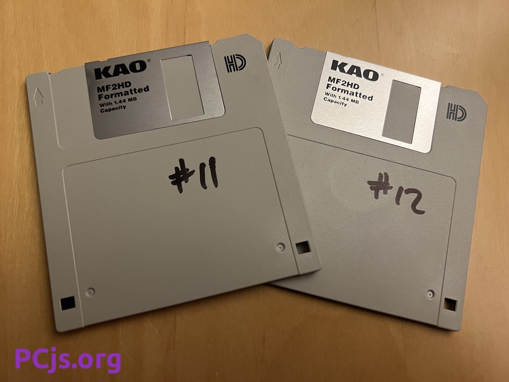
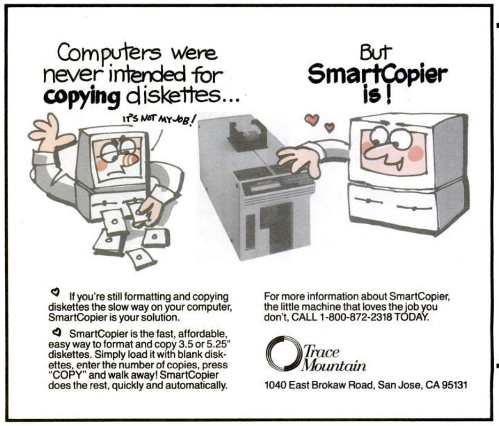

Here is another batch of diskettes from the PCjs archives: an early version (4.00.121) of Windows 95 "Beta 1".

You can use the machine below to test the installation process.  For example:

  - From the MS-DOS 5.00 Setup screen, press F3 and then Y to exit.
  - Run FDISK, create a primary DOS partition, restart, and exit again.
  - Run FORMAT C: and proceed with the format.
  - Select "Windows 95 (Build 121 Disk 01)" for drive A: and click Load.
  - Run SETUP.

However, I haven't had time to investigate any PCjs hardware compatibility issues, so don't expect that process to work yet.  The only emulator in which I was able to successfully get this version installed and running was [DOSBox-x](#dosbox-x-screenshots), and even then, the whole process took one or two recovery reboots to complete.

NOTE: Setup required a Beta Site ID and Password.  Here are some values that worked with this release:

  - Beta Site ID: 229911
  - Beta Password: 30a22ccb9



### DOSBox-x Screenshots

### Diskette Information

I had labeled the diskettes only with numbers, so I had no idea what they contained until after I imaged them.

Their contents were probably produced by the Chicago Build Lab using a Trace Mountain "SmartCopier".

They were formatted as standard 1.44M diskettes (Chicago hadn't started using the 1.68M "DMF" disk format yet), and I imaged them using **WinImage** on a Windows 98 machine, so as a consequence, the diskettes' original OEM signatures were overwritten with Windows 9x volume tracking signatures.  For example:

    00000000  eb 3c 90 27 24 68 33 38  49 48 43 00 02 01 01 00  |.<.'$h38IHC.....|
    00000010  02 e0 00 40 0b f0 09 00  12 00 02 00 00 00 00 00  |...@............|
    00000020  00 00 00 00 00 00 00 00  00 00 00 00 00 00 00 00  |................|
    00000030  00 00 00 00 00 00 00 00  00 00 00 00 00 00 0e 1f  |................|
    00000040  33 c0 fa 8e d0 bc 00 7c  fb be 76 7c fc ac 84 c0  |3......|..v|....|
    00000050  74 08 b4 0e b3 07 cd 10  eb f3 b4 00 cd 16 cd 19  |t...............|
    00000060  00 00 00 00 00 00 00 00  00 00 00 00 00 00 00 00  |................|
    00000070  00 00 00 00 00 00 0d 0a  4e 6f 6e 2d 53 79 73 74  |........Non-Syst|
    00000080  65 6d 20 64 69 73 6b 20  6f 72 20 64 69 73 6b 20  |em disk or disk |
    00000090  65 72 72 6f 72 0d 0a 0d  0a 52 65 70 6c 61 63 65  |error....Replace|
    000000a0  20 61 6e 64 20 73 74 72  69 6b 65 20 61 6e 79 20  | and strike any |
    000000b0  6b 65 79 20 77 68 65 6e  20 72 65 61 64 79 0d 0a  |key when ready..|
    000000c0  00 43 6f 70 79 72 69 67  68 74 20 31 39 39 32 20  |.Copyright 1992 |
    000000d0  54 72 61 63 65 20 4d 6f  75 6e 74 61 69 6e 20 50  |Trace Mountain P|
    000000e0  72 6f 64 00 00 00 00 00  00 00 00 00 00 00 00 00  |rod.............|
    000000f0  00 00 00 00 00 00 00 00  00 00 00 00 00 00 00 00  |................|

### Directory of Windows 95 (Build 121 Disk 01)

     Volume in drive A has no label
     Directory of A:\

    MINI     CAB    428058   5-26-94   1:14a
    DELTEMP  COM       502   5-26-94  11:57p
    SUEXPAND DLL      9936   3-12-94   7:18p
    VERX     DLL     12768   5-16-94   4:58p
    EXTRACT  EXE    135412   6-01-94   9:10p
    SETUP    EXE    143040   6-07-94   1:01p
    SMARTDRV EXE     45145   3-10-94   6:21p
    XMSMMGR  EXE     14144   2-18-94  10:38p
    PRECOPY  CAB    390144   6-09-94  10:39a
    RELNOTES RTF    247301   6-07-94   8:42p
    OVERVIEW RTF     28303   6-06-94  12:10p
           11 file(s)    1454753 bytes
                               0 bytes free

### Directory of Windows 95 (Build 121 Disk 02)

     Volume in drive A has no label
     Directory of A:\

    PRECOPY2 CAB    627165   6-09-94  10:40a
    CHICO3   CAB    819200   6-08-94   9:10p
            2 file(s)    1446365 bytes
                           11264 bytes free

### Directory of Windows 95 (Build 121 Disk 03)

     Volume in drive A has no label
     Directory of A:\

    CHICO4   CAB   1457664   6-08-94   9:11p
            1 file(s)    1457664 bytes
                               0 bytes free

### Directory of Windows 95 (Build 121 Disk 04)

     Volume in drive A has no label
     Directory of A:\

    CHICO5   CAB   1457664   6-08-94   9:13p
            1 file(s)    1457664 bytes
                               0 bytes free

### Directory of Windows 95 (Build 121 Disk 05)

     Volume in drive A has no label
     Directory of A:\

    CHICO6   CAB   1457664   6-08-94   9:15p
            1 file(s)    1457664 bytes
                               0 bytes free

### Directory of Windows 95 (Build 121 Disk 06)

     Volume in drive A has no label
     Directory of A:\

    CHICO7   CAB   1457664   6-08-94   9:16p
            1 file(s)    1457664 bytes
                               0 bytes free

### Directory of Windows 95 (Build 121 Disk 07)

     Volume in drive A has no label
     Directory of A:\

    CHICO8   CAB   1457664   6-08-94   9:18p
            1 file(s)    1457664 bytes
                               0 bytes free

### Directory of Windows 95 (Build 121 Disk 08)

     Volume in drive A has no label
     Directory of A:\

    CHICO9   CAB   1457664   6-08-94   9:19p
            1 file(s)    1457664 bytes
                               0 bytes free

### Directory of Windows 95 (Build 121 Disk 09)

     Volume in drive A has no label
     Directory of A:\

    CHICO10  CAB   1457664   6-08-94   9:21p
            1 file(s)    1457664 bytes
                               0 bytes free

### Directory of Windows 95 (Build 121 Disk 10)

     Volume in drive A has no label
     Directory of A:\

    CHICO11  CAB   1457664   6-08-94   9:23p
            1 file(s)    1457664 bytes
                               0 bytes free

### Directory of Windows 95 (Build 121 Disk 11)

     Volume in drive A has no label
     Directory of A:\

    CHICO12  CAB   1457664   6-08-94   9:24p
            1 file(s)    1457664 bytes
                               0 bytes free

### Directory of Windows 95 (Build 121 Disk 12)

     Volume in drive A has no label
     Directory of A:\

    CHICO13  CAB   1457664   6-08-94   9:26p
            1 file(s)    1457664 bytes
                               0 bytes free

### Directory of Windows 95 (Build 121 Disk 13)

     Volume in drive A has no label
     Directory of A:\

    CHICO14  CAB   1457664   6-08-94   9:27p
            1 file(s)    1457664 bytes
                               0 bytes free

### Directory of Windows 95 (Build 121 Disk 14)

     Volume in drive A has no label
     Directory of A:\

    CHICO15  CAB   1457664   6-08-94   9:29p
            1 file(s)    1457664 bytes
                               0 bytes free

### Directory of Windows 95 (Build 121 Disk 15)

     Volume in drive A has no label
     Directory of A:\

    CHICO16  CAB   1457664   6-08-94   9:31p
            1 file(s)    1457664 bytes
                               0 bytes free

### Directory of Windows 95 (Build 121 Disk 16)

     Volume in drive A has no label
     Directory of A:\

    CHICO17  CAB   1053187   6-08-94   9:32p
            1 file(s)    1053187 bytes
                          403968 bytes free

### Directory of Windows 95 (Build 121 Disk 17)

     Volume in drive A has no label
     Directory of A:\

    NETAUXT  INF      6945   5-24-94  11:39p
    NETAUXM  INF      3482   5-24-94  11:26p
    WINBUG   EXE     90624   6-07-94  12:21p
    WINBUG   DAT     27766   6-07-94  12:21p
    CECFG    EXE     53294   3-02-94   9:17p
    CENDIS   EXE     11733   3-02-94   9:17p
    NETFLX   386     34905   4-29-94   5:06a
    NETFLX   BIN     45120   3-02-94   9:16p
    NETFLX   DOS     78996   3-02-94   9:16p
    NETFLX   SYM     16084   4-29-94   5:06a
    NETID    TXT      3747   3-18-94  10:58p
    SETUPFIX EXE      4336   3-02-94   9:17p
    UBXHLP   DOS      4716   3-02-94   9:17p
    VUBXD    386     73205   3-31-93   3:13a
    PIFMGR   DLL     44800   6-13-94  11:10a
    WINBOOT  SYS    271426   7-12-94   7:01p
           16 file(s)     771179 bytes
                          681984 bytes free
