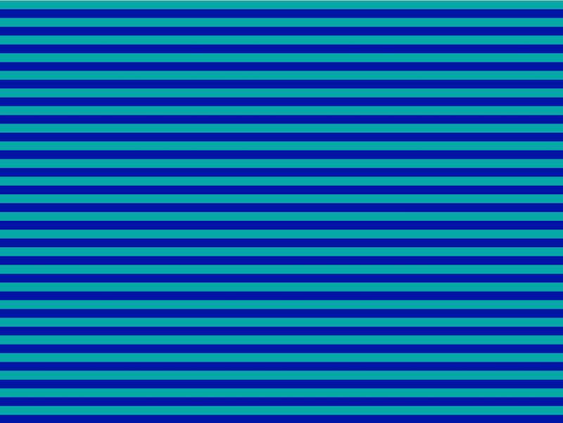
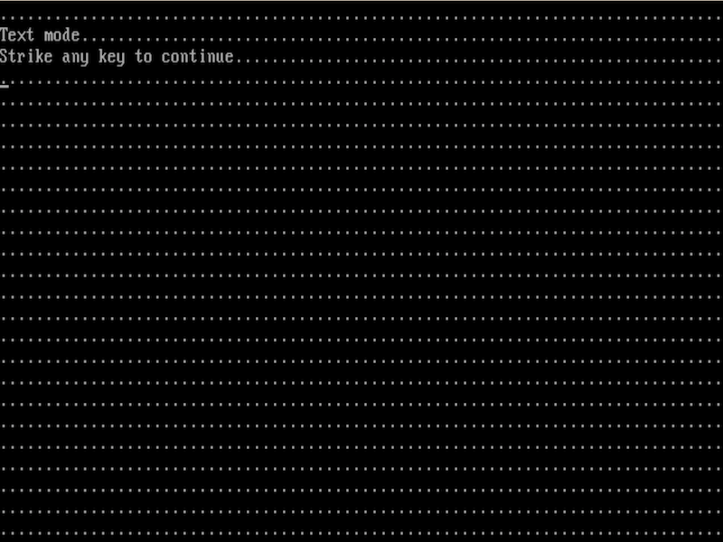
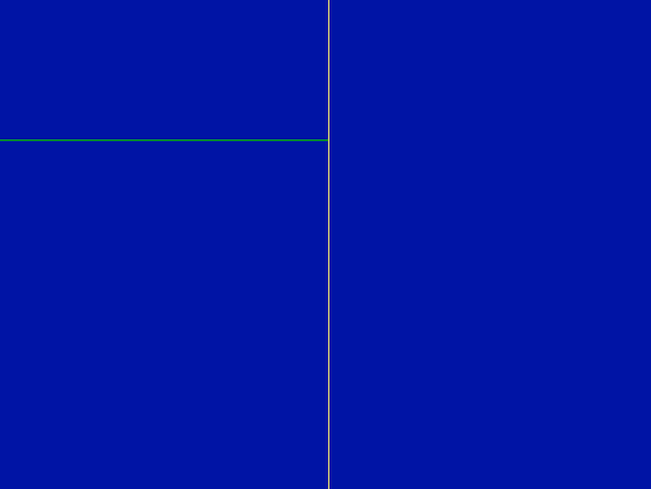
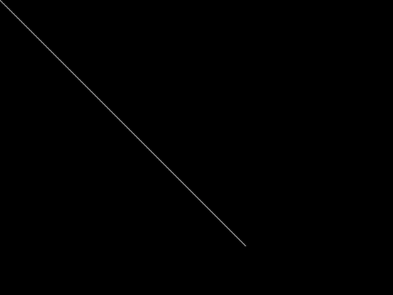
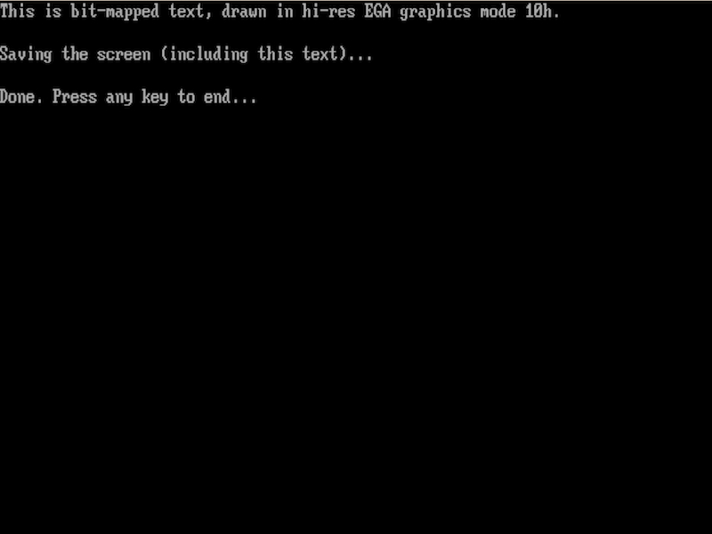
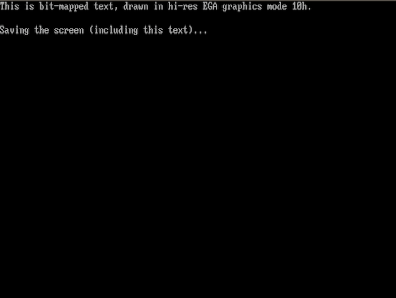
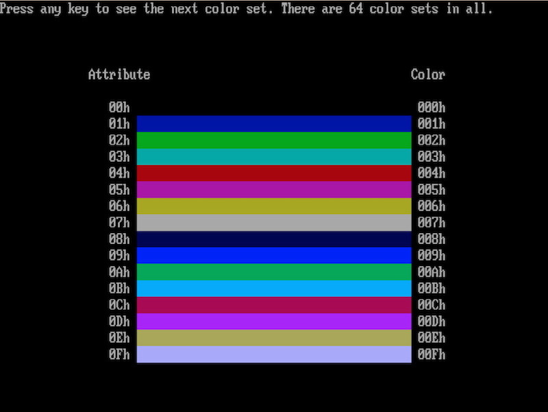
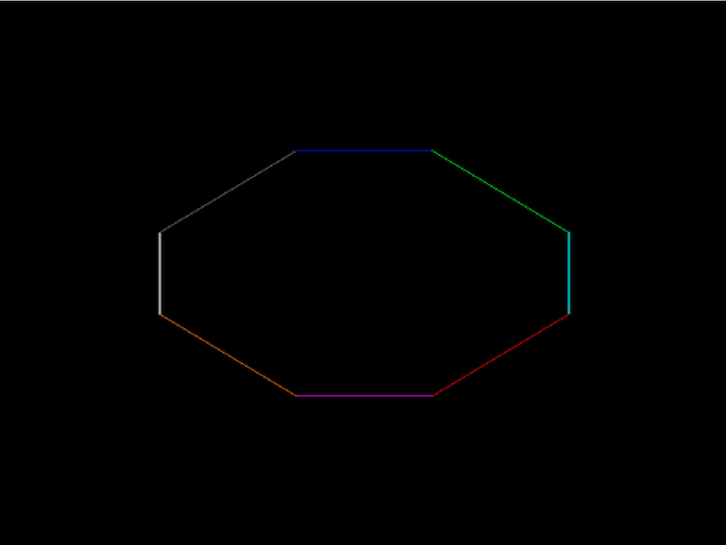
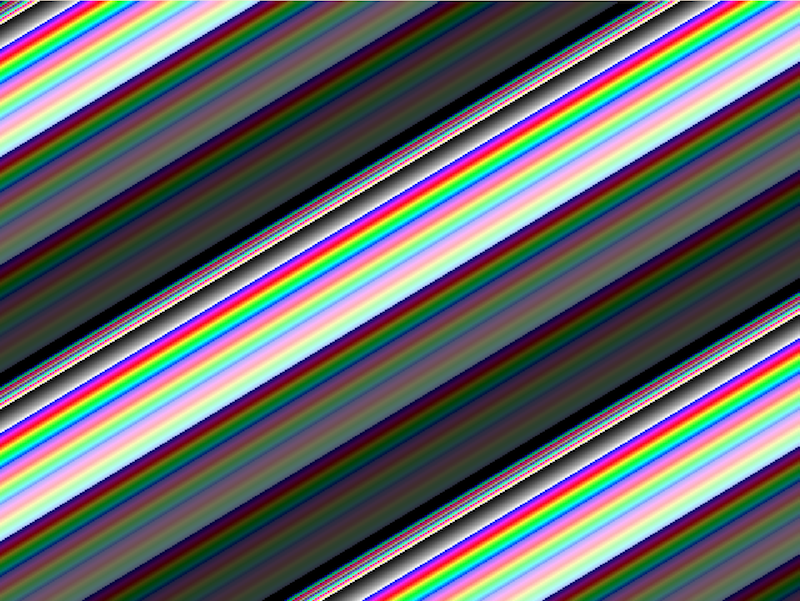
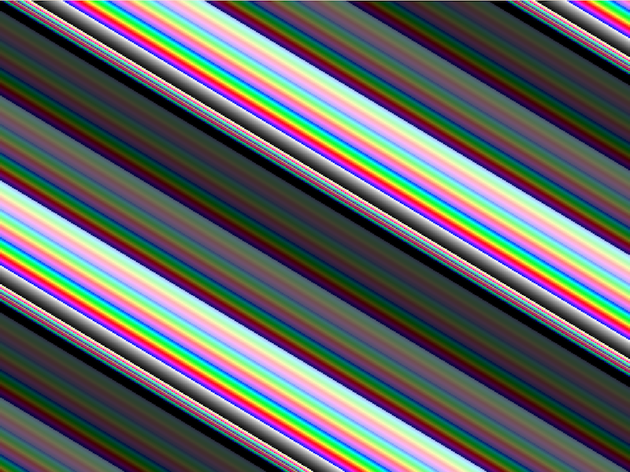

To aid the development of PCjs VGA support, selected [VGA "Black Book" Tests](#selected-vga-black-book-tests) from
Michael Abrash's [Graphics Programming Black Book](https://github.com/jeffpar/abrash-black-book) have been added
to the project, which you can run in the [VGA "Black Book" Test Machine](#vga-black-book-test-machine) below.

Abrash's book is available on many sites, but I'm partial to the Markdown version that [James Gregory](https://github.com/jagregory)
has made available on GitHub, because (a) it's a brilliant way to render and share the text, and (b) it apparently has
Abrash's blessing, so I feel more comfortable forking it, using it, and resharing it.

The main reasons for my [fork](https://github.com/jeffpar/abrash-black-book) are to make the book's
images display properly on GitHub, and to extract and add assorted source code listings as I need them.  Since that
project's [/src](https://github.com/jeffpar/abrash-black-book/tree/master/src) folder contains just the book's text,
I've added a [/code](https://github.com/jeffpar/abrash-black-book/tree/master/code) folder for the source code listings.
The name of each source code file matches the name displayed in the text (eg, [L23-1.ASM](L23-1/) is Listing 23.1
from [Chapter 23](https://github.com/jeffpar/abrash-black-book/blob/master/src/chapter-23.md)).

I assume something similar was done on the CD-ROM that accompanied the Black Book, but since I don't have the original
book or its CD-ROM, I've extracted the source code directly from the Markdown text and then "tabified" it with 8-column
tab stops.

Development of PCjs VGA support began June 2015, and not everything here runs properly inside PCjs yet.  For example:

- [L29-4](src/L29-4.ASM) doesn't actually blank the screen (then again, other emulators don't bother blanking it, either)
- [L30-1](src/L30-1.ASM) and [L30-2](src/L30-2.ASM) require split-screen support

### VGA "Black Book" Test Machine

The Compaq DeskPro 386 machine below loads the
[VGA "Black Book" Binaries](#directory-of-vga-black-book-binaries) diskette from the PCjs Disk Library
into Drive B.  Click the **Run** button to start the machine.



### Directory of VGA "Black Book" Sources

This disk image contains the source code for selected [VGA "Black Book" Tests](#selected-vga-black-book-tests).
It was built using [DiskDump]({{ site.github.pages }}/tools/diskdump/) and the *--normalize* option, which automatically converts linefeeds
in known text files (including ASM files) into DOS-compatible CR/LF sequences.

	 Volume in drive A is VGASRC     

	Directory of A:\

	L23-1    ASM     14690 08-09-16  11:53a
	L24-1    ASM      7243 08-09-16  11:53a
	L25-1    ASM      4872 08-09-16  11:53a
	L25-2    ASM      1606 08-09-16  11:53a
	L25-3    ASM      2347 08-09-16  11:53a
	L25-4    ASM      2437 08-09-16  11:53a
	L26-1    ASM      6949 08-09-16  11:53a
	L26-2    ASM      7170 08-09-16  11:53a
	L27-1    ASM      5766 08-09-16  11:53a
	L27-2    ASM      6055 08-09-16  11:53a
	L27-3    ASM      3928 08-09-16  11:53a
	L28-1    ASM      5809 08-09-16  11:53a
	L28-2    ASM      4436 08-09-16  11:53a
	L28-3    ASM      2285 08-09-16  11:53a
	L29-1    ASM      3262 08-09-16  11:53a
	L29-2    ASM      2919 08-09-16  11:53a
	L29-3    ASM      5940 08-09-16  11:53a
	L29-4    ASM      1614 08-09-16  11:53a
	L30-1    ASM     10178 08-09-16  11:53a
	L30-2    ASM     12499 08-09-16  11:53a
	L31-1    ASM      8073 08-09-16  11:53a
	L31-2    ASM      6703 08-09-16  11:53a
	L32-1    ASM      5493 08-09-16  11:53a
	L32-2    C        6000 08-09-16  11:53a
	L33-1    ASM      4788 08-09-16  11:53a
	L34-1    ASM      9662 08-09-16  11:53a
	L35-1    C        6037 08-09-16  11:53a
	L35-2    C        2371 08-09-16  11:53a
	L35-3    ASM      9258 08-09-16  11:53a
	L42-1    C        5353 08-09-16  11:53a
	L42-2    C        5294 08-09-16  11:53a
	L42-3    C         715 08-09-16  11:53a
	L42-4    C        2288 08-09-16  11:53a
	L42-5    C        1263 08-09-16  11:53a
	L42-6    ASM     10098 08-09-16  11:53a
	L47-1    ASM      2793 08-09-16  11:53a
	L47-2    ASM      1564 08-09-16  11:53a
	L47-3    ASM      1453 08-09-16  11:53a
	L47-4    ASM      3192 08-09-16  11:53a
	L47-5    ASM      4329 08-09-16  11:53a
	L47-6    ASM      3980 08-09-16  11:53a
	L47-7    C         680 08-09-16  11:53a
	L48-1    C        1886 08-09-16  11:53a
	L48-2    ASM      6563 08-09-16  11:53a
	L48-3    ASM      6612 08-09-16  11:53a
	L48-4    ASM      4515 08-09-16  11:53a
	MAKEFILE          1011 08-09-16  11:53a
	REGS     H         662 08-09-16  11:53a
	       48 file(s)     234641 bytes

	Total files listed:
	       48 file(s)     234641 bytes
	                       64512 bytes free

### Directory of VGA "Black Book" Binaries

This disk image contains executables built from selected [VGA "Black Book" Tests](#selected-vga-black-book-tests).

	 Volume in drive A is VGABIN     

	Directory of A:\

	L23-1    EXE      2176 07-05-15   1:12p
	L24-1    EXE      1482 06-27-15  11:56a
	L25-1    EXE      1253 06-26-15   2:06p
	L25-2    EXE      1097 06-26-15   2:06p
	L25-3    EXE      1131 06-27-15  11:56a
	L25-4    EXE      1131 07-07-15  12:45p
	L26-1    EXE      1322 06-27-15  11:56a
	L26-2    EXE      1334 06-27-15  11:56a
	L27-1    EXE      1327 06-27-15   6:26p
	L27-2    EXE      1541 06-27-15   6:26p
	L27-3    EXE     13604 06-27-15   6:26p
	L28-1    EXE      2279 06-29-15  10:29a
	L28-2    EXE      1173 06-29-15  10:29a
	L28-3    EXE      1109 06-29-15  10:29a
	L29-1    EXE      1400 07-05-15   7:59a
	L29-2    EXE      1290 07-05-15   7:59a
	L29-3    EXE      1687 07-05-15   7:59a
	L29-4    EXE      1242 07-05-15   7:59a
	L30-1    EXE      1391 07-05-15   7:59a
	L30-2    EXE      1351 07-05-15   7:59a
	L31-1    EXE      1385 07-06-15   2:11p
	L31-2    EXE      1245 07-05-15   7:59a
	L33-1    EXE      1430 07-05-15  11:26a
	L34-1    EXE       664 07-05-15   1:12p
	L35-1    EXE      9185 07-07-15  12:49p
	L35-3    EXE      8801 07-06-15   3:32p
	L47-4    EXE      3643 07-06-15   3:33p
	L47-5    EXE      3707 07-07-15  12:42p
	L47-6    EXE      3683 07-07-15  12:42p
	L48-2    EXE      3923 07-07-15   1:34p
	       30 file(s)      77986 bytes

	Total files listed:
	       30 file(s)      77986 bytes
	                       73728 bytes free

### Selected VGA "Black Book" Tests

The VGA "Black Book" tests taken from
[Michael Abrash's Graphics Programming Black Book](https://github.com/jeffpar/abrash-black-book) to
create the PCjs [VGA "Black Book" Binaries](#directory-of-vga-black-book-binaries) are listed below.

#### [Chapter 23: Bones and Sinew](https://github.com/jeffpar/abrash-black-book/blob/master/src/chapter-23.md)

  - [L23-1.ASM: Animates four balls bouncing around a playfield by using page flipping and panning](L23-1/)

#### [Chapter 24: Parallel Processing with the VGA](https://github.com/jeffpar/abrash-black-book/blob/master/src/chapter-24.md)

  - [L24-1.ASM: Illustrates operation of ALUs and latches of the VGA's Graphics Controller](src/L24-1.ASM)
 

#### [Chapter 25: VGA Data Machinery](https://github.com/jeffpar/abrash-black-book/blob/master/src/chapter-25.md)

  - [L25-1.ASM: Illustrates operation of data rotate and bit mask features of Graphics Controller](src/L25-1.ASM)
 

 
  - [L25-2.ASM: Illustrates operation of Map Mask register when drawing to memory that already contains data](src/L25-2.ASM)
 

 
  - [L25-3.ASM: Illustrates operation of set/reset circuitry to force setting of memory that already contains data](src/L25-3.ASM)
 

 
  - [L25-4.ASM: Illustrates operation of set/reset circuitry in conjunction with CPU data](src/L25-4.ASM)
 

 
#### [Chapter 26: VGA Write Mode 3](https://github.com/jeffpar/abrash-black-book/blob/master/src/chapter-26.md)

  - [L26-1.ASM: Illustrates operation of write mode 3 of the VGA](src/L26-1.ASM)
 

 
  - [L26-2.ASM: Illustrates high-speed text-drawing operation of write mode 3 of the VGA](src/L26-2.ASM)
 

 
#### [Chapter 27: Yet Another VGA Write Mode](https://github.com/jeffpar/abrash-black-book/blob/master/src/chapter-27.md)

  - [L27-1.ASM: Illustrates one use of write mode 2 of the VGA and EGA by animating the image of an "A"](src/L27-1.ASM)
 

 
  - [L27-2.ASM: Illustrates one use of write mode 2 of the VGA and EGA by drawing lines in color patterns](src/L27-2.ASM)
 

 
  - [L27-3.ASM: Illustrates flipping from bit-mapped graphics mode to text mode and back](src/L27-3.ASM)
 
 
 

 
#### [Chapter 28: Reading VGA Memory](https://github.com/jeffpar/abrash-black-book/blob/master/src/chapter-28.md)

  - [L28-1.ASM: Illustrates the use of the Read Map register in read mode 0](src/L28-1.ASM)
 

 
  - [L28-2.ASM: Illustrates use of read mode 1 (color compare mode) to detect collisions in display memory](src/L28-2.ASM)
 

 
  - [L28-3.ASM: Illustrates the use of Color Don't Care to support fast read-modify-write operations](src/L28-3.ASM)
 

 
#### [Chapter 29: Saving Screens and Other VGA Mysteries](https://github.com/jeffpar/abrash-black-book/blob/master/src/chapter-29.md)

  - [L29-1.ASM: Puts up a mode 10h EGA graphics screen, then saves it to the file SNAPSHOT.SCR](src/L29-1.ASM)
 

 
  - [L29-2.ASM: Restores a mode 10h EGA graphics screen from the file SNAPSHOT.SCR](src/L29-2.ASM)
 

 
  - [L29-3.ASM: Illustrates the color mapping capabilities of the EGA's palette registers](src/L29-3.ASM)
 

 

  - [L29-4.ASM: Demonstrates screen blanking via bit 5 of the Attribute Controller Index register](src/L29-4.ASM)
 

 
#### [Chapter 30: Video Est Omnis Divisa](https://github.com/jeffpar/abrash-black-book/blob/master/src/chapter-30.md)

  - [L30-1.ASM: Demonstrates the VGA/EGA split screen in action](src/L30-1.ASM)
  - [L30-2.ASM: Demonstrates the interaction of the split screen and horizontal pel panning](src/L30-2.ASM)
 
#### [Chapter 31: Higher 256-Color Resolution on the VGA](https://github.com/jeffpar/abrash-black-book/blob/master/src/chapter-31.md)

  - [L31-1.ASM: Demonstrates pixel drawing in 320x400 256-color mode on the VGA](src/L31-1.ASM)
 

 
  - [L31-2.ASM: Demonstrates the two pages available in 320x400 256-color modes on a VGA](src/L31-2.ASM)
 
 
 

 
#### [Chapter 32: Be It Resolved: 360x480](https://github.com/jeffpar/abrash-black-book/blob/master/src/chapter-32.md)

  - [L32-1.ASM: Illustrates VGA line drawing in 360x480 256-color mode](src/L32-1.ASM)
  - [L32-2.C:   Sample program to illustrate VGA line drawing in 360x480 256-color mode](src/L32-2.C)
 
#### [Chapter 33: Yogi Bear and Eurythmics Confront VGA Colors](https://github.com/jeffpar/abrash-black-book/blob/master/src/chapter-33.md)

  - [L33-1.ASM: Demonstrates use of the DAC registers by selecting a smoothly contiguous set of 256 colors](src/L33-1.ASM)

 
#### [Chapter 34: Changing Colors without Writing Pixels](https://github.com/jeffpar/abrash-black-book/blob/master/src/chapter-34.md)

  - [L34-1.ASM: Fills a band across the screen with vertical bars in all 256 attributes](src/L34-1.ASM)

 
#### [Chapter 35: Bresenham Is Fast, and Fast Is Good](https://github.com/jeffpar/abrash-black-book/blob/master/src/chapter-35.md)

  - [L35-1.C: C implementation of Bresenham's line drawing algorithm](src/L35-1.C)

 
  - [L35-2.C: Sample program to illustrate EGA/VGA line drawing routines](src/L35-2.C)
  - [L35-3.ASM: Fast assembler implementation of Bresenham's line drawing algorithm](src/L35-3.ASM)

#### [Chapter 47: Mode X: 256-Color VGA Magic](https://github.com/jeffpar/abrash-black-book/blob/master/src/chapter-35.md)

  - [L47-1.ASM: Mode X (320x240, 256 colors) mode set routine](src/L47-1.ASM)
  - [L47-2.ASM: Mode X (320x240, 256 colors) write pixel routine](src/L47-2.ASM)
  - [L47-3.ASM: Mode X (320x240, 256 colors) read pixel routine](src/L47-3.ASM)
  - [L47-4.ASM: Mode X (320x240, 256 colors) rectangle fill routine (slow)](src/L47-4.ASM)

 
  - [L47-5.ASM: Mode X (320x240, 256 colors) rectangle fill routine (medium)](src/L47-5.ASM)
  - [L47-6.ASM: Mode X (320x240, 256 colors) rectangle fill routine (fast)](src/L47-6.ASM)
  - [L47-7.C: Program to demonstrate mode X (320x240, 256-colors) rectangle fill](src/L47-7.C)

#### [Chapter 48: Mode X Marks the Latch](https://github.com/jeffpar/abrash-black-book/blob/master/src/chapter-48.md)

  - [L48-1.C: Mode X (320x240, 256 colors) patterned rectangle fills](src/L48-1.C)
  - [L48-2.ASM: Mode X (320x240, 256 colors) rectangle 4x4 pattern fill routine](src/L48-2.ASM)

 
  - [L48-3.ASM: Mode X (320x240, 256 colors) display memory to display memory copy](src/L48-3.ASM)
  - [L48-4.ASM: Mode X (320x240, 256 colors) system memory to display memory copy](src/L48-4.ASM)
